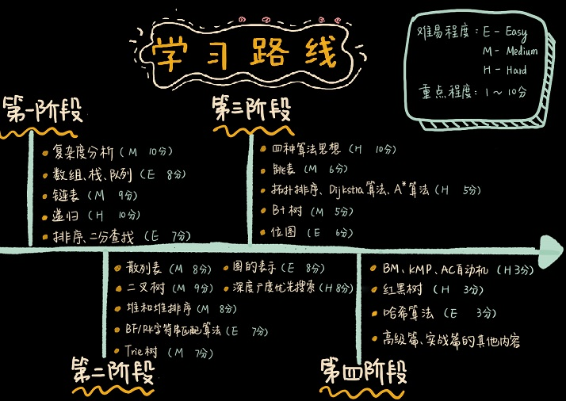

本文档是[《数据结构与算法之美》](http://gk.link/a/108GK)的学习笔记和个人编写的python实现的相关代码。

在线阅读地址：https://datastructure.xiaoxiaoming.xyz/

如果本文档对您有用，期待您点击右上角Star :star: 给予关注！谢谢拉！

还可以分享给您身边更多的小伙伴！:kissing_heart:

**若你有什么更好的建议，欢迎提交pull或issue进行反馈，每篇文档本身也支持评论，评论后我都可以在issue或原文档页面看到。**

------

本文档与原课程的目录会有点差别，本人进行了一些合并和重新编号，新排版的目录为：

* **入门篇**
  * [01.入门篇](docs/01.入门篇.md)

* **基础篇**
  * [02.数组](docs/02.数组.md)
  * [03.链表](docs/03.链表.md)
  * [04.栈](docs/04.栈.md)
  * [05.队列](docs/05.队列.md)
  * [06.递归](docs/06.递归.md)
  * [07.排序](docs/07.排序.md)
  * [09.二分查找](docs/09.二分查找.md)
  * [10.跳表](docs/10.跳表.md)
  * [11.散列表](docs/11.散列表.md)
  * [12.哈希算法](docs/12.哈希算法.md)
  * [13.二叉树基础](docs/13.二叉树基础.md)
  * [14.红黑树](docs/14.红黑树.md)
  * [15.递归树](docs/15.递归树.md)
  * [16.堆](docs/16.堆.md)
  * [17.图的表示](docs/17.图的表示.md)
  * [18.深度和广度优先搜索](docs/18.深度和广度优先搜索.md)
  * [19.字符串匹配基础](docs/19.字符串匹配基础.md)
  * [20.Trie树](docs/20.Trie树.md)
  * [21.AC自动机](docs/21.AC自动机.md)
  * [22.贪心算法](docs/22.贪心算法.md)
  * [23.分治算法](docs/23.分治算法.md)
  * [24.回溯算法](docs/24.回溯算法.md)
  * [25.动态规划](docs/25.动态规划.md)

* **高级篇**
  * [26.拓扑排序](docs/26.拓扑排序.md)
  * [27.有权图的应用：最短路径](docs/27.有权图的应用：最短路径.md)
  * [28.位图&布隆过滤器](docs/28.位图&布隆过滤器.md)
  * [29.B+树](docs/29.B+树.md)
  * [30.索引](docs/30.索引.md)
  * [31.并行算法](docs/31.并行算法.md)

* **实战篇**

  * [32.Redis用到的数据结构](docs/32.Redis用到的数据结构.md)
  * [33.搜索引擎的理论基础](docs/33.搜索引擎的理论基础.md)
  * [34.高性能队列Disruptor](docs/34.高性能队列Disruptor.md)
  * [35.微服务的鉴权限流接口](docs/35.微服务的鉴权限流接口.md)
  * [36.短网址服务系统](docs/36.短网址服务系统.md)

* **结束篇**
  * [37.权衡选择数据结构和算法](docs/37.权衡选择数据结构和算法.md)
  * [38.leetcode练习题](docs/38.leetcode练习题.md)

