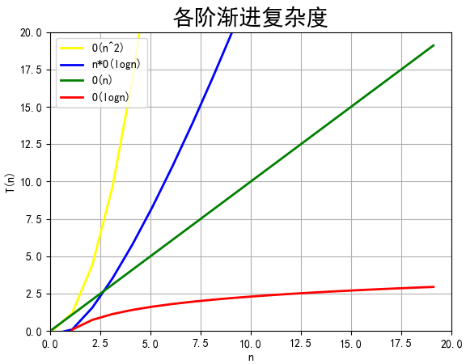

# 01.入门篇

# 数据结构&算法的定义

从广义上讲，数据结构就是指一组数据的存储结构。算法就是操作数据的一组方法。

图书管理员为了方便查找，一般会将书籍分门别类进行“**存储**”。按照一定规律编号，就是书籍这种“数据”的存储结构。

**查找一本书**有很多种办法，你可以一本一本地找，也可以先根据书籍类别的编号，是人文，还是科学、计算机，来定位书架，然后再依次查找。笼统地说，这些查找方法都是算法。

从狭义上讲，数据结构和算法，是指某些著名的**队列、栈、堆、二分查找、动态规划等**。

这些都是前人从很多实际操作场景中抽象出来的，经过非常多的求证和检验，可以高效地帮助我们解决很多实际的开发问题。

## 数据结构和算法的关系

数据结构和算法是相辅相成的。

**数据结构是为算法服务的，算法要作用在特定的数据结构之上。**

 因此，我们无法孤立数据结构来讲算法，也无法孤立算法来讲数据结构。

比如，因为数组具有随机访问的特点，常用的二分查找算法需要用数组来存储数据。但如果我们选择链表这种数据结构，二分查找算法就无法工作了，因为链表并不支持随机访问。

数据结构是静态的，它只是组织数据的一种方式。如果不在它的基础上操作、构建算法，孤立存在的数据结构就是没用的。


## 数据结构与算法整体框架


**20 个最常用的、最基础**数据结构与算法：

10 个数据结构：**数组、链表、栈、队列、散列表、二叉树、堆、跳表、图、Trie 树**；

10 个算法：**递归、排序、二分查找、搜索、哈希算法、贪心算法、分治算法、回溯算法、动态规划、字符串匹配算法**。

掌握了这些基础的数据结构和算法，再学更加复杂的数据结构和算法，就会非常容易、非常快。

在学习数据结构和算法的过程中，应当学习它的：

**“来历”**

**“自身的特点”**

**“适合解决的问题”**

**以及“实际的应用场景”**。


# 时间、空间复杂度分析

**复杂度分析是整个算法学习的精髓，只要掌握了它，数据结构和算法的内容基本上就掌握了一半**。

## 事后统计法的局限性

### 1. 测试结果非常依赖测试环境

测试环境中硬件的不同会对测试结果有很大的影响。比如，我们拿同样一段代码，分别用 Intel Core i9 处理器和 Intel Core i3 处理器来运行，不用说，i9 处理器要比 i3 处理器执行的速度快很多。还有，比如原本在这台机器上 a 代码执行的速度比 b 代码要快，等我们换到另一台机器上时，可能会有截然相反的结果。

### 2. 测试结果受数据规模的影响很大

对同一个排序算法，待排序数据的有序度不一样，排序的执行时间就会有很大的差别。极端情况下，如果数据已经是有序的，那排序算法不需要做任何操作，执行时间就会非常短。除此之外，如果测试数据规模太小，测试结果可能无法真实地反应算法的性能。比如，对于小规模的数据排序，插入排序可能反倒会比快速排序要快！

所以，**我们需要一个不用具体的测试数据来测试，就可以粗略地估计算法的执行效率的方法**。这就是时间、空间复杂度分析方法。

## 大 O 复杂度表示法

算法的执行效率，粗略地讲，就是算法代码执行的时间。

但是，如何在不运行代码的情况下，用“肉眼”得到一段代码的执行时间呢？

这里有段非常简单的代码，求 1,2,3…n 的累加和。

```c
 int cal(int n) {
   int sum = 0;
   int i = 1;
   for (; i <= n; ++i) {
     sum = sum + i;
   }
   return sum;
 }
```

从 CPU 的角度来看，这段代码的每一行都执行着类似的操作：**读数据**-**运算**-**写数据**。尽管每行代码对应的 CPU 执行的个数、执行的时间都不一样，但是，我们这里只是粗略估计，所以可以假设每行代码执行的时间都一样，为 unit_time。

第 2、3 行代码分别需要 1 个 unit_time 的执行时间，第 4、5 行都运行了 n 遍，所以需要 $2n* unit\_time$ 的执行时间，所以这段代码总的执行时间就是 $(2n+2)*unit\_time$。可以看出来，**所有代码的执行时间 T(n) 与每行代码的执行次数成正比**。

按照这个分析思路，我们再来看这段代码。

```c
 int cal(int n) {
   int sum = 0;
   int i = 1;
   int j = 1;
   for (; i <= n; ++i) {
     j = 1;
     for (; j <= n; ++j) {
       sum = sum +  i * j;
     }
   }
 }
```

依旧假设每个语句的执行时间是 unit_time。那这段代码的总执行时间 T(n) 是多少呢？

第 2、3、4 行代码，每行都需要 1 个 unit_time 的执行时间，第 5、6 行代码循环执行了 n 遍，需要$2n*unit\_time$ 的执行时间，第 7、8 行代码循环执行了 $n^2$遍，所以需要 $2n^{2} * unit\_time$ 的执行时间。所以，整段代码总的执行时间$T(n) = (2n^2+2n+3)*unit\_time$ .

需要 $2n * unit\_time$ 的执行时间，第 7、8 行代码循环执行了 $n^{2}$遍，所以需要 $2n^{2} * unit\_time$ 的执行时间。所以，整段代码总的执行时间 $T(n) = (2n^2+2n+3)*unit\_time$。

尽管不知道 unit_time 的具体值，但**所有代码的执行时间 T(n) 与每行代码的执行次数 n 成正比**。

把这个规律总结成一个公式:

$$
T(n)=O(f(n))
$$
T(n) 表示代码执行的时间；n 表示数据规模的大小；

f(n) 表示每行代码执行的次数总和。因为这是一个公式，所以用 f(n) 来表示。

公式中的 O，表示代码的执行时间 T(n) 与 f(n) 表达式成正比。

所以，第一个例子中的 $T(n) = O(2n+2)$，第二个例子中的 $T(n) = O(2n^2+2n+3)$。这就是**大 O 时间复杂度表示法**。大 O 时间复杂度实际上并不具体表示代码真正的执行时间，而是表示**代码执行时间随数据规模增长的变化趋势**，所以，也叫作**渐进时间复杂度**（asymptotic time complexity），简称**时间复杂度**。

当 n 很大时，你可以把它想象成 10000、100000。而公式中的低阶、常量、系数三部分并不左右增长趋势，所以都可以忽略。我们只需要记录一个最大量级就可以了，如果用大 O 表示法表示刚讲的那两段代码的时间复杂度，就可以记为：$T(n) = O(n)； T(n) = O(n^2)$。

## 时间复杂度分析

时间复杂度的全称是**渐进时间复杂度**，**表示算法的执行时间与数据规模之间的增长关系**。

### 三个比较实用的分析方法

#### 1. 只关注循环执行次数最多的一段代码

大 O 这种复杂度表示方法只是表示一种变化趋势。通常会忽略掉公式中的常量、低阶、系数，只需要记录一个最大阶的量级就可以了。所以，**我们在分析一个算法、一段代码的时间复杂度的时候，也只关注循环执行次数最多的那一段代码就可以了**。这段核心代码执行次数的 n 的量级，就是整段要分析代码的时间复杂度。

以前面的例子举例：

```c
 int cal(int n) {
   int sum = 0;
   int i = 1;
   for (; i <= n; ++i) {
     sum = sum + i;
   }
   return sum;
 }
```

其中第 2、3 行代码都是常量级的执行时间，与 n 的大小无关，所以对于复杂度并没有影响。循环执行次数最多的是第 4、5 行代码，所以这块代码要重点分析。前面我们也讲过，这两行代码被执行了 n 次，所以总的时间复杂度就是 O(n)。

#### 2. 加法法则

**总复杂度等于量级最大的那段代码的复杂度**

```c
int cal(int n) {
   int sum_1 = 0;
   int p = 1;
   for (; p < 100; ++p) {
     sum_1 = sum_1 + p;
   }
 
   int sum_2 = 0;
   int q = 1;
   for (; q < n; ++q) {
     sum_2 = sum_2 + q;
   }
 
   int sum_3 = 0;
   int i = 1;
   int j = 1;
   for (; i <= n; ++i) {
     j = 1; 
     for (; j <= n; ++j) {
       sum_3 = sum_3 +  i * j;
     }
   }
 
   return sum_1 + sum_2 + sum_3;
 }
```

这个代码分为三部分，分别是求 sum_1、sum_2、sum_3。可以分别分析每一部分的时间复杂度，然后把它们放到一块儿，再取一个量级最大的作为整段代码的复杂度。

第一段代码循环执行了 100 次，所以是一个常量的执行时间，跟 n 的规模无关。即便这段代码循环 10000 次、100000 次，只要是一个已知的数，跟 n 无关，照样也是常量级的执行时间。

当 n 无限大的时候，尽管对代码的执行时间会有很大影响，但是回到时间复杂度的概念来说，它表示的是一个算法执行效率与数据规模增长的变化趋势，所以不管常量的执行时间多大都可以忽略掉。因为它本身对增长趋势并没有影响。


第二段代码和第三段代码的时间复杂度分别是$O(n)$ 和 $O(n^2)$。


综合这三段代码的时间复杂度，取其中最大的量级。所以，整段代码的时间复杂度就为$O(n^2)$。也就是说：**总的时间复杂度就等于量级最大的那段代码的时间复杂度**。那我们将这个规律抽象成公式就是：

如果 $T1(n)=O(f(n))，T2(n)=O(g(n))$；那么 $T(n)=T1(n)+T2(n)=max(O(f(n))$, $O(g(n))) =O(max(f(n), g(n)))$.


#### 3.乘法法则

**嵌套代码的复杂度等于嵌套内外代码复杂度的乘积**

如果 $T1(n)=O(f(n))$，$T2(n)=O(g(n))$；那么 $T(n)=T1(n)*T2(n)=O(f(n))*O(g(n))=O(f(n)*g(n))$.

也就是说，假设 T1(n) = O(n)，$T2(n) = O(n^2)$，则 $T1(n) * T2(n) = O(n^3)$。落实到具体的代码上，我们可以把乘法法则看成是**嵌套循环**，举个例子:

```c
int cal(int n) {
   int ret = 0; 
   int i = 1;
   for (; i < n; ++i) {
     ret = ret + f(i);
   } 
 } 
 
 int f(int n) {
  int sum = 0;
  int i = 1;
  for (; i < n; ++i) {
    sum = sum + i;
  } 
  return sum;
 }
```

单独看 cal() 函数。假设 f() 只是一个普通的操作，那第 4～6 行的时间复杂度就是，$T_1(n) = O(n)$。但 f() 函数本身不是一个简单的操作，它的时间复杂度是 $T_2(n) = O(n)$，所以，整个 cal() 函数的时间复杂度就是，$T(n) = T_1(n) * T_2(n) = O(n*n) = O(n^2)$。

### 多项式时间复杂度分析

常见的复杂度量级（按数量级递增）:

- **多项式量级：**

  - 常量阶：$O(1)$
  - 对数阶：$O(log\ n)$
  - 线性阶：$O(n)$
  - 线性对数阶：$nO(log\ n)$
  - 平方阶：$O(n^2)$、 立方阶：$O(n^3)$、……、 K次方阶：$O(n^k)$

- **非多项式量级：**

  - 指数阶：$O(2^n)$ 
  - 阶乘阶： $O(n!)$

  

可以粗略地分为两类，**多项式量级**和**非多项式量级**。其中，非多项式量级只有两个：$O(2^n)$ 和 $O(n!)$。

当数据规模 n 越来越大时，非多项式量级算法的执行时间会急剧增加，求解问题的执行时间会无限增长。所以，非多项式时间复杂度的算法其实是非常低效的算法。

我们主要来看几种常见的**多项式时间复杂度**。

#### $1. O(1)$

首先你必须明确一个概念，O(1) 只是常量级时间复杂度的一种表示方法，并不是指只执行了一行代码。比如这段代码，即便有 3 行，它的时间复杂度也是 O(1)，而不是 O(3)。

```c
 int i = 8;
 int j = 6;
 int sum = i + j;
```

只要代码的执行时间不随 n 的增大而增长，这样代码的时间复杂度我们都记作 O(1)。或者说，**一般情况下，只要算法中不存在循环语句、递归语句，即使有成千上万行的代码，其时间复杂度也是Ο(1)**。

#### $2. O(logn)、O(nlogn)$

例子：

```c
 i=1;
 while (i <= n)  {
   i = i * 2;
 }
```

第三行代码是循环执行次数最多的，只要能计算出这行代码被执行了多少次，就能知道整段代码的时间复杂度。


实际上，变量 i 的取值就是一个等比数列。如果把它列出来：
$$
2^{0} \quad 2^{1} \quad 2^{2} \cdots 2^{k} \cdots 2^{x}=n
$$
通过 $2^x=n$ 得 $x=log_2n$，所以，这段代码的时间复杂度就是 $O(log_2n)$。

例子：

```c
 i=1;
 while (i <= n)  {
   i = i * 3;
 }
```

这段代码的时间复杂度为 $O(log_3n)$。

实际上，可以把所有对数阶的时间复杂度都记为 $O(log\ n)$。

$log_3n= log_3 2 * log_2 n$，所以 $O(log_3 n) = O(C * log_2 n)$，其中 $C=log_32$ 是一个常量。

因此，在对数阶时间复杂度的表示方法里，我们忽略对数的“底”，统一表示为 $O(logn)$。

如果一段代码的时间复杂度是 $O(logn)$，循环执行 n 遍，时间复杂度就是  $O(logn)$了。

归并排序、快速排序的时间复杂度都是  $O(nlogn)$。

#### $3. O(m+n)、O(m*n)$

这种时间复杂度，代码的复杂度**由两个数据的规模**来决定。

先看代码：

```c
int cal(int m, int n) {
  int sum_1 = 0;
  int i = 1;
  for (; i < m; ++i) {
    sum_1 = sum_1 + i;
  }
 
  int sum_2 = 0;
  int j = 1;
  for (; j < n; ++j) {
    sum_2 = sum_2 + j;
  }
 
  return sum_1 + sum_2;
}
```

m 和 n 是表示两个数据规模，无法事先评估 m 和 n 谁的量级大，无法忽略其中一个，所以上面代码的时间复杂度就是 O(m+n)。

针对这种情况，加法规则为：$T_1(m) + T_2(n) = O(f(m) + g(n))$。

但是乘法法则继续有效：$T_1(m)*T_2(n) = O(f(m) * f(n))$。

## 空间复杂度分析

空间复杂度全称就是**渐进空间复杂度**（asymptotic space complexity），**表示算法的额外存储空间与数据规模之间的增长关系**。

举个弱智的例子：

```c
void print(int n) {
  int i = 0;
  int[] a = new int[n];
  for (i; i <n; ++i) {
    a[i] = i * i;
  }
 
  for (i = n-1; i >= 0; --i) {
    print out a[i]
  }
}
```

第 2 行代码中，申请了一个空间存储变量 i，但是它是常量阶的，跟数据规模 n 没有关系，所以可以忽略。

第 3 行申请了一个大小为 n 的 int 类型数组，除此之外，剩下的代码都没有占用更多的空间，所以整段代码的空间复杂度就是 O(n)。

我们常见的空间复杂度就是 $O(1)、O(n)、O(n^2)$，像 $O(logn)、O(nlogn)$ 这样的对数阶复杂度平时都用不到。而且，空间复杂度分析比时间复杂度分析要简单很多。

## 渐进复杂度小结

渐进复杂度，包括时间复杂度和空间复杂度，用来分析算法执行效率与数据规模之间的增长关系，可以粗略地表示，越高阶复杂度的算法，执行效率越低。常见的复杂度并不多，从低阶到高阶有：

$O(1)、O(logn)、O(n)、O(nlogn)、O(n^2)$。



渐进时间，渐进空间复杂度分析与是宿主平台无关的，能够让我们对我们的程序或算法有一个大致的认识，让我们知道，比如在最坏的情况下程序的执行效率如何。

算法1的时间复杂度是$O(n)$，算法2的时间复杂度是$O(logn)$，能立刻就对不同的算法有一个“效率”上的感性认识。

渐进式时间，空间复杂度分析只是一个理论模型，只能提供给粗略的估计分析，我们不能直接断定就觉得O(logN)的算法一定优于O(n), 针对不同的宿主环境，不同的数据集，不同的数据量的大小，在实际应用上面可能真正的性能会不同，针对不同的实际情况，进而进行一定的性能基准测试是很有必要的，比如在同一批手机上(同样的硬件，系统等等)进行横向基准测试，进而选择适合特定应用场景下的最有算法。

综上所述，渐进式时间，空间复杂度分析与性能基准测试并不冲突，而是相辅相成的，但是一个低阶的时间复杂度程序有极大的可能性会优于一个高阶的时间复杂度程序，所以在实际编程中，时刻关心理论时间，空间度模型是有助于产出效率高的程序的，同时，因为渐进式时间，空间复杂度分析只是提供一个粗略的分析模型，因此也不会浪费太多时间，重点在于在编程时，要具有这种复杂度分析的思维。  


# 四种情况下时间复杂度分析

**最好情况时间复杂度**（best case time complexity）

**最坏情况时间复杂度**（worst case time complexity）

**平均情况时间复杂度**（average case time complexity）

**均摊时间复杂度**（amortized time complexity）


在一个无序的数组（array）中，查找变量 x 出现的位置。如果没有找到，就返回 -1。这段代码的复杂度是 O(n)，其中，n 代表数组的长度。

在数组中查找一个数据，并不需要每次都把整个数组都遍历一遍，因为有可能中途找到就可以提前结束循环了：

```c
// n 表示数组 array 的长度
int find(int[] array, int n, int x) {
  int i = 0;
  int pos = -1;
  for (; i < n; ++i) {
    if (array[i] == x) {
       pos = i;
       break;
    }
  }
  return pos;
}
```

要查找的变量 x 可能出现在数组的任意位置。

如果数组中第一个元素正好是要查找的变量 x，那时间复杂度就是 O(1)。

但如果数组中不存在变量 x，那我们就需要把整个数组都遍历一遍，时间复杂度就成了 O(n)。

所以，不同的情况下，这段代码的时间复杂度是不一样的。

# 最好、最坏情况时间复杂度

为了表示代码在不同情况下的不同时间复杂度，引入最好情况时间复杂度、最坏情况时间复杂度和平均情况时间复杂度。

**最好情况时间复杂度就是，在最理想的情况下，执行这段代码的时间复杂度**。

**最坏情况时间复杂度就是，在最糟糕的情况下，执行这段代码的时间复杂度**。


## 平均情况时间复杂度

平均情况时间复杂度，可简称为平均时间复杂度。

分析示例：

要查找的变量 x 在数组中的位置，有 n+1 种情况：**在数组的 0～n-1 位置中**和**不在数组中**。把每种情况下，查找需要遍历的元素个数累加起来，忽略概率只要再除以 n+1情况数，就可以得到需要遍历的元素个数的平均值，即：
$$
\frac{1+2+3+\cdots+n+n}{n+1}=\frac{n(n+3)}{2(n+1)}
$$
省略掉系数、低阶、常量，得到的平均时间复杂度就是 O(n)。


要查找的变量 x，要么在数组里，要么就不在数组里，假设在数组中与不在数组中的概率都为 $\frac{1}{2}$，要查找的数据出现在 0～n-1 这 n 个位置的概率也是一样的，为$\frac{1}{n}$。要查找的数据出现在 0～n-1 中任意位置的概率就是 $\frac{1}{2n}$。

如果把每种情况发生的概率也考虑进去，那平均时间复杂度的计算过程：
$$
\begin{aligned} & 1 \times \frac{1}{2 n}+2 \times \frac{1}{2 n}+3 \times \frac{1}{2 n}+\dots+n \times \frac{1}{2 n}+n \times \frac{1}{2} \\=& \frac{3 n+1}{4} \end{aligned}
$$
平均时间复杂度的可以叫**加权平均时间复杂度**或者**期望时间复杂度**。

引入概率之后，前面那段代码的加权平均值为$\frac{3n+1}{4}$ 。用大 O 表示法来表示，去掉系数和常量，这段代码的加权平均时间复杂度仍然是 O(n)。


只有同一块代码在不同的情况下，时间复杂度有量级的差距，才会使用最好最差平均三种复杂度表示法来区分。

## 均摊时间复杂度

均摊时间复杂度 ，对应的分析方法，摊还分析（或者叫平摊分析）。

先举一个针对性的例子（实际没有人会这么写）：

```c
 // array 表示一个长度为 n 的数组
 // 代码中的 array.length 就等于 n
 int[] array = new int[n];
 int count = 0;
 
 void insert(int val) {
    if (count == array.length) {
       int sum = 0;
       for (int i = 0; i < array.length; ++i) {
          sum = sum + array[i];
       }
       array[0] = sum;
       count = 1;
    }
 
    array[count] = val;
    ++count;
 }
```

当数组满了之后时，遍历数组求和，并清空数组，将求和之后的 sum 值放到数组的第一个位置，然后再将新的数据插入。但如果数组一开始就有空闲空间，则直接将数据插入数组。


数组中有空闲空间的情况下，只需要将数据插入到数组下标为 count 的位置就可以了，所以最好情况时间复杂度为 O(1)。

数组中没有空闲空间的情况下，需要先做一次数组的遍历求和，然后再将数据插入，所以最坏情况时间复杂度为 O(n)。

那平均时间复杂度是 O(1)。

假设数组的长度是 n，根据数据插入的位置的不同，我们可以分为 n 种情况，每种情况的时间复杂度是 O(1)。“额外”的情况是在数组没有空闲空间时插入一个数据，这个时候的时间复杂度是 O(n)。而且，这 n+1 种情况发生的概率都是 $\frac{1}{n+1}$ 。所以，求得的平均时间复杂度就是：
$$
1 \times \frac{1}{n+1}+1 \times \frac{1}{n+1}+\dots+1 \times \frac{1}{n+1}+n \times \frac{1}{n+1}=O(1)
$$


对于 insert() 函数来说，O(1) 时间复杂度的插入和 O(n) 时间复杂度的插入，有一定的前后时序关系，一般都是一个 O(n) 插入之后，紧跟着 n-1 个 O(1) 的插入操作，循环往复。

所以把耗时多的那次操作均摊到接下来的 n-1 次耗时少的操作上，均摊下来，这一组连续的操作的均摊时间复杂度就是 O(1)。

这就是**摊还分析法**，得到的时间复杂度就叫**均摊时间复杂度**。


对一个数据结构进行一组连续操作中，大部分情况下时间复杂度都很低，只有个别情况下时间复杂度比较高，而且这些操作之间存在前后连贯的时序关系，这个时候，我们就可以将这一组操作放在一块儿分析，看是否能将较高时间复杂度那次操作的耗时，平摊到其他那些时间复杂度比较低的操作上。而且，在能够应用均摊时间复杂度分析的场合，一般均摊时间复杂度就等于最好情况时间复杂度。


# 时间复杂度分析示例

分析一下下面这个 add() 函数的时间复杂度。

```c
// 全局变量，大小为 10 的数组 array，长度 len，下标 i。
int array[] = new int[10]; 
int len = 10;
int i = 0;
 
// 往数组中添加一个元素
void add(int element) {
   if (i >= len) { // 数组空间不够了
     // 重新申请一个 2 倍大小的数组空间
     int new_array[] = new int[len*2];
     // 把原来 array 数组中的数据依次 copy 到 new_array
     for (int j = 0; j < len; ++j) {
       new_array[j] = array[j];
     }
     // new_array 复制给 array，array 现在大小就是 2 倍 len 了
     array = new_array;
     len = 2 * len;
   }
   // 将 element 放到下标为 i 的位置，下标 i 加一
   array[i] = element;
   ++i;
}
```

最好时间复杂度是O(1)，最差时间复杂度是O(n)，平均时间复杂度是O(1)，均摊时间复杂度是O(1)

分析：

数组中有空闲空间的情况下，只需要将数据插入到数组下标为 i 的位置就可以了，所以**最好情况时间复杂度为**$O(1)$。

数组中没有空闲空间的情况下，需要先重新申请一个 2 倍大小的数组空间，然后把原来 array 数组中的数据依次 copy 到 new_array，所以**最坏情况时间复杂度为** $O(n)$

假设数组初始长度为len，当$i=len,2*len,4*len,\cdots,2^k*len,2^{k+1}*len$时，都会进行一次两倍扩容操作，第$2^{k+1}$插入copy次数为$2^k*len$，当数组$i\neq len,2*len,4*len,\cdots,2^k*len,2^{k+1}*len$时，直接插入时间复杂度为 O(1)，假设所有插入情况的概率相等均为p，则：
$$
(len-1)*p+p+(2len-len)*p+len*p+\cdots+(2^{k+1}-2^k)len*p+2^k*len*p \\
=len*p+2len*p+\cdots+2^klen*p+2^{k+1}len*p \\
=[1+2+\cdots+2^k+2^{k+1}]len*p \\
=\frac{1-2^{k+1}}{1-2}*len*p \\
=(2^{k+1}-1)*len*p
$$
$(2^{k+1}-1)*len*p$ 中各变量均与数据量大小无关，所以平均时间复杂度为$O(1)$

每$2^{k+1}-2^k$次O(1)插入操作时，都伴随一次$O(n)$算法复杂度的操作，把这一次的操耗时多的操作作均摊到$ 2^{k+1}-2^k$次耗时少的操作上，均摊下来这一组连续的操作的均摊时间复杂度就是 $O(1)$。

**故均摊时间复杂度是**$O(1)$

