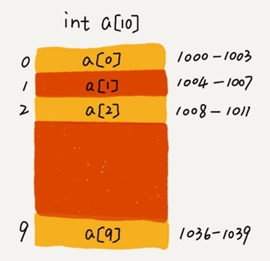
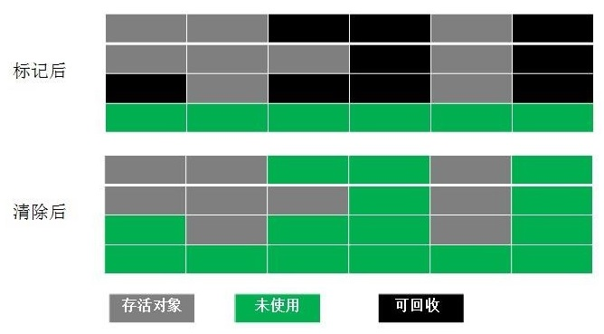
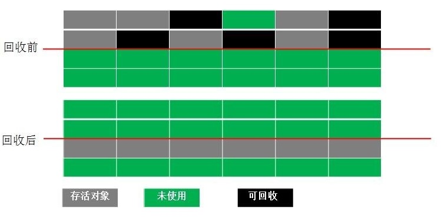

# 02.数组


数组是一种最基础的数据结构，在大部分编程语言中，数组都是从 0 开始编号的。


# 线性表与非线性表

**线性表**（Linear List），就是数据排成像一条线一样的结构。每个线性表上的数据最多只有前和后两个方向，包括**数组，链表、队列、栈**等。

**数组（Array）是一种线性表数据结构。它用一组连续的内存空间，来存储一组具有相同类型的数据。**


**非线性表**，数据之间并不是简单的前后关系，有二叉树、堆、图等，如下图：


# 数组实现随机访问的方法

数组使用了**连续的内存空间和相同类型的数据**。使得它可以“随机访问”，但同时也让数组的删除、插入等操作变得非常低效，为了保证连续性，就需要做大量的数据搬移工作。

**数组是如何实现根据下标随机访问数组呢？**

以一个长度为 10 的 int 类型的数组 `int[] a = new int[10]`为例。

计算机会给每个内存单元分配一个地址，并通过地址来访问内存中的数据。

下图中，假设计算机给数组 a[10]，分配了一块连续内存空间 1000～1039，其中，内存块的首地址为 base_address = 1000。



当计算机需要随机访问数组中的某个元素时，它会首先通过下面的寻址公式，计算出该元素存储的内存地址：

```
a[i]_address = base_address + i * data_type_size
```

* data_type_size 表示数组中每个元素的大小。

上面的数组中存储的是 int 类型数据，所以 data_type_size 就为 4 个字节。


# 数组查找的时间复杂度

数组支持随机访问，根据下标随机访问的时间复杂度为 O(1)。

排好序的数组用二分查找，时间复杂度是 O(logn)；

顺序查找，最好时间复杂度为 O(1)，最差时间复杂度为O(n)，平均时间复杂度为O(n)


# 数组的低效操作

## 插入操作

假设数组的长度为 n，如果将一个数据插入到数组中的第 k 个位置。为了把第 k 个位置腾出来给新来的数据，需要将第 k～n 这部分的元素都顺序地往后挪一位。

如果在数组的末尾插入元素，那就不需要移动数据了，这时的时间复杂度为 O(1)。但如果在数组的开头插入元素，那所有的数据都需要依次往后移动一位，所以最坏时间复杂度是 O(n)。 因为我们在每个位置插入元素的概率是一样的，所以平均情况时间复杂度为 $\frac{1+2+…n}{n}=O(n)$。

如果数组中的数据是有序的，在某个位置插入一个新的元素时，就必须搬移 k 之后的数据。但是，如果数组中存储的数据并没有任何规律，数组只是被当作一个存储数据的集合。可以直接将第 k 位的数据搬移到数组元素的最后，把新的元素直接放入第 k 个位置。

假设数组 a[10] 中存储了如下 5 个元素：a，b，c，d，e。

现在需要将元素 x 插入到第 3 个位置。我们只需要将 c 放入到 a[5]，将 a[2] 赋值为 x 即可：


利用这种处理技巧，在特定场景下，在第 k 个位置插入一个元素的时间复杂度就会降为 O(1)。这个处理思想在快排中也会用到。

## **删除操作**

如果我们要删除第 k 个位置的数据，为了内存的连续性，也需要搬移数据，不然中间就会出现空洞，内存就不连续了。

如果删除数组末尾的数据，则最好情况时间复杂度为 O(1)；如果删除开头的数据，则最坏情况时间复杂度为 O(n)；平均情况时间复杂度也为 O(n)。

实际上，在某些特殊场景下，我们并不一定非得追求数组中数据的连续性。可以将多次删除操作集中在一起执行。

比如数组 a[10] 中存储了 8 个元素：a，b，c，d，e，f，g，h。要依次删除 a，b，c 三个元素：


为了避免 d，e，f，g，h 这几个数据会被搬移三次，可以先记录下已经删除的数据。每次的删除操作并不是真正地搬移数据，只是记录数据已经被删除。当数组没有更多空间存储数据时，再触发执行一次真正的删除操作。

这有点像是 JVM 标记清除垃圾回收算法的核心思想。


# 警惕数组的访问越界问题

先分析一下这段 C 语言代码的运行结果：

```c
int main(int argc, char* argv[]){
    int i = 0;
    int arr[3] = {0};
    for(; i<=3; i++){
        arr[i] = 0;
        printf("hello world\n");
    }
    return 0;
}
```

这段代码的运行结果并非是打印三行“hello word”，而是会无限打印“hello world”。

因为，数组大小为 3，a[0]，a[1]，a[2]，而  a[3] 访问越界，在 C 语言中，a[3] 被定位到某块不属于数组的内存地址上，而这个地址正好是存储变量 i 的内存地址，其他高级语言一般会报角标越界异常。

那么 **a[3]=0 就相当于 i=0**，所以就会导致代码无限循环。

访问数组的本质就是访问一段连续内存，在 C 语言中只要数组通过偏移计算得到的内存地址是可用的，那么程序就可能不会报任何错误。

 C语言把数组越界检查的工作丢给程序员来做，但 Java 本身就会做越界检查，比如下面这几行 Java 代码，就会抛出 java.lang.ArrayIndexOutOfBoundsException。

```java
int[] a = new int[3];
a[3] = 10;
```

# 容器vs数组

针对数组类型，很多语言都提供了容器类，比如 Java 中的 ArrayList、C++ STL 中的 vector。

ArrayList 最大的优势就是**可以将很多数组操作的细节封装起来**。比如前面提到的数组插入、删除数据时需要搬移其他数据等。另外，它还有一个优势，就是**支持动态扩容**。

数组本身在定义的时候需要预先指定大小，因为需要分配连续的内存空间。如果我们申请了大小为 10 的数组，当第 11 个数据需要存储到数组中时，我们就需要重新分配一块更大的空间，将原来的数据复制过去，然后再将新的数据插入。

如果使用 ArrayList，我们就完全不需要关心底层的扩容逻辑，ArrayList 已经帮我们实现好了。每次存储空间不够的时候，它都会将空间自动扩容为 1.5 倍大小。

扩容操作涉及内存申请和数据搬移，是比较耗时的。所以，如果事先能确定需要存储的数据大小，最好**在创建 ArrayList 的时候事先指定数据大小**。

比如我们要从数据库中取出 10000 条数据放入 ArrayList。我们看下面这几行代码，你会发现，相比之下，事先指定数据大小可以省掉很多次内存申请和数据搬移操作。

```java
ArrayList<User> users = new ArrayList(10000);
for (int i = 0; i < 10000; ++i) {
  users.add(xxx);
}
```

有些时候用数组会更合适些：

1. Java ArrayList 无法存储基本类型，比如 int、long，需要封装为 Integer、Long 类，而 Autoboxing、Unboxing 则有一定的性能消耗，所以如果特别关注性能，或者希望使用基本类型，就可以选用数组。
2. 如果数据大小事先已知，并且对数据的操作非常简单，用不到 ArrayList 提供的大部分方法，也可以直接使用数组。
3. 当要表示多维数组时，用数组往往会更加直观。比如 `Object[][] array`；而用容器的话则需要这样定义：`ArrayList<ArrayList> array​`。

总结一下，对于业务开发，直接使用容器就足够了，省时省力。毕竟损耗一丢丢性能，完全不会影响到系统整体的性能。但如果是做一些非常底层的开发，比如开发网络框架，性能的优化需要做到极致，这个时候数组就会优于容器。

# 为什么数组要从 0 开始编号?

**为什么数组要从 0 开始编号，而不是从 1 开始呢？** 从 1 开始不是更符合人类的思维习惯吗？

从数组存储的内存模型上来看，**“下标”最确切的定义应该是“偏移（offset）”**。

从 0 开始编号，数组 a[k] 的内存寻址公式为：

```c
a[k]_address = base_address + k * type_size
```

从 1 开始编号，数组 a[k] 的内存寻址公式为：

```c
a[k]_address = base_address + (k-1)*type_size
```

对比两个公式，从 1 开始编号，每次随机访问数组元素都多了一次减法运算，对于 CPU 来说，就是多了一次减法指令。

所以为了减少一次减法操作，数组选择了从 0 开始编号，而不是从 1 开始。另外，C 语言设计者用 0 开始计数数组下标，之后的 Java、JavaScript 等高级语言都效仿了 C 语言，或者说，为了在一定程度上减少 C 语言程序员学习 Java 的学习成本，因此继续沿用了从 0 开始计数的习惯。


当然，并不是所有语言的数组都是从 0 开始计数的，比如 Matlab。


# 二维数组的内存寻址公式

对于 m * n 的数组，`a[i][j] (i<m,j<n)​`的地址为：

```
address = base_address + (i*n+j)*type_size
```


# JVM垃圾回收与算法

一个对象如果没有任何与之关联的引用，即他们的引用计数为 0，则说明对象不太可能再被用到，那么这个对象就是可回收对象。
为了解决引用计数法的循环引用问题，Java 使用了可达性分析，通过一系列的“GC roots”对象作为起点搜索。如果在“GC roots”和一个对象之间没有可达路径，则称该对象是不可达的。不可达对象不等价于可回收对象，不可达对象变为可回收对象至少要经过两次标记过程。两次标记后仍然是可回收对象，则将面临回收。

## 标记清除算法(Mark-Sweep)

分为 标注 和 清除 两个阶段。标记阶段标记出所有需要回收的对象，清除阶段回收被标记的对象所占用的空间。



这种算法虽然实现简单，内存效率高，不易产生碎片，但是最大的问题是可用内存被压缩到了原本的一半。且存活对象增多的话，Copying 算法的效率会大大降低。

## 复制算法(copying)

为了解决 Mark-Sweep 算法内存碎片化的缺陷而被提出的算法,按内存容量将内存划分为等大小的两块。每次只使用其中一块，当这一块内存满后将尚存活的对象复制到另一块上去，把已使用的内存清掉。



## 标记整理算法(Mark-Compact)

结合了以上两个算法，为了避免缺陷而提出。标记阶段和 Mark-Sweep 算法相同，标记后不是清
理对象，而是将存活对象移向内存的一端。然后清除端边界外的对象。


## 分代收集

根据对象存活的不同生命周期将内存划分为不同的域，一般情况下将 GC 堆划分为老生代(Tenured/Old Generation)和新生代(Young Generation)。

老生代的特点是每次垃圾回收时只有少量对象需要被回收，新生代的特点是每次垃圾回收时都有大量垃圾需要被回收，因此可以根据不同区域选择不同的算法。

### 新生代与复制算法

目前大部分 JVM 的 GC 对于新生代都采取 Copying 算法，因为新生代中每次垃圾回收都要回收大部分对象，即要复制的操作比较少，但通常并不是按照 1：1 来划分新生代。一般将新生代
划分为一块较大的 Eden 空间和两个较小的 Survivor 空间(From Space, To Space)，每次使用Eden 空间和其中的一块 Survivor 空间，当进行回收时，将该两块空间中还存活的对象复制到另一块 Survivor 空间中。


### 老年代与标记复制算法

而老年代因为每次只回收少量对象，因而采用 Mark-Compact 算法。

1.  JAVA 虚拟机提到过的处于方法区的永生代(Permanet Generation)，它用来存储 class 类，
常量，方法描述等。对永生代的回收主要包括废弃常量和无用的类。
2.  对象的内存分配主要在新生代的 Eden Space 和 Survivor Space 的 From Space(Survivor 目
前存放对象的那一块)，少数情况会直接分配到老生代。
3.  当新生代的 Eden Space 和 From Space 空间不足时就会发生一次 GC，进行 GC 后，Eden
Space 和 From Space 区的存活对象会被挪到 To Space，然后将 Eden Space 和 From
Space 进行清理。
4.  如果 To Space 无法足够存储某个对象，则将这个对象存储到老生代。
5.  在进行 GC 后，使用的便是 Eden Space 和 To Space 了，如此反复循环。
6.  当对象在 Survivor 区躲过一次 GC 后，其年龄就会+1。默认情况下年龄到达 15 的对象会被
移到老生代中。


