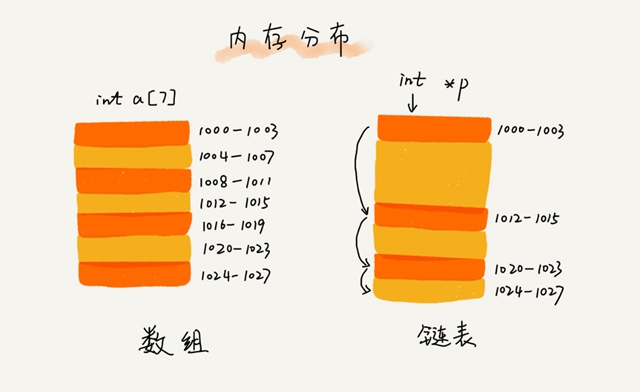
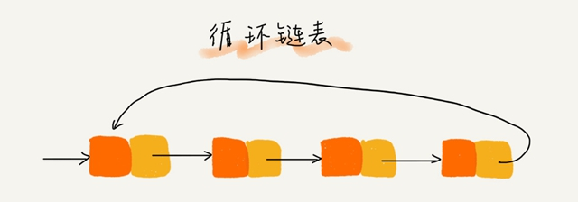
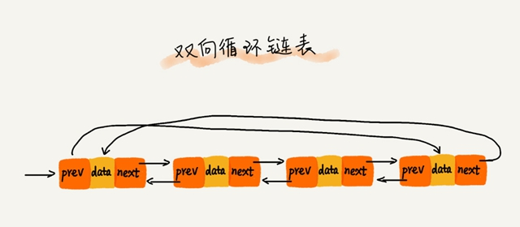
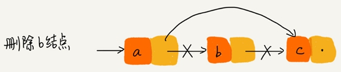
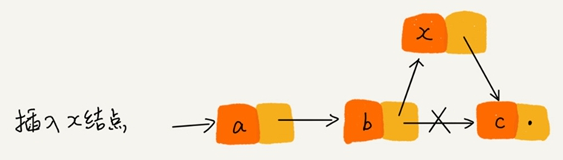
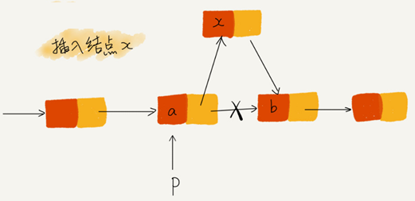
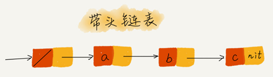
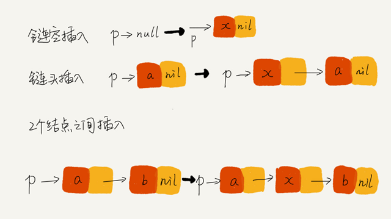

# 03.链表

# 空间换时间&时间换空间

**空间换时间**的设计思想：当内存空间充足的时候，为了追求代码更快的执行速度，就可以选择空间复杂度相对较高、但时间复杂度相对很低的算法或者数据结构。

**时间换空间**的设计思想：内存空间比较紧缺时，可以选择空间复杂度相对较低、但时间复杂度相对很高的算法或者数据结构，来节省内存空间。

缓存实际上就是利用了**空间换时间**的设计思想。如果我们把数据存储在硬盘上，会比较节省内存，但每次查找数据都要询问一次硬盘，会比较慢。但如果我们通过缓存技术，事先将数据加载在内存中，虽然会比较耗费内存空间，但是每次数据查询的速度就大大提高了。

总结:

**对于执行较慢的程序，可以通过消耗更多的内存（空间换时间）来进行优化；**

**对于内存消耗过多的程序，可以通过消耗更多的时间（时间换空间）来降低内存的消耗。**


# 链表的存储结构



数组需要一块**连续的内存空间**来存储，需要事先申请需要申请内存空间；而链表通过“指针”将一组**零散的内存块**串联起来使用，不会占用还未使用的内存空间。


# 三种最常见的链表结构

## 单链表

链表通过指针将一组零散的内存块串联在一起，内存块称为链表的“**结点**”。每个链表的结点除了存储数据之外，还需要记录链上的下一个结点的地址，叫作**后继指针 next**。


上图中有两个特殊的结点，分别是第一个结点（**头结点**）和最后一个结点（**尾结点**）。

头结点用来记录链表的基地址，用它可以遍历得到整条链表。

尾结点指向一个**空地址 NULL**，表示这是链表上最后一个结点。


## 循环链表

**循环链表**跟单链表的区在尾结点指针是指向链表的头结点。



和单链表相比，**循环链表**的优点是从链尾到链头比较方便。

当要处理的数据具有环型结构特点时，采用循环链表实现代码会简洁很多。

## 双向链表

双向链表支持两个方向，每个结点同时有后继指针 next 指向后面的结点，还有一个前驱指针 prev 指向前面的结点。


双向链表需要额外的两个空间来存储后继结点和前驱结点的地址，存储同样的数据，双向链表要比单链表占用更多的内存空间。优点是双向链表可以支持 O(1) 时间复杂度的情况下找到前驱结点。

 Java 语言的LinkedHashMap  就用到了双向链表这种数据结构。

## 双向循环链表



# 三种基本操作

## 删除操作

从链表中删除一个数据有两种情况：

- 删除结点中“值等于某个给定值”的结点
- 删除给定指针指向的结点。

**对于第一种情况**，各种链表都需要从头结点开始遍历对比，直到找到值等于给定值的结点，然后再删除。

单纯的删除操作时间复杂度是 O(1)，但遍历查找对应的时间复杂度为 O(n)。链表操作的总时间复杂度为 O(n)。

**对于第二种情况**，删除某个结点 q 需要知道其前驱结点，而单链表并不支持直接获取前驱结点，所以，单链表还是要从头结点开始遍历链表，直到 p->next=q，说明 p 是 q 的前驱结点。

双向链表中的结点已经保存了前驱结点的指针，不需要像单链表那样遍历。

所以，单链表删除操作需要 O(n) 的时间复杂度，而双向链表需要 O(1) 的时间复杂度。



## 插入操作



如果希望在链表的某个指定结点前面插入一个结点，双向链表需要O(1) 时间复杂度；

单向链表需要 O(n) 的时间复杂度，因为单链表都需要从头结点开始遍历，直到找到前驱节点。

## 查询操作

链表的随机访问第 k 个元素，必须根据指针一个结点一个结点地依次遍历，直到找到相应的结点。链表随机访问需要 O(n) 的时间复杂度。

对于一个有序链表，双向链表的按值查询的效率会比单链表高一些。记录上次查找的位置 p，每次查询时，根据要查找的值与 p 的大小关系，决定是往前还是往后查找，双向链表平均只需要查找一半的数据。


# 链表 VS 数组性能大比拼

数组和链表的时间复杂度：

| 时间复杂度 | 数组 | 链表 |
| :--------: | :--: | :--: |
|  插入删除  | O(n) | O(1) |
|  随机访问  | O(1) | O(n) |

数组简单易用，在实现上使用的是连续的内存空间，可以借助 CPU 的缓存机制，预读数组中的数据，所以访问效率更高。而链表在内存中并不是连续存储，所以对 CPU 缓存不友好，没办法有效预读。

数组的缺点是大小固定，一经声明就要占用整块连续内存空间。如果声明的数组过大，系统可能没有足够的连续内存空间分配给它，导致“**内存不足(out  of  memory)**”。如果声明的数组过小，则可能出现不够用的情况。这时只能再申请一个更大的内存空间，把原数组拷贝进去，非常费时。链表本身没有大小的限制，天然地支持动态扩容。

Java 中的 ArrayList 容器的动态扩容，存在数据拷贝的操作，而数据拷贝的操作是非常耗时的。举一个稍微极端的例子。如果我们用  ArrayList 存储了了 1GB 大小的数据，这个时候已经没有空闲空间了，当我们再插入数据的时候，ArrayList 会申请一个  1.5GB 大小的存储空间，并且把原来那 1GB 的数据拷贝到新申请的空间上。

如果对内存的使用非常苛刻数组就更适合，因为链表中的每个结点都需要消耗额外的存储空间去存储一份指向下一个结点的指针，所以内存消耗会翻倍。

对链表进行频繁的插入、删除操作，会导致频繁的内存申请和释放，容易造成内存碎片，对于 Java 语言，就有可能会导致频繁的 GC（Garbage Collection，垃圾回收）。


# LRU 缓存

缓存是一种提高数据读取性能的技术，在硬件设计、软件开发中都有着非常广泛的应用，比如常见的 CPU 缓存、数据库缓存、浏览器缓存等等。

## 常见的缓存淘汰策略

- 先进先出策略  FIFO（First In，First Out）
- 最少使用策略 LFU（Least Frequently Used）
- 最近最少使用策略  LRU（Least Recently Used）

**假如你买了很多本技术书，但有一天你发现，这些书太多了，太占书房空间了，你要做个大扫除，扔掉一些书籍。那这个时候，你会选择扔掉哪些书呢？**


## LRU缓存的实现

**思路**：维护一个有序单链表，越靠近链表尾部的结点是越早之前访问的。当有一个新的数据被访问时，从链表头开始顺序遍历链表：

1. 如果此数据之前已经被缓存在链表中了，遍历得到这个数据对应的结点，并将其从原来的位置删除，然后再插入到链表的头部。

2. 如果此数据没有在缓存链表中,，则将此结点插入到链表的头部；

   - 如果此时缓存超过容量，则链表尾结点删除。

---

```python
class ListNode(object):
    def __init__(self, val, n=None):
        self.val = val
        self.next = n


class LRUCache:
    """
    一个 LRU 缓存
    维护了一个有序单链表，越靠近链表尾部的结点是越早之前访问的。
    """

    def __init__(self, capacity: int = 10):
        self.cap = capacity
        # 哨兵节点, 本身不存储任何数据
        self.head = ListNode(None, None)
        self.length = 0

    def __len__(self):
        return self.length

    def get(self, val: object) -> bool:
        '''获取指定缓存数据
        思路：从链表头开始顺序遍历链表：
        1. 如果此数据之前已经被缓存在链表中了，遍历得到这个数据对应的结点，并将其从原来的位置删除，然后再插入到链表的头部。
        2. 如果此数据没有在缓存链表中，则将新的数据结点插入链表的头部：
           - 如果此时缓存已满已超过容量，则将链表尾结点删除，
        参数：
            val:要获取的数据
        返回：
            存在于缓存中，返回True，否则返回 False。
        '''
        prev = None  # 用于记录尾节点的前一个节点
        p = self.head
        # 如果此数据之前已经被缓存在链表中了
        while p.next:
            if p.next.val == val:
                # 将目标节点从原来的位置删除
                dest = p.next  # dest临时保存目标节点
                p.next = dest.next
                # 将目标节点插入到头部
                self.insert_to_head(self.head, dest)
                return True
            prev = p
            p = p.next

        # 如果此数据没有缓存在链表中
        self.insert_to_head(self.head, ListNode(val))
        self.length += 1
        # 添加数据导致超过容量则要删除尾节点
        if self.length > self.cap:
            prev.next = None
        return False

    @staticmethod
    def insert_to_head(head, node):
        """将指定节点插入到头部"""
        node.next = head.next
        head.next = node

    def __str__(self):
        vals = []
        p = self.head.next
        while p:
            vals.append(str(p.val))
            p = p.next
        return '->'.join(vals)
```

不管缓存有没有满，访问都需要遍历一遍链表，时间复杂度为 $O(n)$。


也可以用数组实现 LRU 缓存淘汰策略：

```python
class LRUCache:
    '''
    通过数组array实现的简易 LRU缓存
    维护一个list，越靠近尾部表示是越早之前访问的。
    '''
    def __init__(self, capacity: int = 10):
        self.cap = capacity
        self._data = []  # 存储数据

    def __len__(self):
        return len(self._data)

    def __str__(self):
        return str(self._data)

    def get(self, val: object) -> bool:
        """
        获取指定缓存数据
        参数：
            val:要获取的数据
        返回：
            存在于缓存中，返回True，否则返回 False。
        """
        for i in range(len(self._data)):
            if self._data[i] == val:
                self._data.insert(0, self._data.pop(i))
                return True

        # 如果此数据没有缓存在链表中
        self._data.insert(0, val)
        # 添加数据导致超过容量则要删除尾节点
        if len(self) > self.cap:
            self._data.pop(len(self)-1)
        return False
```


# 回文字符串

如果字符串是通过单链表来存储的，那该如何来判断是一个回文串呢？

思路：

- 使用快慢两个指针找到链表中点，慢指针每次前进一步，快指针每次前进两步。这样当快指针指向末尾时，慢指针指向了中点。

- 在慢指针前进的过程中，同时修改其 next 指针指向上一个元素prev，使得链表前半部分反序。

- 最后比较中点两侧的链表是否相等。

---

```python
class ListNode(object):
    def __init__(self, val, next=None):
        self.val = val
        self.next = next


class StringLinkedList:
    def __init__(self, val: str):
        self.head = ListNode(None, None)
        p = self.head
        for ch in val:
            p.next = ListNode(ch)
            p = p.next
        self.head = self.head.next

    def is_palindrome(self) -> bool:
        """
        判断字符串链表是否是回文字符串
        思路：
        - 使用快慢两个指针找到链表中点，慢指针每次前进一步，快指针每次前进两步。这样当快指针指向末尾时，慢指针指向了中点。
        - 在慢指针前进的过程中，同时修改其 next 指针指向上一个元素prev，使得链表前半部分反序。
        - 最后比较中点两侧的链表是否相等。
        """
        p = self.head
        if not p.next:
            return True
        prev = None
        slow = p
        fast = p
        while fast and fast.next:
            # 快指针每次前进两步
            fast = fast.next.next
            # 慢指针每次前进一步，同时修改其 next指针指向上一个元素
            next_node = slow.next
            slow.next = prev
            prev = slow
            slow = next_node
        # 当快节点指向尾部时循环结束，此时慢节点指向中位点
        # 如果快节点仍然有值，说明字符串长度为奇数，慢节点指向中位点下一个节点
        mid = slow
        if fast:
            slow = slow.next

        # print(self.to_string(prev), self.to_string(slow), self.to_string(fast))
        tmp = mid
        while slow:
            if slow.val != prev.val:
                return False
            slow = slow.next
            #还原倒序的链表
            next_node = prev.next
            prev.next = tmp
            tmp = prev
            prev = next_node

        return True

    @staticmethod
    def to_string(head: ListNode):
        vals = []
        p = head
        while p:
            vals.append(str(p.val))
            p = p.next
        return ''.join(vals)

    def __str__(self):
        return self.to_string(self.head)
```


时间复杂度：$O(n)$
空间复杂度：$O(1)$

---


# 约瑟夫环

题目：有n个人围成一圈，顺序排号。从第一个人开始报数（从1到m报数），凡报到m的人退出圈子，直到船上仅剩 r人为止,问都有哪些编号的人下船了呢？。

假设n=30，m=9，r=15

数组实现：

```python
# -*- coding: utf-8 -*-
__author__ = 'xiaoxiaoming'

n, m, r = 30, 9, 15
circle = list(range(1, n + 1))
# index+1代表当前报数的人在剩余报数人群中的编号
index = 0
result = []
while len(circle) > r:
    index += m-1
    if (index >= len(circle)):
        index -= len(circle)
    result.append(circle.pop(index))
print("报到%d的人的出列顺序：" % m, result)
```

链表实现：

```python
class ListNode(object):
    def __init__(self, val, next_node=None):
        self.val = val
        self.next = next_node


n, m, r = 30, 9, 15
# 开始构建环
head = ListNode(1)
p = head
for i in range(2, n + 1):
    p.next = ListNode(i)
    p = p.next
p.next = head
# 构建完成,开始报数

result = []  # 用于保存出列顺序
p = head
count = 1  # 第一个人报的数为1
while n != r:
    prev: ListNode = p
    p = p.next
    count += 1
    # 凡报到m的人退出圈子
    if count == m:
        result.append(p.val)
        prev.next = prev.next.next
        count = 0
        n -= 1
print("报到%d的人的出列顺序：" % m, result)
```


# 几个写链表的代码技巧

## 技巧一：理解指针或引用的含义

C 语言有“指针”的概念； Java、Python的“引用”相当于C 语言的“指针”。

“指针”和“引用”都是存储所指对象的内存地址。

**将某个变量赋值给指针，实际上就是将这个变量的地址赋值给指针，或者反过来说，指针中存储了这个变量的内存地址，指向了这个变量，通过指针就能找到这个变量。**

p->next=q 表示 p 结点中的 next 指针存储了 q 结点的内存地址。

p->next=p->next->next 表示 p 结点的 next 指针存储了 p 结点的下下一个结点的内存地址。


## 技巧二：警惕指针丢失和内存泄漏

写链表代码的时候，指针指来指去，一会儿就不知道指到哪里了。所以，我们在写的时候，一定注意不要弄丢了指针。

指针往往都是怎么弄丢的呢？拿单链表的插入操作为例来分析一下：



如图所示，我们希望在结点 a 和相邻的结点 b 之间插入结点 x，假设当前指针 p 指向结点 a。如果我们将代码实现变成下面这个样子，就会发生指针丢失和内存泄露。

```c
p->next = x;  // 将 p 的 next 指针指向 x 结点；
x->next = p->next;  // 将 x 的结点的 next 指针指向 b 结点；
```

初学者经常会在这儿犯错。p->next  指针在完成第一步操作之后，已经不再指向结点 b 了，而是指向结点 x。第 2 行代码相当于将 x 赋值给  x->next，自己指向自己。因此，整个链表也就断成了两半，从结点 b 往后的所有结点都无法访问到了。

对于有些语言来说，比如 C 语言，内存管理是由程序员负责的，如果没有手动释放结点对应的内存空间，就会产生内存泄露。所以，我们**插入结点时，一定要注意操作的顺序**，要先将结点 x 的 next 指针指向结点 b，再把结点 a 的 next 指针指向结点 x，这样才不会丢失指针，导致内存泄漏。所以，对于刚刚的插入代码，我们只需要把第 1 行和第 2 行代码的顺序颠倒一下就可以了。

同理，**删除链表结点时，也一定要记得手动释放内存空间**，否则，也会出现内存泄漏的问题。当然，对于像 Java 这种虚拟机自动管理内存的编程语言来说，就不需要考虑这么多了。

## 技巧三：利用哨兵简化实现难度

对于单链表的插入和删除操作，如果我们在结点 p 后面插入一个新的结点，只需要下面两行代码就可以搞定。

```c
new_node->next = p->next;
p->next = new_node;
```

但是，当我们要向一个空链表中插入第一个结点，刚刚的逻辑就不能用了。我们需要进行下面这样的特殊处理，其中 head 表示链表的头结点。所以，从这段代码，我们可以发现，对于单链表的插入操作，第一个结点和其他结点的插入逻辑是不一样的。

```c
if (head == null) {
  head = new_node;
}
```

我们再来看单链表结点删除操作。如果要删除结点 p 的后继结点，我们只需要一行代码就可以搞定。

```c
p->next = p->next->next;
```

但是，如果我们要删除链表中的最后一个结点，前面的删除代码就不 work 了。跟插入类似，我们也需要对于这种情况特殊处理。写成代码是这样子的：

```c
if (head->next == null) {
   head = null;
}
```

**针对链表的插入、删除操作，需要对插入第一个结点和删除最后一个结点的情况进行特殊处理**。

head 表示头结点指针指向链表中的第一个结点，head=null 表示链表中没有结点了。

哨兵是为了解决“边界问题”的，不直接参与业务逻辑。如果我们引入哨兵结点，在任何时候，不管链表是不是空，head 指针都会一直指向这个哨兵结点。我们也把这种有哨兵结点的链表叫**带头链表**。相反，没有哨兵结点的链表就叫作**不带头链表**。

**带头链表：**

哨兵结点是不存储数据的。因为哨兵结点一直存在，所以插入第一个结点和插入其他结点，删除最后一个结点和删除其他结点，都可以统一为相同的代码实现逻辑了。



实际上，这种利用哨兵简化编程难度的技巧，在插入排序、归并排序、动态规划等代码都有用到。

示例1：

```c
// 在数组 a 中，查找 key，返回 key 所在的位置
// 其中，n 表示数组 a 的长度
int find(char* a, int n, char key) {
  // 边界条件处理，如果 a 为空，或者 n<=0，说明数组中没有数据，就不用 while 循环比较了
  if(a == null || n <= 0) {
    return -1;
  }
  int i = 0;
  // 这里有两个比较操作：i<n 和 a[i]==key.
  while (i < n) {
    if (a[i] == key) {
      return i;
    }
    ++i;
  }
  return -1;
}
```

示例2：

```c
// 在数组 a 中，查找 key，返回 key 所在的位置
// 其中，n 表示数组 a 的长度
// 我举 2 个例子，你可以拿例子走一下代码
// a = {4, 2, 3, 5, 9, 6}  n=6 key = 7
// a = {4, 2, 3, 5, 9, 6}  n=6 key = 6
int find(char* a, int n, char key) {
  if(a == null || n <= 0) {
    return -1;
  }

  // 这里因为要将 a[n-1] 的值替换成 key，所以要特殊处理这个值
  if (a[n-1] == key) {
    return n-1;
  }
    
  // 把 a[n-1] 的值临时保存在变量 tmp 中，以便之后恢复。tmp=6。
  // 之所以这样做的目的是：希望 find() 代码不要改变 a 数组中的内容
  char tmp = a[n-1];
  // 把 key 的值放到 a[n-1] 中，此时 a = {4, 2, 3, 5, 9, 7}
  a[n-1] = key;

  int i = 0;
  // while 循环比起代码一，少了 i<n 这个比较操作
  while (a[i] != key) {
    ++i;
  }

  // 恢复 a[n-1] 原来的值, 此时 a= {4, 2, 3, 5, 9, 6}
  a[n-1] = tmp;
  if (i == n-1) {
    // 如果 i == n-1 说明，在 0...n-2 之间都没有 key，所以返回 -1
    return -1;
  } else {
    // 否则，返回 i，就是等于 key 值的元素的下标
    return i;
  }
}
```

两段代码中执行次数最多就是 while  循环那一部分。第二段代码中，通过一个哨兵 a[n-1] = key，成功省掉了一个比较语句  i<n，在字符串  a 很长的时候，比如几万、几十万时，累积的节省时间就很明显了。

**利用哨兵简化编码**

哨兵可以理解为它可以减少特殊情况的判断，比如判空，比如判越界，比如减少链表插入删除中对空链表的判断，比如例子中对i越界的判断。

空与越界可以认为是小概率情况，所以代码每一次操作都走一遍判断，在大部分情况下都会是多余的。

哨兵的巧妙就是提前将这种情况去除，比如给一个哨兵结点，以及将key赋值给数组末元素，让数组遍历不用判断越界也可以因为相等停下来。

使用哨兵的指导思想应该是将小概率需要的判断先提前扼杀，比如提前给他一个值让他不为null，或者提前预设值，或者多态的时候提前给个空实现，然后在每一次操作中不必再判断以增加效率。  

## 技巧四：重点留意边界条件处理

软件开发中，代码在一些边界或者异常情况下，最容易产生 Bug。要实现没有 Bug 的链表代码，一定要检查边界条件是否考虑全面，以及代码在边界条件下是否能正确运行。

常用检查链表代码是否正确的边界条件有：

- 如果链表为空时，代码是否能正常工作？
- 如果链表只包含一个结点时，代码是否能正常工作？
- 如果链表只包含两个结点时，代码是否能正常工作？
- 代码逻辑在处理头结点和尾结点的时候，是否能正常工作？

如果这些边界条件下都没有问题，那基本上可以认为没有问题了。

当然，边界条件不止针对不同的场景，可能还有特定的边界条件。

写任何代码时，一定要多想想，你的代码在运行的时候，可能会遇到哪些边界情况或者异常情况。遇到了应该如何应对，这样写出来的代码才够健壮！

## 技巧五：举例画图，辅助思考

找一个具体的例子，把它画下面释放一些脑容量，留更多的给逻辑思考，这样就会感觉到思路清晰很多。比如往单链表中插入一个数据这样一个操作，可以把各种情况都举一个例子，画出插入前和插入后的链表变化，如图所示：



写完代码之后，也可以举几个例子，画在纸上，照着代码走一遍，很容易就能发现代码中的 Bug。

## 技巧六：多写多练，没有捷径

下面 5 个常见的链表操作。只要把这几个操作都能写熟练，不熟就多写几遍，之后再也不会害怕写链表代码。

- 单链表反转
- 链表中环的检测
- 两个有序的链表合并
- 删除链表倒数第 n 个结点
- 求链表的中间结点

**写链表代码是最考验逻辑思维能力的**。因为，链表代码到处都是指针的操作、边界条件的处理，稍有不慎就容易产生 Bug。链表代码写得好坏，可以看出一个人写代码是否够细心，考虑问题是否全面，思维是否缜密。


