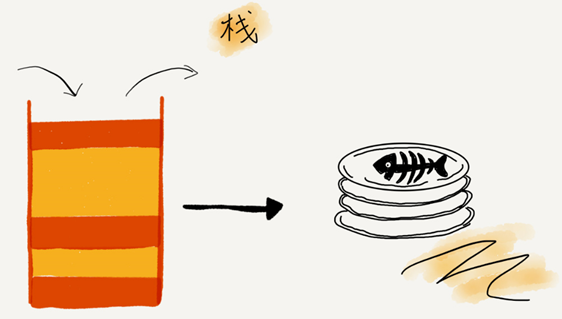
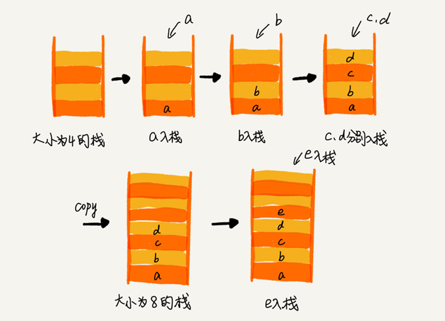
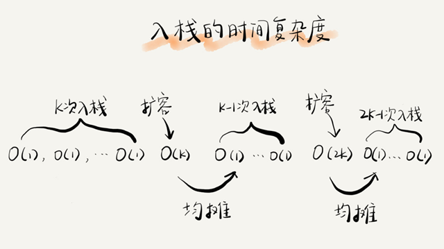
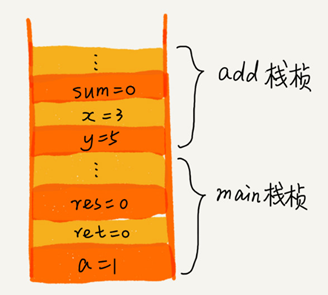
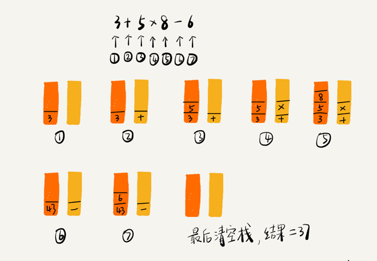
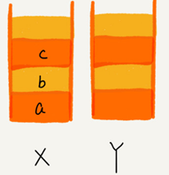
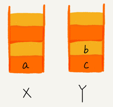
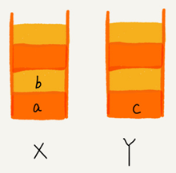
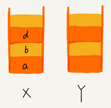

# 理解“栈”

## “栈”的基本结构

**后进者先出，先进者后出，就是典型的“栈”结构。**



从栈的操作特性上来看，**栈是一种“操作受限”的线性表**，只允许在一端插入和删除数据。

从功能上来说，数组或链表可以替代栈，但特定的数据结构是对特定场景的抽象，数组或链表暴露了太多的操作接口，操作上的确灵活自由，但使用时就比较不可控，自然也就更容易出错。

**当某个数据集合只涉及在一端插入和删除数据，并且满足后进先出、先进后出的特性，就应该首选“栈”这种数据结构**。

## 实现一个“栈”

栈主要包含两个操作，入栈和出栈，也就是在栈顶插入一个数据和从栈顶删除一个数据。

栈既可以用数组来实现，也可以用链表来实现。用数组实现的栈，我们叫作**顺序栈**，用链表实现的栈，我们叫作**链式栈**。

java数组实现：

```java
// 基于数组实现的顺序栈
public class ArrayStack {
  private String[] items;  // 数组
  private int count;       // 栈中元素个数
  private int n;           // 栈的大小
 
  // 初始化数组，申请一个大小为 n 的数组空间
  public ArrayStack(int n) {
    this.items = new String[n];
    this.n = n;
    this.count = 0;
  }
 
  // 入栈操作
  public boolean push(String item) {
    // 数组空间不够了，直接返回 false，入栈失败。
    if (count == n) return false;
    // 将 item 放到下标为 count 的位置，并且 count 加一
    items[count] = item;
    ++count;
    return true;
  }
  
  // 出栈操作
  public String pop() {
    // 栈为空，则直接返回 null
    if (count == 0) return null;
    // 返回下标为 count-1 的数组元素，并且栈中元素个数 count 减一
    String tmp = items[count-1];
    --count;
    return tmp;
  }
}
```

python数组实现：

```python
class ArrayStack():
    """基于数组实现的顺序栈"""

    def __init__(self, n: int):
        self.items = [None] * n  # 数组
        self.count = 0  # 栈中元素的个数
        self.n = n  # 栈的大小

    def push(self, item) -> bool:
        # 数组空间不够了，直接返回 false，入栈失败。
        if self.count == self.n:
            return False
        # 将item放到下标为count的位置，并且count加1
        self.items[self.count] = item
        self.count += 1
        return True

    def pop(self):
        # 栈为空，则直接返回 None
        if self.count == 0:
            return None
        # 返回下标为count-1的数组元素，并且栈中元素个数count减1
        tmp = self.items[self.count - 1]
        self.count -= 1
        return tmp

    def __str__(self):
        return str(self.items[:self.count])
```

python的栈实现：

```python
class ListNode:
    def __init__(self, data: int, next=None):
        self._data = data
        self._next = next


class LinkedStack:
    """基于单链表实现的栈
    """

    def __init__(self):
        self._top: ListNode = None

    def push(self, value):
        # 添加元素
        new_top = ListNode(value)
        new_top._next = self._top
        self._top = new_top
        return True

    def pop(self):
        # 删除并返回栈顶元素
        value = self._top._data
        self._top = self._top._next
        return value

    def __str__(self) -> str:
        vals = []
        p: ListNode = self._top
        while p:
            vals.append(str(p._data))
            p = p._next
        return '->'.join(vals)
```

不管是顺序栈还是链式栈，存储数据只需要一个大小为 n 的存储空间。

在入栈和出栈过程中，只需要一两个临时变量存储空间，所以**空间复杂度是 O(1)**。

**空间复杂度是指除了原本的数据存储空间外，算法运行还需要额外的存储空间。**

不管是顺序栈还是链式栈，入栈、出栈只涉及栈顶个别数据的操作，所以**时间复杂度都是 O(1)**。


## 支持动态扩容的顺序栈

上面基于数组实现的栈，当栈满之后，就无法再往栈里添加数据了。尽管链式栈的大小不受限，但要存储 next 指针，内存消耗相对较多。

**注意：python的列表本身支持动态扩容，不需要自己实现细节。**

要实现一个支持动态扩容的栈，我们只需要底层依赖一个支持动态扩容的数组就可以了。当栈满了之后，我们就申请一个更大的数组，将原来的数据搬移到新数组中：



出栈的时间复杂度是 O(1)，因为出栈操作不会涉及内存的重新申请和数据的搬移。

对于入栈操作来说，最好情况时间复杂度是 O(1)，最坏情况时间复杂度是 O(n)。当栈中有空闲空间时，入栈操作的仅1次赋值操作。但当空间不够时，就需要重新申请内存和数据搬移。

对于平均情况下的时间复杂度，可以采用摊还分析法。

假设：

- 栈空间不够时，重新申请一个是原来大小两倍的数组；
- 只有入栈操作没有出栈操作；
- 入栈操作均为 simple-push 操作，时间复杂度为 O(1)。

如果当前栈大小为 K已满，入栈时就要重新申请 2 倍大小的内存，并且做 K 个数据的搬移操作，然后再入栈。但接下来的 K-1 次入栈操作都只需要一个 simple-push 操作就可以完成：



这 K 次入栈操作，总共涉及了 K 个数据的搬移，以及 K 次 simple-push 操作。将 K 个数据搬移均摊到 K 次入栈操作，那每个入栈操作只需要一个数据搬移和一个 simple-push 操作。以此类推，入栈操作的均摊时间复杂度就为 O(1)。

**均摊时间复杂度一般都等于最好情况时间复杂度。**因为在大部分情况下，入栈操作的时间复杂度 O 都是 O(1)，只有在个别时刻才会退化为 O(n)，所以把耗时多的入栈操作的时间均摊到其他入栈操作上，平均情况下的耗时就接近 O(1)。

# 栈在软件工程中的实际应用

## 函数调用栈

操作系统给每个线程分配了一块独立的内存空间，这块内存被组织成“栈”这种结构, 用来存储函数调用时的临时变量。每进入一个函数，就会将临时变量作为一个栈帧入栈，当被调用函数执行完成，返回之后，将这个函数对应的栈帧出栈：

```c
int main() {
   int a = 1; 
   int ret = 0;
   int res = 0;
   ret = add(3, 5);
   res = a + ret;
   printf("%d", res);
   reuturn 0;
}
 
int add(int x, int y) {
   int sum = 0;
   sum = x + y;
   return sum;
}
```

main() 函数调用了 add() 函数，获取计算结果，并且与临时变量 a 相加，最后打印 res 的值。

下图表示在执行到 add() 函数时，函数调用栈出栈、入栈的的情况。



## 栈实现表达式求值

编译器如何利用栈来实现**表达式求值**？比如：34+13*9+44-12/3。

需要两个栈来实现：一个栈保存操作数，另一个栈保存运算符。

从左向右遍历表达式，遇到数字就压入操作数栈；

遇到运算符，就与运算符栈的栈顶元素进行比较。如果比运算符栈顶元素的优先级高，就将当前运算符压入栈；如果比运算符栈顶元素的优先级低或者相同，从运算符栈中取栈顶运算符，从操作数栈的栈顶取 2 个操作数，然后进行计算，再把计算完的结果压入操作数栈，继续比较。

下图是 3+5*8-6 这个表达式的计算过程：




## 栈实现括号匹配

借助栈来检查表达式中的括号是否匹配：

假设表达式中只包含三种括号，圆括号 ()、方括号 [] 和花括号{}，并且它们可以任意嵌套。比如，{[{}]}或 [{()}([])] 等都为合法格式，而{[}()] 或 [({)] 为不合法的格式。对于一个包含三种括号的表达式字符串，如何检查它是否合法呢？

**"("跟")"匹配，"["跟"]"匹配，"{"跟"}"匹配**

使用一个栈即可实现：

从左到右依次扫描字符串，遇到左括号则将其压入栈中；

当扫描到右括号时，从栈顶取出一个左括号。如果能够匹配，则继续扫描剩下的字符串。如果扫描的过程中，遇到不能配对的右括号，或者栈中没有数据，则说明为非法格式。

当所有的括号都扫描完成之后，如果栈为空，则说明字符串为合法格式；否则，说明有未匹配的左括号，为非法格式。


## 实现浏览器的前进和后退功能

依次访问完一串页面 a-b-c 之后，点击浏览器的后退按钮，就可以查看之前浏览过的页面 b 和 a。后退到页面 a，点击前进按钮，就可以重新查看页面 b 和 c。但是，如果后退到页面 b 后，点击了新的页面 d，那就无法再通过前进、后退功能查看页面 c 了。如何实现这个功能呢？

使用两个栈X 和 Y即可实现：

**栈 X中的栈顶数据表示当前访问的页面**

打开页面时将数据压入栈 X，并清空栈Y。

当点击后退按钮时，取出栈 X数据 并放入栈 Y中。

当点击前进按钮时，取出栈 Y 数据放入栈 X 中。

当栈 X 中仅剩1个数据时，那就说明没有页面可以继续后退浏览了。

当栈 Y 中没有数据，那就说明没有页面可以点击前进按钮浏览了。


流程示例：顺序查看了 a，b，c 三个页面，就依次把 a，b，c 压入栈X：



点击后退按钮，从页面 c 后退到页面 a 之后，就依次把 c 和 b 从栈 X 中弹出，并且依次放入到栈 Y：



又点击前进按钮回到 b 页面，就把 b 再从栈 Y 中出栈，放入栈 X 中：



通过页面 b 访问新页面 d，则将d放入X中，同时清空栈 Y ：



总之，后退时将页面从X移动到Y；前进则将页面从Y移动到X；访问新页面时，则将新页面压入X，并清空Y。

三种操作都是取X的栈顶元素显示。

python代码实现：

```python
from collections import deque


class Browser():

    def __init__(self):
        self.x_stack = deque()
        self.y_stack = deque()

    def can_back(self):
        return len(self.x_stack) > 1

    def can_forward(self):
        return len(self.y_stack) > 0

    def open(self, url):
        print("Open new url %s" % url, end="\n")
        self.x_stack.appendleft(url)
        self.y_stack.clear()

    def back(self):
        if self.can_back():
            self.y_stack.appendleft(self.x_stack.popleft())
            print("back to %s" % self.x_stack[0], end="\n")

    def forward(self):
        if self.can_forward():
            self.x_stack.appendleft(self.y_stack.popleft())
            print("forward to %s" % self.x_stack[0], end="\n")

    def __str__(self):
        return "X:HEAD=>%s,Y:HEAD=>%s" % ("->".join(self.x_stack) or "None", "->".join(self.y_stack) or "None")
```


# 两个问题

1.函数调用除了用“栈”来保存临时变量以外还可以用其他数据结构吗？

**答：**

> 其实，我们不一定非要用栈来保存临时变量，只不过如果这个函数调用符合后进先出的特性，用栈这种数据结构来实现，是最顺理成章的选择。
>
> 从调用函数进入被调用函数，对于数据来说，变化的是作用域。只要能保证每进入一个新的函数，都是一个新的作用域就可以。
>
> 要实现这个，用栈就非常方便。在进入被调用函数的时候，分配一段栈空间给这个函数的变量，在函数结束的时候，将栈顶复位，正好回到调用函数的作用域内。  

---


2.JVM 内存管理中有个“堆栈”的概念。栈内存用来存储局部变量和方法调用，堆内存用来存储 Java 中的对象。JVM 里面的“栈”跟数据结构的栈有什么区别呢？

**答：**

> 内存中的堆栈是真实存在的物理区，数据结构中的堆栈是抽象的数据存储结构。
> JVM 的内存空间在逻辑上分为：代码区、静态数据区、动态数据区
>
> - 代码区
>
>   存储方法体的二进制代码。
>
>   控制代码区执行代码的切换：
>   - 高级调度（作业调度）
>   - 中级调度（内存调度）
>   - 低级调度（进程调度）
>
> - 静态数据区
>   - 存储全局变量、静态变量、常量，常量包括final修饰的常量和String常量
>   - 系统自动分配和回收。
>
> - 动态数据区
>   1. 栈区：存储运行方法的形参、局部变量、返回值。由系统自动分配和回收。
>   2. 堆区：new一个对象的引用或地址存储在栈区，指向该对象存储在堆区中的真实数据。


