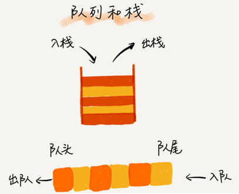
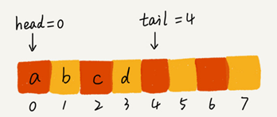
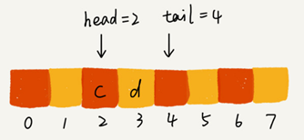
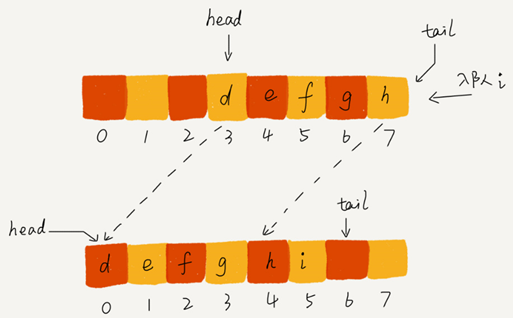
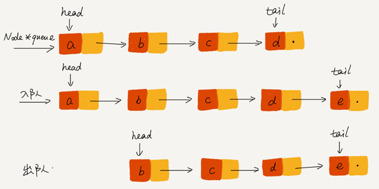
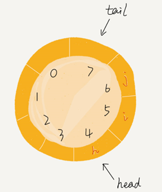
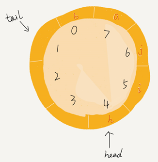
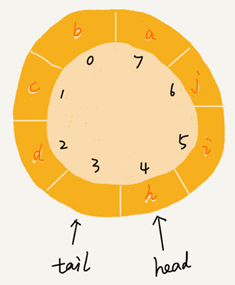
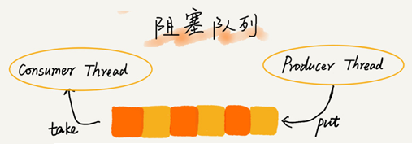
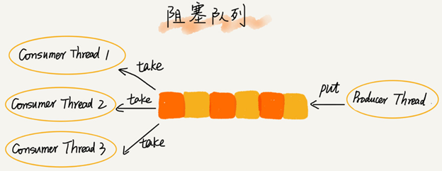

# 队列的结构

可以把队列想象成排队买票，先来的先买，后来的人只能站末尾，不允许插队。

队列最大的特点就是先进先出，主要的两个操作是入队和出队。跟栈一样，它既可以用数组来实现，也可以用链表来实现。用数组实现的叫顺序队列，用链表实现的叫链式队列。特别是长得像一个环的循环队列。在数组实现队列的时候，会有数据搬移操作，要想解决数据搬移的问题，就需要循环数组实现的循环队列。

**先进者先出，是典型的“队列”**。

**后进者先出，先进者后出，是典型的“栈”结构。**

栈只支持**入栈 push()和出栈 pop()**两个操作。

队列只支持：**入队 enqueue()**，放一个数据到队列尾部；**出队 dequeue()**，从队列头部取一个元素。



队列跟栈一样也是一种**操作受限的线性表数据结构**。

循环队列、阻塞队列、并发队列等具有某些额外特性的队列，它们在很多偏底层系统、框架、中间件的开发中，起着关键性的作用。

比如高性能队列 Disruptor、Linux 环形缓存，都用到了循环并发队列；

Java concurrent 并发包利用 ArrayBlockingQueue 来实现公平锁等。

# 队列的实现

用数组实现的队列叫作**顺序队列**，用链表实现的队列叫作**链式队列**。

## 数组实现的顺序队列

java基于数组的实现：

```java
// 用数组实现的队列
public class ArrayQueue {
  // 数组：items，数组大小：n
  private String[] items;
  private int n = 0;
  // head 表示队头下标，tail 表示队尾下标
  private int head = 0;
  private int tail = 0;
 
  // 申请一个大小为 capacity 的数组
  public ArrayQueue(int capacity) {
    items = new String[capacity];
    n = capacity;
  }
 
  // 入队
  public boolean enqueue(String item) {
    // 如果 tail == n 表示队列已经满了
    if (tail == n) return false;
    items[tail] = item;
    ++tail;
    return true;
  }
 
  // 出队
  public String dequeue() {
    // 如果 head == tail 表示队列为空
    if (head == tail) return null;
    // 为了让其他语言的同学看的更加明确，把 -- 操作放到单独一行来写了
    String ret = items[head];
    ++head;
    return ret;
  }
}
```

把上面代码翻译成python：

```python
from typing import Optional


class ArrayQueue:
    """用数组实现的队列"""

    def __init__(self, capacity: int):
        self.items: list = [None] * capacity
        self._capacity = capacity
        self.head = 0  # 队头下标
        self.tail = 0  # 队尾下标

    def enqueue(self, item: str) -> bool:
        """入队"""
        if self.tail == self._capacity:
            return False
        self.items[self.tail] = item
        self.tail += 1
        return True

    def dequeue(self) -> Optional[str]:
        """出队"""
        if self.head == self.tail:
            return None
        item = self.items[self.head]
        self.head += 1
        return item

    def __str__(self) -> str:
        return str(self.items[self.head:self.tail])
```

队列需要两个指针：一个是 head 指针，指向队头；一个是 tail 指针，指向队尾。

当 a、b、c、d 依次入队之后，队列中的 head 指针指向下标为 0 的位置，tail 指针指向下标为 4 的位置。



调用两次出队操作之后，队列中 head 指针指向下标为 2 的位置，tail 指针仍然指向下标为 4 的位置。



随着不停地进行入队、出队操作，head 和 tail 都会持续往后移动。

当 tail 移动到最右边，即使数组中还有空闲空间，也无法继续往队列中添加数据了。这时只需要触发一次数据的搬移操作即可：

```java
   // 入队操作，将 item 放入队尾
  public boolean enqueue(String item) {
    // tail == n 表示队列末尾没有空间了
    if (tail == n) {
      // tail ==n && head==0，表示整个队列都占满了
      if (head == 0) return false;
      // 数据搬移
      for (int i = head; i < tail; ++i) {
        items[i-head] = items[i];
      }
      // 搬移完之后重新更新 head 和 tail
      tail -= head;
      head = 0;
    }
    items[tail] = item;
    ++tail;
    return true;
  }
```

相应python代码：

```python
def enqueue(self, item: str) -> bool:
    """入队"""
    # 表示队列末尾没有空间了
    if self.tail == self.capacity:
        if self.head == 0: return False
        # 数据搬移
        for i in range(self.head, self.tail):
            self.items[i - self.head] = self.items[i]
        # 搬移完之后重新更新 head 和 tail
        self.tail -= self.head
        self.head = 0
    self.items[self.tail] = item
    self.tail += 1
    return True
```

上面的代码中，当队列的 tail 指针移动到数组的最右边后，如果有新的数据入队，就将 head 到 tail 之间的数据，整体搬移到数组中 0 到 tail-head 的位置。



这种实现思路中，出队入队操作的时间复杂度是 **O(1)**


## 链表实现的链式队列

基于链表的实现，需要head 和 tail 两个指针。分别指向链表的第一个和最后一个结点。

入队时，tail->next= new_node, tail = tail->next；出队时，head = head->next。



java实现代码：

```java
public class QueueBasedOnLinkedList {

  // 队列的队首和队尾
  private Node head = null;
  private Node tail = null;

  // 入队
  public void enqueue(String value) {
    if (tail == null) {
      Node newNode = new Node(value, null);
      head = newNode;
      tail = newNode;
    } else {
      tail.next = new Node(value, null);
      tail = tail.next;
    }
  }

  // 出队
  public String dequeue() {
    if (head == null) return null;

    String value = head.data;
    head = head.next;
    if (head == null) {
      tail = null;
    }
    return value;
  }

  public void printAll() {
    Node p = head;
    while (p != null) {
      System.out.print(p.data + " ");
      p = p.next;
    }
    System.out.println();
  }

  private static class Node {
    private String data;
    private Node next;

    public Node(String data, Node next) {
      this.data = data;
      this.next = next;
    }

    public String getData() {
      return data;
    }
  }

}
```

python代码实现：

```python
from typing import Optional


class ListNode:

    def __init__(self, data: str, next=None):
        self.data = data
        self._next = next


class LinkedQueue:

    def __init__(self):
        self._head: Optional[ListNode] = None
        self._tail: Optional[ListNode] = None

    def enqueue(self, value: str):
        # 入队
        new_node = ListNode(value)
        if self._tail:
            self._tail._next = new_node
        else:
            self._head = new_node
        self._tail = new_node

    def dequeue(self) -> Optional[str]:
        """出队"""
        if self._head:
            value = self._head.data
            self._head = self._head._next
            if not self._head:
                self._tail = None
            return value

    def __str__(self) -> str:
        values = []
        p: ListNode = self._head
        while p:
            values.append(p.data)
            p = p._next
        return "->".join(values)
```


## 循环数组实现的队列

上面用数组来实现队列的时候，在 tail==n 时，会有数据搬移操作，采用循环数组则不需要数据搬移操作。

原本数组是有头有尾的是一条直线，把它首尾相连扳成一个环：



图中这个队列的大小为 8，当前 head=4，tail=7。

当有一个新的元素 a 入队时，放入下标为 7 的位置， tail 并不更新为 8，而是到下标为 0 的位置。

当再有一个元素 b 入队时，将 b 放入下标为 0 的位置，然后 tail 加 1 更新为 1。

在 a，b 依次入队之后，循环队列中的元素就变成了下面的样子：



**确定队空和队满的判定条件**。

队列为空的判断条件是 head == tail。



如上图，显然队列满的判断条件是**(tail+1)%n=head**，

为了避免和队空的判断条件混淆，则必须牺牲一个数组的存储空间。

java实现代码：

```java
public class CircularQueue {
  // 数组：items，数组大小：n
  private String[] items;
  private int n = 0;
  // head 表示队头下标，tail 表示队尾下标
  private int head = 0;
  private int tail = 0;
 
  // 申请一个大小为 capacity 的数组
  public CircularQueue(int capacity) {
    items = new String[capacity];
    n = capacity;
  }
 
  // 入队
  public boolean enqueue(String item) {
    // 队列满了
    if ((tail + 1) % n == head) return false;
    items[tail] = item;
    tail = (tail + 1) % n;
    return true;
  }
 
  // 出队
  public String dequeue() {
    // 如果 head == tail 表示队列为空
    if (head == tail) return null;
    String ret = items[head];
    head = (head + 1) % n;
    return ret;
  }
}
```

python实现代码：

```python
from typing import Optional


class CircularQueue:
    def __init__(self, capacity):
        self.capacity = capacity + 1
        self.items = [None] * self.capacity
        self.head = 0  # head表示队头下标
        self.tail = 0  # tail表示队尾下标

    def enqueue(self, item: str) -> bool:
        """入队"""
        if (self.tail + 1) % self.capacity == self.head:
            return False
        self.items[self.tail] = item
        self.tail = (self.tail + 1) % self.capacity
        return True

    def dequeue(self) -> Optional[str]:
        # 如果head == tail 表示队列为空
        if self.head == self.tail: return None
        item = self.items[self.head]
        self.head = (self.head + 1) % self.capacity
        return item

    def __str__(self) -> str:
        if self.tail >= self.head:
            return str(self.items[self.head: self.tail])
        else:
            return str(self.items[self.head:] + self.items[:self.tail])
```


# 队列在实际开发中的应用

## 阻塞队列

**阻塞队列**其实就是在队列基础上增加了阻塞操作。简单来说，就是在队列为空的时候，从队头取数据会被阻塞。因为此时还没有数据可取，直到队列中有了数据才能返回；如果队列已经满了，那么插入数据的操作就会被阻塞，直到队列中有空闲位置后再插入数据，然后再返回。



使用阻塞队列，就可以轻松实现一个“生产者 - 消费者模型”！

这种基于阻塞队列实现的“生产者 - 消费者模型”，可以有效地协调生产和消费的速度。当“生产者”生产数据的速度过快，“消费者”来不及消费时，存储数据的队列很快就会满了。这个时候，生产者就阻塞等待，直到“消费者”消费了数据，“生产者”才会被唤醒继续“生产”。

还可以通过协调“生产者”和“消费者”的个数，来提高数据的处理效率。

可以多配置几个“消费者”，来应对一个“生产者”：



python基于阻塞队列实现的**生产者 - 消费者模型**：

```python
import queue
import random
import threading
import time


class Producer(threading.Thread):
    nameList = ["apple", "peach", "pineapple", "orange", "banana", "blueberry"]
    flag = 1

    def __init__(self, q, name):
        threading.Thread.__init__(self)
        self.name = name
        self.q = q

    def run(self):
        name_list = Producer.nameList
        while Producer.flag:
            queueLock.acquire()
            if not self.q.full():
                data = name_list[random.randrange(0, len(name_list))]
                self.q.put(data)
                print("%s 生产数据: %s" % (threading.currentThread().name, data))
                queueLock.release()
            else:
                queueLock.release()
            time.sleep(random.random() * 3)


class Consumer(threading.Thread):
    flag = 1

    def __init__(self, q, name):
        threading.Thread.__init__(self)
        self.name = name
        self.q = q

    def run(self):
        while Consumer.flag:
            queueLock.acquire()
            if not self.q.is_empty():
                data = self.q.get()
                print("%s 消费数据: %s" % (threading.currentThread().name, data))
                queueLock.release()
            else:
                queueLock.release()
            time.sleep(random.random() * 4)


workQueue = queue.Queue(5)
queueLock = threading.Lock()
# 创建新线程
Producer(workQueue, "Producer1").start()
Producer(workQueue, "Producer2").start()
Consumer(workQueue, "Consumer1").start()
Consumer(workQueue, "Consumer2").start()
Consumer(workQueue, "Consumer3").start()

while 1:
    time.sleep(1)
    print(workQueue.queue)
```


## 并发队列

在多线程情况下，会有多个线程同时操作队列，这个时候就会存在线程安全问题。

线程安全的队列叫作**并发队列**。最简单直接的实现方式是直接在 enqueue()、dequeue() 方法上加锁，但是锁粒度大并发度会比较低，同一时刻仅允许一个存或者取操作。实际上，基于数组的循环队列，利用 CAS 原子操作，可以实现非常高效的并发队列。这也是循环队列比链式队列应用更加广泛的原因。


## 有限资源池

常见的有限资源池有线程池和数据库连接池。

CPU 资源是有限的，任务的处理速度与线程个数并不是线性正相关。相反，过多的线程反而会导致 CPU 频繁切换，处理性能下降。所以，线程池的大小一般都是综合考虑要处理任务的特点和硬件环境，来事先设置的。

**当我们向固定大小的线程池中请求一个线程时，如果线程池中没有空闲资源了，这个时候线程池如何处理这个请求？是拒绝请求还是排队请求？各种处理策略又是怎么实现的呢？**

线程池一般有两种处理策略：

- 非阻塞的处理方式，直接拒绝任务请求；
- 阻塞的处理方式，将请求排队，等到有空闲线程时，取出排队的请求继续处理。


我们希望公平地处理每个排队的请求，先进者先服务，队列这种数据结构很适合来存储排队请求。

基于链表实现的队列，可以实现一个支持无限排队的无界队列（unbounded queue），但是可能会导致过多的请求排队等待，请求处理的响应时间过长。所以，针对响应时间比较敏感的系统，基于链表实现的无限排队的线程池是不合适的。

基于数组实现的有界队列（bounded queue），队列的大小有限，所以线程池中排队的请求超过队列大小时，接下来的请求就会被拒绝，这种方式对响应时间敏感的系统来说，就相对更加合理。

队列设置太大会导致等待的请求太多，设置太小会导致无法充分利用系统资源、发挥最大性能。


**对于大部分资源有限的场景，当没有空闲资源时，基本上都可以通过“队列”这种数据结构来实现请求排队。**


# 思考题

1、你还知道有哪些场景中会用到队列的排队请求呢？

答：

> 各种消息队列，例如Active MQ ,Rabbit MQ ,Rocket MQ ,Zero MQ 以及分布式消息队列Kafka等。
>


2、如何实现无锁并发队列？

答：

> 使用 CAS 原子操作 + 循环数组的方式可以实现。
>
> 对于java语言，jdk提供了java.util.concurrent.atomic 包实现 CAS 原子操作
>
> 对于python语言可以使用协程，这样就不会存在并发访问问题。