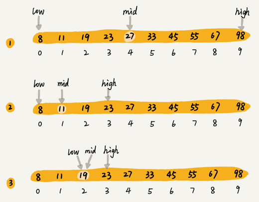
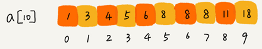

# 二分查找

# 二分查找的思想

二分查找（Binary Search）算法，也叫折半查找算法。

**二分查找针对的是一个有序的数据集合，查找思想有点类似分治思想。每次都通过跟区间的中间元素对比，将待查找的区间缩小为之前的一半，直到找到要查找的元素，或者区间被缩小为 0**。

假设有 1000 条订单数据，已经按照订单金额从小到大排序，每个订单金额都不同，并且最小单位是元。现在想知道是否存在金额等于 19 元的订单。如果存在，则返回订单数据，如果不存在则返回 null。

利用二分思想，每次都与区间的中间数据比对大小，缩小查找区间的范围。下图中，low 和 high 表示待查找区间的下标，mid 表示待查找区间的中间元素下标。



二分查找的时间复杂度为O(logn) ，被查找区间的大小变化：

$$
n, \frac{n}{2}, \frac{n}{4}, \frac{n}{8}, \cdots, \frac{n}{2^{k}} \cdots
$$
# 二分查找的实现

**最简单的情况**就是**有序数组中不存在重复元素**， Java 代码循环实现：

```java
public int bsearch(int[] a, int n, int value) {
  int low = 0;
  int high = n - 1;
 
  while (low <= high) {
    int mid = (low + high) / 2;
    if (a[mid] == value) {
      return mid;
    } else if (a[mid] < value) {
      low = mid + 1;
    } else {
      high = mid - 1;
    }
  }
 
  return -1;
}
```

python实现：

```python
def binary_search(arr: list, value) -> int:
    low, high = 0, len(arr) - 1
    while low <= high:
        mid = low + ((high - low) >> 1)
        if arr[mid] == value:
            return mid
        elif arr[mid] > value:
            high = mid - 1
        else:
            low = mid + 1
    return -1  # 未找到返回-1
```

low、high、mid 都是指数组下标，其中 low 和 high 表示当前查找的区间范围，初始 low=0， high=n-1。mid 表示 [low, high] 的中间位置。我们通过对比 a[mid] 与 value 的大小，来更新接下来要查找的区间范围，直到找到或者区间缩小为 0，就退出。

需要注意的点：

1.循环退出条件是 low<=high，而不是 low<high。

2.mid=(low+high)/2 这种写法，在 low 和 high 比较大时，两者之和可能会溢出。

改进的方法是将 mid 的计算方式写成 low+(high-low)/2，转化成位运算 low+((high-low)>>1)更佳。

3.写成 low=mid 或者 high=mid，可能会发生死循环。应当写成low=mid+1，high=mid-1。

二分查找的java递归实现：

```java
// 二分查找的递归实现
public int bsearch(int[] a, int n, int val) {
  return bsearchInternally(a, 0, n - 1, val);
}
 
private int bsearchInternally(int[] a, int low, int high, int value) {
  if (low > high) return -1;
 
  int mid =  low + ((high - low) >> 1);
  if (a[mid] == value) {
    return mid;
  } else if (a[mid] < value) {
    return bsearchInternally(a, mid+1, high, value);
  } else {
    return bsearchInternally(a, low, mid-1, value);
  }
}
```

# 二分查找应用场景的局限性

**1.二分查找依赖的是顺序表结构，即数组。**

二分查找算法需要按照下标随机访问元素，所以不能用链表随机访问的时间复杂度是 O(n)。所以，如果数据使用链表存储，二分查找的时间复杂就会变得很高。

二分查找只能用在数据是通过顺序表来存储的数据结构上。如果你的数据是通过其他数据结构存储的，则无法应用二分查找。

**2.二分查找要求数据必须是有序的，或者无序但没有频繁的插入和删除操作。**

数据没有序，进行一次排序，多次二分查找。这样排序的成本可被均摊，二分查找的边际成本就会比较低。

但如果数据集合有频繁的插入和删除操作，要想用二分查找，要么每次插入、删除操作之后保证数据仍然有序，要么在每次二分查找之前都先进行排序。针对这种动态数据集合，无论哪种方法，维护有序的成本都是很高的。

所以，二分查找只能用在插入、删除操作不频繁，一次排序多次查找的场景中。

**3.数据量太小二分查找性能提升不大**

但如果数据之间的比较操作非常耗时，比较次数的减少会大大提高性能，这个时候二分查找就比顺序遍历更有优势。

**4.数据量太大不适合二分查找**

只有数据量比较大的时候，二分查找的优势才会比较明显。

不过，这里有一个例外。如果数据之间的比较操作非常耗时，不管数据量大小，我都推荐使用二分查找。比如，数组中存储的都是长度超过 300 的字符串，如此长的两个字符串之间比对大小，就会非常耗时。我们需要尽可能地减少比较次数，而比较次数的减少会大大提高性能，这个时候二分查找就比顺序遍历更有优势。

二分查找的底层需要依赖数组这种数据结构，而数组为了支持随机访问的特性，要求内存空间连续，对内存的要求比较苛刻。比如有 1GB 大小的数据，用数组来存储，就需要 1GB 的连续内存空间。

“连续”意味着即便有 2GB 的内存空间剩余，但是如果这剩余的 2GB 内存空间都是零散的，没有连续的 1GB 大小的内存空间，那就无法申请一个 1GB 大小的数组。

# 二分查找的三种变体

## 变体一：查找第一个值等于给定值的元素

如果有序数据集合中存在重复的数据，要找到第一个值等于给定值的数据。

比如下面这样一个有序数组，其中，a[5]，a[6]，a[7] 的值都等于 8，是重复的数据。我们希望查找第一个等于 8 的数据，也就是下标是 5 的元素。



简洁实现：

```java
public int bsearch(int[] a, int n, int value) {
  int low = 0;
  int high = n - 1;
  while (low <= high) {
    int mid = low + ((high - low) >> 1);
    if (a[mid] >= value) {
      high = mid - 1;
    } else {
      low = mid + 1;
    }
  }
 
  if (low < n && a[low]==value) return low;
  else return -1;
}
```

容易理解的java实现：

```java
public int bsearch(int[] a, int n, int value) {
  int low = 0;
  int high = n - 1;
  while (low <= high) {
    int mid =  low + ((high - low) >> 1);
    if (a[mid] > value) {
      high = mid - 1;
    } else if (a[mid] < value) {
      low = mid + 1;
    } else {
      if ((mid == 0) || (a[mid - 1] != value)) return mid;
      else high = mid - 1;
    }
  }
  return -1;
}
```

求解的是第一个值等于给定值的元素，当 a[mid] 等于要查找的值时，就需要确认一下这个 a[mid] 是不是第一个值等于给定值的元素。

如果 mid 等于 0，那这个元素已经是数组的第一个元素，那它肯定是我们要找的；

如果 mid 不等于 0，但 a[mid] 的前一个元素 a[mid-1] 不等于 value，那也说明 a[mid] 就是要找的第一个值等于给定值的元素。

如果经过检查之后发现 a[mid] 前面的一个元素 a[mid-1] 也等于 value，那说明此时的 a[mid] 肯定不是要查找的第一个值等于给定值的元素。那就更新 high=mid-1，因为要找的元素肯定出现在 [low, mid-1] 之间。

python代码实现：

```python
# 2分查找第一个值等于给定值的元素
def bsearch_first(arr: list, value: int) -> int:
    low, high = 0, len(arr) - 1
    while low <= high:
        mid = low + ((high - low) >> 1)
        if arr[mid] < value:
            low = mid + 1
        elif arr[mid] > value:
            high = mid - 1
        else:
            if mid == 0 or arr[mid - 1] != value:
                return mid
            else:
                high = mid - 1
    return -1
```

python简洁实现：

```python
def bsearch_first_simple(arr: list, value: int) -> int:
    low, high = 0, len(arr) - 1
    while low <= high:
        mid = low + ((high - low) >> 1)
        if arr[mid] >= value:
            high = mid - 1
        else:
            low = mid + 1
    if low < len(arr) and arr[low] == value:
        return low
    else:
        return -1
```


## 变体二：查找最后一个值等于给定值的元素

java实现：

```java
public int bsearch(int[] a, int n, int value) {
  int low = 0;
  int high = n - 1;
  while (low <= high) {
    int mid =  low + ((high - low) >> 1);
    if (a[mid] > value) {
      high = mid - 1;
    } else if (a[mid] < value) {
      low = mid + 1;
    } else {
      if ((mid == n - 1) || (a[mid + 1] != value)) return mid;
      else low = mid + 1;
    }
  }
  return -1;
}
```

如果 a[mid] 这个元素已经是数组中的最后一个元素了，那它肯定是我们要找的；

如果 a[mid] 的后一个元素 a[mid+1] 不等于 value，那也说明 a[mid] 就是我们要找的最后一个值等于给定值的元素。

如果 a[mid] 后面的一个元素 a[mid+1] 也等于 value，那说明当前的这个 a[mid] 并不是最后一个值等于给定值的元素。我们就更新 low=mid+1，因为要找的元素肯定出现在 [mid+1, high] 之间。

python实现：

```python
# 查找最后一个值等于给定值的元素
def bsearch_last(arr: list, value: int) -> int:
    low, high = 0, len(arr) - 1
    while low <= high:
        mid = low + ((high - low) >> 1)
        if arr[mid] < value:
            low = mid + 1
        elif arr[mid] > value:
            high = mid - 1
        else:
            if mid == 0 or arr[mid + 1] != value:
                return mid
            else:
                low = mid + 1
    return -1


# 查找最后一个值等于给定值的元素
def bsearch_last_simple(arr: list, value: int) -> int:
    low, high = 0, len(arr) - 1
    while low <= high:
        mid = low + ((high - low) >> 1)
        if arr[mid] <= value:
            low = mid + 1
        else:
            high = mid - 1
    if high >= 0 and arr[high] == value:
        return high
    else:
        return -1
```


## 变体三：查找第一个大于等于给定值的元素

java实现代码：

```java
public int bsearch(int[] a, int n, int value) {
  int low = 0;
  int high = n - 1;
  while (low <= high) {
    int mid =  low + ((high - low) >> 1);
    if (a[mid] >= value) {
      if ((mid == 0) || (a[mid - 1] < value)) return mid;
      else high = mid - 1;
    } else {
      low = mid + 1;
    }
  }
  return -1;
}
```

如果 a[mid] 小于要查找的值 value，那要查找的值肯定在 [mid+1, high] 之间，更新 low=mid+1。

对于 a[mid] 大于等于给定值 value 的情况，如果 a[mid] 前面已经没有元素，或者前面一个元素 a[mid-1] 小于要查找的值 value，那 a[mid] 就是目标元素。

如果 a[mid-1] 也大于等于要查找的值 value，那说明要查找的元素在 [low, mid-1] 之间，所以，我们将 high 更新为 mid-1。

python实现：

```python
# 查找第一个大于等于给定值的元素
def bsearch_first_not_less(arr: list, value: int) -> int:
    low, high = 0, len(arr) - 1
    while low <= high:
        mid = low + ((high - low) >> 1)
        if arr[mid] < value:
            low = mid + 1
        else:
            if mid == 0 or arr[mid - 1] < value:
                return mid
            else:
                high = mid - 1
    return -1


# 查找第一个大于等于给定值的元素
def bsearch_first_not_less_simple(arr: list, value: int) -> int:
    low, high = 0, len(arr) - 1
    while low <= high:
        mid = low + ((high - low) >> 1)
        if arr[mid] >= value:
            high = mid - 1
        else:
            low = mid + 1
    if low < len(arr) and arr[low] >= value:
        return low
    else:
        return -1
```


## 变体四：查找最后一个小于等于给定值的元素

java实现代码：

```java
public int bsearch(int[] a, int n, int value) {
  int low = 0;
  int high = n - 1;
  while (low <= high) {
    int mid =  low + ((high - low) >> 1);
    if (a[mid] > value) {
      high = mid - 1;
    } else {
      if ((mid == n - 1) || (a[mid + 1] > value)) return mid;
      else low = mid + 1;
    }
  }
  return -1;
}
```

python实现：

```python
# 查找最后一个小于等于给定值的元素
def bsearch_last_not_greater(arr: list, value: int) -> int:
    low, high = 0, len(arr) - 1
    while low <= high:
        mid = low + ((high - low) >> 1)
        if arr[mid] <= value:
            if mid == len(arr) - 1 or arr[mid + 1] != value:
                return mid
            else:
                low = mid + 1
        else:
            high = mid - 1
    return -1


# 查找最后一个小于等于给定值的元素
def bsearch_last_not_greater_simple(arr: list, value: int) -> int:
    low, high = 0, len(arr) - 1
    while low <= high:
        mid = low + ((high - low) >> 1)
        if arr[mid] <= value:
            low = mid + 1
        else:
            high = mid - 1
    if high >= 0 or arr[high] <= value:
        return high
    else:
        return -1
```


# 二分查找相关问题

## 如何快速判断某个整数是否出现在这 1000 万数据中？

假设有 1000 万个整数数据，每个数据占 8 个字节，内存限制是 100MB，**如何设计数据结构和算法，快速判断某个整数是否出现在这 1000 万数据中？** 

每个数据大小是 8 字节，将数据存储在数组中，内存占用差不多是 80MB，符合内存的限制。对这 1000 万数据利用原地排序算法排序，然后再利用二分查找算法，就可以快速地查找想要的数据了。


## 用二分查找求一个数的平方根

如何编程实现“求一个数的平方根”？要求精确到小数点后 6 位。

python代码实现：

```python
def bsearch_sqrt(num: float) -> float:
    if num < 0:
        raise ValueError
    if num ** 2 == num:
        return num
    if num < 1:
        low, high = num, 1
    else:
        low, high = 0, num
    while high - low > 0.0000001:
        mid = (high + low) / 2
        mid_v2 = mid ** 2
        if mid_v2 > num:
            high = mid
        elif mid_v2 < num:
            low = mid
        elif mid_v2 == num:
            return mid
    return round((high + low) / 2, 6)
```


## 二分查找快速定位IP对应的省份地址

 IP 地址查找 IP 归属地是通过维护一个很大的 IP 地址库来实现的。地址库中包括 IP 地址范围和归属地的对应关系。

当查询 202.102.133.13 这个 IP 地址的归属地时，就在地址库中搜索，发现这个 IP 地址落在 [202.102.133.0, 202.102.133.255] 这个地址范围内，那我们就可以将这个 IP 地址范围对应的归属地“山东东营市”显示给用户了。

```
202.102.133.0|202.102.133.63|山东东营联通
202.102.133.64|202.102.133.255|山东济南联通
202.102.134.0|202.102.134.255|山东青岛联通
202.102.135.0|202.102.135.231|山东烟台联通
202.102.48.0|202.102.48.255|江苏宿迁电信
202.102.49.0|202.102.49.255|江苏泰州电信
202.102.50.0|202.102.50.255|江苏苏州电信
202.102.51.0|202.102.101.255|江苏南京电信
```

**假设有 12 万条这样的 IP 区间与归属地的对应关系，如何快速定位出一个 IP 地址的归属地呢？**

思路：

可以先预处理这 12 万条数据，存储到数组中，让其按照起始 IP（按照地址对应的整型值） 从小到大排序。

查询某个 IP 归属地时，先通过二分查找找到最后一个起始 IP 小于等于这个 IP 的 IP 区间，然后检查这个 IP 是否在这个 IP 区间内，如果在就取出对应的归属地显示；如果不在就返回未查找到。

代码实现：

```python
ip_rule_list = []
with open("ip.txt", encoding="utf-8") as f:
    for line in f:
        start_ip, end_ip, location = line.rstrip().split("|", 2)
        ip_rule_list.append((start_ip, end_ip, location))


def ip2int(ip_str: str) -> int:
    result = 0
    for i in ip_str.split("."):
        result = (result << 8) + int(i)
    return result


ip_rule_list.sort(key=lambda x: ip2int(x[0]))


def ip_to_location(ip: str) -> str:
    low, high = 0, len(ip_rule_list) - 1
    ip_int = ip2int(ip)
    while low <= high:
        mid = (low + high) >> 1
        # 查找最后一个起始IP小于等于这个IP的IP区间
        if ip2int(ip_rule_list[mid][0]) < ip_int:
            low = mid + 1
        else:
            high = mid - 1
    if high >= 0 and ip2int(ip_rule_list[high][0]) <= ip_int <= ip2int(ip_rule_list[high][1]):
        return ip_rule_list[high][2]
    else:
        return ""
```


## 循环有序数组的二分查找问题

如果有序数组是一个循环有序数组，比如 4，5，6，1，2，3。针对这种情况，如何实现一个求“值等于给定值”的二分查找算法呢？

思路：

对于数组[1 2 3 4 5 6] 共有下列6种旋转方法：

1　　2　　**<font color=red>3　　4　　5　　6</font>**

6　　1　　**<font color=red>2　　3　　4　　5</font>**

5　　6　　**<font color=red>1　　2　　3　　4</font>**

**<font color=red>4　　5　　6</font>**　　1　　2　　3

**<font color=red>3　　4　　5</font>**　　6　　1　　2

**<font color=red>2　　3　　4</font>**　　5　　6　　1

以数组中间点为分区，会将数组分成升序和非升序两部分，观察发现上面红色加粗的数字都是升序部分。

由此可得：

- 若中间数小于最右边数，则右半段是升序区间
- 若中间数大于最右边数，则左半段是升序区间

然后根据目标值是否存在于升序区间，确定保留哪一区间，进行2分查找即可


python实现代码：

```python
def binary_search_circle_array(arr: list, value) -> int:
    low, high = 0, len(arr) - 1
    while low <= high:
        mid = (low + high) >> 1
        if arr[mid] == value: return mid
        # 上面没有返回，说明中间值不是目标值
        if arr[mid] < arr[high]:  # 若中间数小于最右边数，则右半段是升序区间
            if arr[mid] < value and value <= arr[high]:  # 在右半段有序区间
                low = mid + 1
            else:
                high = mid - 1
        elif arr[mid] > arr[high]:  # 若中间数大于最右边数，则左半段是升序区间
            if arr[low] <= value and value < arr[mid]:  # 在左半段有序区间
                high = mid - 1
            else:
                low = mid + 1
        else:  # 若中间数等于最右边数，则目标不在右半段
            high = mid - 1
    return -1
```

