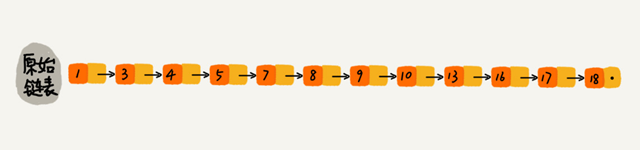
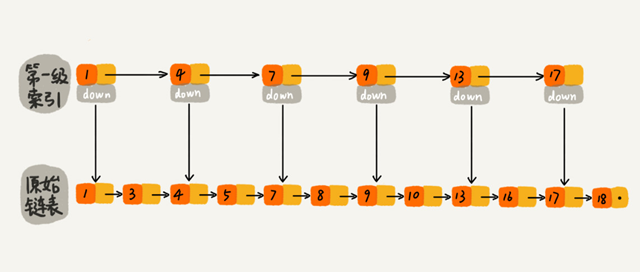
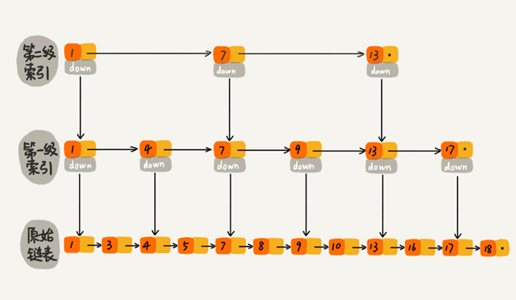
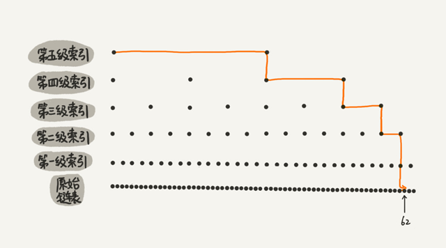
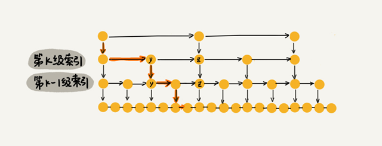
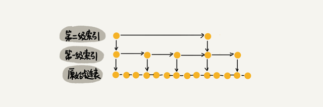
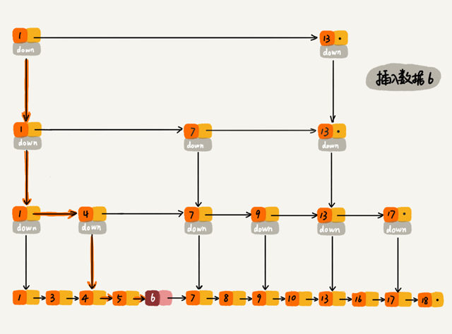
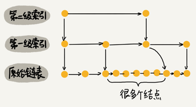
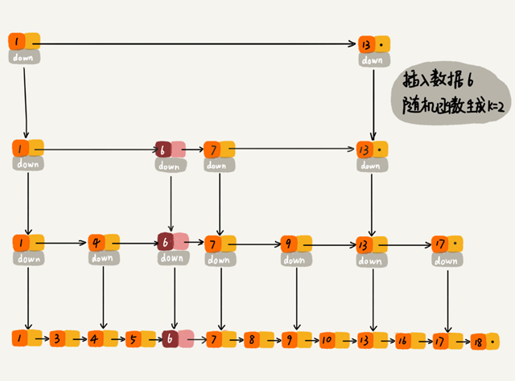

## 跳表=链表+多级索引

跳表使用空间换时间的设计思路，通过构建多级索引来提高查询的效率，实现了基于链表的“二分查找”。跳表是一种动态数据结构，支持快速的插入、删除、查找操作，时间复杂度都是 O(logn)。

跳表的空间复杂度是 O(n)。跳表的实现非常灵活，可以通过改变索引构建策略，有效平衡执行效率和内存消耗。跳表的代码比起红黑树来说，要简单、易读。

**链表加多级索引的结构，就是跳表**。

对于一个单链表，即便链表中存储的数据是有序的，如果要查找某个数据，也只能从头到尾遍历，时间复杂度是 O(n)。



对链表建立一级“索引”，每两个结点提取一个结点到上一级，把抽出来的那一级叫作**索引**或**索引层**。图中的 down 表示 down 指针，指向下一级结点。



这样就可以先在索引层遍历，然后通过索引层结点的 down 指针，下降到原始链表这一层，继续遍历。

比如要查找16，当在索引层遍历到13时，发现索引层下一个节点是17大于目标16，则可从13的down指针下降到原始链表继续遍历。这样只需要再遍历 2 个结点，就可以找到值等于 16 的这个结点了。原来查找 16，需要遍历 10 个结点，加入一层索引后只需要遍历 7 个结点。

**加来一层索引之后，查找一个结点需要遍历的结点个数减少了，查找效率提高了**。继续再加一级索引，在第一级索引的基础之上，每两个结点就抽出一个结点到第二级索引。现在再查找 16，只需要遍历 6 个结点了，需要遍历的结点数量又减少了。



下图是一个包含 64 个结点的链表，建立五级索引。



在五级索引的作用下，查找 62 只需要遍历 11 个结点。当链表的长度 n 比较大时，比如 1000、10000 的时候，在构建多级索引之后，查找效率的提升就会非常明显。

## 跳表的时间复杂度分析

一个链表里有 n 个结点，每两个结点会抽出一个结点作为上一级索引的结点，那第一级索引的结点个数大约就是 n/2，第二级索引的结点个数大约就是 n/4，第三级索引的结点个数大约就是 n/8，依次类推，也就是说，**第 k 级索引的结点个数是第 k-1 级索引的结点个数的 1/2，那第 k级索引结点的个数就是 $n/(2^k)$。**

假设索引有 h 级，最高级的索引有 2 个结点，则 $n/(2^h)=2$，即 $h=log_2n-1$。加上原始链表这一层，整个跳表的高度就是 $log_2n$。在跳表中查询某个数据的时候，如果每一层都要遍历 m 个结点，那在跳表中查询一个数据的时间复杂度就是 $O(m*logn)$。

按照每两个结点提取一个结点到上一级建立索引这种结构，每一级索引都最多只需要遍历 3 个结点，那么m=3.

假设要查找的数据是 x，在第 k 级索引中遍历到 y 结点之后，发现 x 大于 y，小于后面的结点 z，所以通过 y 的 down 指针，从第 k 级索引下降到第 k-1 级索引。在第 k-1 级索引中，y 和 z 之间只有 3 个结点（包含 y 和 z），所以在 K-1 级索引中最多只需要遍历 3 个结点，依次类推，每一级索引都最多只需要遍历 3 个结点。



所以在跳表中查询任意数据的时间复杂度就是 O(logn)。

## 跳表的空间复杂度分析

假设原始链表大小为 n，那第一级索引大约有 n/2 个结点，第二级索引大约有 n/4 个结点，以此类推，每上升一级就减少一半，直到剩下 2 个结点。每层索引的节点数为：
$$
\frac{n}2,\frac{n}4,\frac{n}8,...,8,4,2
$$
这几级索引的结点总和就是 $\frac{n}2+\frac{n}4+\frac{n}8+...+8+4+2=n-2$。所以跳表的空间复杂度是 O(n)。

将包含 n 个结点的单链表构造成跳表，需要额外再用接近 n 个结点的存储空间。


如果每三个结点或五个结点，抽一个结点到上级索引:



那第一级索引需要大约 n/3 个结点，第二级索引需要大约 n/9 个结点。每往上一级，索引结点个数都除以 3。为了方便计算，假设最高一级的索引结点个数是 1。每3个节点抽一个，每层索引的节点数为：

$$
\frac{n}3,\frac{n}9,\frac{n}{27},...,9,3,1
$$
总的索引结点个数为$\frac{n}{3}+\frac{n}{9}+\frac{n}{27}+…+9+3+1=n/2$。空间复杂度依然是 O(n)，但比每两个结点抽一个结点的索引构建方法，减少了一半的索引结点存储空间。

在实际的软件开发中，原始链表中存储的有可能是很大的对象，而索引结点只需要存储关键值和几个指针，并不需要存储对象，所以当对象比索引结点大很多时，那索引占用的额外空间就可以忽略了。

## 跳表动态的插入和删除

跳表插入、删除操作的时间复杂度是 O(logn)。



对于删除操作，如果这个结点在索引中也有出现，删除原始链表中的结点之后还要删除对应的索引。

查找要删除的结点的时候，一定要获取前驱结点（双向链表不需要考虑这个问题）。

## 跳表索引动态更新

不停地往跳表中插入数据时，如果不更新索引，就有可能出现某 2 个索引结点之间数据非常多的情况。极端情况下，跳表还会退化成单链表。



作为一种动态数据结构，需要某种手段来维护索引与原始链表大小之间的平衡：

如果链表中结点多了，索引结点就相应地增加一些，避免复杂度退化，以及查找、插入、删除操作性能下降。

往跳表中插入数据的时候，可以同时将这个数据插入到部分索引层中。通过一个随机函数，来决定将这个结点插入到哪几级索引中，比如随机函数生成了值 K，就将这个结点添加到第一级到第 K 级这 K 级索引中。




## Redis 用跳表实现有序集合

Redis 中的有序集合是通过跳表来实现的，严格点讲，其实还用到了散列表。

Redis 中的有序集合支持的核心操作主要有：

- 插入一个数据；
- 删除一个数据；
- 查找一个数据；
- 按照区间查找数据（比如查找值在 [100, 356] 之间的数据）；
- 迭代输出有序序列。

其中，插入、删除、查找以及迭代输出有序序列这几个操作，红黑树也可以完成，时间复杂度跟跳表是一样的。但是，按照区间来查找数据这个操作，红黑树的效率没有跳表高。

对于按照区间查找数据这个操作，跳表可以做到 O(logn) 的时间复杂度定位区间的起点，然后在原始链表中顺序往后遍历就可以了。这样做非常高效。

跳表相对红黑树而言代码更容易实现，简单就意味着可读性好，不容易出错。还有，跳表更加灵活，它可以通过改变索引构建策略，有效平衡执行效率和内存消耗。


## 跳表的简易代码实现

跳表的java实现：

```java
public class SkipList {

  private static final float SKIPLIST_P = 0.5f;
  private static final int MAX_LEVEL = 16;

  private int levelCount = 1;

  private Node cls = new Node();  // 带头链表

  public Node find(int value) {
    Node p = cls;
    for (int i = levelCount - 1; i >= 0; --i) {
      while (p.forwards[i] != null && p.forwards[i].data < value) {
        p = p.forwards[i];
      }
    }

    if (p.forwards[0] != null && p.forwards[0].data == value) {
      return p.forwards[0];
    } else {
      return null;
    }
  }

  public void insert(int value) {
    int level = randomLevel();
    Node newNode = new Node();
    newNode.data = value;
    newNode.maxLevel = level;
    Node update[] = new Node[level];
    for (int i = 0; i < level; ++i) {
      update[i] = cls;
    }

    // record every level largest value which smaller than insert value in update[]
    Node p = cls;
    for (int i = level - 1; i >= 0; --i) {
      while (p.forwards[i] != null && p.forwards[i].data < value) {
        p = p.forwards[i];
      }
      update[i] = p;// use update save node in search path
    }

    // in search path node next node become new node forwords(next)
    for (int i = 0; i < level; ++i) {
      newNode.forwards[i] = update[i].forwards[i];
      update[i].forwards[i] = newNode;
    }

    // update node hight
    if (levelCount < level) levelCount = level;
  }

  public void delete(int value) {
    Node[] update = new Node[levelCount];
    Node p = cls;
    for (int i = levelCount - 1; i >= 0; --i) {
      while (p.forwards[i] != null && p.forwards[i].data < value) {
        p = p.forwards[i];
      }
      update[i] = p;
    }

    if (p.forwards[0] != null && p.forwards[0].data == value) {
      for (int i = levelCount - 1; i >= 0; --i) {
        if (update[i].forwards[i] != null && update[i].forwards[i].data == value) {
          update[i].forwards[i] = update[i].forwards[i].forwards[i];
        }
      }
    }

    while (levelCount>1&&cls.forwards[levelCount]==null){
      levelCount--;
    }

  }

  // 理论来讲，一级索引中元素个数应该占原始数据的 50%，二级索引中元素个数占 25%，三级索引12.5% ，一直到最顶层。
  // 因为这里每一层的晋升概率是 50%。对于每一个新插入的节点，都需要调用 randomLevel 生成一个合理的层数。
  // 该 randomLevel 方法会随机生成 1~MAX_LEVEL 之间的数，且 ：
  //        50%的概率返回 1
  //        25%的概率返回 2
  //      12.5%的概率返回 3 ...
  private int randomLevel() {
    int level = 1;

    while (Math.random() < SKIPLIST_P && level < MAX_LEVEL)
      level += 1;
    return level;
  }

  public void printAll() {
    Node p = cls;
    while (p.forwards[0] != null) {
      System.out.print(p.forwards[0] + " ");
      p = p.forwards[0];
    }
    System.out.println();
  }

  public class Node {
    private int data = -1;
    private Node forwards[] = new Node[MAX_LEVEL];
    private int maxLevel = 0;

    @Override
    public String toString() {
      StringBuilder builder = new StringBuilder();
      builder.append("{ data: ");
      builder.append(data);
      builder.append("; levels: ");
      builder.append(maxLevel);
      builder.append(" }");

      return builder.toString();
    }
  }

}
```

python实现：

```python
# -*- coding: utf-8 -*-
__author__ = 'xiaoxiaoming'

import random


class SkipListNode(object):
    def __init__(self, val, max_level=1):
        self.data = val  # 节点存储的值
        self.forwards = [None] * max_level  # 节点对应索引层的深度


class SkipList(object):
    """
        跳表的一种实现方法。
        跳表中储存的是不重复的正整数。
    """

    def __init__(self):
        self.__MAX_LEVEL = 16  # 索引层的最大深度
        self.SKIPLIST_P = 0.5  # 索引生成层数的随机因子
        self._level_count = 1  # 跳表的深度
        self._head = SkipListNode(None, self.__MAX_LEVEL)  # 带头链表

    def find(self, val):
        p = self._head
        # 从索引的顶层, 逐层定位要查找的值
        # 索引层上下是对应的, 下层的起点是上一个索引层中小于插入值的最大值对应的节点
        for i in range(self._level_count - 1, -1, -1):
            # 同一索引层内, 查找小于插入值的最大值对应的节点
            while p.forwards[i] and p.forwards[i].data < val:
                p = p.forwards[i]
        if p.forwards[0] and p.forwards[0].data == val:
            return p.forwards[0]
        return None

    def insert(self, val):
        '''
        新增时, 通过随机函数获取要更新的索引层数,
        要对低于给定高度的索引层添加新结点的指针
        '''
        level = self.random_level()
        # 更新跳表索引层数
        if self._level_count < level: self._level_count = level
        new_node = SkipListNode(val, level)  # 申请新结点
        # cache用来缓存对应索引层中小于插入值的最大节点
        cache = [None] * level
        # 在低于随机高度的每一个索引层寻找小于插入值的节点
        p = self._head
        # 缓存每一个索引层定位小于插入值的节点
        for i in range(level - 1, -1, -1):
            while p.forwards[i] and p.forwards[i].data < val:
                p = p.forwards[i]
            cache[i] = p
        # 在小于高度的每个索引层中插入新结点
        for i in range(level):
            new_node.forwards[i] = cache[i].forwards[i]
            cache[i].forwards[i] = new_node

    def delete(self, val):
        '''
        删除时, 要将每个索引层中对应的节点都删掉
        '''
        # cache用来缓存对应索引层中小于插入值的最大节点
        cache = [None] * self._level_count
        p = self._head
        # 缓存每一个索引层定位小于插入值的节点
        for i in range(self._level_count - 1, -1, -1):
            while p.forwards[i] and p.forwards[i].data < val:
                p = p.forwards[i]
            cache[i] = p
        # 如果给定的值存在, 更新索引层中对应的节点
        if p.forwards[0] and p.forwards[0].data == val:
            for i in range(self._level_count):
                if cache[i].forwards[i] and cache[i].forwards[i].data == val:
                    cache[i].forwards[i] = cache[i].forwards[i].forwards[i]
        # 更新跳表的深度
        while self._level_count > 1 and self._head.forwards[self._level_count] == None:
            self._level_count -= 1

    def random_level(self):
        """
        一级索引中元素个数应该占原始数据的 SKIPLIST_P,二级索引中元素个数占SKIPLIST_P^2,三级索引SKIPLIST_P^3,一直到最顶层。
        每一层的晋升概率是 SKIPLIST_P。对于每一个新插入的节点，都需要调用 randomLevel 生成一个合理的层数。
        该 randomLevel 方法会随机生成 1~MAX_LEVEL 之间的数
        :return: 按概率返回 1-MAX_LEVEL中的一个值
        """
        level = 1
        while random.random() < self.SKIPLIST_P and level < self.__MAX_LEVEL:
            level += 1
        return level

    def __repr__(self):
        vals = []
        p = self._head
        while p.forwards[0]:
            vals.append(str(p.forwards[0].data))
            p = p.forwards[0]
        return '->'.join(vals)

    def print_all(self):
        for i in range(self._level_count - 1, -1, -1):
            p = self._head
            print("level:", i)
            while p.forwards[i]:
                print(str(p.forwards[i].data), end="->")
                p = p.forwards[i]
            print()


if __name__ == '__main__':
    sl = SkipList()
    for i in range(100):
        sl.insert(i)
        if i % 10 == 5:
            sl.print_all()
    sl.print_all()
    p = sl.find(7)
    print(p.data)
    sl.delete(37)
    print(sl)
    sl.delete(37.5)
    print(sl)

```

