# 散列表

散列表来源于数组，它借助散列函数对数组这种数据结构进行扩展，利用的是数组支持按照下标随机访问元素的特性。散列表两个核心问题是**散列函数设计**和**散列冲突解决**。散列冲突有两种常用的解决方法，开放寻址法和链表法。散列函数设计的好坏决定了散列冲突的概率，也就决定散列表的性能。

散列表的英文叫“Hash Table”，也叫它“哈希表”或者“Hash 表”，**散列表用的是数组支持按照下标随机访问数据的特性，是数组的一种扩展。**

散列表利用了数组按照下标随机访问的时候时间复杂度是 O(1) 的特性。通过散列函数把元素的键值映射为下标，然后将数据存储在数组中对应下标的位置。当按照键值查询元素时，用同样的散列函数，将键值转化数组下标，从对应的数组下标的位置取数据。

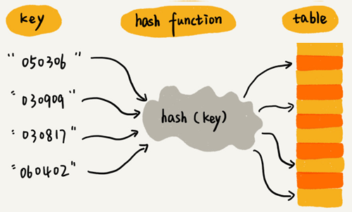


## 散列函数

散列函数，可以定义成hash(key)，其中 key 表示元素的键值，hash(key) 的值表示经过散列函数计算得到的散列值。

散列函数，顾名思义，它是一个函数。我们可以把它定义成**hash(key)**，其中 key 表示元素的键值，hash(key) 的值表示经过散列函数计算得到的散列值。

散列函数设计的三点基本要求：

1. 散列函数计算得到的散列值是一个非负整数；
2. 如果 key1 = key2，那 hash(key1) == hash(key2)；
3. 如果 key1 ≠ key2，那 hash(key1) ≠ hash(key2)。

对于第一点，因为数组下标是从 0 开始的，所以散列函数生成的散列值也要是非负整数。

对于第二点，相同的 key，经过散列函数得到的散列值也应该是相同的。

对于第三点，几乎无法找到一个完美的无冲突的散列函数，即便像业界著名的[MD5](https://zh.wikipedia.org/wiki/MD5)、[SHA](https://zh.wikipedia.org/wiki/SHA家族)、[CRC](https://zh.wikipedia.org/wiki/循環冗餘校驗)等哈希算法，也无法完全避免这种**散列冲突**。而且，因为数组的存储空间有限，也会加大散列冲突的概率。针对散列冲突问题，需要通过其他途径来解决。


## 解决散列冲突问题的两种方法

常用的散列冲突解决方法有两类，开放寻址法（open addressing）和链表法（chaining）。

### 1. 开放寻址法

开放寻址法的核心思想是，如果出现了散列冲突，就重新探测一个空闲位置，将其插入。

探测新的位置的方法有**线性探测**（Linear Probing）、**二次探测**（Quadratic probing）和**双重散列**（Double hashing）

**线性探测：**

往散列表中插入数据时，如果某个数据经过散列函数散列之后，存储位置已经被占用了，就从当前位置开始，依次往后查找，看是否有空闲位置，直到找到为止。

下图黄色的色块表示空闲位置，橙色的色块表示已经存储了数据。

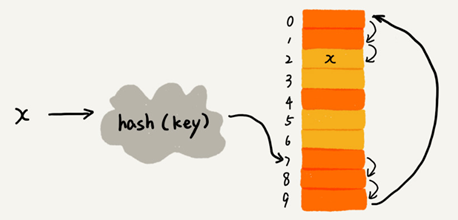

图中散列表的大小为 10，在元素 x 插入散列表之前，已经 6 个元素插入到散列表中。x 经过 Hash 算法之后，被散列到位置下标为 7 的位置，但是这个位置已经有数据了，所以就产生了冲突。于是我顺序地往后一个一个找，遍历到尾部都没有找到空闲的位置，于是我们再从表头开始找，直到找到空闲位置 2，于是将其插入到这个位置。

在散列表中查找元素，会先通过散列函数求出要查找元素的键值对应的散列值，然后比较数组中下标为散列值的元素和要查找的元素。如果相等，则说明就是我们要找的元素；否则就顺序往后依次查找。如果遍历到数组中的空闲位置，还没有找到，就说明要查找的元素并没有在散列表中。

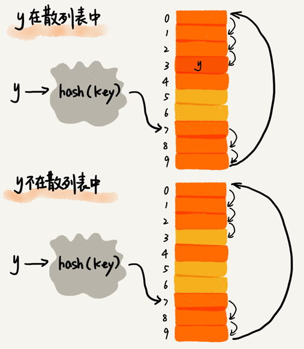

使用线性探测法解决冲突的散列表，对于删除操作，会将被删除的元素特殊标记为 deleted。当线性探测查找的时候，遇到标记为 deleted 的空间，并不是停下来，而是继续往下探测。

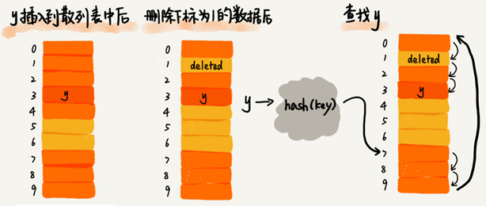

**线性探测法存在的问题：**

当散列表中插入的数据越来越多时，散列冲突发生的可能性越来越大，空闲位置越来越少，线性探测的时间越来越久。极端情况下，可能需要探测整个散列表，所以最坏情况下的时间复杂度为 O(n)。同理，在删除和查找时，也有可能会线性探测整张散列表，才能找到要查找或者删除的数据。

**二次探测：**

线性探测每次探测的步长是 1，它探测的下标序列是 $hash(key)+0$，$hash(key)+1$，$hash(key)+2$……而二次探测探测的步长就变成了原来的“二次方”，也就是说，它探测的下标序列就是 $hash(key)+0$，$hash(key)+1^2$，$hash(key)+2^2$……

**双重散列：**

并不只用一个散列函数，而是同时使用一组散列函数 $hash1(key)，hash2(key)，hash3(key)……$先用第一个散列函数，如果计算得到的存储位置已经被占用，再用第二个散列函数，依次类推，直到找到空闲的存储位置。


### 2. 链表法

在散列表中，每个“桶（bucket）”或者“槽（slot）”会对应一条链表，所有散列值相同的元素我们都放到相同槽位对应的链表中。

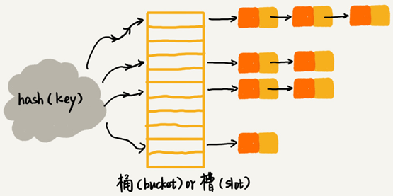

插入的时候只需要通过散列函数计算出对应的散列槽位，将其插入到对应链表中即可，所以插入的时间复杂度是 O(1)。当查找、删除一个元素时，同样通过散列函数计算出对应的槽，然后遍历链表查找或者删除。

查找或删除操作的时间复杂度跟链表的长度 k 成正比，即 O(k)。对于散列比较均匀的散列函数来说，理论上讲，k=n/m，其中 n 表示散列中数据的个数，m 表示散列表中“槽”的个数。

## Word的单词拼写检查功能是如何实现的？

Word 这种文本编辑器能自动识别错误的英文单词，用标红的方式提示“拼写错误”。**Word 的这个单词拼写检查功能是如何实现的呢？**

解决思路：

常用的英文单词有 20 万个左右，假设单词的平均长度是 10 个字母，平均一个单词占用 10 个字节的内存空间，那 20 万英文单词大约占 2MB 的存储空间，就算放大 10 倍也就是 20MB。对于现在的计算机来说，这个大小完全可以放在内存里面。所以可以用散列表来存储整个英文单词词典。

当用户输入某个英文单词时，我们拿用户输入的单词去散列表中查找。如果查到，则说明拼写正确；如果没有查到，则说明拼写可能有误，给予提示。借助散列表这种数据结构，就可以轻松实现快速判断是否存在拼写错误。


## 思考题

1.假设我们有 10 万条 URL 访问日志，如何按照访问次数给 URL 排序？

解决思路：

遍历 10 万条数据，以 URL 为 key，访问次数为 value，存入散列表，同时记录下访问次数的最大值 K，时间复杂度 O(N)。

如果 K 不是很大，可以使用桶排序，时间复杂度 O(N)。如果 K 非常大（比如大于 10 万），就使用一般的排序方法，复杂度 $O(NlogN)$。 

模拟实现代码：

```python
# -*- coding: utf-8 -*-
__author__ = 'xiaoxiaoming'

url_count_dict = {}
k = 0
with open("access.log", "r") as f:
    for line in f:
        url = line.rstrip()
        if len(url) > 0:
            value = url_count_dict.setdefault(url, 0) + 1
            url_count_dict[url] = value
            if value > k: k = value
result = []
# k不大可以使用桶排序,每个次数一个桶
if k < 10:
    buckets = []
    for i in range(k):
        buckets.append([])
    # 将数组中值分配到各个桶里
    for url, value in url_count_dict.items():
        buckets[value - 1].append(url)
    for value in range(len(buckets) - 1, -1, -1):
        for url in buckets[value]:
            result.append((url, value + 1))
else:
    result = sorted(url_count_dict.items(), key=lambda x: x[1], reverse=True)

for x in result[0:10]:
    print(x)
```


2.有两个字符串数组，每个数组大约有 10 万条字符串，如何快速找出两个数组中相同的字符串？

思路：

将两个字符串数组分别存入散列表中，遍历其中一个散列表，每个遍历出来的字符串都去另一个散列表中查找，若找到则说明该字符串为公共字符串。 

python简易实现：

```python
arr1 = ['apple', 'orange', 'apple', 'pear', 'orange', 'banana']
arr2 = ['apple', 'apple', 'pear', 'banana', 'Apricot','Avocado']
common_str = set(arr1) & set(arr2)
print(common_str)
```


# 散列表的设计

散列函数要尽可能让散列后的值随机且均匀分布，尽可能地减少散列冲突，即便冲突之后，分配到每个槽内的数据也比较均匀。除此之外，散列函数的设计也不能太复杂，太复杂就会太耗时间，也会影响散列表的性能。

关于散列冲突解决方法的选择，大部分情况下，链表法更加普适。还可以将链表改造成其他动态查找数据结构，比如红黑树，来避免散列表时间复杂度退化成 O(n)。对于小规模数据、装载因子不高的散列表，比较适合用开放寻址法。

对于动态散列表来说，随着数据的不断增加，散列表总会出现装载因子过高的情况，这个时候需要启动动态扩容。

**工业级的散列表的特性：**

- 支持快速的查询、插入、删除操作；
- 内存占用合理，不能浪费过多的内存空间；
- 性能稳定，极端情况下，散列表的性能也不会退化到无法接受的情况。

**散列表的设计思路：**

- 设计一个合适的散列函数；
- 定义装载因子阈值，并且设计动态扩容策略；
- 选择合适的散列冲突解决方法。


散列表的查询效率并不都是 O(1)，它跟散列函数、装载因子、散列冲突等都有关系。如果散列函数设计得不好，或者装载因子过高，都可能导致散列冲突发生的概率升高，查询效率下降。

在极端情况下，所有的数据经过散列函数之后，可能都散列到同一个槽里，查询的时间复杂度就从 O(1) 急剧退化为 O(n)。

## 设计良好的散列函数

散列函数设计的好坏，决定了散列表冲突的概率大小，也直接决定了散列表的性能。

首先，**散列函数的设计不能太复杂**。过于复杂的散列函数，势必会消耗很多计算时间，也就间接的影响到散列表的性能。其次，**散列函数生成的值要尽可能随机并且均匀分布**，这样才能避免或者最小化散列冲突，而且即便出现冲突，散列到每个槽里的数据也会比较平均，不会出现某个槽内数据特别多的情况。

需要综合考虑关键字的长度、特点、分布、还有散列表的大小等各种因素。

实现 Word 拼写检查功能的散列函数可以这样设计：将单词中每个字母的[ASCll 码](http://www.96yx.com/tool/ASC2.htm)[值](http://www.96yx.com/tool/ASC2.htm)“进位”相加，然后再跟散列表的大小求余、取模，作为散列值。

代码：

```python
def hash_code(s: str) -> int:
    result = 0
    base = ord('a')
    for ch in s.lower():
        result = result * 26 + (ord(ch) - base)
    return result
```

比如，英文单词 nice，我们转化出来的散列值就是下面这样：

```c
hash("nice")=(("n" - "a") * 26*26*26 + ("i" - "a")*26*26 + ("c" - "a")*26+ ("e"-"a")) / 78978
```

散列函数的设计方法还有直接寻址法、平方取中法、折叠法、随机数法等，根据实际情况设计即可。

## 装载因子过大时需要进行动态扩容

装载因子的计算公式：

**散列表的装载因子 = 填入表中的元素个数 / 散列表的长度​**

装载因子越大说明散列表中的元素越多，空闲位置越少，散列冲突的概率就越大。不仅插入数据的过程要多次寻址或者拉很长的链，查找的过程也会因此变得很慢。

对于动态散列表来说，数据集合是频繁变动的，事先无法预估将要加入的数据个数。随着数据慢慢加入，装载因子就会慢慢变大。当装载因子大到一定程度之后，散列冲突就会变得不可接受。

装载因子过大时，就需要进行动态扩容，重新申请一个更大的散列表，将数据搬移到这个新散列表中。假设每次扩容都申请一个原来散列表大小两倍的空间。如果原来散列表的装载因子是 0.8，那经过扩容之后，新散列表的装载因子就下降为原来的一半，变成了 0.4。

针对散列表的扩容，数据搬移操作相对数组要复杂很多。散列表的大小变了，数据的存储位置也变了需要通过散列函数重新计算每个数据的存储位置。

下图中，21 这个元素原来存储在下标为 0 的位置，搬移到新的散列表中，存储在下标为 7 的位置。

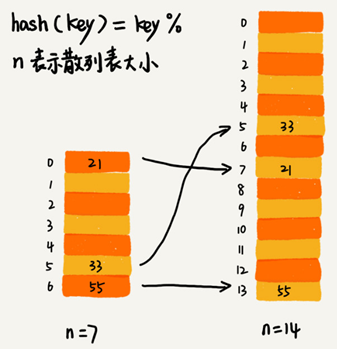

插入一个数据，最好情况下，不需要扩容，最好时间复杂度是 O(1)。最坏情况下，启动扩容需要重新申请内存空间，重新计算哈希位置，并且搬移数据，时间复杂度是 O(n)。用摊还分析法，均摊情况下，时间复杂度接近最好情况，就是 O(1)。

对于动态散列表，随着数据的删除，散列表中的数据会越来越少，空闲空间会越来越多。如果对空间消耗非常敏感，可以在装载因子小于某个值之后，启动动态缩容。

装载因子阈值的设置要权衡时间、空间复杂度。如果内存空间不紧张，对执行效率要求很高，可以降低负载因子的阈值；相反，如果内存空间紧张，对执行效率要求又不高，可以增加负载因子的值，甚至可以大于 1。

## 均摊插入避免低效扩容

当装载因子已经到达阈值，需要先进行扩容，再插入数据。这个时候，插入数据就会变得很慢，甚至会无法接受。

为了解决一次性扩容耗时过多的情况，可以将扩容操作穿插在插入操作的过程中，分批完成。当装载因子触达阈值之后，只申请新空间，但并不将老的数据搬移到新散列表中。

当有新数据要插入时，将新数据插入新散列表中，并且从老的散列表中拿出一个数据放入到新散列表。每次插入一个数据到散列表，都重复上面的过程。经过多次插入操作之后，老的散列表中的数据就一点一点全部搬移到新散列表中了。这样就没有了集中的一次性数据搬移，而是分摊到了每一次插入操作上。

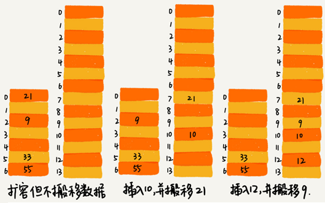

对于查询操作，先从新散列表中查找，如果没有找到，再去老的散列表中查找。

通过这样均摊的方法，将一次性扩容的代价，均摊到多次插入操作中，就避免了一次性扩容耗时过多的情况。这种实现方式，任何情况下，插入一个数据的时间复杂度都是 O(1)。

## 两种散列冲突的解决办法的应用场景

开放寻址法和链表法，这两种冲突解决办法在实际的软件开发中都非常常用。比如，Java 中 **LinkedHashMap** 就采用了链表法解决冲突，**ThreadLocalMap** 是通过线性探测的开放寻址法来解决冲突。

### 1. 开放寻址法

**优点：**散列表中的数据都存储在数组中，可以有效地利用 CPU 缓存加快查询速度，序列化起来比较简单。

**缺点：**

- 删除数据的时候需要特殊标记已经删除掉的数据。
- 所有的数据都存储在一个数组中，比起链表法来说，冲突的代价更高。
- 使用开放寻址法解决冲突的散列表，装载因子的上限不能太大。
- 相比链表法更浪费内存空间。

**当数据量比较小、装载因子小的时候，适合采用开放寻址法。**

### 2. 链表法

**优点：**

- 对内存的利用率比开放寻址法要高，链表结点可以在需要的时候再创建。


- 对大装载因子的容忍度更高：开放寻址法只能适用装载因子小于 1 的情况。对于链表法来说，只要散列函数的值随机均匀，即便装载因子变成 10，也只是是链表的长度变长了而已。

**缺点：**

- 链表要存储指针对于比较小的对象的存储，是比较消耗内存的，还有可能会让内存的消耗翻倍。
- 链表中的结点是零散分布在内存中的，不是连续的，对 CPU 缓存不友好对于执行效率有一定的影响。

如果存储的是大对象，即存储的对象的大小远远大于一个指针的大小（4 个字节或者 8 个字节），那链表中指针的内存消耗在大对象面前可以忽略了。

链表法中的链表可以改造为跳表、红黑树等其他的动态数据结构，这样即便所有的数据都散列到同一个桶内，那最终退化成的散列表的查找时间也只不过是 $O(logn)$。

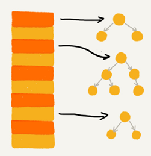

**基于链表的散列冲突处理方法比较适合存储大对象、大数据量的散列表**

## Java 中的HashMap

### 1. 初始大小

HashMap 默认的初始大小是 16，当然这个默认值是可以设置的，如果事先知道大概的数据量有多大，可以通过修改默认初始大小，减少动态扩容的次数，这样会大大提高 HashMap 的性能。

### 2. 装载因子和动态扩容

最大装载因子默认是 0.75，当 HashMap 中元素个数超过 0.75*capacity（capacity 表示散列表的容量）的时候，就会启动扩容，每次扩容都会扩容为原来的两倍大小。

### 3. 散列冲突解决方法

HashMap 底层采用链表法来解决冲突。

在 JDK1.8 版本中， HashMap 的链表长度默认超过 8时，链表就转换为红黑树。当红黑树结点个数少于 8 个的时，红黑树又会转化为链表。

### 4. 散列函数

散列函数的设计并不复杂，追求的是简单高效、分布均匀：

```java
int hash(Object key) {
    int h = key.hashCode()；
    return (h ^ (h >>> 16)) & (capitity -1); //capicity 表示散列表的大小
}
```

其中，hashCode() 返回的是 Java 对象的 hash code。比如 String 类型的对象的 hashCode() ：

```java
public int hashCode() {
  int var1 = this.hash;
  if(var1 == 0 && this.value.length > 0) {
    char[] var2 = this.value;
    for(int var3 = 0; var3 < this.value.length; ++var3) {
      var1 = 31 * var1 + var2[var3];
    }
    this.hash = var1;
  }
  return var1;
}
```


# 散列表+链表

散列表这种数据结构虽然支持非常高效的数据插入、删除、查找操作，但是散列表中的数据都是通过散列函数打乱之后无规律存储的。也就说，它无法支持按照某种顺序快速地遍历数据。如果希望按照顺序遍历散列表中的数据，那需要将散列表中的数据拷贝到数组中，然后排序，再遍历。

因为散列表是动态数据结构，不停地有数据的插入、删除，按顺序遍历散列表中的数据的时候，都需要先排序，效率很低。为了解决这个问题，可以将散列表和链表（或者跳表）结合在一起使用。


用链表来实现 LRU 缓存淘汰算法，时间复杂度是 O(n)，通过散列表可以将这个时间复杂度降低到 O(1)。

**Redis** 有序集合不仅使用了跳表，还用到了散列表。

**LinkedHashMap**也用到了散列表和链表两种数据结构。


## 散列表+双向链表实现LRU 缓存

用链表实现的 LRU 缓存淘汰算法查找的时间复杂度是 O(n)，而将散列表和链表组合使用，可以将查找的时间复杂度降低到 O(1)。

一个缓存（cache）系统主要包含下面这几个操作：

- 添加一个数据；
- 删除一个数据；
- 查找一个数据。

这三个操作都要涉及“查找”操作，单纯采用链表时间复杂度是 O(n)，散列表+链表时间复杂度是 O(1)。

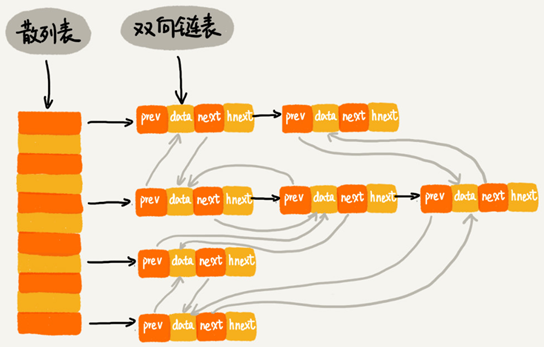

双向链表的每个结点包含存储数据的data和prev、next、hnext三个指针。

hnext是散列表的**拉链**指针，前驱prev和后继next是双向链表的串联指针。

**查找一个数据：**通过散列表的拉链指针可以很快地在缓存中找到一个数据。找到数据之后将它移动到双向链表的尾部。

**删除一个数据：**找到数据所在的结点，然后将结点删除。借助散列表可以在 O(1) 时间复杂度里找到要删除的结点。

**添加一个数据：**查看这个数据是否已经在缓存中。如果已经在其中将其移动到双向链表的尾部；如果不在其中，再看缓存有没有满。如果满了，则将双向链表头部的结点删除，然后再将数据放到链表的尾部；如果没有满，就直接将数据放到链表的尾部。

python实现代码：

```python
from typing import Optional


class DNode():
    def __init__(self, key=None, value=None):
        self.key = key
        self.value = value
        self.prev: Optional[DNode] = None
        self.next: Optional[DNode] = None


class LRUCacheHashTable():
    def __init__(self, capacity=10):
        self.length = 0  # 链表长度
        self.capacity = capacity  # 链表容量
        self.table = {}  # 散列表存储key

        self.head_node = DNode()
        self.tail_node = DNode()
        self.head_node.next = self.tail_node
        self.tail_node.prev = self.head_node

    def put(self, key, value):
        node: DNode = self.table.get(key)
        if node is None:
            new_node = DNode(key, value)
            self.table[key] = new_node
            self.add_node(new_node)
            self.length += 1
            if self.length > self.capacity:
                tail = self.pop_tail()
                del self.table[tail.key]
                self.length -= 1
        else:
            node.value = value
            self.move_to_head(node)

    def add_node(self, new_node: DNode):
        """将新节点加到头部"""
        new_node.next = self.head_node.next
        new_node.prev = self.head_node
        self.head_node.next.prev = new_node
        self.head_node.next = new_node

    def pop_tail(self):
        """弹出尾部数据节点"""
        node = self.tail_node.prev
        self.remove_node(node)
        return node

    @staticmethod
    def remove_node(node):
        """移除节点"""
        node.prev.next = node.next
        node.next.prev = node.prev

    def move_to_head(self, node):
        """将节点移动到头部"""
        self.remove_node(node)
        self.add_node(node)

    def get(self, key):
        """获取节点数据"""
        node: DNode = self.table.get(key)
        if node is None: return None
        self.move_to_head(node)
        return node.value

    def remove(self, key):
        """移除节点数据"""
        node = self.table.get(key)
        if node is None: return
        self.remove_node(node)
        self.length -= 1

    def __repr__(self):
        p = self.head_node.next
        result = []
        while p.next:
            result.append("%s:%s" % (p.key, p.value))
            p = p.next
        return "{%s}" % ", ".join(result)
```


## Redis 有序集合

在Redis有序集合中，每个成员对象有两个重要的属性，**key**（键值）和**score**（分值）。可以同时通过key 和 score 来查找数据。

比如用户积分排行榜有这样一个功能：可以通过用户的 ID 来查找积分信息，也可以通过积分区间来查找用户 ID 或者姓名信息。这里包含 ID、姓名和积分的用户信息，就是成员对象，用户 ID 就是 key，积分就是 score。

 Redis 有序集合的操作：

- 添加一个成员对象；
- 按照键值来删除一个成员对象；
- 按照键值来查找一个成员对象；
- 按照分值区间查找数据，比如查找积分在 [100, 356] 之间的成员对象；
- 按照分值从小到大排序成员变量；

如果仅仅按照分值将成员对象组织成跳表的结构，那按照键值来删除、查询成员对象就会很慢。

可以再按照键值构建一个散列表，这样按照 key 来删除、查找一个成员对象的时间复杂度就变成了 O(1)。

## Java的LinkedHashMap

LinkedHashMap 是通过散列表和链表组合在一起实现的。它不仅支持按照插入顺序遍历数据，还支持按照访问顺序来遍历数据。

LinkedHashMap 中的“Linked”相当于在HashMap的基础上加了一层双向链表。

比如：

```java
// 10 是初始大小，0.75 是装载因子，true 是表示按照访问时间排序
HashMap<Integer, Integer> m = new LinkedHashMap<>(10, 0.75f, true);
m.put(3, 11);
m.put(1, 12);
m.put(5, 23);
m.put(2, 22);
 
m.put(3, 26);
m.get(5);
 
for (Map.Entry e : m.entrySet()) {
  System.out.println(e.getKey());
}
```

这段代码打印的结果是 1，2，3，5。

每次调用 put() 函数，往 LinkedHashMap 中添加数据的时候，都会将数据添加到链表的尾部，在前四个操作完成之后：

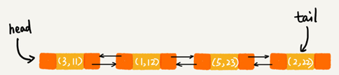

再次将键值为 3 的数据放入到 LinkedHashMap 的时候，会先查找这个键值是否已经有了，然后，再将已经存在的 (3,11) 删除，并且将新的 (3,26) 放到链表的尾部：

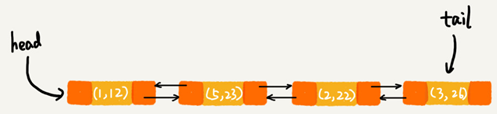

当访问到 key 为 5 的数据的时候，将被访问到的数据移动到链表的尾部：

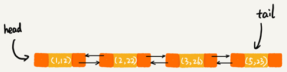

按照访问时间排序的 LinkedHashMap 本身就是一个支持 LRU 缓存淘汰策略的缓存系统。


## 2道思考题

1.散列表+链表，把双向链表改成单链表，还能否正常工作呢？为什么呢？

答：可以正常工作，散列表+链表主要是查找、删除和添加三种操作，改成单链表后，只是相对需要增加一个变量记录前驱节点，照样可以在找到目标节点后很快的实现查找、删除和添加三种操作。


2.假设猎聘网有 10 万名猎头，每个猎头都可以通过做任务（比如发布职位）来积累积分，然后通过积分来下载简历。假设你是猎聘网的一名工程师，如何在内存中存储这 10 万个猎头 ID 和积分信息，让它能够支持这样几个操作：

1. 根据猎头的 ID 快速查找、删除、更新这个猎头的积分信息；
2. 查找积分在某个区间的猎头 ID 列表；
3. 查找按照积分从小到大排名在第 x 位到第 y 位之间的猎头 ID 列表。

答：

构建一个散列表，并在链表节点上增加用于构建跳表的指针，散列表根据猎头的 ID 计算hash值，跳表根据积分从小到大排序。

1. ID 在散列表中存储，可以根据ID在O(1)的时间复杂度内快速查找、删除、更新这个猎头的积分信息。
2. 积分在跳表存储，可以做到 O(logn) 的时间复杂度定位积分区间的起点，然后在原始链表中顺序往后遍历到积分的终点就可以了。
3. 对跳表进行改造，每个索引结点中加入一个 span 字段，记录这个索引结点到下一个索引结点的包含的链表结点的个数。这样就可以利用跳表索引，快速计算出排名在某个区间的猎头列表。

实际开发中，可以直接利用 Redis 的有序集合来完成这些需求。

