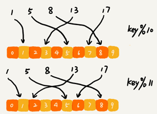
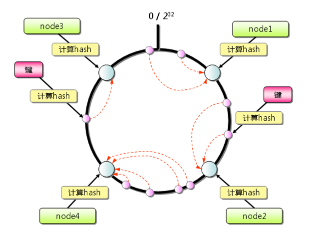
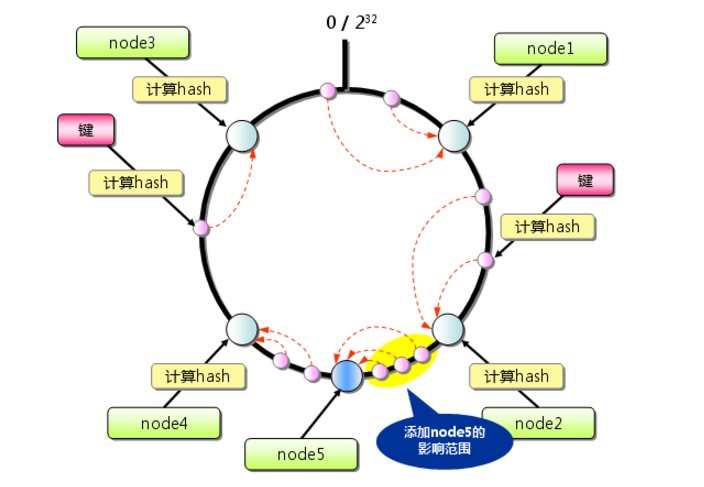
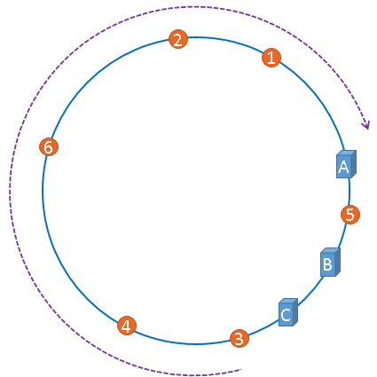
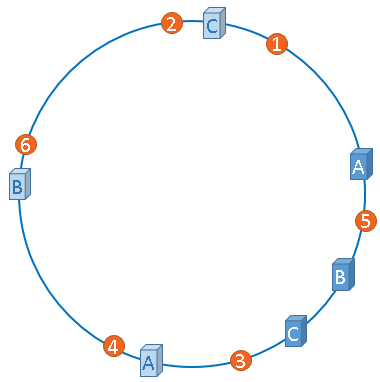
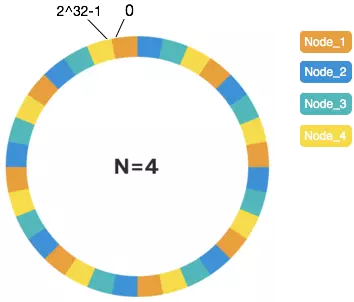
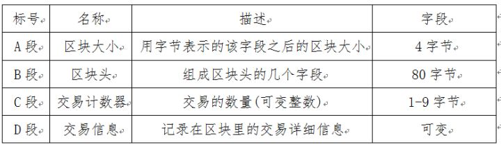
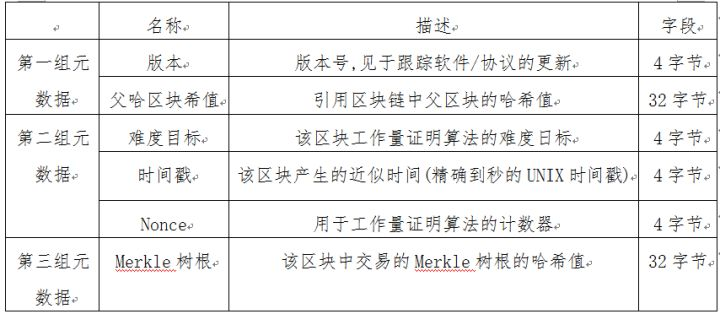
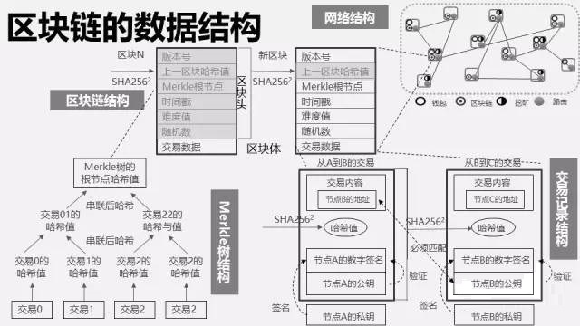
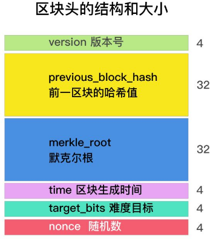

# 哈希算法

哈希算法是指将任意长度的二进制值串映射为固定长度的二进制值串，这个映射的规则就是**哈希算法**，而通过原始数据映射之后得到的二进制值串就是**哈希值**。

要设计一个优秀的哈希算法需要满足的几点要求：

- 从哈希值不能反向推导出原始数据（所以哈希算法也叫单向哈希算法）；
- 对输入数据非常敏感，哪怕原始数据只修改了一个 Bit，最后得到的哈希值也大不相同；
- 散列冲突的概率要很小，对于不同的原始数据，哈希值相同的概率非常小；
- 哈希算法的执行效率要尽量高效，针对较长的文本，也能快速地计算出哈希值。

哈希算法要处理的文本可能是各种各样的。比如，对于非常长的文本，如果哈希算法的计算时间很长，那就只能停留在理论研究的层面，很难应用到实际的软件开发中。比如，我们把今天一篇包含 4000 多个汉字的文章，用 MD5 计算哈希值，用不了 1ms 的时间。

# 哈希算法的应用

最常见的应用分别是**安全加密、唯一标识、数据校验、散列函数**。

在分布式系统中的应用有**负载均衡、数据分片、分布式存储**。

## 应用一：安全加密

最常用于加密的哈希算法是**MD5**（MD5 Message-Digest Algorithm，MD5 消息摘要算法）、**SHA**（Secure Hash Algorithm，安全散列算法）、**DES**（Data Encryption Standard，数据加密标准）、**AES**（Advanced Encryption Standard，高级加密标准）。

**为什么哈希算法无法做到零冲突？**

鸽巢原理（也叫抽屉原理）是说，如果有 10 个鸽巢，有 11 只鸽子，那肯定有 1 个鸽巢中的鸽子数量多于 1 个，换句话说就是，肯定有 2 只鸽子在 1 个鸽巢内。

哈希算法产生的哈希值的长度是固定且有限的。比如 MD5 的哈希值是固定的 128 位二进制串，能表示的数据是有限的，最多能表示 $2^{128}$ 个数据，但要哈希的数据是无穷的。基于鸽巢原理，如果对 $2^{128}+1$ 个数据求哈希值，就必然会存在哈希值相同的情况。当然，哈希值越长的哈希算法，散列冲突的概率越低。

```
2^128=340282366920938463463374607431768211456
```

但MD5有  $2^{128}$ 个不同的哈希值，散列冲突的概率小于  $\frac{1}{2^{128}}$，冲突的概率极低。

通过毫无规律的穷举的方法，找到跟一个 MD5 值相同的另一个数据，那耗费的时间是个天文数字。没有绝对安全的加密。越复杂、越难破解的加密算法，需要的计算时间也越长。比如 SHA-256 比 SHA-1 要更复杂、更安全，相应的计算时间就会比较长。

## 应用二：唯一标识

如果要在海量的图库中，搜索一张图是否存在 ，比较笨的办法就是，拿要查找的图片的二进制码串与图库中所有图片的二进制码串一一比对。如果相同，则说明图片在图库中存在。

给每一个图片取一个唯一标识，即信息摘要。比如，从图片的二进制码串开头取 100 个字节，从中间取 100 个字节，从最后再取 100 个字节，然后将这 300 个字节放到一块，通过哈希算法（比如 MD5），得到一个哈希字符串，用它作为图片的唯一标识。通过这个唯一标识来判定图片是否在图库中，这样就可以减少很多工作量。

如果还想继续提高效率，可以把每个图片的唯一标识，和相应的图片文件在图库中的路径信息，都存储在散列表中。当要查看某个图片是不是在图库中的时候，先通过哈希算法对这个图片取唯一标识，然后在散列表中查找是否存在这个唯一标识。

如果不存在，那就说明这个图片不在图库中；如果存在，再通过散列表中存储的文件路径，获取到这个已经存在的图片，跟现在要插入的图片做全量的比对，看是否完全一样。如果一样，就说明已经存在；如果不一样，说明两张图片尽管唯一标识相同，但是并不是相同的图片。

## 应用三：数据校验

BT 下载是基于 P2P 协议的，比如下载一个电影文件，BT 下载会从多个机器上并行下载一个 2GB 的电影，这个电影文件可能会被分割成很多文件块（比如可以分成 100 块，每块大约 20MB）。等所有的文件块都下载完成之后，再组装成一个完整的电影文件就行了。

但网络传输是不安全的，下载的文件块有可能是被宿主机器恶意修改过的，又或者下载过程中出现了错误，所以下载的文件块可能不是完整的。

种子文件保存了 100 个文件块的哈希值。当文件块下载完成之后，通过相同的哈希算法，对下载好的文件块逐一求哈希值，然后跟种子文件中保存的哈希值比对。如果不同，说明这个文件块不完整或者被篡改了，需要再重新从其他宿主机器上下载这个文件块。

## 应用四：散列函数

散列函数也是哈希算法的一种应用，相对哈希算法的其他应用，散列函数对于散列算法冲突的要求要低很多。

散列函数对于散列算法计算得到的值，是否能反向解密也并不关心。散列函数中用到的散列算法，更加关注散列后的值是否能平均分布。

另外，散列函数用的散列算法一般都比较简单，比较追求效率。


## 应用五：负载均衡

负载均衡算法有轮询、随机、加权轮询等。

一个会话粘滞（session sticky）的负载均衡算法是指在同一个客户端上一次会话中的所有请求都路由到同一个服务器上。

实现方法：

**通过哈希算法，对客户端 IP 地址或者会话 ID 计算哈希值，将取得的哈希值与服务器列表的大小进行取模运算，最终得到的值就是应该被路由到的服务器编号。** 


## 应用六：数据分片

哈希算法还可以用于数据的分片：

**1.假如1T 的日志文件，里面记录了用户的搜索关键词，想要快速统计出每个关键词被搜索的次数，该怎么做呢？**

问题：搜索日志很大，没办法放到一台机器的内存中；如果只用一台机器来处理这么巨大的数据，处理时间会很长。

具体解决的思路：为了提高处理的速度，用 n 台机器并行处理。从搜索记录的日志文件中，依次读出每个搜索关键词，并且通过哈希函数计算哈希值，然后再跟 n 取模，最终得到的值分配到指定的机器上。

哈希值相同的搜索关键词会被分配到同一个机器上，同一个搜索关键词会被分配到同一个机器上。每个机器会分别计算关键词出现的次数，最后合并起来就是最终的结果。

这个处理过程也是 MapReduce 的基本设计思想。

**2. 如何快速判断图片是否在图库中（图库中有 1 亿张以上的海量图片）？**

基本方法，即给每个图片取唯一标识（或者信息摘要），然后构建散列表。

问题： 1 亿张图片构建散列表远远超过了单台机器的内存上限。

**解决思路：**

准备 n 台机器，让每台机器只维护某一部分图片对应的散列表。每次从图库中读取一个图片，计算唯一标识与机器个数 n 求余取模，得到的值就对应要分配的机器编号，然后将这个图片的唯一标识和图片路径发往对应的机器构建散列表。

当判断一个图片是否在图库中的时候，通过同样的哈希算法，计算这个图片的唯一标识与机器个数 n 求余取模。假设得到的值是 k，那就去编号 k 的机器构建的散列表中查找。

**给 1 亿张图片构建散列表所需存储空间估算：**

散列表中每个数据单元包含两个信息，哈希值和图片文件的路径。假设通过 MD5 来计算哈希值，那长度就是 128 比特， 16 字节。文件路径长度的上限是 256 字节，可以假设平均长度是 128 字节。如果用链表法来解决冲突，那还需要存储指针，指针只占用 8 字节。所以，散列表中平均每个数据单元就占用 152 字节。

假设一台机器的内存大小为 2GB，散列表的装载因子为 0.75，那一台机器可以给大约 1000 万（2GB*0.75/152）张图片构建散列表。所以对 1 亿张图片构建索引，大约需要十几台机器。


这种估算能事先对需要投入的资源、资金有个大概的了解，能更好地评估解决方案的可行性。

## 应用七：分布式存储

现在互联网面对的都是海量的数据、海量的用户，为了提高数据的读取、写入能力，一般都采用分布式的方式来存储数据，比如分布式缓存。有海量的数据需要缓存，一个缓存机器肯定是不够的，就需要将数据分布在多台机器上。

随着数据增多就需要增加机器扩容了，但一旦扩容所有的数据都要重新计算哈希值，缓存中的数据一下子都失效了。




引入**一致性哈希算法**可以使得在新加入一个机器后，并不需要做大量的数据搬移。


# 一致性哈希算法

1. 首先用哈希算法求出服务器（一般用ip地址或主机名）的哈希值与$2^{32}$取模，将其映射到$0～2^{32}$的Hash环上。
2. 然后采用同样的哈希算法求出存储数据的键的哈希值与$2^{32}$取模，映射到相同的Hash环上。
3. 然后从数据映射到的位置开始顺时针查找，将数据保存到找到的第一个服务器上。由于映射在环上，超过$2^{32}$仍然找不到服务器就会指向第一台服务器。

  

当添加一台机器node5时，先计算hash值与$2^{32}$取模并映射到Hash环上，然后将顺时针指向node5的数据从原本指向的node4迁移到node5机器上：

  

如果node5节点出现故障宕机，则数据分布又会重新恢复到上图的特点。

## Hash环的偏斜

上面描述了比较理想的情况，但在实际的映射中，服务器可能会被映射成如下模样： 

  

这样大部分缓存数据都被映射到了服务器A节点上。

## 虚拟节点

对于上面的情况，如果想要均衡地将缓存分布到三台服务器上，最佳办法是将现有的物理节点通过虚拟的方法复制出来映射到Hash环上，这些由实际节点虚拟复制而来的节点被称为"虚拟节点"。加入虚拟节点以后的hash环如下： 

  

 "虚拟节点"是"实际节点"（实际的物理服务器）在hash环上的复制品，一个实际节点可以对应多个虚拟节点。上图中A、B、C三台服务器分别虚拟出了一个虚拟节点。实际可以虚拟出更多的虚拟节点，以便减小hash环偏斜所带来的影响，虚拟节点越多，hash环上的节点就越多，缓存被均匀分布的概率就越大。 

假设有4个物理节点Node，虚拟节点可设置为160个，此时可带来较好的均匀分布：

  

“虚拟节点”的hash计算可以采用对应节点的IP地址加数字后缀的方式。例如假设NODE1的IP地址为192.168.1.100。引入“虚拟节点”前，计算 cache A 的 hash 值：

> Hash(“192.168.1.100”);

引入“虚拟节点”后，计算“虚拟节”点NODE1-1和NODE1-2的hash值：

> Hash(“192.168.1.100#1”); // NODE1-1
> Hash(“192.168.1.100#2”); // NODE1-2


# 哈希算法的其他应用

比如网络协议中的 CRC 校验、Git commit id 等等。

Hash算法在信息安全方面的应用主要体现在以下的3个方面：

1.文件校验

常见校验算法有奇偶校验和CRC校验，这2种校验并没有抗数据篡改的能力，它们一定程度上能检测并纠正数据传输中的信道误码，但却不能防止对数据的恶意破坏。

 MD5 Hash算法的“数字指纹”特性，使它成为目前应用最广泛的一种文件完整性校验和（Checksum）算法，不少Unix系统有提供计算md5 checksum的命令。

2.数字签名

Hash 算法也是现代密码体系中的一个重要组成部分。由于非对称算法的运算速度较慢，所以在数字签名协议中，单向散列函数扮演了一个重要的角色。 对 Hash 值，又称“数字摘要”进行数字签名，在统计上可以认为与对文件本身进行数字签名是等效的。而且这样的协议还有其他的优点。

3.鉴权协议
鉴权协议又被称作挑战--认证模式：在传输信道是可被侦听，但不可被篡改的情况下，这是一种简单而安全的方法。


# 如何防止数据库中的用户信息被脱库？

引入一个盐（salt），跟用户的密码组合在一起，拿组合之后的字符串来做哈希算法加密，将它存储到数据库中。

不过安全和攻击是一种博弈关系，不存在绝对的安全。所有的安全措施，只是增加攻击的成本而已。


# 区块链&比特币

区块链是由包含交易信息的区块从后向前有序链接起来的数据结构.  它可以被存储为flat file (一种包含非相对关系记录的文件),或是存储在一个简单数据库中.比特币核心(Bitcoin Core)客户端使用Google的LeveLDB数据库存储区块链元数据.区块被从后向前有序地链接在这个链条里,每个区块都指向前一个区块.

区块链经常被视为一个垂直的栈,第一个区块作为栈底的首区块,随后每个区块都被放置在其他区块之上.用栈来形象化表示区块依次堆叠这一概念后, 我们便可以使用一些术语,例如,"高度"来表示区块与首区块之间的距离;以及用"顶部"或"顶端"来表示最新添加的区块. 

对每个区块头进行SHA256加密哈希,可生成一个哈希值.通过这个哈希值, 可以识别出区块链中的对应区块.同时,每一个区块都可以通过其区块头的"父区块哈希值"字段引用前一区块(父区块).也就是说,每个区块头都包含它的父区块哈希值.这样把每个区块链接到各自父区块的哈希值序列就创建了一条一直可以追溯到第一区块(创世区块）的链条.

虽然每个区块都只有一个父区块,但可以暂时拥有多个子区块.每个子区块都将同一区块作为其父区块，并且在"父区块哈希值"字段中具有相同的(父区块)哈希值.一个区块出现多个子区块的情况被称为"区块链分叉".区块链分义只是暂时状态,只有当多个不同区块几乎同时被不同的矿工发现时才会发生. 最终,只有一个子区块会成为区块链的一部分,同时解决了"区块链分叉"的问题.尽管一个区块可能会有不止一个子区块,但每个区块只有一个父区块,这是因为一个区块只有一个"父区块哈希值"字段可以指向它的唯一父区块.

由于区块头里面包含"父区块哈希值"字段,所以当前区块的哈希值因此也受到该字段的影响.如果父区块的身份标识发生变化,子区块的身份标识也会跟看变化.当父区块有任何改动时,父区块的哈希值也发生变化。父区块的哈希值发生改变将迫使子区块的"父区块哈希值"字段发生改变,从而又将导致子区块的哈希值发生改变.而子区块的哈希值发生改变又将迫使孙区块的"父区块哈希值”字段发生改变,又因此改变了孙区块哈希值,等等,以此类推.一旦一个区块自很多代以后,这种**瀑布效应**将保证该区块不会被改变,除非强制重新计算该区块所有后续的区块.正是因为这样的重新计算需要耗费巨大的计算量,所以一个长区块链的存在可以让区块链的历史不可改变，这也是比特巾安全性的一个关键特征.

## 区块结构

区块是一种被包含在公开账簿(区块链)里的聚合了交易信息的容器数据结构.它由一个包含元数据的区块头和紧跟其后的构成区块主体的一长串交易组成.区块头是80字节,而平均每个交易至少是250字节,而且平均每个区块至少包含超过500个交易.因此, 一个包含所有交易的元整区块比区块头的1000倍还要大.下表描述了一个区块结构. 

  


## 区块头（区块中的B段）

区块头由三组区块元数据组成.首先是一组引用父区块哈希值的数据,这组元数据用于将该区块与区块链中前一区块相连接。第二组元数据 即难度、时间戳和Nonce,与挖矿竞争相关.第三组元数据是Merkle树根(一种用来有效地总结区块中所有交易的数据结构） 

  

  

## 挖矿算法

比特币挖矿的算法，可以简单地总结为**对区块头做两次sha256哈希运算，得到的结果如果小于区块头中规定的难度目标，即挖矿成功**。 



挖矿的算法可以用python代码表达为：

```python
for nonce in range(0, 2**32):
    block_header = version + previous_block_hash + merkle_root + time + target_bits + nonce
    if sha256(sha256(block_header)) < target_bits:
        break
```

挖矿的流程可以定义为四个阶段：

1. 验证和筛选交易
2. 计算Merkle root
3. 计算区块头
4. 穷举nonce计算hash

### 验证和筛选交易

挖矿节点首先对交易做验证，剔除有问题的，然后通过一套自定义的标准来选择哪些交易希望打包进区块，比如通过交易费与交易占用的字节大小的比值超过某个门槛来判断，这样的交易才被认为有利可图。当然，节点也可以特意选择要加入某条交易，或者故意忽略某些交易，每个挖矿节点有很大的自由裁度权力。如果是通过矿池挖矿的话，矿池的服务器会去筛选交易，然后分配给每个参与的矿机一个独立的任务。这个任务的难度小于总的挖矿难度，通过完成较小难度的计算，来确认自己参与的份额。每台不同的矿机计算的问题不会重复，当其中一台矿机成功挖矿时，所有矿机依据确认的工作量来分配收益。

### 计算Merkle root

一旦筛选好交易数据，按照时间排序，两两哈希，层层约减，通过这些交易就可以计算出一棵Merkle树，可以确定一个唯一的摘要，这就是Merkl树的根。Merkle树中，任何节点的变化，都会导致merkle root发生变化，通过这个值，可以用来验证区块中的交易数据是否被改动过。

```python
ABCDEEEE .......Merkle root
      /        \
   ABCD        EEEE
  /    \      /
 AB    CD    EE .......E与自己配对,奇数树叶时
/  \  /  \  /
A  B  C  D  E .........交易
```

### 计算区块头

依次获取挖矿需要的每一项区块头信息。 区块头只有80个字节，挖矿只需要对区块头进行运算即可。区块头中的信息，在挖矿前大部分已经是固定的，或者是容易计算的。区块中的交易数据虽然很大，但是已经通过Merkle树固定了下来，不需要再包含进来。

逐项准备需要的数字：

**版本号**

跟随比特币客户端而定，一段时间内不会改变。即使要改变，也会有比特币的核心开发人员来协调升级策略，这个可以理解为一个静态常数。

**前一区块摘要**

一次哈希即可。前一区块已经是打包好的。

**默克尔根**

刚才已经得到了结果，根据本次交易包含的交易列表得到。

**时间**

取打包时的时间。也不需要很精确，前后几秒，几十秒也都可以。

**难度目标**

参考上两周产生的区块的平均生成时间而定。两周内如果平均10分钟产生一个区块的话，两周会产生2016个区块，软件会计算最新的2016个区块生成的时间，然后做对比，随之调整难度，使得接下来产生的区块的预期时间保持在10分钟左右。因为最近的2016个区块已经确定，所以这个数字也是确定的。

**随机数nonce**

这个就是挖矿的目标了。这是一个32位的数字。

### 穷举nonce计算hash

随机数可以变化，而且要从0试到最大值2^32。直到最后出现的hash结果，其数字低于难度目标值。不过以现在的计算机算力，一台矿机用不了一秒就把全部的变化可能计算完了，所以还需要改变区块内部的创币交易中的附带消息，这样就让merkle root也发生了变化，从而有更多的可能去找到符合要求的nonce。

挖矿中，第一笔交易是新发的比特币，接收方就是矿工指定的地址，这是挖矿中最大的奖励；另外一小部分来自交易手续费。这笔交易没有输入方，称为创币交易。


