# 二叉树基础

# 树（Tree）

树是一种非线性表结构，比线性表的数据结构要复杂得多：

|        树的种类        |
| :--------------------: |
|       树，二叉树       |
|       二叉查找树       |
| 平衡二叉查找树、红黑树 |
|         递归树         |

“树”的特征：

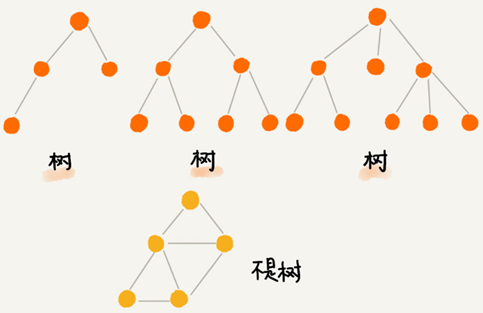


“树”这种数据结构里面每个元素叫作“节点”；用来连线相邻节点之间的关系叫作“父子关系”。

比如下面这幅图，A 节点就是 B 节点的**父节点**，B 节点是 A 节点的**子节点**。B、C、D 这三个节点的父节点是同一个节点，所以它们之间互称为**兄弟节点**。没有父节点的节点叫**根节点**，也就是图中的节点 E。没有子节点的节点叫作**叶子节点**或者**叶节点**，比如图中的 G、H、I、J、K、L 都是叶子节点。

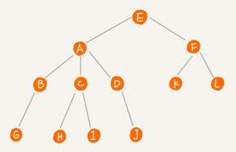

**高度**（Height）、**深度**（Depth）、**层**（Level）的定义：

```
节点的高度=节点到叶子节点的最长路径(边数)
节点的深度=根节点到这个节点所经历的边的个数
节点的层数=节点的深度+1
树的高度=根节点的高度
```

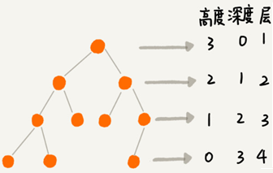

“高度”是从下往上度量，从最底层开始计数计数的起点是 0。

“深度”是从上往下度量，从根结点开始度量计数起点也是 0。

“层数”跟深度的计算类似，不过计数起点是 1。

# 二叉树（Binary Tree）

二叉树的每个节点最多有两个子节点，分别是左子节点和右子节点。二叉树中，有两种比较特殊的树，分别是满二叉树和完全二叉树。满二叉树又是完全二叉树的一种特殊情况。

二叉树既可以用链式存储，也可以用数组顺序存储。数组顺序存储的方式比较适合完全二叉树，其他类型的二叉树用数组存储会比较浪费存储空间。除此之外，二叉树里非常重要的操作就是前、中、后序遍历操作，遍历的时间复杂度是 O(n)，需要用递归代码来实现。


二叉树是树的一种，特点是每个节点最多有两个子节点，分别是**左子节点**和**右子节点**。不过，二叉树有的节点只有左子节点，有的节点只有右子节点：


上图编号 2 的二叉树中，叶子节点全都在最底层，除了叶子节点之外，每个节点都有左右两个子节点，这种二叉树就叫作**满二叉树**。

编号 3 的二叉树中，叶子节点都在最底下两层，最后一层的叶子节点都靠左排列，并且除了最后一层，其他层的节点个数都要达到最大，这种二叉树叫作**完全二叉树**。

## 完全二叉树

完全二叉树和非完全二叉树的区别：


最后一层的叶子节点靠左排列的才叫完全二叉树，如果靠右排列就不能叫完全二叉树了。

存储一棵二叉树有两种方法，一种是基于指针或者引用的二叉链式存储法，一种是基于数组的顺序存储法。

**链式存储法**中每个节点有三个字段，其中一个存储数据，另外两个是指向左右子节点的指针。从根节点开始可以通过左右子节点的指针，把整棵树都串起来。这种存储方式我们比较常用。大部分二叉树代码都是通过这种结构来实现的。

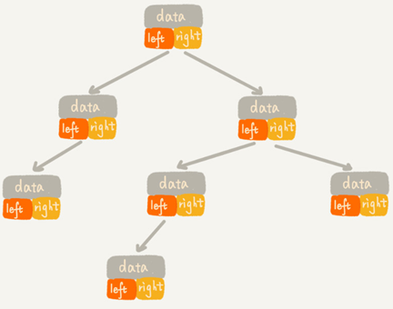

基于数组的**顺序存储法**：把根节点存储在下标 i = 1 的位置，那左子节点存储在下标 2 * i = 2 的位置，右子节点存储在 2 * i + 1 = 3 的位置。以此类推，B 节点的左子节点存储在 2 * i = 2 * 2 = 4 的位置，右子节点存储在 2 * i + 1 = 2 * 2 + 1 = 5 的位置。

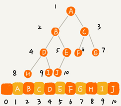

如果节点 X 存储在数组中下标为 i 的位置，左子节点的下标为 2 * i ，右子节点的下标为 2 * i + 1。反过来，下标为 i/2 的位置存储就是它的父节点。通过这种方式，只要知道根节点存储的位置（一般情况下，为了方便计算子节点，根节点会存储在下标为 1 的位置），就可以通过下标计算，把整棵树都串起来。

一棵完全二叉树仅仅“浪费”了一个下标为 0 的存储位置。如果是非完全二叉树，会浪费比较多的数组存储空间：

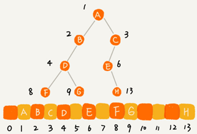

如果某棵二叉树是一棵完全二叉树，用数组存储无疑是最节省内存的一种方式。因为数组的存储方式并不需要存储额外的左右子节点的指针。

堆其实就是一种完全二叉树，最常用的存储方式是数组。

## 二叉树的遍历

将二叉树所有节点都遍历打印出来有三种方法，**前序遍历**、**中序遍历**和**后序遍历**。其中，前、中、后序，表示的是节点与它的左右子树节点遍历打印的先后顺序。

- 前序遍历是指，对于树中的任意节点来说，先打印这个节点，然后再打印它的左子树，最后打印它的右子树。
- 中序遍历是指，对于树中的任意节点来说，先打印它的左子树，然后再打印它本身，最后打印它的右子树。
- 后序遍历是指，对于树中的任意节点来说，先打印它的左子树，然后再打印它的右子树，最后打印这个节点本身。

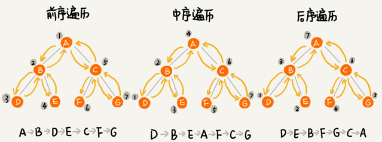

**实际上，二叉树的前、中、后序遍历就是一个递归的过程**。比如，前序遍历，其实就是先打印根节点，然后再递归地打印左子树，最后递归地打印右子树。

写递推公式的关键就是，如果要解决问题 A，就假设子问题 B、C 已经解决，然后再来看如何利用 B、C 来解决 A。前、中、后序遍历的递推公式：

```c
前序遍历的递推公式：
preOrder(r) = print r->preOrder(r->left)->preOrder(r->right)
 
中序遍历的递推公式：
inOrder(r) = inOrder(r->left)->print r->inOrder(r->right)
 
后序遍历的递推公式：
postOrder(r) = postOrder(r->left)->postOrder(r->right)->print r
```

java伪代码：

```java
void preOrder(Node* root) {
  if (root == null) return;
  print root // 此处为伪代码，表示打印 root 节点
  preOrder(root->left);
  preOrder(root->right);
}
 
void inOrder(Node* root) {
  if (root == null) return;
  inOrder(root->left);
  print root // 此处为伪代码，表示打印 root 节点
  inOrder(root->right);
}
 
void postOrder(Node* root) {
  if (root == null) return;
  postOrder(root->left);
  postOrder(root->right);
  print root // 此处为伪代码，表示打印 root 节点
}
```

**二叉树遍历的时间复杂度：**遍历过程中每个节点最多会被访问两次，所以遍历操作的时间复杂度跟节点的个数 n 成正比，二叉树遍历的时间复杂度是 O(n)。

python代码实现：

```python
from typing import Optional


class TreeNode():
    def __init__(self, value):
        self.val = value
        self.left = None
        self.right = None


# 前序遍历
def pre_order(root: Optional[TreeNode]):
    if root:
        yield root.val
        yield from pre_order(root.left)
        yield from pre_order(root.right)


# 中序遍历
def in_order(root: Optional[TreeNode]):
    if root:
        yield from in_order(root.left)
        yield root.val
        yield from in_order(root.right)


# 后序遍历
def post_order(root: Optional[TreeNode]):
    if root:
        yield from post_order(root.left)
        yield from post_order(root.right)
        yield root.val
```


## 按层次遍历二叉树

除了前、中、后序三种二叉树遍历方式外还有按层遍历这种遍历方式。

实现思路：

按照 广度优先的遍历算法的思路，引入一个队列，根节点先入队列，然后开始从队列头部取元素，每取一个元素则先打印当前元素，然后依次将左右子节点加入队列，若左子节点或右子节点为空则跳过此步。

python实现代码：

```python
from collections import deque


# 层级遍历
def layer_order(root: TreeNode):
    if not root: return
    queue = deque([root])
    while queue:
        e: TreeNode = queue.popleft()
        yield e.val
        if e.left: queue.append(e.left)
        if e.right: queue.append(e.right)
```

对应leetcode题目：

 https://leetcode.com/problems/binary-tree-level-order-traversal/ 

给定一个二叉树，返回其按层次遍历的节点值。 （即逐层地，从左到右访问所有节点）。

例如:
给定二叉树: [3,9,20,null,null,15,7],

        3
       / \
      9  20
        /  \
       15   7

返回其层次遍历结果：

```
[
  [3],
  [9,20],
  [15,7]
]
```

python代码实现：

```python
def level_order(root: TreeNode):
    levels = []
    if not root:
        return levels
    level = 0
    queue = deque([root])
    while queue:
        levels.append([])
        for i in range(len(queue)):
            node = queue.popleft()
            levels[level].append(node.val)
            if node.left:
                queue.append(node.left)
            if node.right:
                queue.append(node.right)
        level += 1

    return levels
```


## n个不同的数据可以构建出多少种不同的二叉树？

给定一组数据，比如 1，3，5，6，9，10。可以构建出多少种不同的二叉树？

答：

根据卡特兰数n个数据能产生$\frac{C_{2n}^{n}}{n+1}=\frac{(2n)!}{n!\cdot(n+1)!}$种二叉树形状

而n个数据能产生$A_n^n=n!$种排列组合

故n个不同的数据能构建出$n!\cdot\frac{(2n)!}{n!\cdot(n+1)!}=\frac{(2n)!}{(n+1)!}$种二叉树

题目中给定数据n=6,故能构建出$\frac{12!}{7!}=12*11*10*9*8=95040$种不同的二叉树。

完全二叉树是其中一种二叉树形状，故能构建出$n!$种完全二叉树，题目中给定数据n=6时，可以构建出720种完全二叉树。


## 二叉查找树（Binary Search Tree）

二叉查找树是二叉树中最常用的一种类型，也叫二叉搜索树。二叉查找树支持动态数据集合的快速插入、删除、查找操作。

二叉查找树要求，在树中的任意一个节点，其左子树中的每个节点的值都小于这个节点的值，而右子树每个节点的值都大于这个节点的值:

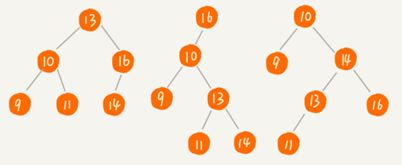

### 1. 二叉查找树的查找操作

先取根节点，如果它等于要查找的数据就返回。如果要查找的数据比根节点的值小，那就在左子树中递归查找；如果要查找的数据比根节点的值大，那就在右子树中递归查找。

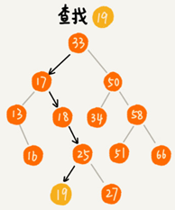

java实现代码：

```java
public class BinarySearchTree {
  private Node tree;
 
  public Node find(int data) {
    Node p = tree;
    while (p != null) {
      if (data < p.data) p = p.left;
      else if (data > p.data) p = p.right;
      else return p;
    }
    return null;
  }
 
  public static class Node {
    private int data;
    private Node left;
    private Node right;
 
    public Node(int data) {
      this.data = data;
    }
  }
}
```

### 2. 二叉查找树的插入操作

二叉查找树的插入过程需要从根节点开始，依次比较要插入的数据和节点的大小关系。

如果要插入的数据比节点的数据大，并且节点的右子树为空，就将新数据直接插到右子节点的位置；如果不为空，就再递归遍历右子树，查找插入位置。同理，如果要插入的数据比节点数值小，并且节点的左子树为空，就将新数据插入到左子节点的位置；如果不为空，就再递归遍历左子树，查找插入位置。

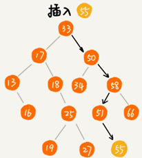

java实现代码：

```java
public void insert(int data) {
  if (tree == null) {
    tree = new Node(data);
    return;
  }
 
  Node p = tree;
  while (p != null) {
    if (data > p.data) {
      if (p.right == null) {
        p.right = new Node(data);
        return;
      }
      p = p.right;
    } else { // data < p.data
      if (p.left == null) {
        p.left = new Node(data);
        return;
      }
      p = p.left;
    }
  }
}
```

### 3. 二叉查找树的删除操作

针对要删除节点的子节点个数的不同需要分2种情况来处理。

如果要删除的节点只有一个子节点（只有左子节点或者右子节点）或没有子节点（左右子节点均为Null），只需要要将要删除节点的父节点的指针指向要删除节点的子节点。比如下图中删除节点 55、 13。

如果要删除的节点有两个子节点。需要找到这个节点的右子树中的最小节点，把它替换到要删除的节点上。然后再按照上面方法删除掉这个最小节点。比如下图中的删除节点 18。（用左子树的最大节点进行替换也可以）

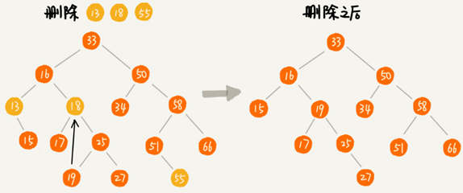

java实现代码：

```java
public void delete(int data) {
  Node p = tree; // p 指向要删除的节点，初始化指向根节点
  Node pp = null; // pp 记录的是 p 的父节点
  while (p != null && p.data != data) {
    pp = p;
    if (data > p.data) p = p.right;
    else p = p.left;
  }
  if (p == null) return; // 没有找到
 
  // 要删除的节点有两个子节点
  if (p.left != null && p.right != null) { // 查找右子树中最小节点
    Node minP = p.right;
    Node minPP = p; // minPP 表示 minP 的父节点
    while (minP.left != null) {
      minPP = minP;
      minP = minP.left;
    }
    p.data = minP.data; // 将 minP 的数据替换到 p 中
    p = minP; // 下面就变成了删除 minP 了
    pp = minPP;
  }
 
  // 删除节点是叶子节点或者仅有一个子节点
  Node child; // p 的子节点
  if (p.left != null) child = p.left;
  else if (p.right != null) child = p.right;
  else child = null;
 
  if (pp == null) tree = child; // 删除的是根节点
  else if (pp.left == p) pp.left = child;
  else pp.right = child;
}
```

关于二叉查找树的删除操作，最简单的方法是单纯将要删除的节点标记为“已删除”并不真正从树中将这个节点去掉。这样原本删除的节点还需要存储在内存中，缺点是比较浪费内存空间。


### 4. 二叉查找树的其他操作

二叉查找树中还可以支持**快速地查找最大节点和最小节点、前驱节点和后继节点**。

二叉查找树也叫作二叉排序树，**中序遍历二叉查找树，可以输出有序的数据序列，时间复杂度是 O(n)**。

python代码实现：

```python
    def find_min(self) -> Optional[TreeNode]:
        if self.tree is None: return None
        p = self.tree
        while p.left:
            p = p.left
        return p

    def find_max(self) -> Optional[TreeNode]:
        if self.tree is None: return None
        p = self.tree
        while p.right:
            p = p.right
        return p

    def _in_order(self, root: Optional[TreeNode]):
        if root:
            yield from self._in_order(root.left)
            yield root.data
            yield from self._in_order(root.right)

    def in_order(self) -> list:
        if self.tree is None:
            return []
        return list(self._in_order(self.tree))
```

### 二叉查找树的python实现代码

```python
from collections import deque
from typing import Optional, List


class TreeNode:
    def __init__(self, data=None):
        self.data = data
        self.left = None
        self.right = None


class BinarySearchTree:
    def __init__(self, val_list=None):
        if val_list is None:
            val_list = []
        self.tree: Optional[TreeNode] = None
        for n in val_list:
            self.insert(n)

    def find(self, data):
        p = self.tree
        while p and p.data != data:
            p = p.left if data < p.data else p.right
        return p

    def insert(self, data):
        if not self.tree:
            self.tree = TreeNode(data)
            return
        pp = None
        p = self.tree
        while p:
            pp = p
            p = p.left if p.data > data else p.right
        if pp.data > data:
            pp.left = TreeNode(data)
        else:
            pp.right = TreeNode(data)

    def delete(self, data):
        p: Optional[TreeNode] = self.tree  # p指向要删除的节点，初始化指向根节点
        pp: Optional[TreeNode] = None  # pp记录的是p的父节点
        while p and p.data != data:
            pp = p
            p = p.right if p.data < data else p.left
        if not p: return  # 没有找到

        if p.left and p.right:  # 查找右子树中最小节点
            min_p = p.right  # 记录右子树的最小节点
            min_pp = p  # minPP表示minP的父节点
            while min_p.left:
                min_pp = min_p
                min_p = min_p.left
            p.data = min_p.data  # 替换数据
            p, pp = min_p, min_pp  # p指向要删除的min_p
        #  删除节点是叶子节点或者仅有一个子节点
        child: Optional[TreeNode] = p.left if p.left else p.right
        if not pp:
            self.tree = child  # 删除的是根节点
        elif pp.left == p:
            pp.left = child
        else:
            pp.right = child

    def find_min(self) -> Optional[TreeNode]:
        if self.tree is None: return None
        p = self.tree
        while p.left:
            p = p.left
        return p

    def find_max(self) -> Optional[TreeNode]:
        if self.tree is None: return None
        p = self.tree
        while p.right:
            p = p.right
        return p

    def _in_order(self, root: Optional[TreeNode]):
        if root:
            yield from self._in_order(root.left)
            yield root.data
            yield from self._in_order(root.right)

    def in_order(self) -> list:
        if self.tree is None:
            return []
        return list(self._in_order(self.tree))

    def __repr__(self):
        return str(self.in_order())

    def __iter__(self):
        return self._in_order(self.tree)

    def draw_tree(self):
        if not self.tree:
            return
        # level = 0
        queue = deque([self.tree])
        while queue:
            length = len(queue)
            if set(queue) == {None}: return
            for i in range(length):
                node = queue.popleft()
                if node:
                    print(node.data, end="")
                    queue.append(node.left)
                    queue.append(node.right)
                else:
                    print(None, end="")
                    queue.append(None)
                    queue.append(None)
                if i != length - 1:
                    print(",", end="")
                else:
                    print()


if __name__ == '__main__':
    nums = [4, 2, 10, 6, 1, 7, 3]
    bst = BinarySearchTree(nums)
    print(bst)
    bst.draw_tree()
    # 插入
    bst.insert(5)
    print(bst)

    print(bst.find(2).data)

    # 删除
    bst.delete(6)
    print(bst)
    bst.delete(4)
    print(bst)
    bst.draw_tree()
    # min max
    print(bst.find_max().data)
    print(bst.find_min().data)

```


## 支持重复数据的二叉查找树

在实际的软件开发中，在二叉查找树中存储的，是一个包含很多字段的对象。利用对象的某个字段作为键值（key）来构建二叉查找树，对象中的其他字段叫作卫星数据。

如果存储的两个对象键值相同的两种解决方法：

1.二叉查找树中每一个节点存储链表或支持动态扩容的数组，把值相同的数据都存储在同一个节点上。

2.每个节点仍然只存储一个数据。在查找插入位置的过程中，如果碰到一个节点的值，与要插入数据的值相同，就把这个新插入的数据当作大于这个节点的值来处理，放到这个节点的右子树。

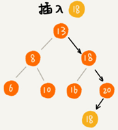

查找数据的时候，遇到值相同的节点并不停止查找操作，而是继续在右子树中查找，直到遇到叶子节点，才停止。这样就可以把键值等于要查找值的所有节点都找出来。

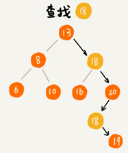

对于删除操作也需要先查找到每个要删除的节点，然后再依次删除。

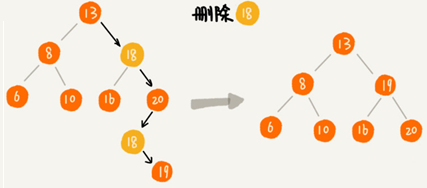

## 二叉查找树的时间复杂度分析

二叉查找树的形态各式各样。下图中同一组数据构造的三种二叉查找树，它们的查找、插入、删除操作的执行效率都是不一样的。

不管操作是插入、删除还是查找，**时间复杂度其实都跟树的高度成正比，也就是 O(height)**。

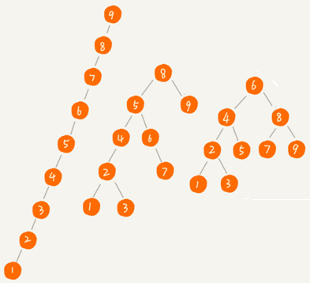

上图中，第一种二叉查找树，根节点的左右子树极度不平衡，已经退化成了链表，所以查找的时间复杂度就变成了 O(n)。

最理想的情况下，二叉查找树是一棵完全二叉树（或满二叉树），插入、删除、查找操作时间复杂度是 $O(logn)$

树的高度就等于最大层数减1，包含 n 个节点的满二叉树中，第一层包含 1 个节点，第二层包含 2 个节点，第三层包含 4 个节点，依次类推，下面一层节点个数是上一层的 2 倍，第 K 层包含的节点个数就是 $2^{K-1}$。

对于完全二叉树来说，最后一层的节点个数在 1 到 $2^{K-1}$个之间（假设最大层数是 K）。 n 满足这样一个关系：
$$
1+2+4+8+...+2^{K-2}+1 <= n <= 1+2+4+8+...+2^{K-2}+2^{K-1} \\
\Rightarrow 2^{K-1} <= n <= 2^K-1 \\
\Rightarrow log_2(n+1) <= K <= log_2{n}+1
$$
K 的范围是$[log_2(n+1),log_2{n}+1]$。完全二叉树的层数小于等于$log_2{n}+1$，即高度小于等于$log_2{n}$。


## 散列表vs二叉查找树

散列表的优势：

散列表的插入、删除、查找操作的时间复杂度可以做到常量级的 O(1)，而二叉查找树在比较平衡的情况下，插入、删除、查找操作时间复杂度才是 $O(logn)$。

散列表的劣势：

我认为有下面几个原因：

第一，散列表要输出有序的数据，需要先进行排序；二叉查找树只需要中序遍历，就可以在 O(n) 的时间复杂度内，输出有序的数据序列。

第二，散列表扩容耗时很多，而且当遇到散列冲突时，性能不稳定；最常用的平衡二叉查找树的性能非常稳定，时间复杂度稳定在 O(logn)。

第三，因为哈希冲突的存在，散列表的实际的查找速度可能不一定比 O(logn) 快。加上哈希函数的耗时，也不一定就比平衡二叉查找树的效率高。

第四，散列表的构造比二叉查找树要复杂，需要考虑的东西很多。比如散列函数的设计、冲突解决办法、扩容、缩容等。平衡二叉查找树只需要考虑平衡性这一个问题，而且这个问题的解决方案比较成熟、固定。

最后，为了避免过多的散列冲突，散列表装载因子不能太大，特别是基于开放寻址法解决冲突的散列表，不然会浪费一定的存储空间。

综合这几点，平衡二叉查找树在某些方面还是优于散列表的。


## 求给定二叉树的确切高度

思路：

递归法，根节点高度=max(左子树高度，右子树高度)+1 

实现代码：

```python
def get_level(node: TreeNode) -> int:
    if node is None: return 0
    return max(get_level(node.left), get_level(node.right)) + 1
```

