# 二叉查找树

# 平衡二叉查找树

二叉查找树是最常用的一种二叉树，它支持快速插入、删除、查找操作，各个操作的时间复杂度跟树的高度成正比，理想情况下，时间复杂度是 O(logn)。但二叉查找树在频繁的动态更新过程中，可能会出现树的高度远大于 $log_2n$ 的情况，从而导致各个操作的效率下降。极端情况下，二叉树会退化为链表，时间复杂度会退化到 $O(n)$。要解决这个复杂度退化的问题，需要设计一种平衡二叉查找树。

平衡二叉树的严格定义是任意一个节点的左右子树的高度相差不能大于 1。

完全二叉树、满二叉树都是平衡二叉树，非完全二叉树也有可能是平衡二叉树。

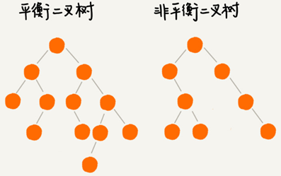

最先被发明的平衡二叉查找树是[AVL 树](https://zh.wikipedia.org/wiki/AVL树)，它严格符合平衡二叉查找树的定义，即任何节点的左右子树高度相差不超过 1，是一种高度平衡的二叉查找树。

但是很多平衡二叉查找树并没有严格符合上面的定义（树中任意一个节点的左右子树的高度相差不能大于 1），比如红黑树，它从根节点到各个叶子节点的最长路径，有可能会比最短路径大一倍。

发明平衡二叉查找树这类数据结构的初衷是，解决普通二叉查找树在频繁的插入、删除等动态更新的情况下，出现时间复杂度退化的问题。

所以，**平衡二叉查找树中“平衡”的意思，其实就是让整棵树左右看起来比较“对称”、比较“平衡”，不要出现左子树很高、右子树很矮的情况。这样就能让整棵树的高度相对来说低一些，相应的插入、删除、查找等操作的效率高一些。**

所以，只要树的高度不比 $log_2n$ 大很多（树的高度仍然是对数量级的），就仍然可以认为这是一个合格的平衡二叉查找树。

## 各种平衡2叉树的对比

绝大部分情况下Treap、Splay Tree操作的效率都很高，但是也无法避免极端情况下时间复杂度的退化。尽管这种情况出现的概率不大，但是对于单次操作时间非常敏感的场景来说，它们并不适用。

AVL 树是一种高度平衡的二叉树，所以查找的效率非常高，但AVL 树为了维持这种高度的平衡，每次插入、删除都要做调整比较复杂、耗时。对于有频繁的插入、删除操作的数据集合，使用 AVL 树的代价就有点高。

红黑树只是做到了近似平衡，并不是严格的平衡，所以在维护平衡的成本上，要比 AVL 树要低。红黑树的插入、删除、查找各种操作性能都比较稳定。对于工程应用来说，要面对各种异常情况，为了支撑这种工业级的应用更倾向于这种性能稳定的平衡二叉查找树。

## 动态数据结构优劣势对比

动态数据结构支持动态地数据插入、删除、查找操作

散列表：插入删除查找都是O(1), 是最常用的，但其缺点是不能顺序遍历以及扩容缩容的性能损耗。适用于那些不需要顺序遍历，数据更新不那么频繁的。

跳表：插入删除查找都是O(logn), 并且能顺序遍历。缺点是空间复杂度O(n)。适用于不那么在意内存空间的，其顺序遍历和区间查找非常方便。

红黑树：插入删除查找都是O(logn), 中序遍历即是顺序遍历，稳定。缺点是难以实现，去查找不方便。 

# 红黑树

平衡二叉查找树有Splay Tree（伸展树）、Treap（树堆）等，但用的最多的平衡二叉查找树基本都是红黑树。有时候甚至默认平衡二叉查找树就是红黑树。

红黑树的英文是“Red-Black Tree”，简称 R-B Tree。它是一种不严格的平衡二叉查找树，

红黑树中的节点，一类被标记为黑色，一类被标记为红色。

## 红黑树所需要满足的要求

红黑树满足：

- 根节点是黑色的；
- 每个叶子节点都是黑色的空节点（NIL），叶子节点不存储数据；
- 任何相邻的节点都不能同时为红色，红色节点是被黑色节点隔开的；
- 每个节点，从该节点到达其可达叶子节点的所有路径都包含相同数目的黑色节点；

下图将黑色的、空的叶子节点都省略掉了：

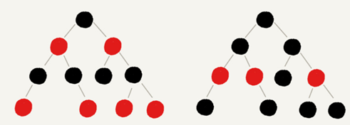

## 红黑树的“近似平衡”

平衡二叉查找树的初衷，是为了解决二叉查找树因为动态更新导致的性能退化问题。所以，**“平衡”的意思可以等价为性能不退化。“近似平衡”就等价为性能不会退化的太严重**。

二叉查找树很多操作的性能都跟树的高度成正比。一棵极其平衡的二叉树（满二叉树或完全二叉树）的高度大约是 $log_2n$，红黑树是否近似平衡就看红黑树的高度是否比较稳定地趋近$log_2n$ 。

红黑树的高度计算：

先计算单纯包含黑色节点的红黑树的高度，红色节点删除之后，失去父节点的节点拿自己的祖父节点（父节点的父节点）作为父节点。之前的二叉树就变成了四叉树。

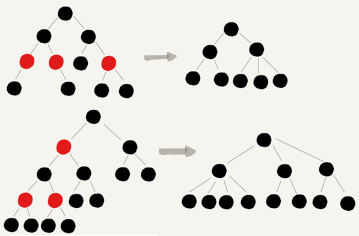

红黑树中，从任意节点到可达的叶子节点的每个路径包含相同数目的黑色节点。从四叉树中取出某些节点，放到叶节点位置，四叉树就变成了完全二叉树。所以，仅包含黑色节点的四叉树的高度，比包含相同节点个数的完全二叉树的高度还要小。

完全二叉树的高度近似$log_2n$，四叉“黑树”的高度低于完全二叉树，所以去掉红色节点的“黑树”的高度也不会超过$log_2n$。

有一个红色节点就至少有一个黑色节点，将它跟其他红色节点隔开。红黑树中包含最多黑色节点的路径不会超过$log_2n$，所以加入红色节点之后，最长路径不会超过$2log_2n$，也就是说，红黑树的高度近似 $2log_2n$。

所以，红黑树的高度能比较稳定地趋近$log_2n$， 是近似平衡的。


## 实现红黑树的基本思想

红黑树的平衡过程跟魔方复原非常神似，大致过程就是：**遇到什么样的节点排布，就对应怎么去调整**。只要按照这些固定的调整规则来操作，就能将一个非平衡的红黑树调整成平衡的。

一棵合格的红黑树需要满足的要求：

1. 根节点是黑色的；
2. 叶子节点都是黑色的空节点（NIL），不存储数据；
3. 红色节点被黑色节点隔开的，不得出现两个连续的红色节点；
4. 每个节点到达其可达叶子节点的所有路径包含黑色节点的个数要相等。

在插入删除节点的过程中，第3、4后面两点要求可能会被破坏，“平衡调整”就是把被破坏的第3、4点恢复过来。

## 如何比较轻松学会红黑树

第一点，**把红黑树的平衡调整的过程比作魔方复原，不要过于深究这个算法的正确性**。只需要明白，只要按照固定的操作步骤，保持插入、删除的过程，不破坏平衡树的定义就行了。

第二点，**找准关注节点，不要搞丢、搞错关注节点**。因为每种操作规则，都是基于关注节点来做的，只有弄对了关注节点，才能对应到正确的操作规则中。在迭代的调整过程中，关注节点在不停地改变，所以，这个过程一定要注意，不要弄丢了关注节点。

第三点，**插入操作的平衡调整比较简单，但是删除操作就比较复杂**。针对删除操作，我们有两次调整，第一次是针对要删除的节点做初步调整，让调整后的红黑树继续满足第四条定义，“每个节点到可达叶子节点的路径都包含相同个数的黑色节点”。但是这个时候，第三条定义就不满足了，有可能会存在两个红色节点相邻的情况。第二次调整就是解决这个问题，让红黑树不存在相邻的红色节点。

## 平衡操作中两个非常重要的操作

**左旋（rotate left）**全称叫**围绕某个节点的左旋**，

**右旋（rotate right）**全称叫**围绕某个节点的右旋**。

下图中的 a，b，r 表示子树，可以为空：

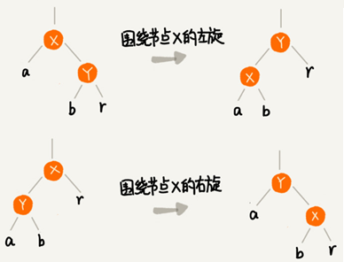

## 插入操作的平衡调整

**红黑树规定，插入的节点必须是红色的。而且，二叉查找树中新插入的节点都是放在叶子节点上**。

插入操作的平衡调整，有这样两种特殊情况：

- 如果插入节点的父节点是黑色的，无需任何调整。
- 如果插入的节点是根节点，那就直接把它改成黑色就可以了。

其他情况都需要进行调整，调整的过程包含两种基础的操作：**左右旋转**和**改变颜色**。

红黑树的平衡调整是一个迭代的过程。正在被处理的节点叫**关注节点**，关注节点会随着不停地迭代处理，而不断发生变化，最开始的关注节点就是新插入的节点。

新节点插入之后，如果红黑树的平衡被打破一般会有下面三种情况。只需要根据每种情况采取对应的策略去调整，然后不停的迭代，就可以让红黑树继续符合定义从而保持平衡。

下面把父节点的兄弟节点称为**叔叔节点**，父节点的父节点称为**祖父节点**。

### **CASE 1：关注节点 a的叔叔节点 d 是红色**

- 将关注节点 a 的父节点 b、叔叔节点 d 都设置成黑色；
- 将关注节点 a 的祖父节点 c 设置成红色；
- 关注节点变成 a 的祖父节点 c；
- 跳到 CASE 2 或者 CASE 3。

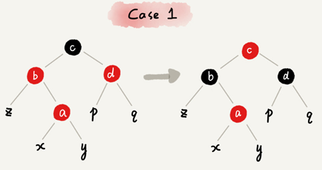

### CASE 2：关注节点 a的叔叔节点 d 是黑色，而且节点 a是其父节点的右子节点：

- 关注节点变成节点 a 的父节点 b；
- 围绕新的关注节点b 左旋；
- 跳到 CASE 3。

如果关注节点 的叔叔节点是黑色而且是右子节点，就将关注节点设置为关注节点的父节点并左旋，最后跳到 CASE 3。

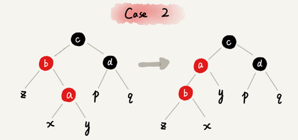

### **CASE 3：关注节点a的叔叔节点 d 是黑色，关注节点 a 是其父节点 b 的左子节点**：

- 围绕关注节点 a 的祖父节点 c 右旋；
- 将关注节点 a 的父节点 b、兄弟节点 c 的颜色互换。
- 调整结束。

如果关注节点 的叔叔节点是黑色而且是左子节点，就围绕关注节点的祖父节点右旋，最后将关注节点的父节点 与关注节点的兄弟节点 颜色互换。

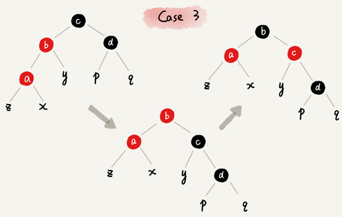

## 删除操作的平衡调整

删除操作的平衡调整分为两步，

初步调整：调整到每个节点到达其可达叶子节点的所有路径包含黑色节点的个数要相等

二次调整：调整到不存在相邻的两个红色节点

### 1. 初步调整

经过初步调整之后，为了保证满足红黑树定义的最后一条要求，有些节点会被标记成两种颜色，“红 - 黑”或者“黑 - 黑”。如果一个节点被标记为了“黑 - 黑”，那在计算黑色节点个数的时候，要算成两个黑色节点。

图示说明：如果一个节点既可以是红色也可以是黑色，用一半红色一半黑色来表示。如果一个节点是“红 - 黑”或者“黑 - 黑”，用左上角的一个小黑点来表示额外的黑色。

**CASE 1：要删除的节点 a只有一个子节点 b**

节点 a 只能是黑色，节点 b 也只能是红色，其他情况均不符合红黑树的定义。

节点b替换到节点 a 的位置并把节点 a 删除，然后将节点b的颜色设置为黑色。

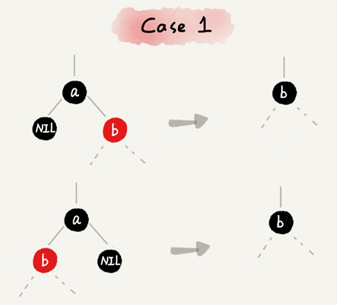

**CASE 2：要删除的节点 a 有两个非空子节点，并且它的后继节点就是节点 a 的右子节点 c**

节点 a 的后继节点是右子节点 c表示右子节点 c没有左子树。

- 将后继节点 c 替换到节点 a 的位置并把节点 a 删除；
- 节点 c 设置为跟节点 a 相同的颜色；
- 如果节点 c 是黑色，就给节点 c 的右子节点 d 多加一个黑色，节点 d 就成了“红 - 黑”或者“黑 - 黑”；
- 关注节点设置为节点 d，准备进行二次调整。

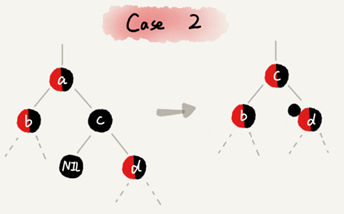

**CASE 3：要删除的节点 a有两个非空子节点，并且节点 a 的后继节点不是右子节点**

节点 a 的后继节点不是右子节点表示右子节点存在左子树。

- 将节点 a 的数据修改为后继节点 d的数据，然后按照CASE 1删除后继节点 d ；
- 如果节点a 是黑色，给节点 a 的右子节点 c 多加一个黑色，这个时候节点 c 就成了“红 - 黑”或者“黑 - 黑”；
- 关注节点设置为节点 c，准备进行二次调整。

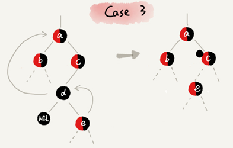

### 2. 二次调整

经过初步调整之后，关注节点变成了“红 - 黑”或者“黑 - 黑”节点。针对这个关注节点，需要再分四种情况来进行二次调整。二次调整是为了让红黑树中不存在相邻的红色节点。

**CASE 1：关注节点 a的兄弟节点 c 是红色**

- 围绕关注节点 a 的父节点 b 左旋；
- 关注节点 a 的父节点 b 和祖父节点 c 交换颜色；
- 关注节点不变，继续从四种情况中选择适合的规则来调整。

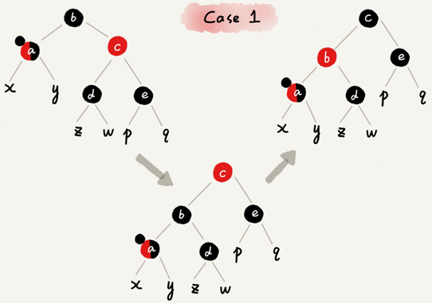

**CASE 2：关注节点 a的兄弟节点 c 是黑色，并且节点 c 的左右子节点 d、e 都是黑色**

- 将关注节点 a 的兄弟节点 c设置为红色；
- 从关注节点 a 中去掉一个黑色，这个时候节点 a 就是单纯的红色或者黑色；
- 给关注节点 a 的父节点 b 添加一个黑色，这个时候节点 b 就变成了“红 - 黑”或者“黑 - 黑”；
- 关注节点从 a 变成其父节点 b；
- 继续从四种情况中选择符合的规则来调整。

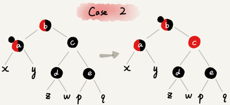

**CASE 3：关注节点a的兄弟节点 c 是黑色，c 的左子节点 d 是红色，c 的右子节点 e 是黑色**

- 围绕关注节点 a 的兄弟节点 c 右旋；
- 节点 c 和节点 d 交换颜色；
- 关注节点不变，跳到 CASE 4，继续调整。

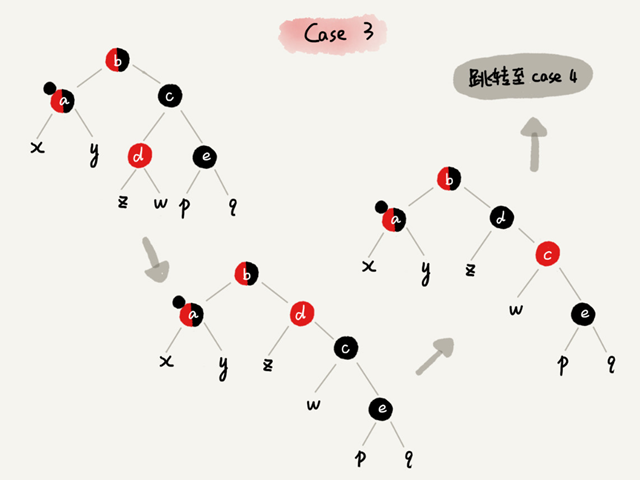

**CASE 4：关注节点 a 的兄弟节点 c 是黑色，并且兄弟节点c 的右子节点是红色的**

- 围绕关注节点 a 的父节点 b 左旋；
- 将关注节点 a 的兄弟节点 c 设置为跟关注节点 a 的父节点 b 相同的颜色；
- 将关注节点 a 的父节点 b 和叔叔节点 e 设置为黑色；
- 去掉关注节点 a 的一个黑色，节点 a 就变成了单纯的红色或者黑色；
- 调整结束。

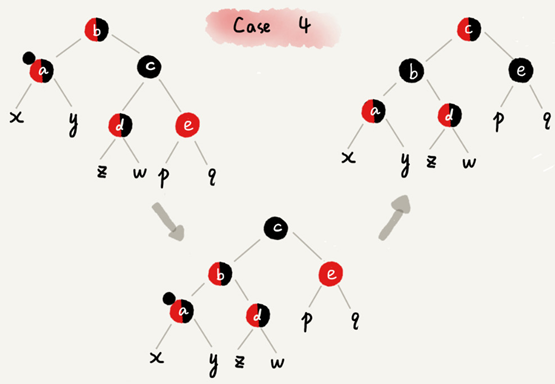

## 为什么红黑树要求叶子节点是黑色的空节点？

是为了实现起来方便。只要满足这一条要求，那在任何时刻，红黑树的平衡操作都可以归结为上面说到那几种情况。

假设红黑树不要求“叶子节点必须是黑色的空节点”，当插入节点的父节点也是红色的时候，两个红色的节点相邻，这个时候，红黑树的定义就被破坏了。这个时候，新插入的节点没有叔叔节点，三种情况下的平衡调整规则就都不适用的。

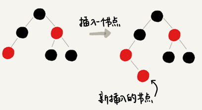

但如果把黑色的空节点都给它加上，就可以满足 CASE 2 ：

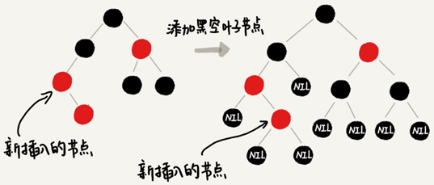

CASE 2 可以改为“关注节点 a的叔叔节点 d 是黑色或者叔叔节点 d 不存在， a是其父节点的右子节点”，但没有原来的规则简洁。

给红黑树添加黑色的空的叶子节点，并不会太浪费存储空间呢。因为在具体实现的时候，只需共用一个黑色的、空的叶子节点就行了。

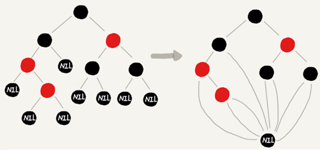


# 红黑树的python可视化

## 安装graphviz

下载地址：[http://www.graphviz.org/download/](http://www.graphviz.org/download/)

windows平台下可以选择：

- [Stable 2.38 Windows install packages](https://graphviz.gitlab.io/_pages/Download/Download_windows.html)

安装完成后将bin目录添加到环境变量中。

验证安装：

```bash
C:\Users\Administrator>dot -version
dot - graphviz version 2.38.0 (20140413.2041)
libdir = "D:\Program Files (x86)\Graphviz2.38\bin"
Activated plugin library: gvplugin_dot_layout.dll
Using layout: dot:dot_layout
Activated plugin library: gvplugin_core.dll
Using render: dot:core
Using device: dot:dot:core
The plugin configuration file:
        D:\Program Files (x86)\Graphviz2.38\bin\config6
                was successfully loaded.
    render      :  cairo dot fig gd gdiplus map pic pov ps svg tk vml vrml xdot
    layout      :  circo dot fdp neato nop nop1 nop2 osage patchwork sfdp twopi
    textlayout  :  textlayout
    device      :  bmp canon cmap cmapx cmapx_np dot emf emfplus eps fig gd gd2 gif gv ima
p imap_np ismap jpe jpeg jpg metafile pdf pic plain plain-ext png pov ps ps2 svg svgz tif
tiff tk vml vmlz vrml wbmp xdot xdot1.2 xdot1.4
    loadimage   :  (lib) bmp eps gd gd2 gif jpe jpeg jpg png ps svg
```

出现类似上面的版本信息，表示安装成功。

## 安装pygraphviz

下载地址：[https://github.com/CristiFati/Prebuilt-Binaries/tree/master/PyGraphviz](https://github.com/CristiFati/Prebuilt-Binaries/tree/master/PyGraphviz)

从上面地址下载指定python版本的pygraphviz，我下载的是64位系统python3.7版本：

[https://github.com/CristiFati/Prebuilt-Binaries/raw/master/PyGraphviz/pygraphviz-1.5-cp37-cp37m-win_amd64.whl](https://github.com/CristiFati/Prebuilt-Binaries/raw/master/PyGraphviz/pygraphviz-1.5-cp37-cp37m-win_amd64.whl)

然后在下载目录中运行以下命令即可安装成功：

```bash
pip install pygraphviz-1.5-cp37-cp37m-win_amd64.whl
```

## 红黑树python实现代码

```python
# -*- coding: UTF-8 -*-
from collections import deque
from typing import Optional

import pygraphviz as pgv


class TreeNode:
    def __init__(self, data=None, color=None):
        self.data = data
        assert color in ['r', 'b']
        self.color = 'red' if color == 'r' else 'black'

        self.left = None
        self.right = None
        self.parent = None

    def is_black(self) -> bool:
        return self.color == 'black'

    def is_red(self) -> bool:
        return self.color == 'red'

    def set_black(self):
        self.color = 'black'

    def set_red(self):
        self.color = 'red'


class RedBlackTree:

    def __init__(self, val_list=None):
        self.tree: Optional[TreeNode] = None
        self.black_leaf = TreeNode(color='b')  # 共用的黑色叶子节点
        if val_list is None:
            val_list = []
        for n in val_list:
            self.insert(n)

    def find(self, data) -> Optional[TreeNode]:
        if self.tree is None:
            return None
        p = self.tree
        while p != self.black_leaf:
            if data < p.data:
                p = p.left
            elif data > p.data:
                p = p.right
            else:
                return p
        return None

    def insert(self, data):
        new_node = TreeNode(data, 'r')  # 新插入的节点为红色
        # 根节点
        if self.tree is None:
            self.tree = new_node
        else:
            p = self.tree  # 根节点
            while p != self.black_leaf:  # 黑色叶子节点
                pp = p  # pp表示插入点的父节点
                if data < p.data:
                    p = p.left
                elif data > p.data:
                    p = p.right
                else:
                    # raise KeyError('val:{} already exists' % data)  # 该值已存在，插入失败
                    return
            if data < pp.data:
                pp.left = new_node
            else:
                pp.right = new_node
            new_node.parent = pp
        new_node.left = new_node.right = self.black_leaf
        # 插入后调整
        self._insert_fixup(new_node)

    def _insert_fixup(self, node):
        n: TreeNode = node  # 关注节点
        while n != self.tree and n.parent.is_red():
            # 父p 叔u 祖父g
            p = self.parent(n)
            u = self.bro(p)
            g = self.parent(p)

            if u.is_red():  # case 1 叔叔节点是红色
                p.set_black()  # 父节点设置成黑色
                u.set_black()  # 叔叔节点设置成黑色
                g.set_red()  # 祖父节点设置成红色
                n = g  # 关注节点变成祖父节点
                continue
            # 往下走，说明叔叔节点是黑色
            if p == g.left:  # 父节点为祖父节点的左子结点
                if n == p.right:  # case 2 关注节点是其父节点的右子节点
                    self.rotate_l(p)  # 围绕关注节点的父节点左旋
                    n, p = p, n  # 左旋后指针交换，关注节点设置为关注节点的父节点
                # case 3 关注节点是其父节点的左子节点
                p.set_black()  # 关注节点的父节点设置为黑色
                g.set_red()  # 关注节点的祖父节点设置为红色
                self.rotate_r(g)  # 围绕关注节点的祖父节点右旋
            else:  # 父节点为祖父节点的右子结点
                if n == p.left:  # case 2 关注节点是其父节点的左子节点
                    self.rotate_r(p)  # 围绕关注节点的父节点右旋
                    n, p = p, n  # 右旋后指针交换，关注节点设置为关注节点的父节点
                # case 3 关注节点是其父节点的右子节点
                p.set_black()  # 关注节点的父节点设置为黑色
                g.set_red()  # 关注节点的祖父节点设置为红色
                self.rotate_l(g)  # 围绕关注节点的祖父节点左旋

        # 根节点强制置黑，有两种情况根节点是红色：
        # 1. 新插入时是红色
        # 2. 经过case 1调整过后变红色
        self.tree.color = 'black'

    def delete(self, data):
        n: TreeNode = self.find(data)
        if n is None:
            return
        # n的子节点个数等于2
        if self.children_count(n) == 2:
            # 寻找n的后继s
            s = n.right
            while s.left != self.black_leaf:
                s = s.left
            n.data = s.data
            # 将删除n转化为删除s
            n = s
        # n的子节点个数小于2
        if n.left == self.black_leaf:
            c = n.right
        else:
            c = n.left
        self._transplant(n, c)
        # 删除的节点是黑色，需要调整
        if n.is_black():
            self._delete_fixup(c)
        return

    def _delete_fixup(self, node):
        n = node
        while n != self.tree and n.is_black():
            p = self.parent(n)
            b = self.bro(n)
            # 左右节点对称
            if p.left == n:
                if not b.is_black():
                    b.set_black()  # case 1
                    p.set_red()  # case 1
                    self.rotate_l(p)  # case 1
                    # new bro after rotate
                    b = self.bro(n)  # case 1

                if b.left.is_black() and b.right.is_black():
                    b.set_red()  # case 2
                    n = p  # case 2
                else:
                    if b.right.is_black():
                        b.left.set_black()  # case 3
                        b.set_red()  # case 3
                        self.rotate_r(b)  # case 3
                        # new bro after rotate
                        b = self.bro(n)  # case 3

                    # 注意，因为p可能是红或黑，所以不能直接赋值颜色，只能copy
                    b.color = p.color  # case 4
                    p.set_black()  # case 4
                    b.right.set_black()  # case 4
                    self.rotate_l(p)  # case 4
                    # trick, 调整结束跳出while
                    n = self.tree  # case 4
            else:
                if not b.is_black():
                    b.set_black()  # case 1
                    p.set_red()  # case 1
                    self.rotate_r(p)  # case 1
                    # new bro after rotate
                    b = self.bro(n)  # case 1

                if b.left.is_black() and b.right.is_black():
                    b.set_red()  # case 2
                    n = p  # case 2
                else:
                    if b.left.is_black():
                        b.right.set_black()  # case 3
                        b.set_red()  # case 3
                        self.rotate_l(b)  # case 3
                        # new bro after rotate
                        b = self.bro(n)  # case 3

                    # 注意，因为p可能是红或黑，所以不能直接赋值颜色，只能copy
                    b.color = p.color  # case 4
                    p.set_black()  # case 4
                    b.left.set_black()  # case 4
                    self.rotate_r(p)  # case 4
                    # trick, 调整结束跳出while
                    n = self.tree  # case 4
        # 将n设为黑色，从上面while循环跳出，情况有两种
        # 1. n是根节点，直接无视附加的黑色
        # 2. n是红色的节点，则染黑
        n.set_black()

    def _transplant(self, n1, n2):
        """
        节点移植， n2 -> n1
        :param n1: 原节点
        :param n2: 移植节点
        :return:
        """
        if n1 == self.tree:
            if n2 != self.black_leaf:
                self.tree = n2
                n2.parent = None
            else:
                self.tree = None  # 只有删除根节点时会进来
        else:
            p = self.parent(n1)
            if p.left == n1:
                p.left = n2
            else:
                p.right = n2
            n2.parent = p

    def rotate_l(self, node):
        if node is None:
            return
        if node.right is self.black_leaf:
            return

        p = self.parent(node)
        x = node
        y = node.right

        # node为根节点时，p为None，旋转后要更新根节点指向
        if p is not None:
            if x == p.left:
                p.left = y
            else:
                p.right = y
        else:
            self.tree = y

        x.parent, y.parent = y, p

        if y.left != self.black_leaf:
            y.left.parent = x

        x.right, y.left = y.left, x

    def rotate_r(self, node):
        if node is None:
            return

        if node.left is self.black_leaf:
            return

        p = self.parent(node)
        x = node
        y = node.left

        # 同左旋
        if p is not None:
            if x == p.left:
                p.left = y
            else:
                p.right = y
        else:
            self.tree = y

        x.parent, y.parent = y, p

        if y.right is not None:
            y.right.parent = x

        x.left, y.right = y.right, x

    @staticmethod
    def bro(node):
        """
        获取兄弟节点
        """
        if node is None or node.parent is None:
            return None
        else:
            p = node.parent
            if node == p.left:
                return p.right
            else:
                return p.left

    @staticmethod
    def parent(node):
        """
        获取父节点
        """
        if node is None:
            return None
        else:
            return node.parent

    def children_count(self, node):
        """
        获取子节点个数
        """
        return 2 - [node.left, node.right].count(self.black_leaf)

    def draw_img(self, img_name='Red_Black_Tree.png'):
        """用pygraphviz画红黑树"""
        if self.tree is None:
            return

        tree = pgv.AGraph(directed=True, strict=True)

        queue = deque([self.tree])
        num = 0
        while queue:
            e = queue.popleft()
            if e != self.black_leaf:  # 黑色叶子的连线由各个节点自己画
                tree.add_node(e.data, color=e.color, fontcolor="white", style="filled",
                              fontname="Microsoft YaHei", shape="circle", margin=0)
                for c in [e.left, e.right]:
                    queue.append(c)
                    if c != self.black_leaf:
                        tree.add_edge(e.data, c.data, color="blue")
                    else:
                        num += 1
                        tree.add_node("nil%s" % num, label="Nil", color="black", fontcolor="white", style="filled",
                                      fontname="Microsoft YaHei", shape="circle", margin=0)
                        tree.add_edge(e.data, "nil%s" % num, color="blue")

        tree.graph_attr['epsilon'] = '0.01'
        tree.layout('dot')
        tree.draw(img_name)


if __name__ == '__main__':
    rbt = RedBlackTree()

    nums = list(range(1, 20))
    for num in nums:
        rbt.insert(num)

    search_num = 7
    n = rbt.find(search_num)
    if n:
        print(n.data)
    else:
        print('node {} not found'.format(search_num))

    rbt.delete(4)

    rbt.draw_img()

```

## 红黑树可视化效果

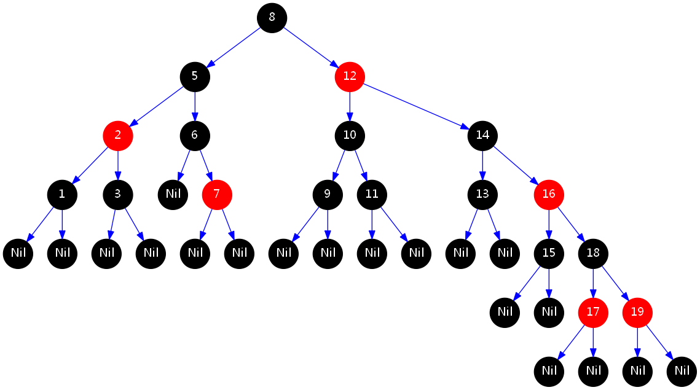

