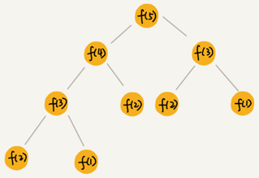
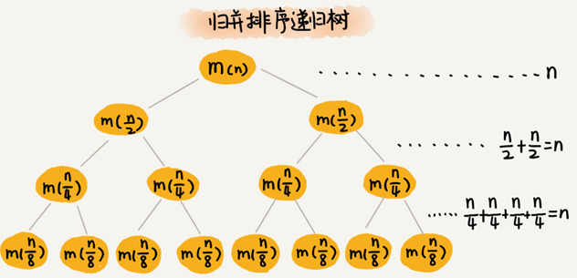
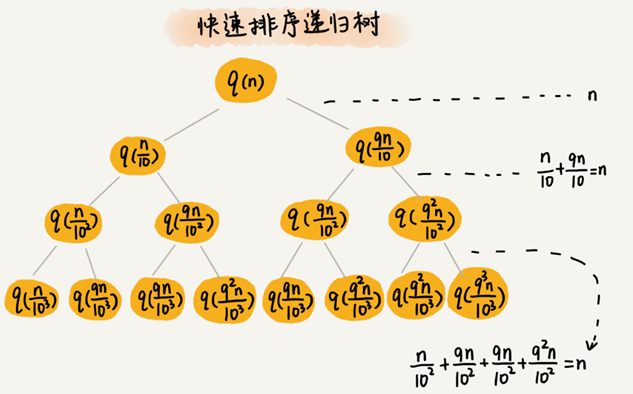
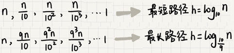
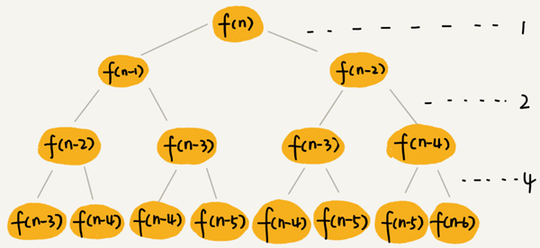
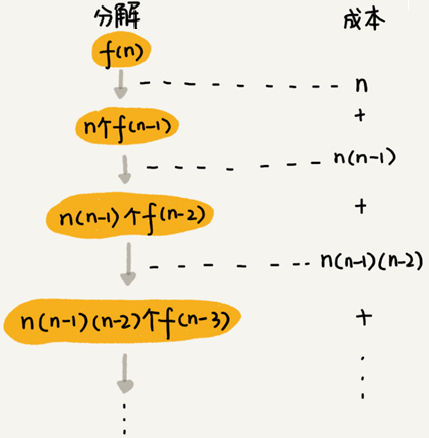
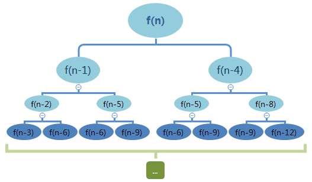

## 递归树与时间复杂度分析

有些代码比较适合用递推公式来分析，比如归并排序的时间复杂度、快速排序的最好情况时间复杂度；有些比较适合采用递归树来分析，比如快速排序的平均时间复杂度。而有些可能两个都不怎么适合使用，比如二叉树的递归前中后序遍历。

一般递推公式都可以求解递归代码的时间复杂度，但是有些情况，比如快排的平均时间复杂度的分析，用递推公式会涉及非常复杂的数学推导，借助递归树来分析递归算法的时间复杂度就会比较简单。

递归的思想就是，将大问题分解为小问题来求解，然后再将小问题分解为小小问题。这样一层一层地分解，直到问题的数据规模被分解得足够小，不用继续递归分解为止。

如果把这个一层一层的分解过程画成图，它其实就是一棵树，这棵树就叫**递归树**。

下面是一棵斐波那契数列的递归树，节点里的数字表示数据的规模，一个节点的求解可以分解为左右子节点两个问题的求解。



## 递归树分析归并排序递归代码的时间复杂度

归并排序每次会将数据规模一分为二，画成递归树，就是下面这个样子：



因为每次分解都是一分为二，所以代价很低，我们把时间上的消耗记作常量 $1$。每一层归并操作消耗的时间总和是一样的，跟要排序的数据规模有关，我们把每一层归并操作消耗的时间记作 $n$。

假设这棵树的高度 $h$，那总的时间复杂度为$O(n∗h)$。

归并排序递归树是一棵满二叉树，满二叉树的高度大约是 $log_2n$，所以，归并排序递归实现的时间复杂度就是 $O(nlogn)$ 。

## 分析快速排序的时间复杂度

用递推公式来求解平均时间复杂度：

快速排序在最好情况下，每次分区都能一分为二，这个时候用递推公式 $T(n)=2T(\frac{n}{2})+n$ ,很容易就能推导出时间复杂度是$ O(nlogn)$ 。

假设平均情况下，每次分区之后两个分区的大小比例为 $1:k$。当 $k=9$时，如果用递推公式的方法来求解时间复杂度的话，递推公式就写成 $T(n)=T(\frac{n}{10})+T(\frac{9n}{10})+n$。

用这个递推公式推导时间复杂度，推导过程非常复杂。现在用递归树来分析这种情况下快速排序的平均情况时间复杂度：



快速排序的过程中，每次分区都要遍历待分区区间的所有数据，所以，每一层分区操作所遍历的数据的个数之和就是 $n$。假设递归树的高度 $h$，时间复杂度就是 $O(h∗n)$。

每次分区并不是均匀地一分为二，递归树并不是满二叉树。快速排序结束的条件就是待排序的小区间，大小为 1，也就是说叶子节点里的数据规模是 1。

从根节点 n 到叶子节点 1，递归树中最短的一个路径每次都乘以 $\frac{1}{10}$，最长的一个路径每次都乘以 $\frac{9}{10}$。通过计算可以得到，从根节点到叶子节点的最短路径是 $log_{10}n$，最长的路径是 $log_{\frac{10}{9}}n$。



遍历数据的个数总和介于 $n\ log_{10}n$ 和$n \ log_{\frac{10}{9}}n$之间。根据复杂度的大 O 表示法，对数复杂度的底数不管是多少，可以统一写成 $log\ n$，所以，当分区大小比例是 $1:9$时，快速排序的时间复杂度仍然是$O(nlog\ n)$。

如果 $k=99$，树的最短路径就是 $log_{100}n$，最长路径是 $log_{\frac{100}{99}}n$，所以总遍历数据个数介于 $nlog_{100}n$ 和 $nlog_{\frac{100}{99}}n$ 之间，时间复杂度也仍然是 $O(nlog\ n)$。

只要 $k$ 的值不随 $n$变化，是一个事先确定的常量，那快排的时间复杂度就是$O(nlog\ n)$。所以，从概率论的角度来说，快排的平均时间复杂度就是 $O(nlog\ n)$。

## 分析斐波那契数列的时间复杂度

斐波那契数列的递推实现代码实现代码：

```c
int f(int n) {
  if (n == 1) return 1;
  if (n == 2) return 2;
  return f(n-1) + f(n-2);
}
```

把上面的递归代码画成递归树，就是下面这个样子：



这棵递归树的高度是多少呢？

$f(n)$分解为 $f(n−1)$ 和 $f(n−2)$，每次数据规模都是 $−1$ 或者 $−2$，叶子节点的数据规模是 $1$ 或者 $2$。所以，从根节点走到叶子节点，每条路径是长短不一的。如果每次都是 $−1$，那最长路径大约就是 $n$；如果每次都是 $−2$，那最短路径大约就是 $\frac{n}{2}$。

每次分解之后的合并操作只需要一次加法运算，把这次加法运算的时间消耗记作 $1$。所以，从上往下，第一层的总时间消耗是 $1$，第二层的总时间消耗是 $2$，第三层的总时间消耗就是 $2^2$。依次类推，第 $k$ 层的时间消耗就是 $2^k−1$，那整个算法的总的时间消耗就是每一层时间消耗之和。

如果路径长度都为 $n$，那这个总和就是 $2^n−1$。
$$
1+2+\cdots+2^{n-1}=2^{n}-1
$$
如果路径长度都是 $\frac{n}{2}$ ，那整个算法的总的时间消耗就是 $2^{\frac{n}{2}}−1$。
$$
1+2+\cdots+2^{\frac{n}{2}-1}=2^{\frac{n}{2}}-1
$$
所以，这个算法的时间复杂度就介于 $O(2^n)$ 和 $O(2^{\frac{n}{2}})$ 之间，算法的时间复杂度是指数级的。

## 分析全排列的时间复杂度

“如何把n 个数据的所有排列都找出来”，这就是全排列的问题。

比如$1，2，3 $这样 3 个数据，有下面这几种不同的排列：

```
1, 2, 3
1, 3, 2
2, 1, 3
2, 3, 1
3, 1, 2
3, 2, 1
```

全排列问题可以用递归来实现：

如果确定了第一位数据，就变成了求解剩下 $n−1$ 个数据的排列问题。而第一位数据可以是 $n$ 个数据中的任意一个，因此它的取值就有 $n$ 种情况。所以，“$n$ 个数据的排列”问题，就可以分解成 $n$ 个“$n−1$ 个数据的排列”的子问题。

递推公式：

```
假设数组中存储的是 1，2， 3...n。
        
f(1,2,...n) = {第一位是 1, f(n-1)} + {第一位是 2, f(n-1)} +...+{第一位是 n, f(n-1)}。
```

python实现代码：

```python
def permutation(chars, k):
    """
    :param chars: 字符串序列
    :param k: 未处理的字符串的起始位置
    :return:
    """
    if k == len(chars) - 1:
        for i in range(len(chars)):
            print(chars[i], end="")
        print(end=",")
    for i in range(k, len(chars)):
        chars[i], chars[k] = chars[k], chars[i]
        permutation(chars, k + 1)
        chars[i], chars[k] = chars[k], chars[i]
```

画出递归树：



第一层分解有 $n$ 次交换操作，第二层有 $n$ 个节点，每个节点分解需要 $n−1$ 次交换，所以第二层总的交换次数是 $n∗(n−1)$。第三层有 $n∗(n−1)$ 个节点，每个节点分解需要 $n−2$ 次交换，所以第三层总的交换次数是 $n∗(n−1)∗(n−2)$。

以此类推，第 kk 层总的交换次数就是 $n∗(n−1)∗(n−2)∗…∗(n−k+1)$。最后一层的交换次数就是 $n∗(n−1)∗(n−2)∗…∗2∗1$。每一层的交换次数之和就是总的交换次数。

$$
n + n*(n-1) + n*(n-1)*(n-2) +... + n*(n-1)*(n-2)*...*2*1
$$
最后一个数$n∗(n−1)∗(n−2)∗…∗2∗1$ 等于 $n!$，而前面的 $n−1$ 个数都小于最后一个数，所以，总和肯定小于 $n∗n!$，全排列的递归算法的时间复杂度在 $O(n!)$到 $O(n∗n!)$之间，阶乘级。


## 分析细胞分裂问题的时间复杂度

1个细胞的生命周期是3小时，1小时分裂一次。求n小时后，容器内有多少细胞？时间复杂度是多少？


细胞的生命周期是三个小时，一个小时后，第一个细胞分裂，此时细胞总数变成 2，这个时候其中一个细胞的生存时间变成了 1，另外一个刚分裂出来的是 0，下面简单表示一下分裂进程（-1 表示死亡）
时间 细胞状态 (生存时间) 细胞总数

```
1 0 												  count=2
2 0 1 0 											  count=4
-1 0 1 0 2 0 1 0 									  count=7
1 0 2 0 1 0 -1 0 1 0 2 0 1 0 1 0 					  count=13
-1 -1 2 2 2 2 1 1 1 1 1 1 1 0 0 0 0 0 0 0 0 0 0 0 0 0 count=24
```

即：
f0 = 1；f1 = 2；f2 = 4
f3 = 7；f4 =13；f5 = 24

第4个小时死亡的细胞是三小时前新出生的细胞$f(0)$，

当n>=4时，第n个小时死亡的细胞是$f(n-4)$，

有递推式：
$$
f(n)=\begin{cases}
        1, &  n<=0 \\
        2, &  n=1 \\
        4, &  n=2 \\
        7, &  n=3 \\
        2 * f(n - 1) - f(n - 4), & n>=4
     \end{cases}
$$
```python
def cell_division(n):
    if n <= 0: return 1
    if n == 1: return 2
    if n == 2: return 4
    if n == 3: return 7
    return 2 * cell_division(n - 1) - cell_division(n - 4)

for i in range(10):
    print("f(%s)=%s" % (i, cell_division(i)))
```

递归树:



$f(n)$分解为 $f(n−1)$ 和 $f(n−4)$，每次数据规模都是 ​−1​或者−4​，叶子节点的数据规模是 ​1、2、4或7。

最长路径大约是n，最短路径大约是 n/4。

每次分解之后的只需要一次乘法和一次加法运算，把这次运算的时间消耗记作 $1$。所以，从上往下，第一层的总时间消耗是 $1$，第二层的总时间消耗是 $2$，第三层的总时间消耗就是 $2^2$。依次类推，第 $k$ 层的时间消耗就是 $2^k−1$，那整个算法的总的时间消耗就是每一层时间消耗之和。

如果路径长度都为 $n$，那这个总和就是 $2^n−1$。
$$
1+2+\cdots+2^{n-1}=2^{n}-1
$$
如果路径长度都是 $\frac{n}{4}$ ，那整个算法的总的时间消耗就是 $2^{\frac{n}{4}}−1$。
$$
1+2+\cdots+2^{\frac{n}{4}-1}=2^{\frac{n}{4}}-1
$$
所以，这个算法的时间复杂度就介于 $O(2^n)$ 和 $O(2^{\frac{n}{4}})$ 之间，算法的时间复杂度是指数级的。

