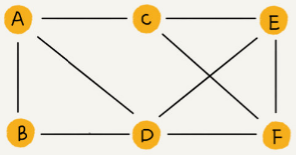
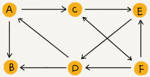
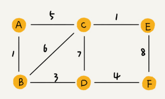
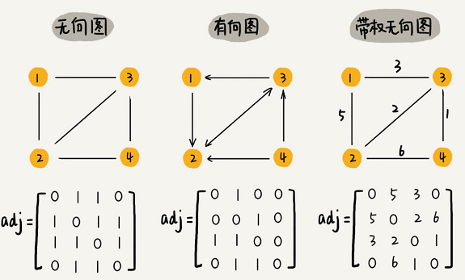
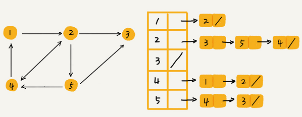
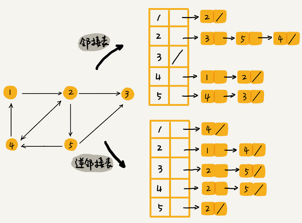
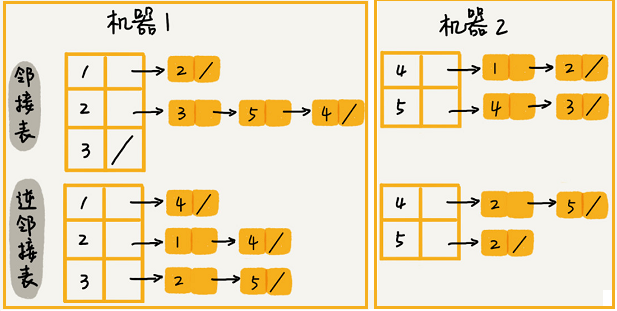

# 图

# 图的概念

**图**（Graph）和树比起来，是一种更加复杂的非线性表结构。

## 顶点&边

树中的元素称为节点，图中的元素叫作**顶点**（vertex）。图一个顶点可以与任意其他顶点建立连接关系，这种建立的关系叫**边**（edge）。

在微信中，可以把每个用户看作一个顶点，两个用户之间互加好友，那就在两者之间建立一条边。所以，整个微信的好友关系就可以用一张图来表示。其中，每个用户有多少个好友，对应到图中，就叫作顶点的**度**（degree），就是跟顶点相连接的边的条数。

## 有向图&无向图

微博允许单向关注，用户 A 关注了用户 B，但用户 B 可以不关注用户 A。如果用户 A 关注了用户 B，就在图中画一条从 A 到 B 的带箭头的边，来表示边的方向。如果用户 A 和用户 B 互相关注了，那我们就画一条从 A 指向 B 的边，再画一条从 B 指向 A 的边。

这种边有方向的图叫作**“有向图”**。边没有方向的图就叫作**“无向图”**。

无向图中的“度”表示一个顶点有多少条边，在有向图中度分为**入度**（In-degree）和**出度**（Out-degree）。

顶点的入度，表示有多少条边指向这个顶点；顶点的出度，表示有多少条边是以这个顶点为起点指向其他顶点。

对应到微博的例子，入度就表示有多少粉丝，出度就表示关注了多少人。

## 带权图

QQ还记录了两个用户之间的亲密度，如果两个用户经常往来，那亲密度就比较高；如果不经常往来，亲密度就比较低。在**带权图**（weighted graph）中，每条边都有一个权重（weight），可以通过这个权重来表示 QQ 好友间的亲密度。

# 图的存储

## 邻接矩阵存储方法

**邻接矩阵**（Adjacency Matrix）的底层依赖一个二维数组。

对于无向图来说，如果顶点 i 与顶点 j 之间有边，就将$A[i][j]$和$A[j][i]$标记为 1；

对于有向图来说，如果顶点 i 指向顶点 j 就将$A[i][j]$标记为1。同理，如果顶点 j 指向顶点 i 就将$A[j][i]$标记为 1。对于带权图，数组中就存储相应的权重。

邻接矩阵的底层依赖一个二维数组。对于无向图来说，如果顶点 i 与顶点 j 之间有边，我们就将 $A[i][j]$ 和 $A[j][i]$ 标记为 1；对于有向图来说，如果顶点 i 到顶点 j 之间，有一条箭头从顶点 i 指向顶点 j 的边，那我们就将 $A[i][j]$ 标记为 1。同理，如果有一条箭头从顶点 j 指向顶点 i 的边，我们就将 $A[j][i]$ 标记为 1。对于带权图，数组中就存储相应的权重。

用邻接矩阵来表示一个图，虽然简单、直观，但是比较浪费存储空间。为什么这么说呢？

对于无向图来说，如果 $A[i][j]$ 等于 1，那 $A[j][i]$ 也肯定等于 1，只需要存储上三角矩阵或下三角矩阵可以节省一半的空间。

**稀疏图**（Sparse Matrix）是指每个顶点的边不多的图，用邻接矩阵的存储方法会非常浪费空间。

比如微信有好几亿的用户，对应到图上有好几亿的顶点，但每个用户的好友一般也就三五百个。如果用邻接矩阵来存储，那绝大部分的存储空间都被浪费了。

但邻接矩阵的存储方式简单、直接，因为基于数组，所以在获取两个顶点的关系时，就非常高效。其次用邻接矩阵的方式存储图，可以将很多图的运算转换成矩阵之间的运算。比如求解最短路径的[Floyd-Warshall 算法](https://zh.wikipedia.org/wiki/Floyd-Warshall算法)，就是利用矩阵循环相乘若干次得到结果。

## 邻接表存储方法

**邻接表**（Adjacency List）的每个顶点对应一条链表，链表中存储的是与这个顶点相连接的其他顶点。

无向图可以看作每条边都是双方向的有向图。

邻接矩阵存储起来比较浪费空间，但是使用起来比较节省时间。相反，邻接表存储起来比较节省空间，但是使用起来就比较耗时间。这是时间、空间复杂度互换的设计思想，前者是空间换时间，后者是时间换空间。

上图邻接表的例子中，如果要确定是否存在一条从顶点 2 到顶点 4 的边，就要遍历顶点 2 对应的那条链表，看链表中是否存在顶点 4。当然如果链过长，可以将链表换成红黑树、跳表、散列表等来提高查找效率，还可以将链表改成有序动态数组，通过二分查找的方法来快速定位两个顶点之间否存在边。

## 如何存储微博、微信等社交网络中的好友关系？

假设需要支持下面这几个操作：

- 判断用户 A 是否关注了用户 B；
- 判断用户 A 是否是用户 B 的粉丝；
- 用户 A 关注用户 B；
- 用户 A 取消关注用户 B；
- 根据用户名称的首字母排序，分页获取用户的粉丝列表；
- 根据用户名称的首字母排序，分页获取用户的关注列表。

用两个邻接表来存储，一个邻接表存储某个用户关注了哪些用户，即用户的关注关系；另一个邻接表称为逆邻接表存储某个用户被哪些用户关注，即用户的粉丝列表。

如果要查找某个用户关注了哪些用户，在邻接表中查找即可；如果要查找某个用户被哪些用户关注了，从逆邻接表中查找即可。

因为需要按照用户名称的首字母排序，分页来获取用户的粉丝列表或者关注列表，用跳表替换邻接表中的链表比较合适。

跳表插入、删除、查找时间复杂度都是O(logn)，空间复杂度上是 O(n)。最重要的一点，跳表中存储的数据本来就是有序的了，分页获取粉丝列表或关注列表，就非常高效。

如果对于小规模的数据，可以将整个社交关系存储在内存中。

如果对于大规模的数据，可以通过哈希算法等数据分片方式，将邻接表存储在不同的机器上。

例如：

当要查询顶点与顶点关系的时候，就利用同样的哈希算法，先定位顶点所在的机器再在相应的机器上查找。

另外一种解决思路，就是利用外部存储（比如硬盘），数据库是经常用来持久化存储关系数据的

用下面这张表来存储这样一个图。为了高效地支持前面定义的操作，可以在表上建立这两列都建立索引。

| user_id | follower_id |
| :-----: | :---------: |
|  **1**  |    **4**    |
|  **2**  |    **1**    |
|  **2**  |    **4**    |
|  **3**  |    **2**    |
|  **3**  |    **5**    |
|  **4**  |    **2**    |
|  **4**  |    **5**    |
|  **5**  |    **2**    |

