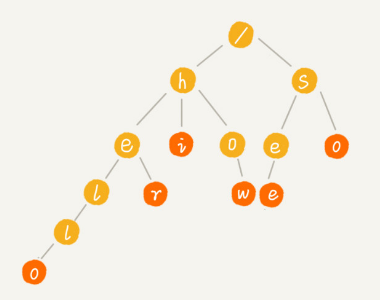
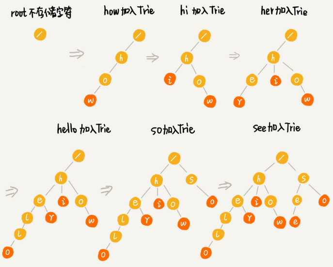
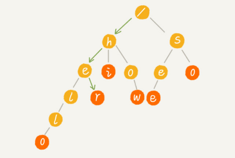
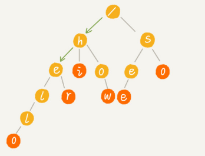
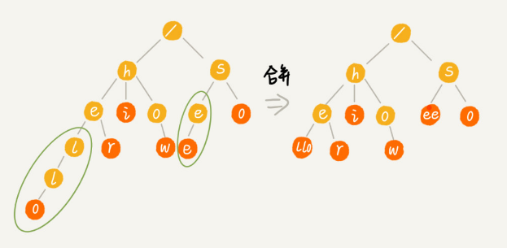
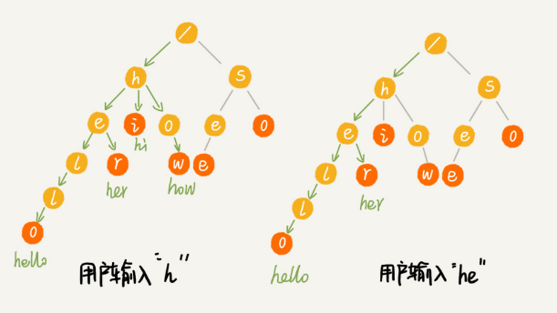

## “Trie 树”的介绍

Trie 树也叫“字典树”，是一种专门处理字符串匹配的树形结构，用来解决在一组字符串集合中快速查找某个字符串的问题。

Trie 树特有的优点，决定它特别适合做搜索引擎的搜索关键词提示功能：在搜索引擎的搜索框中，输入要搜索的文字的某一部分的时候，搜索引擎就会自动弹出下拉框，里面是各种关键词提示。可以直接从下拉框中选择你要搜索的东西，而不用把所有内容都输入进去，一定程度上节省了我们的搜索时间。

Trie 树到底长什么样子：

假设有 6 个字符串分别是：how，hi，her，hello，so，see，组织成 Trie 树的结构，之后每次查找，都是在 Trie 树中进行匹配查找。

**Trie 树的本质，就是利用字符串之间的公共前缀，将重复的前缀合并在一起**。最后构造出来的就是下面这个图中的样子：



其中，根节点不包含任何信息。每个节点表示一个字符串中的字符，从根节点到红色节点的一条路径表示一个字符串（红色节点并不都是叶子节点）。

Trie 树构造的过程：

 

在 Trie 树中查找字符串的时候，比如查找字符串“her”，先将要查找的字符串分割成单个的字符 h，e，r，然后从 Trie 树的根节点开始匹配。下图中绿色的路径就是在 Trie 树中匹配的路径。



要查找字符串“he”，先将要查找的字符串分割成单个的字符 h，e。然后从根节点开始沿着某条路径来匹配，下图绿色的路径就是“he”匹配的路径，但路径最后一个节点“e”并不是红色的（“he”是某个字符串的前缀子串），说明未匹配。



## 实现Trie 树

Trie 树主要有两个操作：

1. 将字符串插入到 Trie 树中
2. 在 Trie 树中查询一个字符串

Trie 树是一个多叉树，经典的存储方式是通过一个下标与字符一一映射的数组，来存储子节点的指针。

```java
class BinaryTreeNode {
  char data;
  BinaryTreeNode left;
  BinaryTreeNode right;  
}
```

假设字符串中只有从 a 到 z 这 26 个小写字母，可以设置一个固定大小为26的数组，下标 0 位置存储指向子节点 a 的指针，下标1位置存储指向子节点 b 的指针，以此类推，下标为 25 的位置，存储指向的子节点 z 的指针。不存在的字符对应下标的位置存储 null。

```java
class TrieNode {
  char data;
  TrieNode children[26];
  boolean isEndingChar;
}
```

在 Trie 树中查找字符串的时候，就可以通过字符的ASCII码减去“a”的 ASCII 码，迅速找到匹配的子节点的指针。比如，d的ASCII码减去a的ASCII码就是 3，那子节点 d 的指针就存储在数组中下标为 3 的位置中。

```java
public class Trie {
  private TrieNode root = new TrieNode('/'); // 存储无意义字符
 
  // 往 Trie 树中插入一个字符串
  public void insert(char[] text) {
    TrieNode p = root;
    for (int i = 0; i < text.length; ++i) {
      int index = text[i] - 'a';
      if (p.children[index] == null) {
        TrieNode newNode = new TrieNode(text[i]);
        p.children[index] = newNode;
      }
      p = p.children[index];
    }
    p.isEndingChar = true;
  }
 
  // 在 Trie 树中查找一个字符串
  public boolean find(char[] pattern) {
    TrieNode p = root;
    for (int i = 0; i < pattern.length; ++i) {
      int index = pattern[i] - 'a';
      if (p.children[index] == null) {
        return false; // 不存在 pattern
      }
      p = p.children[index];
    }
    return p.isEndingChar;
  }
 
  public class TrieNode {
    public char data;
    public TrieNode[] children = new TrieNode[26];
    public boolean isEndingChar = false;
    public TrieNode(char data) {
      this.data = data;
    }
  }
}
```

python代码：

```python
class TrieNode:
    def __init__(self, data: str):
        self.data = data
        self.children = [None] * 26
        self.is_ending_char = False


class Trie:
    def __init__(self):
        self.root = TrieNode("/")

    def insert(self, text: str) -> None:
        node = self.root
        for index, char in map(lambda x: (ord(x) - ord("a"), x), text):
            if node.children[index] is None:
                node.children[index] = TrieNode(char)
            node = node.children[index]
        node.is_ending_char = True

    def find(self, pattern: str) -> bool:
        p = self.root
        for index in map(lambda x: ord(x) - ord("a"), pattern):
            if p.children[index] is None: return False
            p = p.children[index]
        return p.is_ending_char
```

构建 Trie 树的过程，需要扫描所有的字符串，时间复杂度是 O(n)（n 表示所有字符串的长度和）。

假设字符串长度是 k，Trie树查找某个字符串只需要比对大约 k 个节点，所以在Trie树查找某个字符串的时间复杂度是 O(k)，k 表示要查找的字符串的长度。


## Trie 树的内存消耗

上面 Trie 树的实现，如果字符串中包含从 a 到 z 这 26 个字符，每个节点要维护一个长度为 26 的数组，每个数组存储一个 8 字节指针（或者是 4 字节，这个大小跟 CPU、操作系统、编译器等有关）。那每个节点就会额外需要 26*8=208 个字节。

如果字符串中不仅包含小写字母，还包含大写字母、数字、甚至是中文，那需要的存储空间就更多了。

针对这个问题可以稍微牺牲一点查询的效率，将每个节点中的数组换成有序数组、跳表、散列表、红黑树等数据结构，来存储一个节点的子节点指针。

将数组替换为有序数组的python实现：

```python
class TrieNode:
    def __init__(self, c):
        self.data = c
        # 使用有序数组，降低空间消耗，支持更多字符
        self.children = []
        self.is_ending_char = False

    def insert_child(self, c):
        """插入一个子节点"""
        node = TrieNode(c)
        idx = self.binary_search(c)
        if idx < 0: idx = -(idx + 1)
        self.children.insert(idx, node)
        return node

    def binary_search(self, c):
        """二分查找，找到有序数组的插入位置"""
        start, end = 0, len(self.children) - 1
        v = ord(c)
        while start <= end:
            mid = (start + end) >> 1
            if v == ord(self.children[mid].data):
                return mid
            elif v < ord(self.children[mid].data):
                end = mid - 1
            else:
                start = mid + 1
        return -(start + 1)  # 找不到返回-插入点-1

    def has_child(self, c):
        return self.get_child(c) is not None

    def get_child(self, c):
        """搜索子节点并返回"""
        idx = self.binary_search(c)
        if idx >= 0:
            return self.children[idx]
        else:
            return None  # 找不到返回None

    def __repr__(self):
        return 'node value: %s' % self.data + '\n' \
               + 'children:%s' % self.children


class Trie:
    def __init__(self, text_list=None):
        if text_list is None:
            text_list = []
        self.root = TrieNode(None)
        self.insert_list(text_list)

    def insert_list(self, text_list):
        """批量插入节点"""
        for text in text_list:
            self.insert(text)

    def insert(self, text: str):
        node = self.root
        for char in text:
            tmp = node.get_child(char)
            if tmp is None: tmp = node.insert_child(char)
            node = tmp
        node.is_ending_char = True

    def find(self, pattern: str) -> bool:
        p = self.root
        for char in pattern:
            child = p.get_child(char)
            if child is None: return False
            p = child
        return p.is_ending_char
```


还同时可以使用**缩点优化**，就是对只有一个子节点的节点，而且此节点不是一个串的结束节点，可以将此节点与子节点合并：



## Trie树的适用场景

关于字符串的匹配问题，对于精确匹配查找，这种问题更适合用散列表或者红黑树来解决。

对于查找前缀匹配的字符串，使用Trie树效率会更高。例如自动输入补全，比如输入法自动补全功能、IDE 代码编辑器自动补全功能、浏览器网址输入的自动补全功能等等。

例如实现搜索关键词的提示功能：

假设关键词库由用户的热门搜索关键词组成，将这个词库构建成一个 Trie 树。当用户输入其中某个单词的时候，把这个词作为一个前缀子串在 Trie 树中匹配。

假设词库里只有 hello、her、hi、how、so、see 这 6 个关键词。当用户输入了字母 h 的时候，就把以 h 为前缀的 hello、her、hi、how 展示在搜索提示框内。当用户继续键入字母 e 的时候，就把以 he 为前缀的 hello、her 展示在搜索提示框内。



其他问题：

- 如果词库中有很多关键词，在搜索提示的时候，用户输入关键词，作为前缀在 Trie 树中可以匹配的关键词也有很多，如何选择展示哪些内容呢？
- 像 Google 这样的搜索引擎，用户单词拼写错误的情况下，Google 还是可以使用正确的拼写来做关键词提示，这个又是怎么做到的呢？


