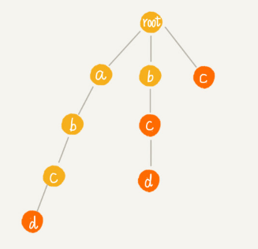
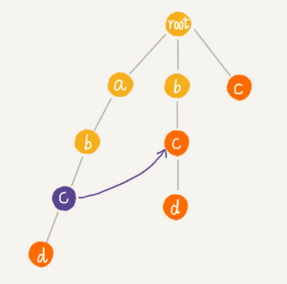
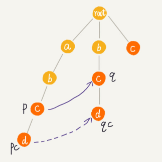
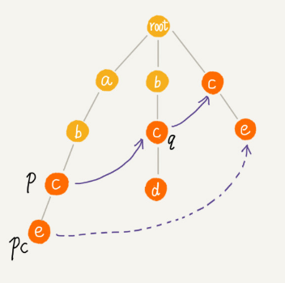
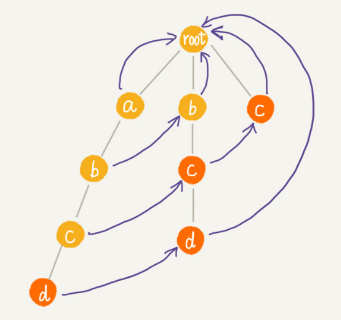
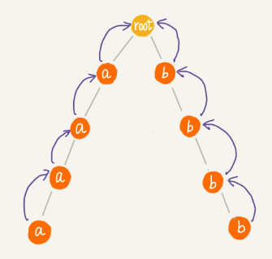

# AC自动机

很多支持用户发表文本内容的网站，比如 BBS，大都会有敏感词过滤功能，用来过滤掉用户输入的一些淫秽、反动、谩骂等内容。

实际上，这些功能最基本的原理就是字符串匹配算法，也就是通过维护一个敏感词的字典，当用户输入一段文字内容之后，通过字符串匹配算法，来查找用户输入的这段文字，是否包含敏感词。如果有，就用“***”把它替代掉。

对于访问量巨大的网站来说，比如淘宝，用户每天的评论数有几亿、甚至几十亿。对敏感词过滤系统的性能要求就要很高。**那如何才能实现一个高性能的敏感词过滤系统呢**？AC自动机这种**多模式串匹配算法**是这个系统的原型。


## 基于单模式串和Trie树实现的敏感词过滤

**单模式串匹配算法**有 BF 算法、RK 算法、BM 算法、KMP 算法。

**多模式串匹配算法**有 Trie 树。

单模式串匹配算法，是在一个模式串和一个主串之间进行匹配，也就是，在一个主串中查找**一个**模式串。

多模式串匹配算法，就是在多个模式串和一个主串之间做匹配，也就是，在一个主串中查找**多个**模式串。

与单模式匹配算法相比，多模式匹配算法只需要扫描一遍主串，就能在主串中一次性查找多个模式串是否存在，从而大大提高匹配效率。


Trie 树就是一种多模式串匹配算法，用 Trie 树即可实现敏感词过滤功能：

对敏感词字典进行预处理，构建成 Trie 树结构，如果敏感词字典动态更新了，比如删除、添加了一个敏感词，那只需要动态更新一下 Trie 树就可以了。

当用户输入一个文本内容后，把用户输入的内容作为主串，从第一个字符（假设是字符 C）开始，在 Trie 树中匹配。当匹配到 Trie 树的叶子节点，或者中途遇到不匹配字符的时候，将主串的开始匹配位置后移一位，也就是从字符 C 的下一个字符开始，重新在 Trie 树中匹配。

基于 Trie 树的这种处理方法，有点类似单模式串匹配的 BF 算法。KMP 算法对 BF 算法进行改进，引入了 next 数组，让匹配失败时，尽可能将模式串往后多滑动几位。借鉴单模式串的优化改进方法，对多模式串 Trie 树进行改进的算法就是 AC 自动机。

## AC 自动机

AC 自动机算法，全称是 Aho-Corasick 算法。

**AC 自动机实际上就是在 Trie 树之上，加了类似 KMP 的 next 数组，只不过此处的 next 数组是构建在树上罢了**。如果代码表示，就是下面这个样子：

```java
public class AcNode {
  public char data; 
  public AcNode[] children = new AcNode[26]; // 字符集只包含 a~z 这 26 个字符
  public boolean isEndingChar = false; // 结尾字符为 true
  public int length = -1; // 当 isEndingChar=true 时，记录模式串长度
  public AcNode fail; // 失败指针
  public AcNode(char data) {
    this.data = data;
  }
}
```

python代码：

```python
class ACNode:
    def __init__(self, data: str):
        self.data = data
        self.children = [None] * 26  # 字符集只包含 a~z 这 26 个字符
        self.is_ending_char = False  # 结尾字符为 true
        self.length = -1  # 当 isEndingChar=true 时，记录模式串长度
        self.fail = None  # 失败指针
```

AC 自动机的构建，包含两个操作：

- 将多个模式串构建成 Trie 树；
- 在Trie树上构建失败指针（相当于KMP中的失效函数 next 数组）。

**构建好 Trie 树之后，如何在它之上构建失败指针？**

有 4 个模式串 c，bc，bcd，abcd；主串是 abcd。

 

Trie 树中的每一个节点都有一个失败指针，它的作用和构建过程，跟 KMP 算法中的 next 数组极其相似。

例如下图中abc的c节点的失败指针指向abc的最长可匹配后缀子串bc的最后一个节点c。

 

树中相同深度的节点放到同一层，那么某个节点的失败指针只有可能出现在它所在层的上一层。

求某个节点的失败指针，可以通过已经求得的、深度更小的那些节点的失败指针来推导。失败指针的构建过程，是一个按层遍历树的过程。

首先 root 的失败指针为 NULL，也就是指向自己。

假设节点 p 的失败指针指向节点 q，然后看节点 p 的子节点 pc 对应的字符，是否也可以在节点 q 的子节点中找到。如果 pc和qc对应的字符相同，则将节点 pc 的失败指针指向节点 qc。

我们假设节点 p 的失败指针指向节点 q，我们看节点 p 的子节点 pc 对应的字符，是否也可以在节点 q 的子节点中找到。如果找到了节点 q 的一个子节点 qc，对应的字符跟节点 pc 对应的字符相同，则将节点 pc 的失败指针指向节点 qc。



如果节点 q 中没有子节点的字符等于节点 pc 包含的字符，则令 q=q->fail（fail 表示失败指针），继续上面的查找，直到 q 是 root 为止，如果还没有找到相同字符的子节点，就让节点 pc 的失败指针指向 root。



构建失败指针的java描述代码：

```java
public void buildFailurePointer() {
  Queue<AcNode> queue = new LinkedList<>();
  root.fail = null;
  queue.add(root);
  while (!queue.isEmpty()) {
    AcNode p = queue.remove();
    for (int i = 0; i < 26; ++i) {
      AcNode pc = p.children[i];
      if (pc == null) continue;
      if (p == root) {
        pc.fail = root;
      } else {
        AcNode q = p.fail;
        while (q != null) {
          AcNode qc = q.children[pc.data - 'a'];
          if (qc != null) {
            pc.fail = qc;
            break;
          }
          q = q.fail;
        }
        if (q == null) {
          pc.fail = root;
        }
      }
      queue.add(pc);
    }
  }
}
```

python代码：

```python
    def build_failure_pointer(self):
        queue = deque()
        queue.append(self.root)
        while queue:
            p: ACNode = queue.popleft()
            for pc in p.children:
                if pc is None:
                    continue
                if p == self.root:
                    pc.fail = self.root
                else:
                    q = p.fail
                    while q:
                        qc = q.children[ord(pc._data) - ord("a")]
                        if qc:
                            pc.fail = qc
                            break
                        q = q.fail
                    if q is None:
                        pc.fail = self.root
                queue.append(pc)
```

通过层级遍历来计算每个节点的子节点的失效指针，上面的例子，最后构建完成之后的 AC 自动机就是下面这个样子：



**在 AC 自动机上匹配主串的过程：**

在匹配过程中，主串从 i=0 开始，AC 自动机从指针 p=root 开始，假设模式串是 b，主串是 a。

- 如果 p 指向的节点有一个等于 b[i] 的子节点 x，就更新 p 指向 x，然后通过失败指针，检测一系列失败指针为结尾的路径是否是模式串。
- 如果 p 指向的节点没有等于 b[i] 的子节点，那让p指向p的失败指针p=p->fail，继续这 2 个过程。

java代码实现：

```java
public void match(char[] text) { // text 是主串
  int n = text.length;
  AcNode p = root;
  for (int i = 0; i < n; ++i) {
    int idx = text[i] - 'a';
    while (p.children[idx] == null && p != root) {
      p = p.fail; // 失败指针发挥作用的地方
    }
    p = p.children[idx];
    if (p == null) p = root; // 如果没有匹配的，从 root 开始重新匹配
    AcNode tmp = p;
    while (tmp != root) { // 打印出可以匹配的模式串
      if (tmp.isEndingChar == true) {
        int pos = i-tmp.length+1;
        System.out.println(" 匹配起始下标 " + pos + "; 长度 " + tmp.length);
      }
      tmp = tmp.fail;
    }
  }
}
```

python代码：

```python
    def match(self, text: str) -> list:
        """返回该字符串所有匹配的起始角标和字符串长度"""
        result = []
        p = self.root
        for i, char in enumerate(text):
            idx = ord(char) - ord("a")
            while p.children[idx] is None and p != self.root:
                p = p.fail
            p = p.children[idx]
            if p is None: p = self.root
            tmp = p
            while tmp != self.root:
                if tmp.is_ending_char:
                    # print(f"匹配起始下标{i - tmp.length + 1}，长度{tmp.length}")
                    result.append((i - tmp.length + 1, tmp.length))
                tmp = tmp.fail
        return result
```


## AC自动机实现敏感词过滤系统

在上述代码基础上再遍历一遍文本内容（主串），就可以将文本中的所有敏感词替换成“***”：

```python
    def sensitive_word_filtered(self, text: str) -> str:
        filter_range_list = self.match(text)
        str_list = list(text)
        for start, length in filter_range_list:
            for i in range(start, start + length):
                str_list[i] = "*"
        return "".join(str_list)
```


将敏感词构建成 AC 自动机，包括构建 Trie 树以及构建失败指针。 

Trie 树构建的时间复杂度是 O(m*len)，其中 len 表示敏感词的平均长度，m 表示敏感词的个数。

构建失败指针的时间复杂度是O(k*len)，其中k表示Trie 树中总的节点个数。每个节点构建失败指针的时候，最耗时的环节是 while 循环中的 q=q->fail，每运行一次这个语句，q 指向节点的深度都会减少 1，而树的高度最高也不会超过 len，所以每个节点构建失败指针的时间复杂度是 O(len)。


**用 AC 自动机做匹配的时间复杂度：**

for 循环依次遍历主串中的每个字符，for 循环内部最耗时的部分也是 while 循环，而这一部分的时间复杂度也是 O(len)，所以总的匹配的时间复杂度就是 O(n*len)。因为敏感词并不会很长，而且这个时间复杂度只是一个非常宽泛的上限，实际情况下，可能近似于 O(n)。

只有在极端情况下，AC 自动机的性能才会退化的跟 Trie 树一样：




