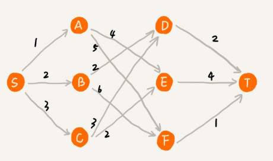
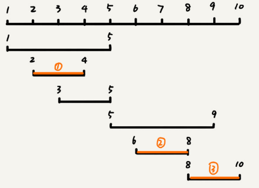
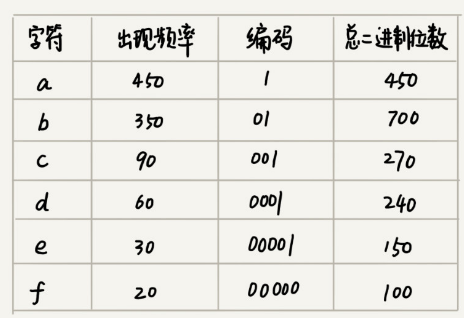
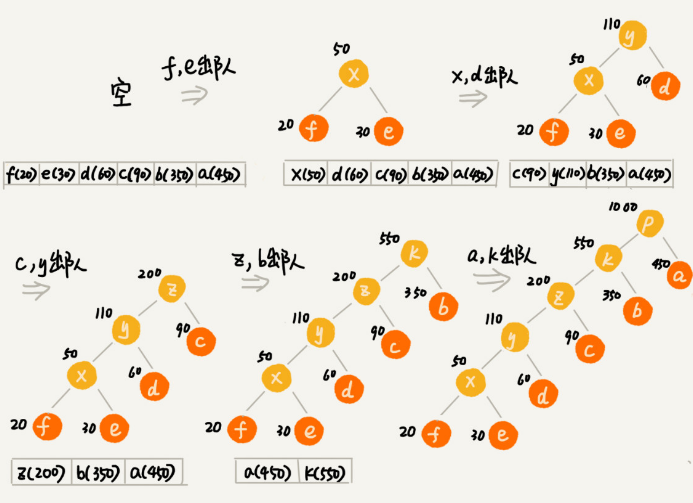
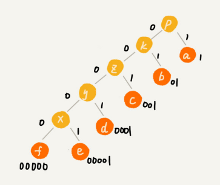
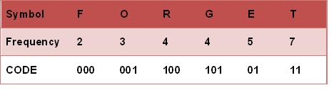

# 贪心算法：如何用贪心算法实现Huffman压缩编码？

贪心算法（greedy algorithm），这种算法思想更多的是指导设计基础算法。贪心算法的经典应用有，霍夫曼编码（Huffman Coding）、Prim 和 Kruskal 最小生成树算法、Dijkstra单源最短路径算法等。

贪心算法解决问题的正确性虽然很多时候都看起来是显而易见的，但是要严谨地证明算法能够得到最优解，并不是件容易的事。所以，很多时候只需要多举几个例子，看一下贪心算法的解决方案是否真的能得到最优解就可以了。

## 如何理解“贪心算法”？

先看一个例子:

有一个可以容纳 100kg 物品的背包，可以装以下 5 种豆子，每种豆子装多少能够让背包中所装物品的总价值最大？

| 物品 | 重量(kg) | 总价值(元) |
| ---- | -------- | ---------- |
| 黄豆 | 100      | 100        |
| 绿豆 | 30       | 90         |
| 红豆 | 60       | 120        |
| 黑豆 | 20       | 80         |
| 青豆 | 50       | 75         |

先计算每周豆子的单价，分别是黄豆1元/kg，绿豆3元/kg，红豆2元/kg，黑豆4元/kg，青豆1.5元/kg，单价从高到低排序依次是：黑豆、绿豆、红豆、青豆、黄豆。所以先从单价最高的装，20kg 黑豆、30kg 绿豆、50kg 红豆。

这个问题的解决思路本质上就是贪心算法。

贪心算法适合解决的问题：

**1.定义了限制值和期望值，希望从中选出几个数据，在满足限制值的情况下，期望值最大。**

类比到刚刚的例子，限制值就是重量不能超过 100kg，期望值就是物品的总价值。这组数据就是 5 种豆子。我们从中选出一部分，满足重量不超过 100kg，并且总价值最大。

**2.每次都可以选择当前情况下在对限制值同等贡献量的情况下，对期望值贡献最大的数据。**

类比到刚刚的例子，每次都从剩下的豆子里面，选择单价最高的，也就是重量相同的情况下，对价值贡献最大的豆子。

**3.举几个例子判断贪心算法产生的结果是否最优**

严格地证明贪心算法的正确性，是非常复杂的，需要涉及比较多的数学推理。大部分能用贪心算法解决的问题，贪心算法的正确性都是显而易见的，也不需要严格的数学推导证明。

贪心算法解决问题的思路，并不总能给出最优解：

比如在一个有权图中，从顶点 S 开始，找一条到顶点 T 的最短路径（路径中边的权值和最小）。贪心算法的解决思路是，每次都选择一条跟当前顶点相连的权最小的边，直到找到顶点 T。按照这种思路，求出的最短路径是 S->A->E->T，路径长度是 1+4+4=9。但路径 S->B->D->T 才是最短路径，路径长度是2+2+2=6。



在这个问题上，贪心算法不工作的主要原因是，前面的选择，会影响后面的选择。如果第一步从顶点 S 走到顶点 A，那接下来面对的顶点和边，跟第一步从顶点 S 走到顶点 B，是完全不同的。所以，即便我们第一步选择最优的走法（边最短），但有可能因为这一步选择，导致后面每一步的选择都很糟糕，最终也就无缘全局最优解了。

# 贪心算法实例分析

## 1. 分糖果

有 m 个糖果和 n 个孩子，但是m<n。

每个糖果的大小不等，这 m 个糖果的大小分别是 s1，s2，s3，……，sm。

每个孩子对糖果大小的需求不一样的，只有糖果的大小大于等于孩子的对糖果大小的需求的时候，孩子才得到满足。这 n 个孩子对糖果大小的需求分别是 g1，g2，g3，……，gn。

**如何分配糖果，能尽可能满足最多数量的孩子？**

这个问题可抽象成，从 n 个孩子中，抽取一部分孩子分配m个糖果，让满足的孩子的个数（期望值）是最大的。

**限制值**是糖果个数 m，**期望**是满足的孩子个数最大。

贪心算法解决思路：

对于一个孩子来说，如果小的糖果可以满足，就没必要用更大的糖果，这样更大的就可以留给其他对糖果大小需求更大的孩子。

另一方面，对糖果大小需求小的孩子更容易被满足。

因为满足一个需求大的孩子跟满足一个需求小的孩子，对期望值的贡献是一样的。

所以从需求小的孩子开始分配糖果。

故每次从剩下的孩子中，找出对糖果大小需求最小的，然后发给他剩下的糖果中能满足他的最小的糖果，这样得到的分配方案，也就是满足的孩子个数最多的方案。

## 2. 钱币找零

假设有 1 元、2 元、5 元、10 元、20 元、50 元、100 元这些面额的纸币，它们的张数分别是 c1、c2、c5、c10、c20、c50、c100。现在要用这些钱来支付 K 元，最少要用多少张纸币呢？

**贪心算法的解决思路：**

希望在相同纸币数目的情况下，多贡献点金额，这样就可以让纸币数更少。

即先用面值最大的来支付，如果不够，就继续用更小一点面值的，以此类推，最后剩下的用 1 元来补齐。


## 3. 区间覆盖

假设有 n 个区间，区间的起始端点和结束端点分别是 [l1, r1]，[l2, r2]，[l3, r3]，……，[ln, rn]。从这 n 个区间中选出一部分区间，这部分区间满足两两不相交（端点相交的情况不算相交），最多能选出多少个区间呢？
$$
\begin{array}{l}{\text { 区间: }[6,8][2,4][3,5][1,5][1,9][8,10]} \\ {\text { 不相交区间: }[2,4][6,8][8,10]}\end{array}
$$
贪心算法的解决思路：假设这 n 个区间中最左端点是 lmin，最右端点是 rmax。

这个问题就抽象为选择几个不相交的区间，从左到右将 [lmin, rmax] 覆盖上。

先按照起始端点从小到大的顺序对这 n 个区间排序。

每次选择左端点跟前面的已经覆盖的区间不重合，右端点又尽量小的区间：

 

# 如何用贪心算法实现霍夫曼编码？

假设有一个包含1000个字符的文件，每个字符占 1 个 byte（1byte=8bits），存储这 1000 个字符就一共需要 8000bits。

假设通过统计分析发现，这 1000 个字符中只包含 6 种不同字符分别是 a、b、c、d、e、f。而 3 个二进制位（bit）就可以表示 8 个不同的字符，所以，为了尽量减少存储空间每个字符只用 3 个二进制位来表示。那存储这 1000 个字符就减少到 3000bits ：

```
a(000)、b(001)、c(010)、d(011)、e(100)、f(101)
```

而霍夫曼编码不仅会考察文本中有多少个不同字符，还会考察每个字符出现的频率，根据频率的不同，选择不同长度的编码。霍夫曼编码是一种十分有效的编码方法，广泛用于数据压缩中，其压缩率通常在 20%～90% 之间。

根据贪心的思想，把出现频率比较多的字符，用稍微短一些的编码；出现频率比较少的字符，用稍微长一些的编码。

对于等长的编码来说，每次读取 固定二进制码，然后翻译成对应的字符。但霍夫曼编码是不等长的，它要求各个字符的编码之间，不会出现某个编码是另一个编码前缀的情况。

假设这 6 个字符出现的频率从高到低依次是 a、b、c、d、e、f。

把它们编码下面这个样子，任何一个字符的编码都不是另一个的前缀：



在解压缩的时候，每次会读取尽可能长的可解压的二进制串，所以在解压缩的时候也不会歧义。经过这种编码压缩之后，这 1000 个字符只需要 2100bits 就可以了。

**如何根据字符出现频率的不同，给不同的字符进行不同长度的编码呢？**

把每个字符看作一个节点，并且辅带着把频率放到优先级队列中。从队列中取出频率最小的两个节点 A、B，然后新建一个节点 C，把频率设置为两个节点的频率之和，并把这个新节点 C 作为节点 A、B 的父节点。最后再把 C 节点放入到优先级队列中。重复这个过程，直到队列中没有数据。



然后给每一条边加上一个权值，指向左子节点的边统统标记为 0，指向右子节点的边统统标记为 1，那从根节点到叶节点的路径就是叶节点对应字符的霍夫曼编码。



再以原始集合的值是[2,3,4,4,5,7]为例：

 

 第一步：从原始集合中取出最小的两个值并将这两个值从原始集合中剔除，这两个最小的值相加得到一个新的值并加入原始集合，这一步执行之后原始集合就变成：[⑤,4,4,5,7]

第二步：从更新后的集合中再取最小的两个值并剔除，同样相加得到新值加入到集合。这一步执行之后集合就变成：[⑤,⑧,5,7]

第三步，重复以上步骤，结果是：[⑩,⑧,7]
第四步，结果是：[⑩,(15)]
最后一步，结果是： [(25)]

编码结果：

  

# 思考题

1.在一个非负整数 a 中，希望从中移除 k 个数字，让剩下的数字值最小，如何选择移除哪 k 个数字呢？

答：

由最高位开始，比较低一位数字，若高位比低位大，则移除高位，否则指针右移一位继续比较两个数字，直到高位大于低位则移除高位。移除后重新从最高为开始比较，共循环k次移除k个数字，如：
4556847594546移除5位-》455647594546-》45547594546-》4547594546-》4447594546-》444594546


2.假设有 n 个人等待被服务，但是服务窗口只有一个，每个人需要被服务的时间长度是不同的，如何安排被服务的先后顺序，才能让这 n 个人总的等待时间最短？

答：

每次从剩下的人中选择等待时间最短的人服务， 直到n个人都被服务完， n 个人总的等待时间就是最短。