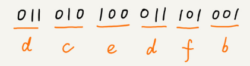

# 贪心算法：如何用贪心算法实现Huffman压缩编码？

基础的数据结构和算法我们基本上学完了，接下来几节，我会讲几种更加基本的算法。它们分别是贪心算法、分治算法、回溯算法、动态规划。更加确切地说，它们应该是算法思想，并不是具体的算法，常用来指导我们设计具体的算法和编码等。

贪心、分治、回溯、动态规划这 4 个算法思想，原理解释起来都很简单，但是要真正掌握且灵活应用，并不是件容易的事情。所以，接下来的这 4 个算法思想的讲解，我依旧不会长篇大论地去讲理论，而是结合具体的问题，让你自己感受这些算法是怎么工作的，是如何解决问题的，带你在问题中体会这些算法的本质。我觉得，这比单纯记忆原理和定义要更有价值。

今天，我们先来学习一下贪心算法（greedy algorithm）。贪心算法有很多经典的应用，比如霍夫曼编码（Huffman Coding）、Prim 和 Kruskal 最小生成树算法、还有 Dijkstra 单源最短路径算法。最小生成树算法和最短路径算法我们后面会讲到，所以我们今天讲下霍夫曼编码，看看**它是如何利用贪心算法来实现对数据压缩编码，有效节省数据存储空间的**。

## 如何理解“贪心算法”？

关于贪心算法，我们先看一个例子。

假设我们有一个可以容纳 100kg 物品的背包，可以装各种物品。我们有以下 5 种豆子，每种豆子的总量和总价值都各不相同。为了让背包中所装物品的总价值最大，我们如何选择在背包中装哪些豆子？每种豆子又该装多少呢？

| 物品 | 重量(kg) | 总价值(元) |
| ---- | -------- | ---------- |
| 黄豆 | 100      | 100        |
| 绿豆 | 30       | 90         |
| 红豆 | 60       | 120        |
| 黑豆 | 20       | 80         |
| 青豆 | 50       | 75         |

实际上，这个问题很简单，我估计你一下子就能想出来，没错，我们只要先算一算每个物品的单价，按照单价由高到低依次来装就好了。单价从高到低排列，依次是：黑豆、绿豆、红豆、青豆、黄豆，所以，我们可以往背包里装 20kg 黑豆、30kg 绿豆、50kg 红豆。

这个问题的解决思路显而易见，它本质上借助的就是贪心算法。结合这个例子，我总结一下贪心算法解决问题的步骤，我们一起来看看。

**第一步，当我们看到这类问题的时候，首先要联想到贪心算法**：针对一组数据，我们定义了限制值和期望值，希望从中选出几个数据，在满足限制值的情况下，期望值最大。

类比到刚刚的例子，限制值就是重量不能超过 100kg，期望值就是物品的总价值。这组数据就是 5 种豆子。我们从中选出一部分，满足重量不超过 100kg，并且总价值最大。

**第二步，我们尝试看下这个问题是否可以用贪心算法解决**：每次选择当前情况下，在对限制值同等贡献量的情况下，对期望值贡献最大的数据。

类比到刚刚的例子，我们每次都从剩下的豆子里面，选择单价最高的，也就是重量相同的情况下，对价值贡献最大的豆子。

**第三步，我们举几个例子看下贪心算法产生的结果是否是最优的**。大部分情况下，举几个例子验证一下就可以了。严格地证明贪心算法的正确性，是非常复杂的，需要涉及比较多的数学推理。而且，从实践的角度来说，大部分能用贪心算法解决的问题，贪心算法的正确性都是显而易见的，也不需要严格的数学推导证明。

实际上，用贪心算法解决问题的思路，并不总能给出最优解。

我来举一个例子。在一个有权图中，我们从顶点 S 开始，找一条到顶点 T 的最短路径（路径中边的权值和最小）。贪心算法的解决思路是，每次都选择一条跟当前顶点相连的权最小的边，直到找到顶点 T。按照这种思路，我们求出的最短路径是 S->A->E->T，路径长度是 1+4+4=9。


但是，这种贪心的选择方式，最终求的路径并不是最短路径，因为路径 S->B->D->T 才是最短路径，因为这条路径的长度是 2+2+2=6。为什么贪心算法在这个问题上不工作了呢？

在这个问题上，贪心算法不工作的主要原因是，前面的选择，会影响后面的选择。如果我们第一步从顶点 S 走到顶点 A，那接下来面对的顶点和边，跟第一步从顶点 S 走到顶点 B，是完全不同的。所以，即便我们第一步选择最优的走法（边最短），但有可能因为这一步选择，导致后面每一步的选择都很糟糕，最终也就无缘全局最优解了。

## 贪心算法实战分析

对于贪心算法，你是不是还有点懵？如果死抠理论的话，确实很难理解透彻。掌握贪心算法的关键是多练习。只要多练习几道题，自然就有感觉了。所以，我带着你分析几个具体的例子，帮助你深入理解贪心算法。

### 1. 分糖果

我们有 m 个糖果和 n 个孩子。我们现在要把糖果分给这些孩子吃，但是糖果少，孩子多（m<n），所以糖果只能分配给一部分孩子。

每个糖果的大小不等，这 m 个糖果的大小分别是 s1，s2，s3，……，sm。除此之外，每个孩子对糖果大小的需求也是不一样的，只有糖果的大小大于等于孩子的对糖果大小的需求的时候，孩子才得到满足。假设这 n 个孩子对糖果大小的需求分别是 g1，g2，g3，……，gn。

我的问题是，如何分配糖果，能尽可能满足最多数量的孩子？

我们可以把这个问题抽象成，从 n 个孩子中，抽取一部分孩子分配糖果，让满足的孩子的个数（期望值）是最大的。这个问题的限制值就是糖果个数 m。

我们现在来看看如何用贪心算法来解决。对于一个孩子来说，如果小的糖果可以满足，我们就没必要用更大的糖果，这样更大的就可以留给其他对糖果大小需求更大的孩子。另一方面，对糖果大小需求小的孩子更容易被满足，所以，我们可以从需求小的孩子开始分配糖果。因为满足一个需求大的孩子跟满足一个需求小的孩子，对我们期望值的贡献是一样的。

我们每次从剩下的孩子中，找出对糖果大小需求最小的，然后发给他剩下的糖果中能满足他的最小的糖果，这样得到的分配方案，也就是满足的孩子个数最多的方案。

### 2. 钱币找零

这个问题在我们的日常生活中更加普遍。假设我们有 1 元、2 元、5 元、10 元、20 元、50 元、100 元这些面额的纸币，它们的张数分别是 c1、c2、c5、c10、c20、c50、c100。我们现在要用这些钱来支付 K 元，最少要用多少张纸币呢？

在生活中，我们肯定是先用面值最大的来支付，如果不够，就继续用更小一点面值的，以此类推，最后剩下的用 1 元来补齐。

在贡献相同期望值（纸币数目）的情况下，我们希望多贡献点金额，这样就可以让纸币数更少，这就是一种贪心算法的解决思路。直觉告诉我们，这种处理方法就是最好的。实际上，要严谨地证明这种贪心算法的正确性，需要比较复杂的、有技巧的数学推导，我不建议你花太多时间在上面，不过如果感兴趣的话，可以自己去研究下。

### 3. 区间覆盖

假设我们有 n 个区间，区间的起始端点和结束端点分别是 [l1, r1]，[l2, r2]，[l3, r3]，……，[ln, rn]。我们从这 n 个区间中选出一部分区间，这部分区间满足两两不相交（端点相交的情况不算相交），最多能选出多少个区间呢？
$$
\begin{array}{l}{\text { 区间: }[6,8][2,4][3,5][1,5][1,9][8,10]} \\ {\text { 不相交区间: }[2,4][6,8][8,10]}\end{array}
$$
这个问题的处理思路稍微不是那么好懂，不过，我建议你最好能弄懂，因为这个处理思想在很多贪心算法问题中都有用到，比如任务调度、教师排课等等问题。

这个问题的解决思路是这样的：我们假设这 n 个区间中最左端点是 lmin，最右端点是 rmax。这个问题就相当于，我们选择几个不相交的区间，从左到右将 [lmin, rmax] 覆盖上。我们按照起始端点从小到大的顺序对这 n 个区间排序。

我们每次选择的时候，左端点跟前面的已经覆盖的区间不重合的，右端点又尽量小的，这样可以让剩下的未覆盖区间尽可能的大，就可以放置更多的区间。这实际上就是一种贪心的选择方法。


## 解答开篇

今天的内容就讲完了，我们现在来看开篇的问题，如何用贪心算法实现霍夫曼编码？

假设我有一个包含 1000 个字符的文件，每个字符占 1 个 byte（1byte=8bits），存储这 1000 个字符就一共需要 8000bits，那有没有更加节省空间的存储方式呢？

假设我们通过统计分析发现，这 1000 个字符中只包含 6 种不同字符，假设它们分别是 a、b、c、d、e、f。而 3 个二进制位（bit）就可以表示 8 个不同的字符，所以，为了尽量减少存储空间，每个字符我们用 3 个二进制位来表示。那存储这 1000 个字符只需要 3000bits 就可以了，比原来的存储方式节省了很多空间。不过，还有没有更加节省空间的存储方式呢？

```
a(000)、b(001)、c(010)、d(011)、e(100)、f(101)
```

霍夫曼编码就要登场了。霍夫曼编码是一种十分有效的编码方法，广泛用于数据压缩中，其压缩率通常在 20%～90% 之间。

霍夫曼编码不仅会考察文本中有多少个不同字符，还会考察每个字符出现的频率，根据频率的不同，选择不同长度的编码。霍夫曼编码试图用这种不等长的编码方法，来进一步增加压缩的效率。如何给不同频率的字符选择不同长度的编码呢？根据贪心的思想，我们可以把出现频率比较多的字符，用稍微短一些的编码；出现频率比较少的字符，用稍微长一些的编码。

对于等长的编码来说，我们解压缩起来很简单。比如刚才那个例子中，我们用 3 个 bit 表示一个字符。在解压缩的时候，我们每次从文本中读取 3 位二进制码，然后翻译成对应的字符。但是，霍夫曼编码是不等长的，每次应该读取 1 位还是 2 位、3 位等等来解压缩呢？这个问题就导致霍夫曼编码解压缩起来比较复杂。为了避免解压缩过程中的歧义，霍夫曼编码要求各个字符的编码之间，不会出现某个编码是另一个编码前缀的情况。



假设这 6 个字符出现的频率从高到低依次是 a、b、c、d、e、f。我们把它们编码下面这个样子，任何一个字符的编码都不是另一个的前缀，在解压缩的时候，我们每次会读取尽可能长的可解压的二进制串，所以在解压缩的时候也不会歧义。经过这种编码压缩之后，这 1000 个字符只需要 2100bits 就可以了。


尽管霍夫曼编码的思想并不难理解，但是如何根据字符出现频率的不同，给不同的字符进行不同长度的编码呢？这里的处理稍微有些技巧。

我们把每个字符看作一个节点，并且辅带着把频率放到优先级队列中。我们从队列中取出频率最小的两个节点 A、B，然后新建一个节点 C，把频率设置为两个节点的频率之和，并把这个新节点 C 作为节点 A、B 的父节点。最后再把 C 节点放入到优先级队列中。重复这个过程，直到队列中没有数据。


现在，我们给每一条边加上画一个权值，指向左子节点的边我们统统标记为 0，指向右子节点的边，我们统统标记为 1，那从根节点到叶节点的路径就是叶节点对应字符的霍夫曼编码。


## 内容小结

今天我们学习了贪心算法。

实际上，贪心算法适用的场景比较有限。这种算法思想更多的是指导设计基础算法。比如最小生成树算法、单源最短路径算法，这些算法都用到了贪心算法。**从我个人的学习经验来讲，不要刻意去记忆贪心算法的原理，多练习才是最有效的学习方法。**

贪心算法的最难的一块是如何将要解决的问题抽象成贪心算法模型，只要这一步搞定之后，贪心算法的编码一般都很简单。贪心算法解决问题的正确性虽然很多时候都看起来是显而易见的，但是要严谨地证明算法能够得到最优解，并不是件容易的事。所以，很多时候，我们只需要多举几个例子，看一下贪心算法的解决方案是否真的能得到最优解就可以了。

## 课后思考

1. 在一个非负整数 a 中，我们希望从中移除 k 个数字，让剩下的数字值最小，如何选择移除哪 k 个数字呢？
2. 假设有 n 个人等待被服务，但是服务窗口只有一个，每个人需要被服务的时间长度是不同的，如何安排被服务的先后顺序，才能让这 n 个人总的等待时间最短？

