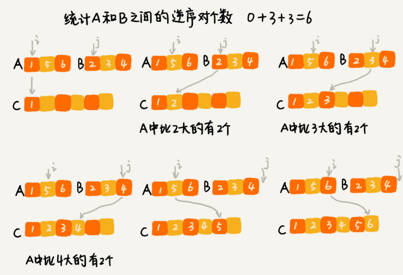

# 分治算法

[TOC]

分治算法用四个字概括就是“分而治之”，将原问题划分成 n 个规模较小而结构与原问题相似的子问题，递归地解决这些子问题，然后再合并其结果，就得到原问题的解。

分治算法的典型的两种应用场景，一个是用来指导编码，降低问题求解的时间复杂度；另一个是解决海量数据处理问题。比如 MapReduce 本质上就是利用了分治思想。

## 如何理解分治算法？

分治算法（divide and conquer）的核心思想就是分而治之 ，将原问题划分成 n 个规模较小，并且结构与原问题相似的子问题，递归地解决这些子问题，然后再合并其结果，就得到原问题的解。

分治算法一般都比较适合用递归来实现，**分治算法是一种处理问题的思想，递归是一种编程技巧**。

分治算法的递归实现中，每一层递归都会涉及这样三个操作：

- 分解：将原问题分解成一系列子问题；
- 解决：递归地求解各个子问题，若子问题足够小，则直接求解；
- 合并：将子问题的结果合并成原问题。

分治算法能解决的问题，一般需要满足下面这几个条件：

- 原问题与分解成的小问题具有相同的模式；
- 原问题分解成的子问题可以独立求解，子问题之间没有相关性，这一点是分治算法跟动态规划的明显区别；
- 具有分解终止条件，当问题足够小时，可以直接求解；
- 可以将子问题合并成原问题，而这个合并操作的复杂度不能太高，否则就起不到减小算法总体复杂度的效果了。

# 分治算法应用举例

## 求数组的逆序对个数

在排序算法里，我们用有序度来表示一组数据的有序程度，用逆序度表示一组数据的无序程度。

假设有 n 个数据，数据从小到大排列后，那完全有序的数据的有序度就是 n(n-1)/2，逆序度等于 0；

相反，倒序排列的数据的有序度就是 0，逆序度是 n(n-1)/2。

其他情况通过计算有序对或者逆序对的个数，来表示数据的有序度或逆序度。
$$
\begin{array}{l}2,4,3,1,5,6 \quad 逆序对个数:4 \\ {(2,1)(4,3)(4,1)(3,1)}\end{array}
$$
计算逆序对个数最笨的方法是，拿每个数字跟它后面的数字比较，看有几个比它小的，把比它小的数字个数记作 k。把每个数字都考察一遍之后，然后对每个数字对应的 k 值求和，最后得到的总和就是逆序对个数。这样操作的时间复杂度是 $O(n^2)$。

**用分治的思想来求数组 A 的逆序对个数:**

将数组分成前后两半 A1 和 A2，分别计算 A1 和 A2 的逆序对个数 K1 和 K2，然后再计算 A1 与 A2 之间的逆序对个数 K3。那数组 A 的逆序对个数就等于 K1+K2+K3。

使用分治算法其中一个要求是，子问题合并的代价不能太大，否则就起不了降低时间复杂度的效果了。

计算两个子问题 A1 与 A2 之间的逆序对个数，可借助归并排序算法的归并思想。

在两个子数组合并的过程中，就可以计算两个子数组的逆序对个数了：



java代码：

```java
private int num = 0; // 全局变量或者成员变量
 
public int count(int[] a, int n) {
  num = 0;
  mergeSortCounting(a, 0, n-1);
  return num;
}
 
private void mergeSortCounting(int[] a, int p, int r) {
  if (p >= r) return;
  int q = (p+r)/2;
  mergeSortCounting(a, p, q);
  mergeSortCounting(a, q+1, r);
  merge(a, p, q, r);
}
 
private void merge(int[] a, int p, int q, int r) {
  int i = p, j = q+1, k = 0;
  int[] tmp = new int[r-p+1];
  while (i<=q && j<=r) {
    if (a[i] <= a[j]) {
      tmp[k++] = a[i++];
    } else {
      num += (q-i+1); // 统计 p-q 之间，比 a[j] 大的元素个数
      tmp[k++] = a[j++];
    }
  }
  while (i <= q) { // 处理剩下的
    tmp[k++] = a[i++];
  }
  while (j <= r) { // 处理剩下的
    tmp[k++] = a[j++];
  }
  for (i = 0; i <= r-p; ++i) { // 从 tmp 拷贝回 a
    a[p+i] = tmp[i];
  }
}
```

## 求距离最近的两个点

二维平面上有 n 个点，如何快速计算出两个距离最近的点对？

思路：

求n个点中距离最近的两个点，可以将n个点划分为两部分，分别求出n/2个点中最近的两个点，然后再从这4个点中求出距离最近的两个点。

python实现代码：

```python
import sys, math
from typing import Tuple


def get_distance(p1: Tuple, p2: Tuple):
    distance = math.sqrt((p1[0] - p2[0]) ** 2 + (p1[1] - p2[1]) ** 2)
    # print(p1, p2, distance)
    return distance


def min_distance_point(nums, p, r) -> list:
    if r - p < 2: return nums[p:r + 1]
    mid = (p + r) >> 1
    pots = min_distance_point(nums, p, mid) + min_distance_point(nums, mid + 1, r)
    n = len(pots)
    min_distance = sys.maxsize
    pot1, pot2 = None, None
    for i in range(n - 1):
        for j in range(i + 1, n):
            distance = get_distance(pots[i], pots[j])
            if distance < min_distance:
                min_distance = distance
                pot1, pot2 = pots[i], pots[j]
    return [pot1, pot2]


nums = [(5, 0), (4, 2), (3, 2), (3, 1), (3, 4), (3, 6), (8, 7), (2, 3), (1, 1)]
pot = min_distance_point(nums, 0, len(nums) - 1)
p1, p2 = pot
print(pot, get_distance(p1, p2))
```

## 分治思想在海量数据处理中的应用

比如，给 10GB 的订单文件按照金额排序，机器的内存可能只有 2GB，无法一次性加载到内存。

要解决这种数据量大到内存装不下的问题，可以将海量的数据集合根据某种方法，划分为几个小的数据集合，每个小的数据集合单独加载到内存来解决，然后再将小数据集合合并成大数据集合。

先扫描一遍订单，根据订单的金额，将 10GB 的文件划分为几个金额区间。比如订单金额为 1 到 100 元的放到一个小文件，101 到 200 之间的放到另一个文件，以此类推。这样每个小文件都可以单独加载到内存排序，最后将这些有序的小文件合并，就是最终有序的 10GB 订单数据了。

如果订单数据存储在类似 GFS 这样的分布式系统上，当 10GB 的订单被划分成多个小文件的时候，每个文件可以并行加载到多台机器上处理，最后再将结果合并在一起。不过，数据的存储与计算所在的机器必须是同一个或者在网络中靠的很近（比如一个局域网内，数据存取速度很快），否则就会因为数据访问的速度，导致整个处理过程不但不会变快，反而有可能变慢。


## 为什么说 MapReduce 的本质就是分治思想？

如果我们要处理的数据是 1T、10T、100T 这样子的，那一台机器处理的效率肯定是非常低的。而对于谷歌搜索引擎来说，网页爬取、清洗、分析、分词、计算权重、倒排索引等等各个环节中，都会面对如此海量的数据（比如网页）。所以，利用集群并行处理显然是大势所趋。

把任务拆分到多台机器上来处理，拆分之后的小任务之间互不干扰，独立计算，最后再将结果合并，就是分治思想。

实际上，MapReduce 框架只是一个任务调度器，底层依赖 GFS 来存储数据，依赖 Borg 管理机器。它从 GFS 中拿数据，交给 Borg 中的机器执行，并且时刻监控机器执行的进度，一旦出现机器宕机、进度卡壳等，就重新从 Borg 中调度一台机器执行。

尽管 MapReduce 的模型非常简单，但是在 Google 内部应用非常广泛。它除了可以用来处理这种数据与数据之间存在关系的任务，比如 MapReduce 的经典例子，统计文件中单词出现的频率。除此之外，它还可以用来处理数据与数据之间没有关系的任务，比如对网页分析、分词等，每个网页可以独立的分析、分词，而这两个网页之间并没有关系。网页几十亿、上百亿，如果单机处理，效率低下就可以利用 MapReduce 提供的高可靠、高性能、高容错的并行计算框架，并行地处理这几十亿、上百亿的网页。


