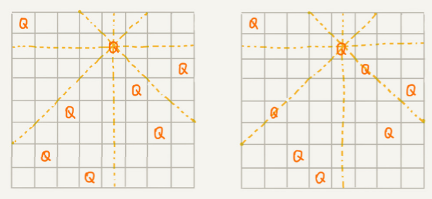

# 回溯算法

[TOC]

深度优先搜索算法利用的是回溯算法思想，它还用在很多实际的软件开发场景中，比如正则表达式匹配、编译原理中的语法分析等。除此之外，很多经典的数学问题都可以用回溯算法解决，比如数独、八皇后、0-1 背包、图的着色、旅行商问题、全排列等等。

## 如何理解“回溯算法”？

在人的一生中，会遇到很多重要的岔路口。在岔路口上，每个选择都会影响我们今后的人生。有的人在每个岔路口都能做出最正确的选择，最后生活、事业都达到了一个很高的高度；而有的人一路选错，最后碌碌无为。如果人生可以量化，那如何才能在岔路口做出最正确的选择，让自己的人生“最优”呢？

借助贪心算法，在每次面对岔路口的时候，都做出看起来最优的选择，期望这一组选择可以使得我们的人生达到“最优”。但贪心算法并不一定能得到最优解。

回溯的处理思想，有点类似枚举搜索。枚举所有的解，找到满足期望的解。为了有规律地枚举所有可能的解，避免遗漏和重复，我们把问题求解的过程分为多个阶段。每个阶段，我们都会面对一个岔路口，我们先随意选一条路走，当发现这条路走不通的时候（不符合期望的解），就回退到上一个岔路口，另选一种走法继续走。

## 回溯算法的应用

### 八皇后问题

有一个 8x8 的棋盘，希望往里放 8 个棋子（皇后），每个棋子所在的行、列、对角线都不能有另一个棋子。

下图中左图是满足条件的一种方法，又图是不满足条件的。八皇后问题就是期望找到所有满足这种要求的放棋子方式：



把这个问题划分成 8 个阶段，依次将 8 个棋子放到第一行、第二行、第三行……第八行。在放置的过程中，我们不停地检查当前的方法，是否满足要求。如果满足，则跳到下一行继续放置棋子；如果不满足，那就再换一种方法，继续尝试。

回溯算法非常适合用递归代码实现，下面是八皇后问题的java实现：

```java
int[] result = new int[8];// 全局或成员变量, 下标表示行, 值表示 queen 存储在哪一列
public void cal8queens(int row) { // 调用方式：cal8queens(0);
  if (row == 8) { // 8 个棋子都放置好了，打印结果
    printQueens(result);
    return; // 8 行棋子都放好了，已经没法再往下递归了，所以就 return
  }
  for (int column = 0; column < 8; ++column) { // 每一行都有 8 中放法
    if (isOk(row, column)) { // 有些放法不满足要求
      result[row] = column; // 第 row 行的棋子放到了 column 列
      cal8queens(row+1); // 考察下一行
    }
  }
}
 
private boolean isOk(int row, int column) {// 判断 row 行 column 列放置是否合适
  int leftup = column - 1, rightup = column + 1;
  for (int i = row-1; i >= 0; --i) { // 逐行往上考察每一行
    if (result[i] == column) return false; // 第 i 行的 column 列有棋子吗？
    if (leftup >= 0) { // 考察左上对角线：第 i 行 leftup 列有棋子吗？
      if (result[i] == leftup) return false;
    }
    if (rightup < 8) { // 考察右上对角线：第 i 行 rightup 列有棋子吗？
      if (result[i] == rightup) return false;
    }
    --leftup; ++rightup;
  }
  return true;
}
 
private void printQueens(int[] result) { // 打印出一个二维矩阵
  for (int row = 0; row < 8; ++row) {
    for (int column = 0; column < 8; ++column) {
      if (result[row] == column) System.out.print("Q ");
      else System.out.print("* ");
    }
    System.out.println();
  }
  System.out.println();
}
```

python实现：

```python
result = [0] * 8  # 角标代表皇后所在的行数，值存储皇后所在的列
n = 0  # 第n个满足条件的情况


def print_eight_queen(result):
    print(f"----------{n}----------")
    for column in result:
        for i in range(8):
            if i == column:
                print(end="Q  ")
            else:
                print(end="*  ")
        print()


def cal8queen(row: int = 0):
    global n
    if row == 8:
        print_eight_queen(result)
        n += 1
    for column in range(8):
        # 只有在第row行column列放置不与之前已经放置的冲突时才进行放置
        if is_ok(row, column):
            result[row] = column
            cal8queen(row + 1)


def is_ok(row, column):
    """
    校验在第row行将皇后放置在第column列是否满足条件
    通过校验的条件是第row行前面所有行，都没有与当前列相同的列数，也不在当前列的对角线上
    """
    leftup, rightup = column - 1, column + 1
    for i in range(row - 1, -1, -1):
        if column == result[i] or leftup == result[i] or rightup == result[i]:
            return False
        leftup -= 1
        rightup += 1
    return True


cal8queen(0)
```


### 0-1背包

0-1 背包是非常经典的算法问题，很多场景都可以抽象成这个问题模型。这个问题的经典解法是动态规划，不过还有一种简单但没有那么高效的解法，那就是回溯算法。

0-1 背包问题有很多变体，介绍一种比较基础的。

有一个背包总的承载重量是 $Wkg$。现在有 n 个重量不等的物品，不可分割。选择几件物品，装载到背包中。在不超过背包所能装载重量的前提下，如何让背包中物品的总重量最大？

这个背包问题，物品是不可分割的，要么装要么不装，所以叫 0-1 背包问题。显然，这个问题已经无法通过贪心算法来解决了。

对于每个物品来说，都有两种选择，装进背包或者不装进背包。对于 n 个物品来说，总的装法就有 $2^n$ 种，去掉总重量超过 $Wkg$ 的，从剩下的装法中选择总重量最接近 $Wkg$的。

把物品依次排列，整个问题就分解为了 n 个阶段，每个阶段对应一个物品怎么选择。先对第一个物品进行处理，选择装进去或者不装进去，然后再递归地处理剩下的物品，发现已经选择的物品的重量超过 ​之后，就停止继续探测剩下的物品。

java代码：

这里还稍微用到了一点搜索剪枝的技巧，就是当发现已经选择的物品的重量超过 $Wkg$之后，我们就停止继续探测剩下的物品。你可以看我写的具体的代码。

```java
public int maxW = Integer.MIN_VALUE; // 存储背包中物品总重量的最大值
// cw 表示当前已经装进去的物品的重量和；i 表示考察到哪个物品了；
// w 背包重量；items 表示每个物品的重量；n 表示物品个数
// 假设背包可承受重量 100，物品个数 10，物品重量存储在数组 a 中，那可以这样调用函数：
// f(0, 0, a, 10, 100)
public void f(int i, int cw, int[] items, int n, int w) {
  if (cw == w || i == n) { // cw==w 表示装满了 ;i==n 表示已经考察完所有的物品
    if (cw > maxW) maxW = cw;
    return;
  }
  f(i+1, cw, items, n, w);
  if (cw + items[i] <= w) {// 已经超过可以背包承受的重量的时候，就不要再装了
    f(i+1,cw + items[i], items, n, w);
  }
}
```

python代码：

```python
max_value = 0  # 存储背包中物品总重量的最大值


def f(i: int, cw: int, items: list, w: int):
    """
    假设背包可承受重量 100，物品重量存储在数组 a 中，那可以这样调用函数：
    bag(0, 0, a, 100)
    :param i: 当前物品的索引
    :param cw: 当前已经装进去的物品的重量和
    :param items: 每个物品的重量
    :param w: 背包容量
    :return:
    """
    global max_value
    if cw == w or i == len(items):  # cw==w 表示装满了 ;i==n 表示已经考察完所有的物品
        if cw > max_w: max_w = cw
        return
    f(i + 1, cw, items, w)
    if cw + items[i] <= w:  # 已经超过可以背包承受的重量的时候，就不要再装了
        f(i + 1, cw + items[i], items, w)
```

可获取选择的重量列表的python实现：

```python
max_value = 0  # 存储背包中物品总重量的最大值
# 背包选取的物品列表
picks = []
picks_with_max_value = []


def bag(i: int, cw: int, items: list, w: int):
    """
    假设背包可承受重量 100，物品重量存储在数组 a 中，那可以这样调用函数：
    bag(0, 0, a, 100)
    :param i: 当前物品的索引
    :param cw: 当前已经装进去的物品的重量和
    :param items: 每个物品的重量
    :param w: 背包容量
    :return:
    """
    global max_value
    if cw == w or i == len(items):  # cw==w 表示装满了 ;i==n 表示已经考察完所有的物品
        if cw > max_w:
            global picks_with_max_value
            max_w = cw
            picks_with_max_value = [x for x in picks if x != 0]
        return

    # 不选第i个物品
    bag(i + 1, cw, items, w)
    # 选第i个物品
    ncw = cw + items[i]
    if ncw <= w:  # 已经超过可以背包承受的重量的时候，就不要再装了
        picks[i] = items[i]
        bag(i + 1, ncw, items, w)


if __name__ == '__main__':
    items_info = [3, 5, 2, 4, 1, 2, 4, 9]
    picks = [0] * len(items_info)
    w = 23
    bag(0, 0, items_info, w)
    print(picks_with_max_value, max_value)
```


### 正则表达式

正则表达式里最重要的一种算法思想就是回溯。

正则表达式中，最重要的就是通配符，通配符结合在一起，可以表达非常丰富的语义。先假设正则表达式中只包含“\*”和“?”这两种通配符，“*”表示匹配大于等于 0 个任意字符，“?”表示匹配零个或者一个任意字符。

基于以上假设下，如何用回溯算法，判断一个给定的文本，能否跟给定的正则表达式匹配？

依次考察正则表达式中的每个字符，非通配符时就直接跟文本的字符进行匹配，相同则继续往下处理；不同则回溯。

如果遇到特殊字符，比如“*”有多种匹配方案，可以匹配任意个文本串中的字符，就先随意的选择一种匹配方案，然后继续考察剩下的字符。如果中途发现无法继续匹配下去了，就回到这个岔路口，重新选择一种匹配方案，然后再继续匹配剩下的字符。

java代码：

```java
public class Pattern {
  private boolean matched = false;
  private char[] pattern; // 正则表达式
  private int plen; // 正则表达式长度
 
  public Pattern(char[] pattern, int plen) {
    this.pattern = pattern;
    this.plen = plen;
  }
 
  public boolean match(char[] text, int tlen) { // 文本串及长度
    matched = false;
    rmatch(0, 0, text, tlen);
    return matched;
  }
 
  private void rmatch(int ti, int pj, char[] text, int tlen) {
    if (matched) return; // 如果已经匹配了，就不要继续递归了
    if (pj == plen) { // 正则表达式到结尾了
      if (ti == tlen) matched = true; // 文本串也到结尾了
      return;
    }
    if (pattern[pj] == '*') { // * 匹配任意个字符
      for (int k = 0; k <= tlen-ti; ++k) {
        rmatch(ti+k, pj+1, text, tlen);
      }
    } else if (pattern[pj] == '?') { // ? 匹配 0 个或者 1 个字符
      rmatch(ti, pj+1, text, tlen);
      rmatch(ti+1, pj+1, text, tlen);
    } else if (ti < tlen && pattern[pj] == text[ti]) { // 纯字符匹配才行
      rmatch(ti+1, pj+1, text, tlen);
    }
  }
}
```

python代码：

```python
class Pattern:
    def __init__(self, regex: str):
        self.regex = regex  # 正则表达式
        self.matched = False

    def rmatch(self, r_idx: int, m_idx: int, main: str):
        if self.matched: return  # 如果已经匹配了，就不要继续递归了
        if r_idx == len(self.regex):  # 正则表达式到结尾了
            if m_idx == len(main): self.matched = True  # 文本串也到结尾了
            return
        if self.regex[r_idx] == '*':  # * 匹配任意个字符
            for i in range(m_idx, len(main)):
                self.rmatch(r_idx + 1, i + 1, main)
        elif self.regex[r_idx] == '?':  # ? 匹配0个或者1个字符
            self.rmatch(r_idx + 1, m_idx, main)
            self.rmatch(r_idx + 1, m_idx + 1, main)
        elif m_idx < len(main) and self.regex[r_idx] == main[m_idx]:  # 非特殊字符需要精确匹配
            self.rmatch(r_idx + 1, m_idx + 1, main)

    def match(self, main):
        self.matched = False
        self.rmatch(0, 0, main)
        return self.matched
```


### 0-1背包问题升级版

如果每个物品不仅重量不同，价值也不同。如何在不超过背包重量的情况下，让背包中的总价值最大？

```python
# 背包选取的物品列表
picks = []
picks_with_max_value = []


def bag(i: int, cw: int, items_info: list, w: int):
    """
    :param i: 当前物品的索引
    :param cw: 背包当前重量
    :param items_info: 物品的重量和价值信息
    :param w: 背包容量
    :return:
    """
    n = len(items_info)
    # 考察完所有物品，或中途已经装满
    if cw == w or i == n:
        global picks_with_max_value
        if get_value(items_info, picks) > get_value(items_info, picks_with_max_value):
            picks_with_max_value = picks.copy()
        return

    # 不选第i个物品
    picks[i] = 0
    bag(i + 1, cw, items_info, w)
    # 选第i个物品
    ncw = cw + items_info[i][0]
    if ncw <= w:  # 已经超过可以背包承受的重量的时候，就不要再装了
        picks[i] = 1
        bag(i + 1, ncw, items_info, w)


def get_value(items_info: list, items_picks: list):
    values = [_[1] for _ in items_info]
    return sum([a * b for a, b in zip(values, items_picks)])


if __name__ == '__main__':
    # [(weight, value), ...]
    items_info = [(3, 5), (2, 2), (1, 4), (1, 2), (4, 10)]
    w = 8
    picks = [0] * len(items_info)
    bag(0, 0, items_info, w)
    max_value_select_list = [items_info[i] for i in range(len(items_info)) if picks_with_max_value[i] == 1]
    print(max_value_select_list)
```

