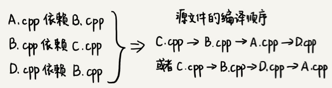
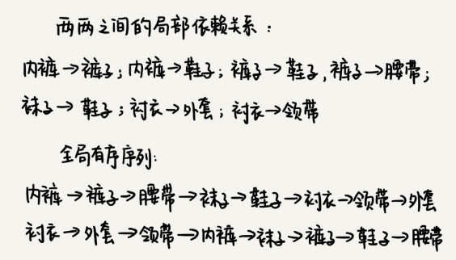

# 拓扑排序：确定代码源文件的编译依赖关系

一个完整的项目往往会包含很多代码源文件。编译器在编译整个项目的时候，需要按照依赖关系，依次编译每个源文件。比如，A.cpp 依赖 B.cpp，那在编译的时候，编译器需要先编译 B.cpp，才能编译 A.cpp。

编译器通过分析源文件或者程序员事先写好的编译配置文件（比如 Makefile 文件），来获取这种局部的依赖关系。**那编译器又该如何通过源文件两两之间的局部依赖关系，确定一个全局的编译顺序呢？**



## 拓扑排序算法解析

一个生活中的拓扑排序的例子:

衣服与衣服之间有一定的依赖关系。比如说，你必须先穿袜子才能穿鞋，先穿内裤才能穿秋裤。假设我们现在有八件衣服要穿，它们之间的两两依赖关系我们已经很清楚了，那如何安排一个穿衣序列，能够满足所有的两两之间的依赖关系？

这就是个拓扑排序问题。在很多时候，拓扑排序的序列并不是唯一的：



关于编译顺序的问题跟这个问题的模型是一样的，也可以抽象成一个拓扑排序问题。

如何将问题背景抽象成具体的数据结构？

把源文件与源文件之间的依赖关系，抽象成一个有向图。每个源文件对应图中的一个顶点，源文件之间的依赖关系就是顶点之间的边。

如果a先于b执行，也就是说b依赖于a，那么就在顶点a和顶点b之间，构建一条从a指向b的边。而且，这个图不仅要是有向图，还要是一个有向无环图不能存在像a->b->c->a这样的循环依赖关系。因为图中一旦出现环，拓扑排序就无法工作了。实际上，拓扑排序本身就是基于有向无环图的一个算法。

```java
public class Graph {
  private int v; // 顶点的个数
  private LinkedList<Integer> adj[]; // 邻接表
 
  public Graph(int v) {
    this.v = v;
    adj = new LinkedList[v];
    for (int i=0; i<v; ++i) {
      adj[i] = new LinkedList<>();
    }
  }
 
  public void addEdge(int s, int t) { // s 先于 t，边 s->t
    adj[s].add(t);
  }
}
```

拓扑排序**Kahn 算法**和**DFS 深度优先搜索算法**有两种实现方法:

### 1.Kahn算法

Kahn算法实际上用的是贪心算法思想。

定义数据结构的时候，如果 s 需要先于 t 执行，那就添加一条 s 指向 t 的边。所以，如果某个顶点入度为 0， 也就表示，没有任何顶点必须先于这个顶点执行，那么这个顶点就可以执行了。

先从图中，找出一个入度为 0 的顶点，将其输出到拓扑排序的结果序列中（对应代码中就是把它打印出来），并且把这个顶点从图中删除（也就是把这个顶点可达的顶点的入度都减 1）。

然后循环执行上面的过程，直到所有的顶点都被输出。最后输出的序列，就是满足局部依赖关系的拓扑排序。

Kahn算法的java实现：

```java
public void topoSortByKahn() {
  int[] inDegree = new int[v]; // 统计每个顶点的入度
  for (int i = 0; i < v; ++i) {
    for (int j = 0; j < adj[i].size(); ++j) {
      int w = adj[i].get(j); // i->w
      inDegree[w]++;
    }
  }
  LinkedList<Integer> queue = new LinkedList<>();
  for (int i = 0; i < v; ++i) {
    if (inDegree[i] == 0) queue.add(i);
  }
  while (!queue.isEmpty()) {
    int i = queue.remove();
    System.out.print("->" + i);
    for (int j = 0; j < adj[i].size(); ++j) {
      int k = adj[i].get(j);
      inDegree[k]--;
      if (inDegree[k] == 0) queue.add(k);
    }
  }
}
```

### 2.DFS算法

拓扑排序也可以用度优先遍历来实现，即遍历图中的所有顶点，而非只是搜索一个顶点到另一个顶点的路径。

java代码实现：

```java
public void topoSortByDFS() {
  // 先构建逆邻接表，边 s->t 表示，s 依赖于 t，t 先于 s
  LinkedList<Integer> inverseAdj[] = new LinkedList[v];
  for (int i = 0; i < v; ++i) { // 申请空间
    inverseAdj[i] = new LinkedList<>();
  }
  for (int i = 0; i < v; ++i) { // 通过邻接表生成逆邻接表
    for (int j = 0; j < adj[i].size(); ++j) {
      int w = adj[i].get(j); // i->w
      inverseAdj[w].add(i); // w->i
    }
  }
  boolean[] visited = new boolean[v];
  for (int i = 0; i < v; ++i) { // 深度优先遍历图
    if (visited[i] == false) {
      visited[i] = true;
      dfs(i, inverseAdj, visited);
    }
  }
}
 
private void dfs(
    int vertex, LinkedList<Integer> inverseAdj[], boolean[] visited) {
  for (int i = 0; i < inverseAdj[vertex].size(); ++i) {
    int w = inverseAdj[vertex].get(i);
    if (visited[w] == true) continue;
    visited[w] = true;
    dfs(w, inverseAdj, visited);
  } // 先把 vertex 这个顶点可达的所有顶点都打印出来之后，再打印它自己
  System.out.print("->" + vertex);
}
```

这个算法包含两个关键部分。

第一部分是**通过邻接表构造逆邻接表**。邻接表中，边 s->t 表示 s 先于 t 执行，也就是 t 要依赖 s。在逆邻接表中，边 s->t 表示 s 依赖于 t，s 后于 t 执行。

第二部分是这个算法的核心，也就是**递归处理每个顶点**。对于顶点 vertex 来说，先输出它可达的所有顶点，也就是说，先把它依赖的所有的顶点输出了，然后再输出自己。

### 时间复杂度分析

从 Kahn 代码中可以看出来，每个顶点被访问了一次，每个边也都被访问了一次，所以，Kahn 算法的时间复杂度就是 O(V+E)（V 表示顶点个数，E 表示边的个数）。

DFS 算法中每个顶点被访问两次，每条边都被访问一次，所以时间复杂度也是 O(V+E)。

由于这里的图可能不是连通的，有可能是有好几个不连通的子图构成，所以，E 并不一定大于 V，两者的大小关系不确定。所以，在表示时间复杂度的时候，V、E 都要考虑在内。

## 拓扑排序检测图中的环

拓扑排序应用非常广泛，解决的问题的模型也非常一致。凡是需要通过局部顺序来推导全局顺序的，一般都能用拓扑排序来解决。

拓扑排序还能检测图中环的存在。对于Kahn算法来说，如果最后输出出来的顶点个数，少于图中顶点个数，图中还有入度不是 0 的顶点，那就说明图中存在环。

在查找最终推荐人的时候，可能会因为脏数据，造成存在循环推荐，比如用户 A 推荐了用户 B，用户 B 推荐了用户C，用户C又推荐了用户 A。如何避免这种脏数据导致的无限递归？

实际上，这就是环的检测问题。因为每次都只是查找一个用户的最终推荐人，所以并不需要动用复杂的拓扑排序算法，而只需要记录已经访问过的用户ID，当用户ID第二次被访问的时候，就说明存在环，也就说明存在脏数据。

```java
HashSet<Integer> hashTable = new HashSet<>(); // 保存已经访问过的 actorId
long findRootReferrerId(long actorId) {
  if (hashTable.contains(actorId)) { // 存在环
    return;
  }
  hashTable.add(actorId);
  Long referrerId = 
       select referrer_id from [table] where actor_id = actorId;
  if (referrerId == null) return actorId;
  return findRootReferrerId(referrerId);
}
```

如果想要知道，数据库中的所有用户之间的推荐关系有没有存在环的情况。这时就需要用到拓扑排序算法了。

把用户之间的推荐关系，从数据库中加载到内存中，然后构建成有向图再利用拓扑排序，就可以快速检测出是否存在环了。

## 思考题

1.修改上面的例子中，依赖关系的表示为如果 a 先于 b就画一条从 b 到 a 的有向边，表示 b 依赖 a， Kahn 算法和 DFS 算法还能否正确工作呢？如果不能，应该如何改造一下呢？

答：可以实现。实现的时候kahn算法由找入度为0的节点改为出度为0的节点。dfs算法则不用再预计算逆邻接表直接用正邻接表即可。


2.BFS 广度优先搜索算法能否实现拓扑排序算法？

答：BFS也可以。其实与DFS一样，BFS也是从某个节点开始，找到所有与其相连通的节点。区别在于BFS是一层一层找（递归函数在for循环外），DFS是先一杆子插到底，再回来插第二条路、第三条路等等（递归函数在for循环内）。 

