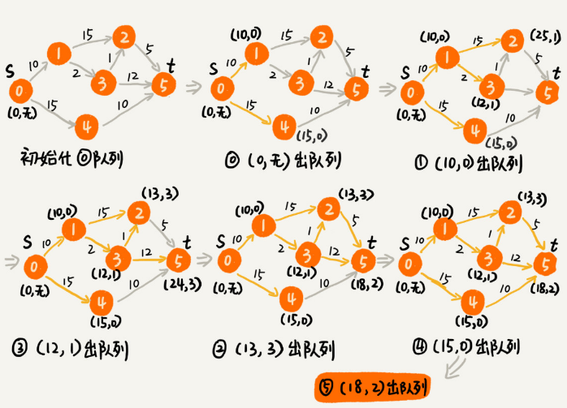
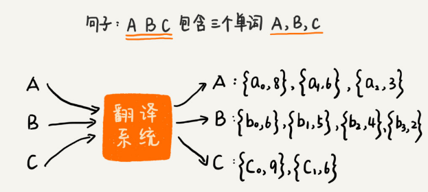
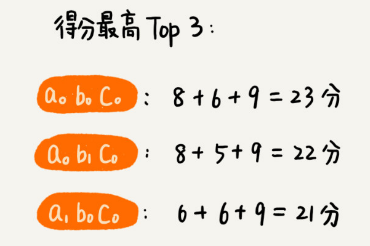
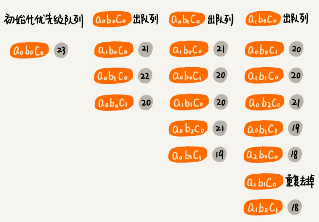
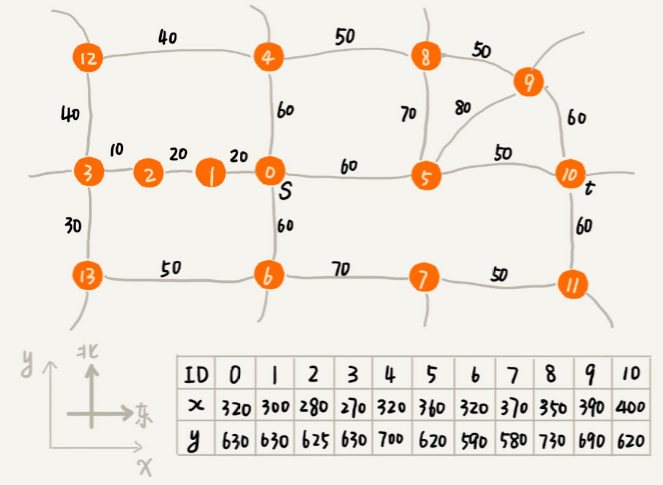
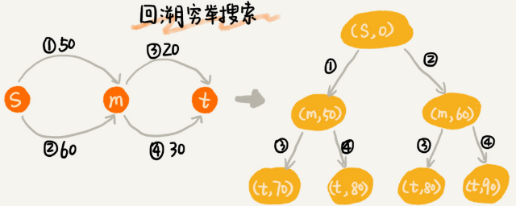
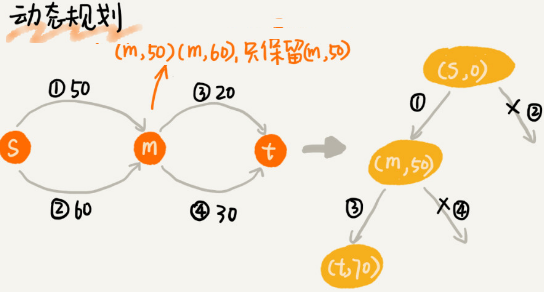
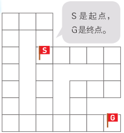

# 有权图的应用

## 地图软件计算最优出行路径

深度优先搜索和广度优先搜索主要是针对无权图的搜索算法。针对有权图，也就是图中的每条边都有一个权重，计算两点之间的最短路径（经过的边的权重和最小），需要**最短路径算法**（Shortest Path Algorithm）。

最短路径算法除了**Dijkstra**还有**Bellford**算法、**Floyd**算法等等。

像 Google 地图、百度地图、高德地图这样的地图软件，只需要输入起始、结束地址，地图就会给你规划一条最优出行路线。这里的最优，有最短路线、最少用时路线、最少红绿灯路线等多种定义。

## 最短路径算法求最短路线

首先进行**建模**，把地图抽象成图：

顶点：每个岔路口，边：岔路口与岔路口之间的路，路的长度作为边的权重。

两个顶点之间，单行道有一条有向边，双行道有两条方向不同的边。

java代码：

```java
public class Graph { // 有向有权图的邻接表表示
  private LinkedList<Edge> adj[]; // 邻接表
  private int v; // 顶点个数
 
  public Graph(int v) {
    this.v = v;
    this.adj = new LinkedList[v];
    for (int i = 0; i < v; ++i) {
      this.adj[i] = new LinkedList<>();
    }
  }
 
  public void addEdge(int s, int t, int w) { // 添加一条边
    this.adj[s].add(new Edge(s, t, w));
  }
 
  private class Edge {
    public int sid; // 边的起始顶点编号
    public int tid; // 边的终止顶点编号
    public int w; // 权重
    public Edge(int sid, int tid, int w) {
      this.sid = sid;
      this.tid = tid;
      this.w = w;
    }
  }
  // 下面这个类是为了 dijkstra 实现用的
  private class Vertex {
    public int id; // 顶点编号 ID
    public int dist; // 从起始顶点到这个顶点的距离
    public Vertex(int id, int dist) {
      this.id = id;
      this.dist = dist;
    }
  }
}
```

然后在一个有向有权图中，求出两个顶点间的最短路径即可。

求最短路线，最经典的算法是**单源最短路径算法**（一个顶点到一个顶点），最出名的莫过于Dijkstra算法了。

java代码：

```java
// 因为Java提供的优先级队列，没有暴露更新数据的接口，所以我们需要重新实现一个
private class PriorityQueue { // 根据 vertex.dist 构建小顶堆
  private Vertex[] nodes;
  private int count;
  public PriorityQueue(int v) {
    this.nodes = new Vertex[v+1];
    this.count = v;
  }
  public Vertex poll() { // TODO: 留给读者实现... }
  public void add(Vertex vertex) { // TODO: 留给读者实现...}
  // 更新结点的值，并且从下往上堆化，重新符合堆的定义。时间复杂度 O(logn)。
  public void update(Vertex vertex) { // TODO: 留给读者实现...} 
  public boolean isEmpty() { // TODO: 留给读者实现...}
}
 
public void dijkstra(int s, int t) { // 从顶点 s 到顶点 t 的最短路径
  int[] predecessor = new int[this.v]; // 用来还原最短路径
  Vertex[] vertexes = new Vertex[this.v];
  for (int i = 0; i < this.v; ++i) {
    vertexes[i] = new Vertex(i, Integer.MAX_VALUE);
  }
  PriorityQueue queue = new PriorityQueue(this.v);// 小顶堆
  boolean[] inqueue = new boolean[this.v]; // 标记是否进入过队列
  vertexes[s].dist = 0;
  queue.add(vertexes[s]);
  inqueue[s] = true;
  while (!queue.isEmpty()) {
    Vertex minVertex= queue.poll(); // 取堆顶元素并删除
    if (minVertex.id == t) break; // 最短路径产生了
    for (int i = 0; i < adj[minVertex.id].size(); ++i) {
      Edge e = adj[minVertex.id].get(i); // 取出一条 minVetex 相连的边
      Vertex nextVertex = vertexes[e.tid]; // minVertex-->nextVertex
      if (minVertex.dist + e.w < nextVertex.dist) { // 更新 next 的 dist
        nextVertex.dist = minVertex.dist + e.w;
        predecessor[nextVertex.id] = minVertex.id;
        if (inqueue[nextVertex.id] == true) {
          queue.update(nextVertex); // 更新队列中的 dist 值
        } else {
          queue.add(nextVertex);
          inqueue[nextVertex.id] = true;
        }
      }
    }
  }
  // 输出最短路径
  System.out.print(s);
  print(s, t, predecessor);
}
 
private void print(int s, int t, int[] predecessor) {
  if (s == t) return;
  print(s, predecessor[t], predecessor);
  System.out.print("->" + t);
}
```

vertexes数组，记录从起始顶点到每个顶点的距离（dist）。

首先把所有顶点的dist都初始化为无穷大（Integer.MAX_VALUE）。再把起始顶点的dist值初始化为 0，并放到优先级队列中。

从优先级队列中取出dist最小的顶点minVertex，遍历这个顶点所有的边e，边的权重为w,

若minVertex.dist + e.w < nextVertex.dist，则更新nextVertex.dist=minVertex.dist+w。并把nextVertex加入到优先级队列中，但如果nextVertex已经加入过队列，则更新队列中的数据，不重复加入一个顶点。

重复这个过程，直到找到终止顶点 t 或者队列为空。

其中，predecessor数组记录着每个顶点的前驱顶点，用于为了还原最短路径。

inqueue数组记录着，一个顶点是否已经加入队列中，为了避免将一个顶点多次添加到优先级队列中。

画图表达这个过程：



python代码实现：

```python
import heapq
import sys
from collections import deque


class Graph:
    def __init__(self, vertex_count: int):
        self.adj = [deque() for _ in range(vertex_count)]

    def add_edge(self, s: int, t: int, w: int):
        self.adj[s].append(Edge(s, t, w))

    def dijkstra(self, s: int, t: int):
        v = len(self.adj)
        predecessor = [0] * v
        vertexes = [Vertex(i, sys.maxsize) for i in range(v)]
        queue = VertexPriorityQueue()
        inqueue = [False] * v
        vertexes[s].dist = 0
        queue.add(vertexes[s])
        inqueue[s] = True

        while not queue.is_empty():
            minVertex: Vertex = queue.poll()
            if (minVertex.id == t): break
            for e in self.adj[minVertex.id]:
                nextVertex = vertexes[e.tid]
                if minVertex.dist + e.w < nextVertex.dist:
                    nextVertex.dist = minVertex.dist + e.w
                    predecessor[nextVertex.id] = minVertex.id
                    if inqueue[nextVertex.id]:
                        queue.update(nextVertex)
                    else:
                        queue.add(nextVertex)
                        inqueue[nextVertex.id] = True
        self.print_path(predecessor, s, t)
        return vertexes[t].dist

    def print_path(self, predecessor, s, t):
        result = deque()
        d = t
        while d != s:
            result.appendleft(str(d))
            d = predecessor[d]
        result.appendleft(str(d))
        print(" -> ".join(result))


class Edge:
    def __init__(self, sid: int, tid: int, w: int) -> None:
        self.sid = sid
        self.tid = tid
        self.w = w


class Vertex:
    def __init__(self, v: int, dist: int) -> None:
        self.id = v
        self.dist = dist

    def __gt__(self, other) -> bool:
        return self.dist > other.dist


class VertexPriorityQueue:
    def __init__(self) -> None:
        self.vertices = []

    def poll(self) -> Vertex:
        return heapq.heappop(self.vertices)

    def add(self, vertex: Vertex) -> None:
        heapq.heappush(self.vertices, vertex)

    def update(self, vertex: Vertex) -> None:
        for i, v in enumerate(self.vertices):
            if vertex.id == v.id:
                v.dist = vertex.dist
                heapq._siftdown(self.vertices, 0, i)
                break

    def is_empty(self) -> bool:
        return len(self.vertices) == 0
```

**Dijkstra 算法的时间复杂度：**

循环语句的整体的循环次数最大为图中所有边的个数 E。

for循环内部涉及从优先级队列取数据、往优先级队列中添加或更新优先级队列中的数据，两个主要操作。优先级队列是用堆来实现的，堆中的这几个操作时间复杂度都是 O(logV)（V为顶点的个数 ）。

整个代码的时间复杂度就是 O(E*logV)。


Dijkstra算法对大地图的优化：

打开地图App，缩小放大一下地图，可以发现地图上的路线被划分为不同级别的子地图。

先规划大的主干图的出行路线。例如把北京海淀区或者北京看作一个顶点，把上海黄浦区或者上海看作一个顶点。从北京到上海，必须要经过某几个顶点，或者某几条干道，然后再细化每个阶段的小路线。

划分小路线时，划出一个小的区块，这个小区块恰好可以覆盖住两个点，然后在这个小区块内部运行Dijkstra算法。


## 最少时间和最少红绿灯

最短路径每条边的权重是路的长度，计算最少时间边的权重为经过这段路所需要的时间。不过，这个时间会根据拥堵情况时刻变化。

每经过一条边，就要经过一个红绿灯。计算最少红绿灯的出行方案，只需要把每条边的权值改为 1 即可。

边的权值为1相当于无权图，还可以使用广度优先搜索算法。


地图软件用的更多的是基于Dijkstra 算法优化的类似A*的启发式搜索算法。

## Dijkstra算法优化句子翻译系统

有一个单词翻译系统，只能针对每个单词返回一组可选的翻译列表，并且针对每个翻译打一个分，表示这个翻译的可信程度。 

首先将句子拆成一个一个的单词，再丢给翻译系统，获得每个单词的翻译列表和对应得分：



现在要基于这个单词翻译系统开发一个句子翻译系统，针对整个句子计算出得分之和最高的前k个翻译结果：



借助Dijkstra算法的核心思想来解决这个问题：

将每个单词的可选翻译是按照分数从大到小排列的，所以$a_0b_0c_0$ 肯定是得分最高组合结果，把 $a_0b_0c_0$及得分作为一个对象，放入到优先级队列中。

每次从优先级队列中取出一个得分最高的组合，并基于这个组合进行扩展，扩展的策略是每个单词的翻译分别替换成下一个单词的翻译。比如$a_0b_0c_0$ 扩展后，会得到$a_1b_0c_0$、$a_0b_1c_0$、$a_0b_0c_1$三个组合。

再把扩展之后的组合，加到优先级队列中。

重复这个过程，直到获取到 k 个翻译组合或者队列为空。



Dijkstra算法优化后的时间复杂度分析：

假设句子包含n个单词，每个单词平均有m个可选的翻译。

求得分最高的前k个组合结果，对应着k次出队操作。每个出队操作都有 n 个组合入队列。优先级队列中出队和入队操作的时间复杂度都是 O(logX)，X 表示队列中的组合个数。所以，总的时间复杂度就是 O(knlogX)。

k次出入队列，队列中的总数据不会超过kn，故总的时间复杂度就是 O(knlog(kn))。


## 如何获得通过某条路的时间

在计算最短时间的出行路线中，如何获得通过某条路的时间呢？

答：通过某条路的时间与①路的长度②路况(是否平坦等)③拥堵情况④红绿灯个数等因素相关。获取这些因素后就可以建立一个回归模型(比如线性回归)来估算时间。其中①②④因素比较固定，容易获得。③是动态的，但也可以通过a.与交通部门合作获得路段拥堵情况；b.联合其他导航软件获得在该路段的在线人数；c.通过现在时间段正好在次路段的其他用户的真实情况等方式估算。


# A*搜索算法

A* 算法属于一种**启发式搜索算法**（Heuristically Search Algorithm）。启发式搜索算法还有IDA* 算法、蚁群算法、遗传算法、模拟退火算法等。

启发式搜索算法利用估价函数，避免“跑偏”，贪心地朝着最有可能到达终点的方向前进。这种算法找出的路线，并不是最短路线。但是，实际的软件开发中的路线规划问题，往往并不需要非得找最短路线。所以，鉴于启发式搜索算法能很好地平衡路线质量和执行效率，它在实际的软件开发中的应用更加广泛。

## A*算法是对Dijkstra算法的改造

像出行路线规划、游戏寻路，这些真实软件开发中的问题，一般情况下都不需要非得求最优解（也就是最短路径）。在权衡路线规划质量和执行效率的情况下，只需要寻求一个次优解就足够了。

Dijkstra算法有点儿类似BFS算法，每次找到跟起点最近的顶点往外扩展。但这种往外扩展的思路，其实有些盲目,比如：



每个顶点用一个二维坐标（x，y）定位。

在Dijkstra算法的实现中找从s到t的路线时，最先被搜索到的顶点依次是 1，2，3。尽管 1，2，3 三个顶点离起始顶点最近，但离终点却越来越远。

A*算法则在Dijkstra算法的基础上是把这个顶点到终点可能还要走多远，也考虑进去，综合来判断哪个顶点该先出队列。

当遍历到某个顶点的时候，从起点走到这个顶点的路径长度是确定的，记作 g(i)（i 表示这个顶点的编号）。

## 估测当前顶点到终点的距离

从这个顶点到终点的路径长度，虽然无法提前知道确切的值，但可以近似估计一下。这里可以通过这个顶点跟终点之间的直线距离，也就是欧几里得距离，来近似地估计这个顶点跟终点的路径长度（注意：路径长度跟直线距离是两个概念）。由于**曼哈顿距离**（Manhattan distance）相对欧几里得距离简单，所以用曼哈顿距离近似这个距离，记作 h(i)（i 表示这个顶点的编号），h(i)也叫**启发函数**（heuristic function）。

曼哈顿距离是两点之间横纵坐标的距离之和：

```java
int hManhattan(Vertex v1, Vertex v2) { // Vertex 表示顶点，后面有定义
  return Math.abs(v1.x - v2.x) + Math.abs(v1.y - v2.y);
}
```

Dijkstra算法只通过g(i)来判断谁先出队列，而A*算法则通过f(i)=g(i)+h(i)判断哪个顶点该最先出队列， f(i)也叫**估价函数**（evaluation function）。

## A*算法的代码实现

在A*算法的代码实现中，顶点Vertex类的定义，相对Dijkstra算法中的定义，多了 x，y 坐标，以及f(i)值。

```java
private class Vertex {
  public int id; // 顶点编号 ID
  public int dist; // 从起始顶点，到这个顶点的距离，也就是 g(i)
  public int f; // 新增：f(i)=g(i)+h(i)
  public int x, y; // 新增：顶点在地图中的坐标（x, y）
  public Vertex(int id, int x, int y) {
    this.id = id;
    this.x = x;
    this.y = y;
    this.f = Integer.MAX_VALUE;
    this.dist = Integer.MAX_VALUE;
  }
}
// Graph 类的成员变量，在构造函数中初始化
Vertex[] vertexes = new Vertex[this.v];
// 新增一个方法，添加顶点的坐标
public void addVetex(int id, int x, int y) {
  vertexes[id] = new Vertex(id, x, y)
}
```

A* 算法的代码实现跟Dijkstra算法的代码实现的3点区别：

- A*算法根据f(i)构建优先级队列，而Dijkstra算法根据 g(i)来构建优先级队列；
- A*算法在更新顶点dist值时会同步更新 f 值；
- Dijkstra算法是在终点出队列的时候才结束循环，A*算法是一旦遍历到终点就结束循环。

```java
public void astar(int s, int t) { // 从顶点 s 到顶点 t 的路径
  int[] predecessor = new int[this.v]; // 用来还原路径
  // 按照 vertex 的 f 值构建的小顶堆，而不是按照 dist
  PriorityQueue queue = new PriorityQueue(this.v);
  boolean[] inqueue = new boolean[this.v]; // 标记是否进入过队列
  vertexes[s].dist = 0;
  vertexes[s].f = 0;
  queue.add(vertexes[s]);
  inqueue[s] = true;
  while (!queue.isEmpty()) {
    Vertex minVertex = queue.poll(); // 取堆顶元素并删除
    for (int i = 0; i < adj[minVertex.id].size(); ++i) {
      Edge e = adj[minVertex.id].get(i); // 取出一条 minVetex 相连的边
      Vertex nextVertex = vertexes[e.tid]; // minVertex-->nextVertex
      if (minVertex.dist + e.w < nextVertex.dist) { // 更新 next 的 dist,f
        nextVertex.dist = minVertex.dist + e.w;
        nextVertex.f 
           = nextVertex.dist+hManhattan(nextVertex, vertexes[t]);
        predecessor[nextVertex.id] = minVertex.id;
        if (inqueue[nextVertex.id] == true) {
          queue.update(nextVertex);
        } else {
          queue.add(nextVertex);
          inqueue[nextVertex.id] = true;
        }
      }
      if (nextVertex.id == t) { // 只要到达 t 就可以结束 while 了
        queue.clear(); // 清空 queue，才能推出 while 循环
        break; 
      }
    }
  }
  // 输出路径
  System.out.print(s);
  print(s, t, predecessor); // print 函数请参看 Dijkstra 算法的实现
}
```

完整python代码实现：

```python
from typing import List, Optional
import heapq
from collections import deque


class Edge:
    def __init__(self, sid: int, tid: int, w: int) -> None:
        self.sid = sid
        self.tid = tid
        self.w = w


class Vertex:
    def __init__(self, id: int, x: int, y: int) -> None:
        self.id = id  # 顶点编号 ID
        # 顶点在地图中的坐标（x, y）
        self.x = x
        self.y = y
        self.f = float("inf")
        self.dist = float("inf")  # 从起始顶点，到这个顶点的距离，也就是 g(i)

    def __gt__(self, other) -> bool:
        return self.f > other.f


class VertexPriorityQueue:
    def __init__(self) -> None:
        self.vertices = []

    def poll(self) -> Vertex:
        return heapq.heappop(self.vertices)

    def add(self, vertex: Vertex) -> None:
        heapq.heappush(self.vertices, vertex)

    def update(self, vertex: Vertex) -> None:
        for i, v in enumerate(self.vertices):
            if vertex.id == v.id:
                v.dist = vertex.dist
                heapq._siftdown(self.vertices, 0, i)
                break

    def is_empty(self) -> bool:
        return len(self.vertices) == 0


def print_path(predecessor, s, t):
    result = deque()
    while t != s:
        result.appendleft(str(t))
        t = predecessor[t]
    result.appendleft(str(s))
    print(" -> ".join(result))


def hManhattan(v1: Vertex, v2: Vertex) -> int:
    return abs(v1.x - v2.x) + abs(v1.y - v2.y)


class Graph:
    def __init__(self, vertex_count: int):
        self.adj = [deque() for _ in range(vertex_count)]
        self.vertexes: List[Optional[Vertex]] = [None] * vertex_count

    def add_vertex(self, id: int, x: int, y: int):
        self.vertexes[id] = Vertex(id, x, y)

    def add_edge(self, s: int, t: int, w: int, two_way: bool = True):
        self.adj[s].append(Edge(s, t, w))
        if two_way: self.adj[t].append(Edge(t, s, w))

    def astar(self, s: int, t: int):
        v = len(self.adj)
        predecessor = [0] * v
        queue = VertexPriorityQueue()
        inqueue = [False] * v
        self.vertexes[s].dist = 0
        self.vertexes[s].f = 0
        queue.add(self.vertexes[s])
        inqueue[s] = True

        while not queue.is_empty():
            min_vertex: Vertex = queue.poll()
            for e in self.adj[min_vertex.id]:
                next_vertex = self.vertexes[e.tid]
                if min_vertex.dist + e.w < next_vertex.dist:
                    next_vertex.dist = min_vertex.dist + e.w
                    next_vertex.f = next_vertex.dist + hManhattan(next_vertex, self.vertexes[t])
                    predecessor[next_vertex.id] = min_vertex.id
                    if inqueue[next_vertex.id]:
                        queue.update(next_vertex)
                    else:
                        queue.add(next_vertex)
                        inqueue[next_vertex.id] = True
                if next_vertex.id == t: break
        print_path(predecessor, s, t)
        return self.vertexes[t].dist


if __name__ == '__main__':
    g = Graph(14)
    g.add_vertex(0, 320, 630)
    g.add_vertex(1, 300, 630)
    g.add_vertex(2, 280, 625)
    g.add_vertex(3, 270, 630)
    g.add_vertex(4, 320, 700)
    g.add_vertex(5, 360, 620)
    g.add_vertex(6, 320, 590)
    g.add_vertex(7, 370, 580)
    g.add_vertex(8, 350, 730)
    g.add_vertex(9, 390, 690)
    g.add_vertex(10, 400, 620)
    g.add_vertex(11, 400, 580)
    g.add_vertex(12, 270, 670)
    g.add_vertex(13, 270, 600)
    g.add_edge(0, 1, 20)
    g.add_edge(0, 4, 60)
    g.add_edge(0, 5, 60)
    g.add_edge(0, 6, 60)
    g.add_edge(1, 2, 20)
    g.add_edge(2, 3, 10)
    g.add_edge(3, 12, 40)
    g.add_edge(3, 13, 50)
    g.add_edge(12, 4, 40)
    g.add_edge(13, 6, 50)
    g.add_edge(4, 8, 50)
    g.add_edge(8, 5, 70)
    g.add_edge(8, 9, 50)
    g.add_edge(5, 9, 80)
    g.add_edge(5, 10, 50)
    g.add_edge(9, 10, 60)
    g.add_edge(6, 7, 70)
    g.add_edge(7, 11, 50)
    g.add_edge(11, 10, 60)
    print(g.astar(0, 10))
```

**尽管A*  算法可以更加快速的找到从起点到终点的路线，但是它并不能像Dijkstra算法那样，找到最短路线。**

要找出起点s到终点t的最短路径，最简单的方法是，通过回溯穷举所有从s到达t的不同路径，然后对比找出最短的那个。



Dijkstra算法在此基础之上，利用动态规划的思想，对回溯搜索进行了剪枝，只保留起点到某个顶点的最短路径，继续往外扩展搜索。动态规划相较于回溯搜索，只是换了一个实现思路，但它实际上也考察到了所有从起点到终点的路线，所以才能得到最优解。



A* 算法利用贪心算法的思路，每次都找 f 值最小的顶点出队列，一旦搜索到终点就不在继续考察其他顶点和路线了。所以，它并没有考察所有的路线，也就不见得能找出最短路径了。

## A* 算法解决游戏寻路问题

游戏中的地图并不像现实生活中，存在规划非常清晰的道路，更多的是宽阔的荒野、草坪等。所以，不能直接把岔路口抽象成顶点，把道路抽象成边。

可以把游戏中的整个地图分割成一个一个的小方块。在某一个方块上的人物，只能往上下左右四个方向的方块上移动。把每个方块看作一个顶点，两个方块相邻就在它们之间连两条有向边，并且边的权值都是1。

于是这个问题就转化成了，在一个有向有权图中，找某个顶点到另一个顶点的路径问题。

 


