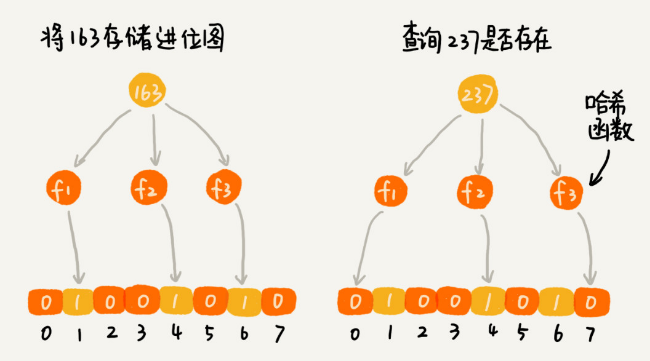

# 位图&布隆过滤器

## 位图

位图可以看成是一种比较“特殊”的散列表。比如有 1 千万个整数，要查找某个整数是否在这 1 千万个整数中，就可以使用位图。

如果整数的范围在 1 到 1 亿之间，申请一个大小为 1 亿、数据类型为布尔类型的数组。将这 1 千万个整数作为数组下标，将对应的数组值设置成 true。比如有整数 5 就设置array[5]=true。查询某个整数 K 是否在这 1 千万个整数中的时候，只需要读取array[K]是否等于 true。

不过，很多语言中提供的布尔类型大小是 1 个字节的，实际上，表示 true 和 false 两个值只需要用一个二进制位（bit）。通过位运算用其中的某个位表示某个数字即可：

```java
public class BitMap { // Java中char类型占16bit，也即是2个字节
  private char[] bytes;
  private int nbits;
  
  public BitMap(int nbits) {
    this.nbits = nbits;
    this.bytes = new char[nbits/16+1];
  }
 
  public void set(int k) {
    if (k > nbits) return;
    int byteIndex = k / 16;
    int bitIndex = k % 16;
    bytes[byteIndex] |= (1 << bitIndex);
  }
 
  public boolean get(int k) {
    if (k > nbits) return false;
    int byteIndex = k / 16;
    int bitIndex = k % 16;
    return (bytes[byteIndex] & (1 << bitIndex)) != 0;
  }
}
```

位图适用于数字所在的范围不是很大的情况，如果数字的范围很大不是 1 到 1 亿而是 1 到 10 亿，那位图的大小消耗的内存空间可能不降反增。**布隆过滤器**（Bloom Filter）就是解决这个问题，对位图的内存消耗的优化。

## 布隆过滤器

**布隆过滤器**（Bloom Filter）是基于位图这种数据结构的一种改进。

对于数据的范围1到10亿，布隆过滤器的仍然使用大小为1亿数组，然后使用 K 个哈希函数，对同一个数字进行求哈希值。每个哈希函数都会将数据映射到数组的某个角标，从而得到 K 个不同的哈希值分别记作 $X_1$，$X_2$，$X_3$，…，$X_K$。把这K个数字对应的 BitMap[$X_1$]，BitMap[$X_2$]，BitMap[$X_3$]，…，BitMap[$X_K$] 都设置成 true。

意味着布隆过滤器用K个二进制位，来表示一个数据是否不存在。

当查询某个数字是否存在的时候，用同样的 K 个哈希函数，对这个数字求哈希值分别得到 $Y_1$，$Y_2$，$Y_3$，…，$Y_K$。再查看这K个哈希值，对应位图中的数值是否都为true。如果都为true则说明这个数字可能存在，如果有其中任意一个不为true，那就说明这个数字必定不存在。

如果有其中任意一个不为true，那就说明这个数字必定不存在：



如果都为true并不能说明这个数字一定存在：


尽管布隆过滤器会存在误判，但这并不影响它发挥大作用。很多场景对误判有一定的容忍度。比如爬虫判重问题，即便一个没有被爬取过的网页被误判为已经被爬取，对于搜索引擎来说也是可以容忍的，毕竟网页太多了搜索引擎也不可能 100% 都爬取到。


# 如何实现网页爬虫中的URL去重功能？

爬虫的工作原理是，通过解析已经爬取页面中的网页链接，然后再爬取这些链接对应的网页。

**同一个网页链接有可能被包含在多个页面中，为了避免重复爬取**，所以需要记录已经爬取的网页链接（也就是 URL）到已爬列表，爬取前判断是否已经爬取过。

另外，每爬取一个页面会将解析到的url添加到待爬列表，一个被解析出来的url需要高效的判断是否已经添加到已爬列表被爬取过，还要高效判断是否已经添加到待爬列表中。

为了增大已爬和待爬列表内存极限，可以采用分治的思想，用多台机器（比如 20 台内存是 8GB 的机器）来存储10亿以上的网页链接。

实现爬虫判重列表可以使用散列表或布隆过滤器来实现。

## 散列表vs布隆过滤器

内存消耗对比：

假设要爬取10亿个网页，一个 URL 的平均长度是 64 字节，那单纯存储这10亿个URL，需要大约60GB的内存空间。

散列表必须维持较小的装载因子，用链表法解决冲突问题，还需要存储链表指针。如果将这10亿个URL存储到散列表，需要的内存空间有可能会超过100GB。

但如果用布隆过滤器记录已经爬取过的网页链接，即使用10倍大小（100 亿个二进制位）的位图来存储，也只需要大约1.2GB内存即可。


查询操作耗时对比：

如果散列表基于链表的方法解决冲突问题，链表中的结点在内存中是离散存储的，无法一下子加载到CPU缓存中利用CPU高速缓存。这个操作涉及很多内存数据的读取是内存密集型的操作，而且还需要逐个进行字符串匹配。

而布隆过滤器用多个哈希函数对同一个网页链接进行处理，CPU 只需要将网页链接从内存中读取一次，进行多次哈希计算，这组操作是 CPU 密集型的操作。

所以对于查询操作，布隆过滤器的速度会比散列表快很多。

## 布隆过滤器总结

布隆过滤器非常适合不需要 100% 准确的、允许存在小概率误判的大规模判重场景。除了爬虫网页去重，还有统计大型网站每日UV都可以使用布隆过滤器，对重复访问的用户，进行去重。

布隆过滤器的误判率，主要跟哈希函数的个数、位图的大小有关。往布隆过滤器中不停地加入数据之后，位图中不是 true 的位置就越来越少了，误判率就越来越高了。所以，对于无法事先知道要判重的数据个数的情况，需要支持自动扩容的功能。

当布隆过滤器中，数据个数与位图大小的比例超过某个阈值的时候，就可以重新申请一个新的位图。后面来的新数据，会被放置到新的位图中。不过判断某个数据是否存在时需要查看多个位图，执行效率会降低一些。

各编程语言对位图、布隆过滤器的实现例子，例如Java中的BitSet，Redis中的BitMap，Google的Guava工具包中的BloomFilter。

# 思考题

假设有1亿个整数，数据范围是从1到10亿，如何快速并且省内存地给这1亿个数据从小到大排序？

答：

假设不需要统计每个整数的重复次数，可以申请一个大小为10亿的位图，只需大约128MB内存，按照下标顺序输出位图上为true的下标即可完成排序。


