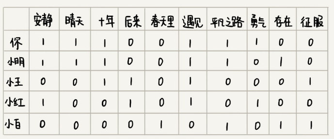
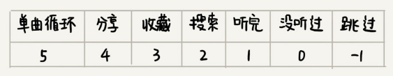
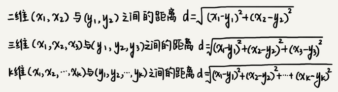
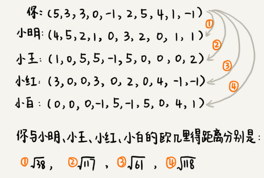
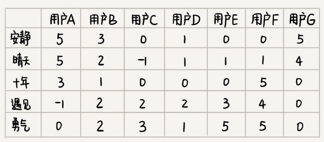

# 向量空间：如何实现一个简单的音乐推荐系统？

很多人都喜爱听歌，以前我们用 MP3 听歌，现在直接通过音乐 App 在线就能听歌。而且，各种音乐 App 的功能越来越强大，不仅可以自己选歌听，还可以根据你听歌的口味偏好，给你推荐可能会喜爱的音乐，而且有时候，推荐的音乐还非常适合你的口味，甚至会惊艳到你！如此智能的一个功能，你知道它是怎么实现的吗？

## 算法解析

实际上，要解决这个问题，并不需要特别高深的理论。解决思路的核心思想非常简单、直白，用两句话就能总结出来。

- 找到跟你口味偏好相似的用户，把他们爱听的歌曲推荐给你；
- 找出跟你喜爱的歌曲特征相似的歌曲，把这些歌曲推荐给你。

接下来，我就分别讲解一下这两种思路的具体实现方法。

### 1. 基于相似用户做推荐

如何找到跟你口味偏好相似的用户呢？或者说如何定义口味偏好相似呢？实际上，思路也很简单，我们把跟你听类似歌曲的人，看做口味相似的用户。你可以看我下面画的这个图。我用“1”表示“喜爱”，用“0”笼统地表示“不发表意见”。从图中我们可以看出，你跟小明共同喜爱的歌曲最多，有 5 首。于是，我们就可以说，小明跟你的口味非常相似。

我们只需要遍历所有的用户，对比每个用户跟你共同喜爱的歌曲个数，并且设置一个阈值，如果你和某个用户共同喜爱的歌曲个数超过这个阈值，我们就把这个用户看作跟你口味相似的用户，把这个用户喜爱但你还没听过的歌曲，推荐给你。

不过，刚刚的这个解决方案中有一个问题，我们如何知道用户喜爱哪首歌曲呢？也就是说，如何定义用户对某首歌曲的喜爱程度呢？

实际上，我们可以通过用户的行为，来定义这个喜爱程度。我们给每个行为定义一个得分，得分越高表示喜爱程度越高。

还是刚刚那个例子，我们如果把每个人对每首歌曲的喜爱程度表示出来，就是下面这个样子。图中，某个人对某首歌曲是否喜爱，我们不再用“1”或者“0”来表示，而是对应一个具体的分值。

有了这样一个用户对歌曲的喜爱程度的对应表之后，如何来判断两个用户是否口味相似呢？

显然，我们不能再像之前那样，采用简单的计数来统计两个用户之间的相似度。还记得我们之前讲字符串相似度度量时，提到的编辑距离吗？这里的相似度度量，我们可以使用另外一个距离，那就是**欧几里得距离**（Euclidean distance）。欧几里得距离是用来计算两个向量之间的距离的。这个概念中有两个关键词，向量和距离，我来给你解释一下。

一维空间是一条线，我们用 1，2，3……这样单个的数，来表示一维空间中的某个位置；二维空间是一个面，我们用（1，3）（4，2）（2，2）……这样的两个数，来表示二维空间中的某个位置；三维空间是一个立体空间，我们用（1，3，5）（3，1，7）（2，4，3）……这样的三个数，来表示三维空间中的某个位置。一维、二维、三维应该都不难理解，那更高维中的某个位置该如何表示呢？

类比一维、二维、三维的表示方法，K 维空间中的某个位置，我们可以写作（$X_1$，$X_2$，$X_3$，…，$X_K$）。这种表示方法就是**向量**（vector）。我们知道，二维、三维空间中，两个位置之间有距离的概念，类比到高纬空间，同样也有距离的概念，这就是我们说的两个向量之间的距离。

那如何计算两个向量之间的距离呢？我们还是可以类比到二维、三维空间中距离的计算方法。通过类比，我们就可以得到两个向量之间距离的计算公式。这个计算公式就是欧几里得距离的计算公式：

我们把每个用户对所有歌曲的喜爱程度，都用一个向量表示。我们计算出两个向量之间的欧几里得距离，作为两个用户的口味相似程度的度量。从图中的计算可以看出，小明与你的欧几里得距离距离最小，也就是说，你俩在高维空间中靠得最近，所以，我们就断定，小明跟你的口味最相似。

### 2. 基于相似歌曲做推荐

刚刚我们讲了基于相似用户的歌曲推荐方法，但是，如果用户是一个新用户，我们还没有收集到足够多的行为数据，这个时候该如何推荐呢？我们现在再来看另外一种推荐方法，基于相似歌曲的推荐方法，也就是说，如果某首歌曲跟你喜爱的歌曲相似，我们就把它推荐给你。

如何判断两首歌曲是否相似呢？对于人来说，这个事情可能会比较简单，但是对于计算机来说，判断两首歌曲是否相似，那就需要通过量化的数据来表示了。我们应该通过什么数据来量化两个歌曲之间的相似程度呢？

最容易想到的是，我们对歌曲定义一些特征项，比如是伤感的还是愉快的，是摇滚还是民谣，是柔和的还是高亢的等等。类似基于相似用户的推荐方法，我们给每个歌曲的每个特征项打一个分数，这样每个歌曲就都对应一个特征项向量。我们可以基于这个特征项向量，来计算两个歌曲之间的欧几里得距离。欧几里得距离越小，表示两个歌曲的相似程度越大。

但是，要实现这个方案，需要有一个前提，那就是我们能够找到足够多，并且能够全面代表歌曲特点的特征项，除此之外，我们还要人工给每首歌标注每个特征项的得分。对于收录了海量歌曲的音乐 App 来说，这显然是一个非常大的工程。此外，人工标注有很大的主观性，也会影响到推荐的准确性。

既然基于歌曲特征项计算相似度不可行，那我们就换一种思路。对于两首歌，如果喜欢听的人群都是差不多的，那侧面就可以反映出，这两首歌比较相似。如图所示，每个用户对歌曲有不同的喜爱程度，我们依旧通过上一个解决方案中定义得分的标准，来定义喜爱程度。

你有没有发现，这个图跟基于相似用户推荐中的图几乎一样。只不过这里把歌曲和用户主次颠倒了一下。基于相似用户的推荐方法中，针对每个用户，我们将对各个歌曲的喜爱程度作为向量。基于相似歌曲的推荐思路中，针对每个歌曲，我们将每个用户的打分作为向量。

有了每个歌曲的向量表示，我们通过计算向量之间的欧几里得距离，来表示歌曲之间的相似度。欧几里得距离越小，表示两个歌曲越相似。然后，我们就在用户已经听过的歌曲中，找出他喜爱程度较高的歌曲。然后，我们找出跟这些歌曲相似度很高的其他歌曲，推荐给他。

## 总结引申

实际上，这个问题是**推荐系统**（Recommendation System）里最典型的一类问题。之所以讲这部分内容，主要还是想给你展示，算法的强大之处，利用简单的向量空间的欧几里得距离，就能解决如此复杂的问题。不过，今天，我只给你讲解了基本的理论，实践中遇到的问题还有很多，比如冷启动问题，产品初期积累的数据不多，不足以做推荐等等。这些更加深奥的内容，你可以之后自己在实践中慢慢探索。

## 课后思考

关于今天讲的推荐算法，你还能想到其他应用场景吗？

