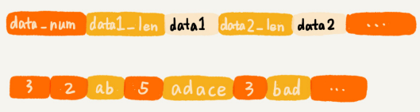
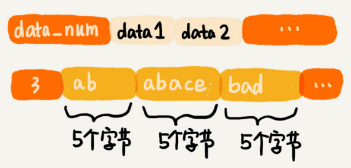

# Redis 中的常用数据类型，底层都是用哪种数据结构实现的？

Redis 中常用数据类型底层依赖的数据结构，大概有这五种：**压缩列表**（一种特殊的数组）、**有序数组**、**链表**、**散列表**、**跳表**。实际上，Redis 就是这些常用数据结构的封装。

## Redis数据库

Redis 是一种键值（Key-Value）数据库。相对于关系型数据库（比如 MySQL），Redis 也被叫作**非关系型数据库**。

Redis 中只包含“键”和“值”两部分，只能通过“键”来查询“值”，主要是作为内存数据库来使用，但也支持将数据存储在硬盘中。

Redis 中，键的数据类型是字符串，值的数据类型常用的有字符串、列表、字典、集合、有序集合。

## 列表（list）

这种数据类型对应两种实现方法，一种是**压缩列表**（ziplist），另一种是双向循环链表。

当列表中存储的数据量比较小并满足下面条件时，就使用压缩列表实现：

- 列表中保存的单个数据（有可能是字符串类型的）小于 64 字节；
- 列表中数据个数少于 512 个。

压缩列表，是Redis自己设计的一种数据存储结构。它类似数组通过连续的内存空间来存储数据，但与数组的区别是每个元素存储空间的长度不一样，需要一个位置来记录接下来存储多长：



压缩列表的压缩两字是相对数组而言的，数组要求每个元素的大小相同，如果要存储不同长度的字符串，那就需要用最大长度的字符串大小作为元素的大小（假设是 20 个字节）。存储小于 20 个字节长度的字符串的时候，便会浪费部分存储空间。



压缩列表这种存储结构，一方面比较节省内存，另一方面可以支持不同类型数据的存储。而且，因为数据存储在一片连续的内存空间，通过键来获取值为列表类型的数据，读取的效率也非常高。

**当列表中存储的数据量比较大不能满足上面两个条件的时候，列表就要通过双向循环链表来实现了。**

Redis的双向链表实现时，额外定义了一个list结构体来组织链表的首、尾指针，还有长度等信息：

```c
// 以下是 C 语言代码，因为 Redis 是用 C 语言实现的。
typedef struct listnode {
  struct listNode *prev;
  struct listNode *next;
  void *value;
} listNode;

typedef struct list {
  listNode *cls;
  listNode *tail;
  unsigned long len;
  // .... 省略其他定义
} list;
```

## 字典（hash）

字典类型用来存储一组数据对，即键值两部分的键值对。

redis的字典类型有**压缩列表**和**散列表**两种实现方式。

只有当存储的数据量比较小的情况下，Redis才使用压缩列表来实现字典类型。具体需要满足两个条件：

- 字典中保存的键和值的大小都要小于 64 字节；
- 字典中键值对的个数要小于 512 个。

当不能同时满足上面两个条件的时候，Redis就使用散列表来实现字典类型。

Redis的中的散列表使用[MurmurHash2](https://zh.wikipedia.org/wiki/Murmur哈希)哈希算法作为哈希函数，使用链表法来解决哈希冲突问题，支持散列表的动态扩容、缩容。当装载因子大于 1 的时候，Redis 会触发扩容，将散列表扩大为原来大小的 2 倍左右。当数据动态减少装载因子小于 0.1 的时候，Redis 就会触发缩容，缩小为字典中数据个数的大约 2 倍大小。

Redis使用渐进式扩容缩容策略，将数据的搬移分批进行，避免了大量数据一次性搬移导致的服务停顿。

## 集合（set）

集合这种数据类型用来存储一组不重复的数据。这种数据类型有序数组和散列表两种实现方法。

当要存储的数据，同时满足下面这样两个条件的时候，Redis 就采用有序数组来实现集合：

- 存储的数据都是整数；
- 存储的数据元素个数不超过 512 个。

当不能同时满足这两个条件的时候，Redis 就使用散列表来存储集合中的数据。

## 有序集合（sortedset）

有序集合这种数据类型，存储的每个数据会附带一个得分。通过得分的大小将数据组织成跳表，以支持快速地按照得分值、得分区间获取数据。

有序集合在数据量比较小的时候，也会用压缩列表来实现，条件是：

- 所有数据的大小都要小于 64 字节；
- 元素个数要小于 128 个。

## 数据结构持久化

将Redis内存中的数据存储到硬盘中，这样当机器断电后，数据并不会丢失。在机器重新启动之后，Redis 只需要再将存储在硬盘中的数据，重新读取到内存即可。

将Redis中跟具体内存地址有关的数据结构存储到磁盘，叫作**数据结构的持久化问题**，或者**对象的持久化问题**。这里的“持久化”，可以笼统地可以理解为“存储到磁盘”。

数据结构的持久化主要有两种解决思路：

第一种是清除原有的存储结构，只将数据存储到磁盘中。从磁盘还原数据到内存的时候，再重新将数据组织成原来的数据结构。

第二种方式是保留原来的存储格式，将数据按照原有的格式存储在磁盘中。对于散列表，可以将散列表的大小、每个数据被散列到的槽的编号等信息，都保存在磁盘中。有了这些信息从磁盘中将数据还原到内存中的时候，就可以避免重新计算哈希值。


**第一种方式的弊端**：数据从硬盘还原到内存的过程，会耗用比较多的时间。比如，从磁盘中取出数据重新构建散列表的时候，需要重新计算每个数据的哈希值。如果磁盘中存储的是几 GB 的数据，那重构数据结构的耗时就不可忽视了。


