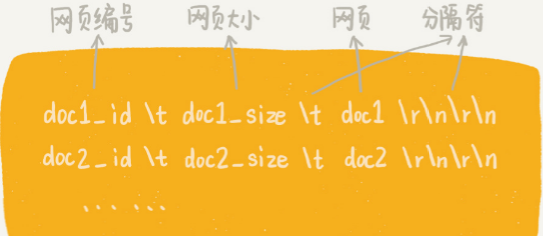
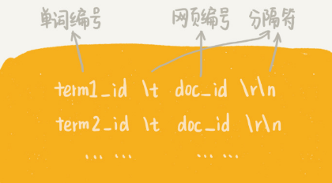
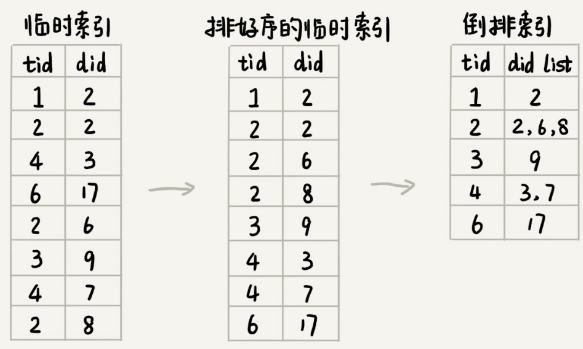
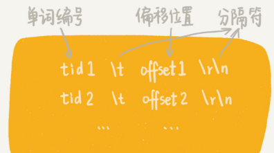

# 搜索引擎的理论基础

搜索引擎跟社交、电商这类产品相比，一个大的区别就是，它是一个技术驱动的产品。所谓技术驱动是指，搜索引擎实现起来，技术难度非常大，技术的好坏直接决定了这个产品的核心竞争力。

在搜索引擎的设计与实现中，会用到大量的算法。所以，百度、Google 这样的搜索引擎公司，在面试的时候，会格外重视考察候选人的算法能力。

**那数据结构和算法是如何应用在搜索引擎中的呢？**

## 实现一个小型搜索引擎的理论基础

像 Google 这样的大型商用搜索引擎，有成千上万的工程师，十年如一日地对它进行优化改进，所以，它所包含的技术细节非常多。接下来主要展示如何在一台机器上（假设这台机器的内存是 8GB， 硬盘是 100 多GB），通过少量的代码，实现一个小型搜索引擎。

搜索引擎大致可以分为四个部分：**搜集**、**分析**、**索引**、**查询**。

搜集：利用爬虫爬取网页。

分析：主要负责网页内容抽取、分词，构建临时索引，计算PageRank值。

索引：主要负责通过分析阶段得到的临时索引，构建倒排索引。

查询，主要负责响应用户的请求，根据倒排索引获取相关网页，计算网页排名，返回查询结果给用户。

## 搜集

搜索引擎把整个互联网看作数据结构中的有向图，把每个页面看作一个顶点。如果某个页面中包含另外一个页面的链接，那就在两个顶点之间连一条有向边。可以利用图的遍历搜索算法，可遍历整个互联网中的网页。

搜索引擎采用的是广度优先搜索策略，先找一些比较知名的网页（权重比较高）的链接（比如新浪、腾讯等），作为种子网页链接，放入到队列中。爬虫按照广度优先的策略，不停地从队列中取出链接爬取对应的网页，解析出网页里包含的其他网页链接，再将解析出来的链接添加到队列中。

具体到实现层面还涉及links.bin、bloom_filter.bin、doc_raw.bin和doc_id.bin这几个重要文件。

### 1. 待爬取网页链接文件：links.bin

在广度优先搜索爬取页面的过程中，爬虫会不停地解析页面链接，将其放到队列中。于是，队列中的链接就会越来越多，可能会多到内存放不下，所以队列会被存储在磁盘文件links.bin中。爬虫从links.bin文件中，取出链接去爬取对应的页面。等爬取到网页之后，再将解析出来的链接，直接存储到 links.bin 文件中。

用文件来存储网页链接还可以支持断点续爬，即当机器重启之后还可以从之前爬取到的位置继续爬取。

### 2. 网页判重文件：bloom_filter.bin

为了避免重复爬取相同的网页，将已经解析出的链接添加到布隆过滤器中。但是布隆过滤器存储在内存中，机器宕机重启之后，布隆过滤器就被清空了。

为了避免这个问题，可以定期地（比如每隔半小时）将布隆过滤器持久化到磁盘中，存储在bloom_filter.bin文件中。这样，即便出现机器宕机，也只会丢失布隆过滤器中的部分数据。当机器重启之后，就可以重新读取磁盘中的bloom_filter.bin文件，将其恢复到内存中。

### 3. 原始网页存储文件：doc_raw.bin

爬取到网页之后，需要将其存储下来，方便后面离线分析、建立索引。

如果把每个网页都存储为一个独立的文件，那磁盘中的文件就会非常多，数量可能会有几千万，甚至上亿。

为了避免这个问题，我们可以把多个网页存储在一个文件中。每个网页之间，通过一定的标识进行分隔。

具体的存储格式如下：

其中，doc_id 这个字段是网页的编号。

当然，一个文件也不能太大，可以设置每个文件的大小不能超过一定的值（比如 1GB）。当文件大小超过 1GB 的时候，就创建一个新的文件，用来存储新爬取的网页。

### 4. 网页链接及其编号的对应文件：doc_id.bin

维护一个中心的计数器，每爬取到一个网页之后，就从计数器中拿一个号码，分配给这个网页，然后计数器加一。在存储网页的同时将网页链接跟编号之间的对应关系，存储在另一个doc_id.bin文件中。

## 分析

网页爬取下来之后，需要对网页进行离线分析，包括抽取网页文本信息和分词并创建临时索引。

分析阶段涉及两个重要的文件，分别是临时索引文件（tmp_index.bin）和单词编号文件（term_id.bin）。

### 1. 抽取网页文本信息

网页是半结构化数据，**HTML 语法规范**，里面夹杂着各种标签、JavaScript代码、CSS样式。

要从半结构化的网页中，抽取出搜索引擎关系的文本信息：

首先要去掉 JavaScript 代码、CSS 格式以及下拉框中的内容（因为下拉框在用户不操作的情况下，也是看不到的）。也就是``，``，`<option></option>`这三组标签之间的内容。可以用 AC 自动机这种多模式串匹配算法查找这三组标签。

第二步是去掉所有的HTML 标签。

### 2. 分词并创建临时索引

经过上面的处理之后，要对文本信息进行分词，并且创建临时索引。

对于英文网页来说，分词非常简单。只需要通过空格、标点符号等分隔符，将每个单词分割开来就可以了。但对于中文来说，分词需要专门的规则。

分词最简单的实现思路是基于字典和规则，其中，字典也叫词库，里面包含大量常用的词语。借助词库并采用最长匹配规则，来对文本进行分词。所谓最长匹配，也就是匹配尽可能长的词语。比如要分词的文本是“中国人民解放了”，库中有“中国”“中国人”“中国人民”“中国人民解放军”这几个词，最长匹配就是“中国人民”。

具体到实现层面，可以将词库中的单词，构建成 Trie 树结构，然后拿网页文本在 Trie 树中匹配。

每个网页的文本信息在分词完成之后，都得到一组单词列表。将单词与网页之间的对应关系，写入到一个临时索引文件中（tmp_Index.bin），格式如下：

在临时索引文件中，存储的是单词编号，也就是图中的term_id，而非单词本身。给单词编号也是维护一个计数器，每当从网页文本信息中分割出一个新的单词的时候，就从计数器中取一个编号，分配给它，然后计数器加一。

这个全局计数器需要使用散列表记录已经编过号的单词。在对网页文本信息分词的过程中，拿分割出来的单词，先到散列表中查找，如果找到就直接使用已有的编号；如果没有找到，再去计数器中拿号码，并且将这个新单词以及编号添加到散列表中。

当所有的网页完成分词和写入临时索引之后，再将全局计数器的散列表中记录的单词跟编号之间的对应关系，写入到磁盘文件term_id.bin中 。

## 索引

索引阶段涉及两个有价值的文件，分别是倒排索引文件（index.bin）和记录单词编号在索引文件中的偏移位置的文件（term_offset.bin）。

索引阶段主要负责根据临时索引构建倒排索引（ Inverted index）。

倒排索引中记录了每个单词以及包含它的网页列表：

通过临时索引文件构建出倒排索引文件，解决这个问题的方法有很多。考虑到临时索引文件很大，无法一次性加载到内存中，搜索引擎一般会选择使用**多路归并排序**的方法来实现。

先对临时索引文件，按照单词编号的大小进行排序。因为临时索引很大，所以一般将其分割成多个小文件，先对每个小文件独立排序，最后再合并在一起。当然在实际的软件开发中，直接利用 MapReduce 来处理。

临时索引文件排序完成之后，相同的单词就被排列到了一起。只需要顺序地遍历排好序的临时索引文件，就能将每个单词对应的网页编号列表找出来，然后把它们存储在倒排索引文件中：

 

另外还用一个文件term_offset.bin，来记录每个单词编号在倒排索引文件中的偏移位置。

这个文件可以快速地查找某个单词编号在倒排索引中存储的位置，进而快速地从倒排索引中读取单词编号对应的网页编号列表。

## 查询

前面三个阶段得到以下文件：

- doc_id.bin：记录网页链接和编号之间的对应关系。
- term_id.bin：记录单词和编号之间的对应关系。
- index.bin：倒排索引文件，记录每个单词编号以及对应包含它的网页编号列表。
- term_offsert.bin：记录每个单词编号在倒排索引文件中的偏移位置。

这四个文件中，除了倒排索引文件（index.bin）比较大之外，其他的都比较小。为了方便快速查找数据将其他三个文件都加载到内存中，并且组织成散列表这种数据结构。

当用户在搜索框中，输入某个查询文本的时候，先对用户输入的文本进行分词处理。假设分分词之后得到 k 个单词，则拿这 k 个单词，去 term_id.bin 对应的散列表中，查找对应的单词编号。经过这个查询之后得到了这 k 个单词对应的单词编号。

拿这 k 个单词编号去 term_offset.bin 对应的散列表中，查找每个单词编号在倒排索引文件中的偏移位置。经过这个查询之后得到了 k 个偏移位置。然后拿这k个偏移位置，去倒排索引（index.bin）中，查找 k 个单词对应的包含它的网页编号列表。经过这一步查询之后得到了 k 个网页编号列表。

针对这 k 个网页编号列表，统计每个网页编号出现的次数。统计完成后按照每个网页编号出现次数从大到小排序。出现次数越多，说明包含越多的用户查询单词（用户输入的搜索文本，经过分词之后的单词）。

经过这一系列查询就得到了一组排好序的网页编号。我们拿着网页编号，去 doc_id.bin 文件中查找对应的网页链接，分页显示给用户就可以了。

