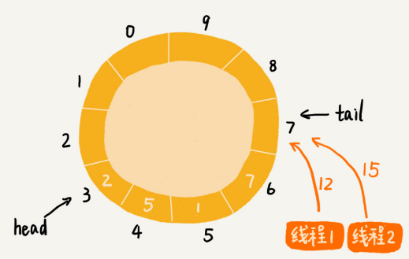
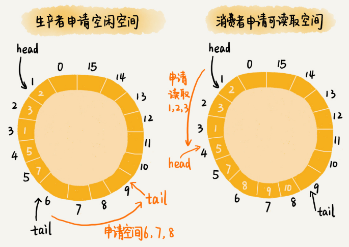

# 高性能队列Disruptor

Disruptor是一种内存消息队列。它类似Kafka，不过Disruptor 是线程之间用于消息传递的队列，它在 Apache Storm、Camel、Log4j等项目中都有广泛应用。

## 基于循环队列的“生产者 - 消费者模型”

在“生产者 - 消费者模型”这个模型中，“生产者”生产数据，并且将数据放到一个中心存储容器中。之后，“消费者”从中心存储容器中，取出数据消费。

实现中心存储容器最常用的一种数据结构是队列。队列有两种实现思路，一种是基于链表实现的链式队列，另一种是基于数组实现的顺序队列，顺序队列包括循环和非循环两种。

非循环的顺序队列在添加、删除数据的工程中，会涉及数据的搬移操作，导致性能变差。而循环队列正好可以解决这个数据搬移的问题，所以，性能更加好。所以，大部分用到顺序队列的场景中，都选择用顺序队列中的循环队列。

实际上，循环队列这种数据结构，就是Disruptor内存消息队列的雏形。借助循环队列，实现的一个最简单的“生产者 - 消费者模型”的代码：

```java
public class Queue {
  private Long[] data;
  private int size = 0, cls = 0, tail = 0;
  public Queue(int size) {
    this.data = new Long[size];
    this.size = size;
  }
 
  public boolean add(Long element) {
    if ((tail + 1) % size == cls) return false;
    data[tail] = element;
    tail = (tail + 1) % size;
    return true;
  }
 
  public Long poll() {
    if (cls == tail) return null;
    long ret = data[cls];
    cls = (cls + 1) % size;
    return ret;
  }
}
 
public class Producer {
  private Queue queue;
  public Producer(Queue queue) {
    this.queue = queue;
  }
 
  public void produce(Long data) throws InterruptedException {
    while (!queue.add(data)) {
      Thread.sleep(100);
    }
  }
}
 
public class Consumer {
  private Queue queue;
  public Consumer(Queue queue) {
    this.queue = queue;
  }
 
  public void comsume() throws InterruptedException {
    while (true) {
      Long data = queue.poll();
      if (data == null) {
        Thread.sleep(100);
      } else {
        // TODO:... 消费数据的业务逻辑...
      }
    }
  }
}
```

## 基于加锁的并发“生产者 - 消费者模型”

上面的“生产者 - 消费者模型”实现代码存在并发修改问题：

- 多个生产者写入的数据可能会互相覆盖；
- 多个消费者可能会读取重复的数据。

第一个问题产生的原因和解决方案：

两个线程同时往队列中添加数据，也就相当于两个线程同时执行类 Queue 中的 add() 函数。假设队列的大小 size 是 10，当前的 tail 指向下标 7，cls 指向下标 3，也就是说，队列中还有空闲空间。这个时候，线程 1 调用 add() 函数，往队列中添加一个值为 12 的数据；线程 2 调用add()函数，往队列中添加一个值为 15 的数据。在极端情况下，本来是往队列中添加了两个数据（12 和 15），最终可能只有一个数据添加成功，另一个数据会被覆盖：

 

解决这种线程并发往队列中添加数据时导致的数据覆盖、运行不正确问题，最简单的处理方法就是给这段代码加锁，同一时间只允许一个线程执行 add() 函数。这就相当于将这段代码的执行，由并行改成了串行。

不过加锁将并行改成串行，必然导致多个生产者同时生产数据的时候，执行效率的下降。当然可以继续优化代码，用[CAS](https://en.wikipedia.org/wiki/Compare-and-swap)（compare and swap，比较并交换）操作等减少加锁的粒度。

## 基于无锁的并发“生产者 - 消费者模型”

Disruptor的基本思想其实是换了一种队列和“生产者 - 消费者模型”的实现思路。

Disruptor 为了在保证逻辑正确的前提下，尽可能地提高队列在并发情况下的性能，采用了“两阶段写入”的方法。在写入数据之前，先加锁申请批量的空闲存储单元，之后往队列中写入数据的操作就不需要加锁了，写入的性能因此就提高了。Disruptor 对消费过程的改造，跟对生产过程的改造是类似的。它先加锁申请批量的可读取的存储单元，之后从队列中读取数据的操作也就不需要加锁了，读取的性能因此也就提高了。

生产者往队列中添加数据之前，先申请可用空闲存储单元，并且是批量地申请连续的 n 个（n≥1）存储单元。当申请到这组连续的存储单元之后，后续往队列中添加元素，就可以不用加锁了，因为这组存储单元是这个线程独享的。不过申请存储单元的过程是需要加锁的。

对于消费者来说，它先去申请一批连续可读的存储单元（这个申请的过程也是需要加锁的），当申请到这批存储单元之后，后续的读取操作就可以不用加锁了。

如果生产者A申请到了一组连续的存储单元下标为3到6，生产者B紧跟着申请到了下标是7到9的存储单元，那在3到6没有完全写入数据之前，7到9的数据是无法读取的。这也是Disruptor实现思路的一个弊端。

整个操作过程：



实际上，Disruptor采用的是RingBuffer和AvailableBuffer这两个结构，来实现上面所讲的功能。

具体实现可以查看源码：[https://github.com/LMAX-Exchange/disruptor](https://github.com/LMAX-Exchange/disruptor)

## 高性能并发全局ID生成器

为了提高存储性能，往往通过分库分表的方式设计数据库表。假设有8张表用来存储用户信息，这时每张用户表中的 ID 字段就不能通过自增的方式来产生了。因为这样的话，就会导致不同表之间的用户 ID 值重复。

如何设计一个高性能、支持并发的、能够生成全局唯一 ID 的 ID 生成器，为所有的用户表生成唯一的 ID 号呢？

使用Disruptor即可设计一个单生产者，多消费者的全局ID生成器。

