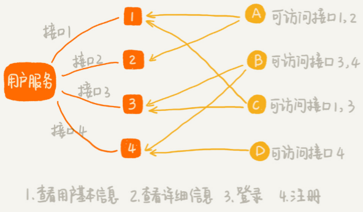
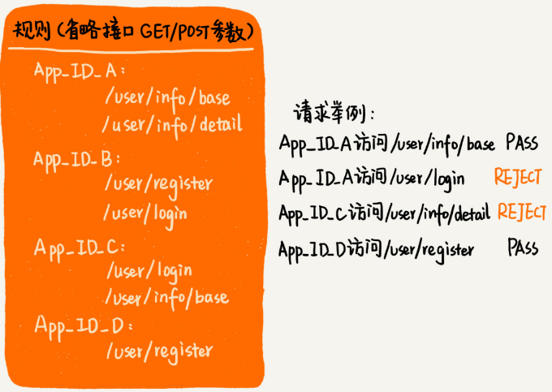
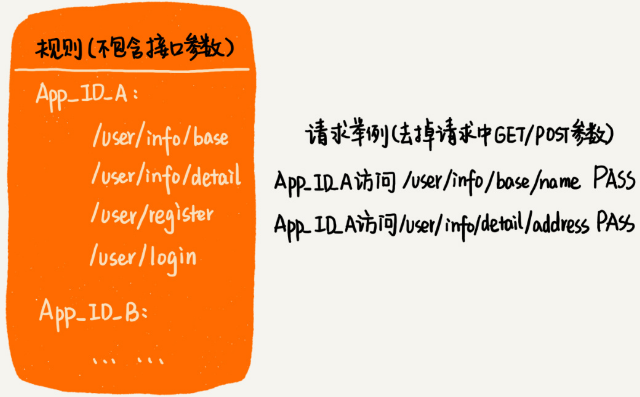
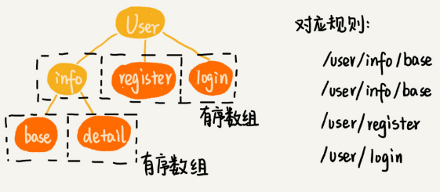
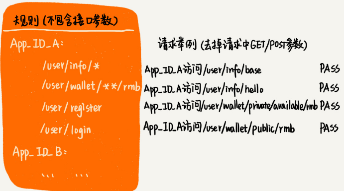
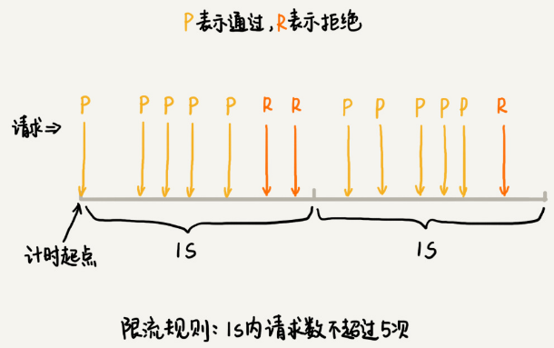
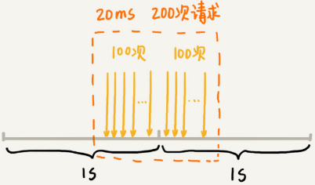
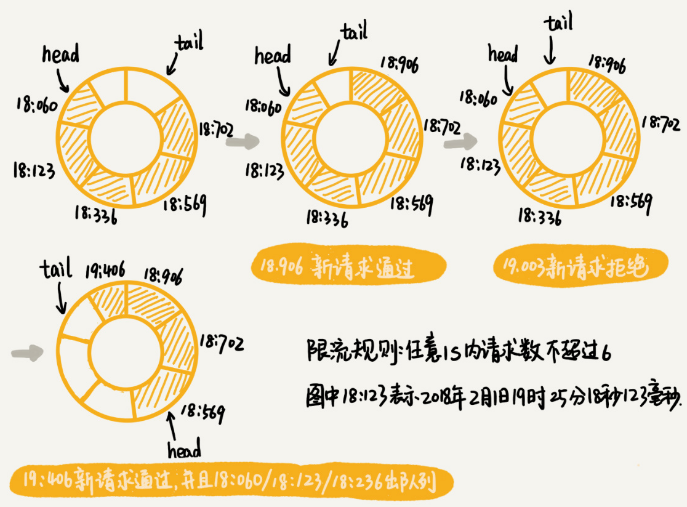

# 剖析微服务接口鉴权限流背后的数据结构和算法

微服务就是把复杂的大应用，解耦拆分成几个小的应用。

好处：利于团队组织架构的拆分，每个应用都可以独立运维，独立扩容，独立上线，各个应用之间互不影响，一个小功能上线，不需要整个大应用都重新发布。

弊端：服务之间的调用关系变得更复杂，平台的整体复杂熵升高，出错的概率、debug 问题的难度都高了好几个数量级。服务治理便成了微服务的一个技术重点。

服务治理就是管理微服务，保证平台整体正常、平稳地运行。服务治理涉及鉴权、限流、降级、熔断、监控告警等等。

这篇笔记仅记录鉴权和限流用到哪些数据结构和算法。

HTTP接口的访问限流框架： [https://github.com/wangzheng0822/ratelimiter4j]( https://github.com/wangzheng0822/ratelimiter4j) 

## 鉴权背景介绍

假设有一个微服务叫用户服务（User Service）。它提供很多用户相关的接口，比如获取用户信息、注册、登录等，给其他应用使用。但并不是所有应用，都可以访问这个用户服务，也并不是每个有访问权限的应用，都可以访问用户服务的所有接口。

比如下图，只有 A、B、C、D 四个应用可以访问用户服务，并且每个应用只能访问用户服务的部分接口。

要实现接口鉴权功能，需要事先设置好应用对接口的访问权限规则。当某个应用访问其中一个接口的时候，就拿应用的请求 URL，在规则中进行匹配。如果匹配成功，就说明允许访问；如果没有可以匹配的规则，那就说明这个应用没有这个接口的访问权限拒绝服务。

## 如何实现快速鉴权？

接口的格式有很多，有类似 Dubbo 这样的 RPC 接口，也有类似 Spring Cloud 这样的 HTTP 接口。不同接口的鉴权实现方式是类似的，这里主要拿 HTTP 接口讲解用到的数据结构。

### 1. 如何实现精确匹配规则？

精确匹配规则：只有当请求 URL 跟规则中配置的某个接口精确匹配时，这个请求才会被接受、处理。

用散列表存储应用和对应的权限规则列表，键可以是应用对应的对象或一行代表应用名称的字符串，值用一个字符串有序数组来存储。

要查找某个 URL 能否匹配其中某条规则的时候，可以采用二分查找在有序数组中进行匹配。

### 2. 如何实现前缀匹配规则？

前缀匹配规则：只要某条规则可以匹配请求 URL 的前缀，就说这条规则能够跟这个请求 URL 匹配。

同样采用散列表来存储应用与规则列表的关系。

Trie 树非常适合用来做前缀匹配。所以，针对这个需求可以将每个应用的规则集合，组织成 Trie 树这种数据结构。

不过，Trie树中的每个节点存储接口被“/”分割之后的子目录（比如“/user/name”被分割为“user”“name”两个子目录）。并把每个节点的子节点，组织成有序数组这种数据结构。

### 3. 如何实现模糊匹配规则？

如果规则中包含通配符，比如“\*\*”表示匹配任意多个子目录，“\*”表示匹配任意一个子目录。只要用户请求 URL 可以跟某条规则模糊匹配，就说这条规则适用于这个请求。

结合实际情况，并不是每条规则都包含通配符，包含通配符的只是少数。所以可以把不包含通配符的规则和包含通配符的规则分开处理。

把不包含通配符的规则，组织成有序数组或者 Trie 树（精确匹配就组织成有序数组，前缀匹配就组织成 Trie 树）

剩下的是少数包含通配符的规则，把它们简单存储在一个数组中就可以了。对于通配符规则需要采用回溯算法，拿请求 URL 跟每条规则逐一进行模糊匹配。详见前面的[24.回溯算法-正则表达式](24.回溯算法#正则表达式)一节。

当接收到一个请求 URL 之后，先在不包含通配符的有序数组或者 Trie 树中查找。如果能够匹配，就不需要继续在通配符规则中匹配了；如果不能匹配，就继续在通配符规则中查找匹配。

## 限流背景介绍

限流就是对接口调用的频率进行限制，比如每秒钟不能超过 100 次调用，超过之后就拒绝服务。

限流在秒杀、大促、双11、618 等场景中发挥着重要的作用，已经成为了保证系统平稳运行的一种标配的技术解决方案。

按照不同的限流粒度，限流可以分为很多种类型：

- 给所有接口限制总的访问频率
- 给每个接口限制不同的访问频率
- 限制某个应用对某个接口的访问频率

下面仅针对限制所有接口总的访问频率这样一个限流需求来举例。

## 如何实现精准限流？

最简单的限流算法叫**固定时间窗口限流算法**。这种算法首先需要选定一个时间起点，之后每当有接口请求到来就将计数器加一。如果在当前时间窗口内，根据限流规则（比如每秒钟最大允许 100 次访问请求），出现累加访问次数超过限流值的情况时，就拒绝后续的访问请求。当进入下一个时间窗口之后，计数器就清零重新计数。

基于固定时间窗口的限流算法的缺点是限流策略过于粗略，无法应对两个时间窗口临界时间内的突发流量。

假设在两个时间窗口临界的 20ms 内，会集中有 200 次接口请求。固定时间窗口限流算法并不能对这种情况做限制，所以，集中在这 20ms 内的 200 次请求就有可能压垮系统。

为了解决这个问题，可以限制任意时间窗口（比如 1s）内，接口请求数都不能超过某个阈值（ 比如 100 次），这个算法叫**滑动时间窗口限流算法**。

假设限流的规则是，在任意 1s 内接口的请求次数都不能大于 K 次。维护一个大小为 K+1 的循环队列（需要一个存储单元作哨兵），用来记录 1s 内到来的请求。

当有新的请求到来时，将与这个新请求的时间间隔超过 1s 的请求，从队列中删除。来看循环队列中是否有空闲位置。如果有，则把新请求存储在队列尾部（tail 指针所指的位置）；如果没有则说明这 1 秒内的请求次数已经超过了限流值 K，所以这个请求被拒绝服务。

假设限流的规则是，任意 1s 内接口的请求次数都不能大于 6 次：

虽然滑动时间窗口限流算法可以保证任意时间窗口内，接口请求次数都不会超过最大限流值，但是仍然不能防止，在细时间粒度上访问过于集中的问题。

比如上面的例子，第一个 1s 的时间窗口内，100 次请求都集中在最后 10ms 中，也就是说，基于时间窗口的限流算法，不管是固定时间窗口还是滑动时间窗口，只能在选定的时间粒度上限流，对选定时间粒度内的更加细粒度的访问频率不做限制。

针对这个问题，还有很多更加平滑的限流算法，比如令牌桶算法、漏桶算法等。

