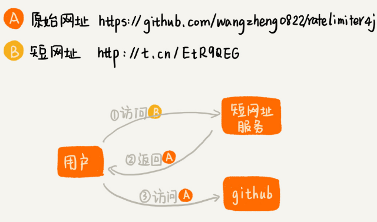
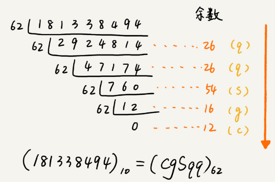
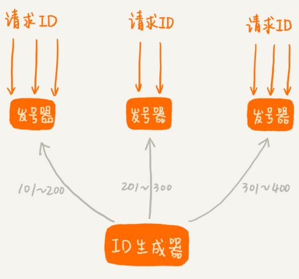
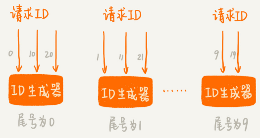

# 短网址服务系统

比如在微博里发布一条带网址的信息，微博会把里面的网址转化成一个更短的网址，只要访问这个短网址，就相当于访问原始的网址。

从功能上讲，短网址服务其实就是把一个长的网址转化成一个短的网址。

## 短网址服务整体介绍

短网址服务的一个核心功能就是把原始的长网址转化成短网址。

浏览器会先访问短网址服务，短网址服务返回原始网址给游览器，游览器识别到重定向语法再去访问原始网址。

下面将讲到短网址服务的两种实现方法：

第一种实现思路是通过哈希算法生成短网址。采用MurmurHash 算法，并将计算得到的 10 进制数，转化成 62 进制表示法，进一步缩短短网址的长度。对于哈希算法的哈希冲突问题，通过给原始网址添加特殊前缀字符，重新计算哈希值的方法来解决。

第二种实现思路是通过 ID 生成器来生成短网址。维护一个 ID 自增的 ID 生成器，给每个原始网址分配一个 ID 号码，并且同样转成 62 进制表示法，拼接到短网址服务的域名之后，形成最终的短网址。

## 哈希算法生成短网址

哈希算法可以将一个不管多长的字符串，转化成一个长度固定的哈希值，所以可以利用哈希算法来生成短网址。

在生成短网址这个问题上，只需要关心哈希算法的计算速度和冲突概率。能够满足这样要求的哈希算法有很多，其中比较著名并且应用广泛的一个哈希算法，那就是[MurmurHash 算法](https://zh.wikipedia.org/wiki/Murmur哈希)。尽管这个哈希算法在 2008 年才被发明出来，但现在它已经广泛应用到 Redis、MemCache、Cassandra、HBase、Lucene 等众多著名的软件中。

MurmurHash 算法提供了两种长度的哈希值，一种是 32bits，一种是 128bits。为了让最终生成的短网址尽可能短，可以选择 32bits 的哈希值。为了让32bits 表示的字符串的更短，可以用0～9、a～z、A～Z组合的62进制表示。具体计算方法是将32bits的数字用10进制表示，然后不断62取余数。

### 解决哈希冲突问题

尽管MurmurHash算法，冲突的概率非常低。但是一旦冲突就会导致两个原始网址被转化成同一个短网址。

当有一个新的原始网址需要生成短网址的时候，先利用 MurmurHash 算法，生成短网址。然后拿这个生成的短网址，在数据库中查找。如果找到了相同的短网址，那就将这个短网址对应的原始网址取出来。如果数据库存储的这个短网址对应的原始网址，跟现在正在处理的原始网址是一样的，就可以拿这个短网址直接用。

如果数据库中记录的原始网址，跟正在处理的原始网址不一样，那就说明哈希算法发生了冲突。此时给原始网址拼接一串特殊字符，比如“[DUPLICATED]”，再重新计算哈希值，生成短网址，重复上面的步骤。

假设出现非常极端的情况，又发生冲突了，可以再换一个拼接字符串，比如“[FUCK]”，再计算哈希值。然后把计算得到的哈希值，跟原始网址拼接了特殊字符串之后的文本，一并存储在 MySQL 数据库中。

当用户访问短网址的时候，短网址服务先通过短网址，在数据库中查找到对应的原始网址。如果原始网址有拼接特殊字符，就先将特殊字符去掉，然后再将不包含特殊字符的原始网址返回给浏览器。

### 优化哈希算法生成短网址的性能

在短网址生成的过程中，需要跟数据库打两次交道，也就是会执行两条 SQL 语句。第一个 SQL 语句是通过短网址查询短网址与原始网址的对应关系，第二个 SQL 语句是将新生成的短网址和原始网址之间的对应关系存储到数据库。

两条 SQL 语句的执行需要两次网络通信。这种 IO 通信耗时以及 SQL 语句的执行，才是整个短网址服务的性能瓶颈所在。所以，为了提高性能，需要尽量减少 SQL 语句。将短网址字段设置为主键，这样能自动添加索引还能要求不重复。

把已经生成的短网址，构建成布隆过滤器。布隆过滤器是比较节省内存的一种存储结构，长度是 10 亿的布隆过滤器，也只需要 125MB 左右的内存空间。

当有新的短网址生成的时候，先拿这个新生成的短网址，在布隆过滤器中查找。如果查找的结果是不存在，那就说明这个新生成的短网址并没有冲突。此时直接将生成的短网址与对应的原始网址，尝试存储到数据库中。

如果布隆过滤器出现误判，数据库反馈违反唯一性索引异常，那就重新执行上面讲到的“查询、写入”过程。由于设计良好的布隆过滤器误判率极低，基本只需要执行一条写入的 SQL 语句就可以了。

## ID生成器生成短网址

维护一个 ID 自增生成器，它可以生成 1、2、3…这样自增的整数 ID。当短网址服务接收到一个原始网址转化成短网址的请求之后，它先从 ID 生成器中取一个号码，然后将其转化成 62 进制表示法，拼接到短网址服务的域名（比如http://t.cn/）后面，就形成了最终的短网址。最后把生成的短网址和对应的原始网址存储到数据库中。

### 相同原始网址可能对应不同的短网址的处理方式

直接这种方式可能会导致相同的原始网址对应不同的短网址，有允许和不允许两种处理方式：

**1.允许相同的原始网址对应不同的短网址**

实际上，相同的原始网址对应不同的短网址，这个用户是可以接受的。在大部分短网址的应用场景里，用户只关心短网址能否正确地跳转到原始网址。至于短网址长什么样子，其实根本就不关心。所以，即便是同一个原始网址，两次生成的短网址不一样，也并不会影响到用户的使用，所以不做处理也无妨。

**2.一个原始网址只能对应唯一的一个短网址**

给一个原始网址生成短网址的时候，先拿原始网址在数据库中查找。如果数据库中已经存在，那就取出对应的短网址，直接返回给用户；否则将短网址插入到数据库。

不过，这样导致需要给数据库中的短网址和原始网址这两个字段，都添加索引。短网址字段加索引是为了提高用户查询短网址对应的原始网页的速度；原始网址字段加索引是为了加快刚刚讲的通过原始网址查询短网址的速度。

代价是两个索引需要占用更多的存储空间，还会导致插入、删除等操作性能的下降。

### 提高ID生成器的性能

实现 ID 生成器的最简单的方法是利用数据库自增字段。

如果自己维护一个计数器，如何提高 ID生成器的并发性能呢？

1.可以给 ID 生成器装多个前置发号器，批量地给每个前置发号器发送 ID 号码。接受到短网址生成请求的时候，就选择一个前置发号器来取号码。这样通过多个前置发号器，明显提高了并发发号的能力。

2.直接实现多个 ID 生成器同时服务。为了保证每个 ID 生成器生成的 ID 不重复。要求每个 ID 生成器按照一定的规则，来生成 ID 号码。比如：

这样通过多个 ID 生成器同时工作，也提高了 ID 生成的效率。