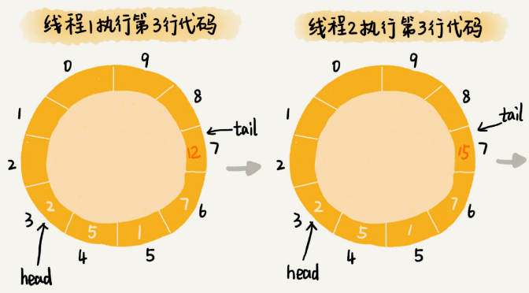
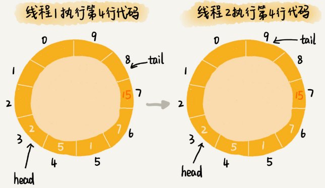

# 剖析高性能队列Disruptor背后的数据结构和算法

Disruptor 你是否听说过呢？它是一种内存消息队列。从功能上讲，它其实有点儿类似 Kafka。不过，和 Kafka 不同的是，Disruptor 是线程之间用于消息传递的队列。它在 Apache Storm、Camel、Log4j 2 等很多知名项目中都有广泛应用。

之所以如此受青睐，主要还是因为它的性能表现非常优秀。它比 Java 中另外一个非常常用的内存消息队列 ArrayBlockingQueue（ABS）的性能，要高一个数量级，可以算得上是最快的内存消息队列了。它还因此获得过 Oracle 官方的 Duke 大奖。

如此高性能的内存消息队列，在设计和实现上，必然有它独到的地方。今天，我们就来一块儿看下，**Disruptor 是如何做到如此高性能的？其底层依赖了哪些数据结构和算法？**

## 基于循环队列的“生产者 - 消费者模型”

什么是内存消息队列？对很多业务工程师或者前端工程师来说，可能会比较陌生。不过，如果我说“生产者 - 消费者模型”，估计大部分人都知道。在这个模型中，“生产者”生产数据，并且将数据放到一个中心存储容器中。之后，“消费者”从中心存储容器中，取出数据消费。

这个模型非常简单、好理解，那你有没有思考过，这里面存储数据的中心存储容器，是用什么样的数据结构来实现的呢？

实际上，实现中心存储容器最常用的一种数据结构，就是我们在[第 9 节](https://time.geekbang.org/column/article/41330)讲的队列。队列支持数据的先进先出。正是这个特性，使得数据被消费的顺序性可以得到保证，也就是说，早被生产的数据就会早被消费。

我们在第 9 节讲过，队列有两种实现思路。一种是基于链表实现的链式队列，另一种是基于数组实现的顺序队列。不同的需求背景下，我们会选择不同的实现方式。

如果我们要实现一个无界队列，也就是说，队列的大小事先不确定，理论上可以支持无限大。这种情况下，我们适合选用链表来实现队列。因为链表支持快速地动态扩容。如果我们要实现一个有界队列，也就是说，队列的大小事先确定，当队列中数据满了之后，生产者就需要等待。直到消费者消费了数据，队列有空闲位置的时候，生产者才能将数据放入。

实际上，相较于无界队列，有界队列的应用场景更加广泛。毕竟，我们的机器内存是有限的。而无界队列占用的内存数量是不可控的。对于实际的软件开发来说，这种不可控的因素，就会有潜在的风险。在某些极端情况下，无界队列就有可能因为内存持续增长，而导致 OOM（Out of Memory）错误。

在第 9 节中，我们还讲过一种特殊的顺序队列，循环队列。我们讲过，非循环的顺序队列在添加、删除数据的工程中，会涉及数据的搬移操作，导致性能变差。而循环队列正好可以解决这个数据搬移的问题，所以，性能更加好。所以，大部分用到顺序队列的场景中，我们都选择用顺序队列中的循环队列。

实际上，**循环队列这种数据结构，就是我们今天要讲的内存消息队列的雏形。**我借助循环队列，实现了一个最简单的“生产者 - 消费者模型”。对应的代码我贴到这里，你可以看看。

为了方便你理解，对于生产者和消费者之间操作的同步，我并没有用到线程相关的操作。而是采用了“当队列满了之后，生产者就轮训等待；当队列空了之后，消费者就轮训等待”这样的措施。

```java
public class Queue {
  private Long[] data;
  private int size = 0, cls = 0, tail = 0;
  public Queue(int size) {
    this.data = new Long[size];
    this.size = size;
  }
 
  public boolean add(Long element) {
    if ((tail + 1) % size == cls) return false;
    data[tail] = element;
    tail = (tail + 1) % size;
    return true;
  }
 
  public Long poll() {
    if (cls == tail) return null;
    long ret = data[cls];
    cls = (cls + 1) % size;
    return ret;
  }
}
 
public class Producer {
  private Queue queue;
  public Producer(Queue queue) {
    this.queue = queue;
  }
 
  public void produce(Long data) throws InterruptedException {
    while (!queue.add(data)) {
      Thread.sleep(100);
    }
  }
}
 
public class Consumer {
  private Queue queue;
  public Consumer(Queue queue) {
    this.queue = queue;
  }
 
  public void comsume() throws InterruptedException {
    while (true) {
      Long data = queue.poll();
      if (data == null) {
        Thread.sleep(100);
      } else {
        // TODO:... 消费数据的业务逻辑...
      }
    }
  }
}
```

## 基于加锁的并发“生产者 - 消费者模型”

实际上，刚刚的“生产者 - 消费者模型”实现代码，是不完善的。为什么这么说呢？

如果我们只有一个生产者往队列中写数据，一个消费者从队列中读取数据，那上面的代码是没有问题的。但是，如果有多个生产者在并发地往队列中写入数据，或者多个消费者并发地从队列中消费数据，那上面的代码就不能正确工作了。我来给你讲讲为什么。

在多个生产者或者多个消费者并发操作队列的情况下，刚刚的代码主要会有下面两个问题：

- 多个生产者写入的数据可能会互相覆盖；
- 多个消费者可能会读取重复的数据。

因为第一个问题和第二个问题产生的原理是类似的。所以，我着重讲解第一个问题是如何产生的以及该如何解决。对于第二个问题，你可以类比我对第一个问题的解决思路自己来想一想。

两个线程同时往队列中添加数据，也就相当于两个线程同时执行类 Queue 中的 add() 函数。我们假设队列的大小 size 是 10，当前的 tail 指向下标 7，cls 指向下标 3，也就是说，队列中还有空闲空间。这个时候，线程 1 调用 add() 函数，往队列中添加一个值为 12 的数据；线程 2 调用 add() 函数，往队列中添加一个值为 15 的数据。在极端情况下，本来是往队列中添加了两个数据（12 和 15），最终可能只有一个数据添加成功，另一个数据会被覆盖。这是为什么呢？


为了方便你查看队列 Queue 中的 add() 函数，我把它从上面的代码中摘录出来，贴在这里。

```java
public boolean add(Long element) {
  if ((tail + 1) % size == cls) return false;
  data[tail] = element;
  tail = (tail + 1) % size;
  return true;
}
```

从这段代码中，我们可以看到，第 3 行给 data[tail] 赋值，然后第 4 行才给 tail 的值加一。赋值和 tail 加一两个操作，并非原子操作。这就会导致这样的情况发生：当线程 1 和线程 2 同时执行 add() 函数的时候，线程 1 先执行完了第 3 行语句，将 data[7]（tail 等于 7）的值设置为 12。在线程 1 还未执行到第 4 行语句之前，也就是还未将 tail 加一之前，线程 2 执行了第 3 行语句，又将 data[7] 的值设置为 15，也就是说，那线程 2 插入的数据覆盖了线程 1 插入的数据。原本应该插入两个数据（12 和 15）的，现在只插入了一个数据（15）。





那如何解决这种线程并发往队列中添加数据时，导致的数据覆盖、运行不正确问题呢？

最简单的处理方法就是给这段代码加锁，同一时间只允许一个线程执行 add() 函数。这就相当于将这段代码的执行，由并行改成了串行，也就不存在我们刚刚说的问题了。

不过，天下没有免费的午餐，加锁将并行改成串行，必然导致多个生产者同时生产数据的时候，执行效率的下降。当然，我们可以继续优化代码，用[CAS](https://en.wikipedia.org/wiki/Compare-and-swap)（compare and swap，比较并交换）操作等减少加锁的粒度，但是，这不是我们这节的重点。我们直接看 Disruptor 的处理方法。

## 基于无锁的并发“生产者 - 消费者模型”

尽管 Disruptor 的源码读起来很复杂，但是基本思想其实非常简单。实际上，它是换了一种队列和“生产者 - 消费者模型”的实现思路。

之前的实现思路中，队列只支持两个操作，添加数据和读取并移除数据，分别对应代码中的 add() 函数和 poll() 函数，而 Disruptor 采用了另一种实现思路。

对于生产者来说，它往队列中添加数据之前，先申请可用空闲存储单元，并且是批量地申请连续的 n 个（n≥1）存储单元。当申请到这组连续的存储单元之后，后续往队列中添加元素，就可以不用加锁了，因为这组存储单元是这个线程独享的。不过，从刚刚的描述中，我们可以看出，申请存储单元的过程是需要加锁的。

对于消费者来说，处理的过程跟生产者是类似的。它先去申请一批连续可读的存储单元（这个申请的过程也是需要加锁的），当申请到这批存储单元之后，后续的读取操作就可以不用加锁了。

不过，还有一个需要特别注意的地方，那就是，如果生产者 A 申请到了一组连续的存储单元，假设是下标为 3 到 6 的存储单元，生产者 B 紧跟着申请到了下标是 7 到 9 的存储单元，那在 3 到 6 没有完全写入数据之前，7 到 9 的数据是无法读取的。这个也是 Disruptor 实现思路的一个弊端。

文字描述不好理解，我画了一个图，给你展示一下这个操作过程。


实际上，Disruptor 采用的是 RingBuffer 和 AvailableBuffer 这两个结构，来实现我刚刚讲的功能。不过，因为我们主要聚焦在数据结构和算法上，所以我对这两种结构做了简化，但是基本思想是一致的。如果你对 Disruptor 感兴趣，可以去阅读一下它的[源码](https://github.com/LMAX-Exchange/disruptor)。

## 总结引申

今天，我讲了如何实现一个高性能的并发队列。这里的“并发”两个字，实际上就是多线程安全的意思。

常见的内存队列往往采用循环队列来实现。这种实现方法，对于只有一个生产者和一个消费者的场景，已经足够了。但是，当存在多个生产者或者多个消费者的时候，单纯的循环队列的实现方式，就无法正确工作了。

这主要是因为，多个生产者在同时往队列中写入数据的时候，在某些情况下，会存在数据覆盖的问题。而多个消费者同时消费数据，在某些情况下，会存在消费重复数据的问题。

针对这个问题，最简单、暴力的解决方法就是，对写入和读取过程加锁。这种处理方法，相当于将原来可以并行执行的操作，强制串行执行，相应地就会导致操作性能的下降。

为了在保证逻辑正确的前提下，尽可能地提高队列在并发情况下的性能，Disruptor 采用了“两阶段写入”的方法。在写入数据之前，先加锁申请批量的空闲存储单元，之后往队列中写入数据的操作就不需要加锁了，写入的性能因此就提高了。Disruptor 对消费过程的改造，跟对生产过程的改造是类似的。它先加锁申请批量的可读取的存储单元，之后从队列中读取数据的操作也就不需要加锁了，读取的性能因此也就提高了。

你可能会觉得这个优化思路非常简单。实际上，不管架构设计还是产品设计，往往越简单的设计思路，越能更好地解决问题。正所谓“大道至简”，就是这个意思。

## 课后思考

为了提高存储性能，我们往往通过分库分表的方式设计数据库表。假设我们有 8 张表用来存储用户信息。这个时候，每张用户表中的 ID 字段就不能通过自增的方式来产生了。因为这样的话，就会导致不同表之间的用户 ID 值重复。

为了解决这个问题，我们需要实现一个 ID 生成器，可以为所有的用户表生成唯一的 ID 号。那现在问题是，如何设计一个高性能、支持并发的、能够生成全局唯一 ID 的 ID 生成器呢？

