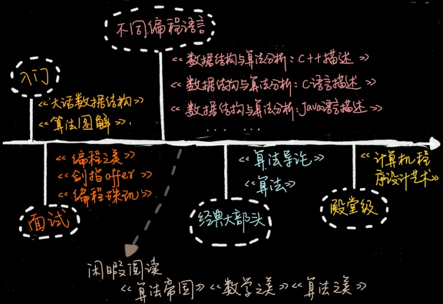

# 《数据结构与算法之美》

本文档是个人对[《数据结构与算法之美》](http://gk.link/a/108GK)的学习笔记和编写的python实现的相关代码。

## 学习路线

---

## 笔记目录

[filename](_sidebar.md  ':include')

---

## 数据结构与算法学习书单

### 针对入门的趣味书

入门的同学，我建议你不要过度追求上去就看经典书。像《算法导论》《算法》这些书，虽然比较经典、比较权威，但是非常厚。初学就去啃这些书肯定会很费劲。而一旦啃不下来，挫败感就会很强。所以，入门的同学，我建议你找一些比较容易看的书来看，比如《大话数据结构》和《算法图解》。**不要太在意书写得深浅，重要的是能不能坚持看完。**

《**大话数据结构**》 这本书最大的特点是，它把理论讲得很有趣，不枯燥。而且每个数据结构和算法，作者都结合生活中的例子进行了讲解， 能让你有非常直观的感受。虽然这本书有 400 多页，但是花两天时间读完，应该是没问题的。如果你之前完全不懂数据结构和算法，可以先从这本书看起。

《**算法图解**》 跟《大话数据结构》走的是同样的路线，就像这本书副标题写的那样，“像小说一样有趣的算法入门书”，主打“图解”，通俗易懂。它只有不到 200 页，所以内容比较少。作为入门，看看这本书，能让你对数据结构和算法有个大概的认识。

这些入门书共同的问题是，缺少细节，不够系统，也不够严谨。所以，如果你想要系统地学数据结构和算法，看这两本书肯定是不够的。

### 针对特定编程语言的教科书

讲数据结构和算法，肯定会跟代码实现挂钩。所以，很多人就很关心，某某书籍是用什么语言实现的，是不是自己熟悉的语言。市面大部分数据结构和算法书籍都是用 C、C++、Java 语言实现的，还有些是用伪代码。而使用 Python、Go、PHP、JavaScript、Objective-C 这些编程语言实现的就更少了。

我这里推荐《数据结构和算法分析》。国内外很多大学都拿这本书当作教材。这本书非常系统、全面、严谨，而且又不是特别难，适合对数据结构和算法有些了解，并且掌握了至少一门编程语言的同学。而且，这个作者也很用心。他用了三种语言，写了三个版本，分别是：《**数据结构与算法分析 ：C 语言描述**》《**数据结构与算法分析：C++ 描述**》《**数据结构与算法分析：Java 语言描述**》。

如果你熟悉的是 Python 或者 JavaScript，可以参考《**数据结构与算法 JavaScript 描述**》《**数据结构与算法：Python 语言描述**》 。至于其他语言的算法书籍，确实比较少。如果你有推荐，可以在留言区补充一下。

### 面试必刷的宝典

算法对面试很重要，很多人也很关心。我这里推荐几本有益于面试的书籍，分别是：《剑指 offer》《编程珠玑》《编程之美》。

从《**剑指 offer**》这本书的名字就可以看出，作者的写作目的非常明确，就是为了面试。这本书几乎包含了所有常见的、经典的面试题。如果能搞懂这本书里的内容，应付一般公司的面试应该不成问题。

《**编程珠玑**》这本书的豆瓣评分非常高，有 9 分。这本书最大的特色就是讲了很多针对海量数据的处理技巧。这个可能是其他算法书籍很少涉及的。面试的时候，海量数据处理的问题也是经常会问的，特别是校招面试。不管是开拓眼界，还是应付面试，这本书都很值得一看。

《**编程之美**》这本书有多位作者，其中绝大部分是微软的工程师，所以书的质量很有保证。不过，这里面的算法题目稍微有点难，也不是很系统，这也是我把它归到面试这一部分的原因。如果你有一定基础，也喜欢钻研些算法问题，或者要面试 Google、Facebook 这样的公司，可以拿这本书里的题，先来自测一下。

### 经典大部头

很多人一提到算法书就会搬出《算法导论》和《算法》。这两本确实非常经典，但是都太厚了，看起来比较费劲，我估计很少有人能坚持全部看下来。如果你想更加深入地学一学数据结构和算法，我还是强烈建议你看看。

我个人觉得，《**算法导论**》这本书的章节安排不是循序渐进的，里面充斥着各种算法的正确性、复杂度的证明、推导，数学公式比较多，一般人看起来会比较吃力。所以，作为入门书籍，并不是很推荐。

《**算法**》这本书也是一本经典大部头，不过它比起《算法导论》来要友好很多，更容易看懂，更适合初学者入门。但是这本书的缺点也很明显，就是内容不够全面，比如动态规划这么重要的知识点，这本书就没有讲。对于数据结构的东西，它讲的也不多，基本就是偏重讲算法。

### 殿堂级经典

说到殿堂级经典书，如果《**计算机程序设计艺术**》称第二，我想没人敢称第一。这本书包括很多卷。说实话，我也只看过比较简单的几卷，比如《基本算法》《排序和查找》。

这套书的深度、广度、系统性、全面性是其他所有数据结构和算法书籍都无法相比的。但是，如果你对算法和数据结构不是特别感兴趣，没有很好的数学、算法、计算机基础，想要把这套书读完、读懂是比较难的。你可以把它当作你算法学习的终极挑战。

### 闲暇阅读

算法无处不在。我这里再推荐几本适合闲暇时间阅读的书：《**算法帝国**》《**数学之美**》《**算法之美**》。

这些书共同的特点是，都列举了大量的例子，非常通俗易懂。夸张点说，像《算法帝国》，文科生都能读懂。当你看这些书的时候，你常常会深深感受到算法的力量，被算法的优美之处折服。即便不是从事 IT 工作的，看完这几本书也可以开拓眼界。

---

## 原课程目录

极客时间的《数据结构与算法之美》[http://gk.link/a/108GK](http://gk.link/a/108GK)

作者本人的代码地址：

[https://github.com/wangzheng0822/algo](https://github.com/wangzheng0822/algo)

| 原课程目录 |
| :--- |
|  **01-开篇词 (1讲)**  |
|  00丨开篇词丨从今天起，跨过“数据结构与算法”这道坎  |
|  **02-入门篇 (4讲)**  |
|  01丨为什么要学习数据结构和算法？  |
|  02丨如何抓住重点，系统高效地学习数据结构与算法？  |
|  03丨复杂度分析（上）：如何分析、统计算法的执行效率和资源消耗？  |
|  04丨复杂度分析（下）：浅析最好、最坏、平均、均摊时间复杂度  |
|  **03-基础篇 (38讲)**  |
|  05丨数组：为什么很多编程语言中数组都从0开始编号？  |
|  06丨链表（上）：如何实现LRU缓存淘汰算法？  |
|  07丨链表（下）：如何轻松写出正确的链表代码？  |
|  08丨栈：如何实现浏览器的前进和后退功能？  |
|  09丨队列：队列在线程池等有限资源池中的应用  |
|  10丨递归：如何用三行代码找到“最终推荐人”？  |
|  11丨排序（上）：为什么插入排序比冒泡排序更受欢迎？  |
|  12丨排序（下）：如何用快排思想在O(n)内查找第K大元素？  |
|  13丨线性排序：如何根据年龄给100万用户数据排序？  |
|  14丨排序优化：如何实现一个通用的、高性能的排序函数？  |
|  15丨二分查找（上）：如何用最省内存的方式实现快速查找功能？  |
|  16丨二分查找（下）：如何快速定位IP对应的省份地址？  |
|  17丨跳表：为什么Redis一定要用跳表来实现有序集合？  |
|  18丨散列表（上）：Word文档中的单词拼写检查功能是如何实现的？  |
|  19丨散列表（中）：如何打造一个工业级水平的散列表？  |
|  20丨散列表（下）：为什么散列表和链表经常会一起使用？  |
|  21丨哈希算法（上）：如何防止数据库中的用户信息被脱库？  |
|  22丨哈希算法（下）：哈希算法在分布式系统中有哪些应用？  |
|  23丨二叉树基础（上）：什么样的二叉树适合用数组来存储？  |
|  24丨二叉树基础（下）：有了如此高效的散列表，为什么还需要二叉树？  |
|  25丨红黑树（上）：为什么工程中都用红黑树这种二叉树？  |
|  26丨红黑树（下）：掌握这些技巧，你也可以实现一个红黑树  |
|  27丨递归树：如何借助树来求解递归算法的时间复杂度？  |
|  28丨堆和堆排序：为什么说堆排序没有快速排序快？  |
|  29丨堆的应用：如何快速获取到Top10最热门的搜索关键词？  |
|  30丨图的表示：如何存储微博、微信等社交网络中的好友关系？  |
|  31丨深度和广度优先搜索：如何找出社交网络中的三度好友关系？  |
|  32丨字符串匹配基础（上）：如何借助哈希算法实现高效字符串匹配？  |
|  33丨字符串匹配基础（中）：如何实现文本编辑器中的查找功能？  |
|  34丨字符串匹配基础（下）：如何借助BM算法轻松理解KMP算法？  |
|  35丨Trie树：如何实现搜索引擎的搜索关键词提示功能？  |
|  36丨AC自动机：如何用多模式串匹配实现敏感词过滤功能？  |
|  37丨贪心算法：如何用贪心算法实现Huffman压缩编码？  |
|  38丨分治算法：谈一谈大规模计算框架MapReduce中的分治思想  |
|  39丨回溯算法：从电影《蝴蝶效应》中学习回溯算法的核心思想  |
|  40丨初识动态规划：如何巧妙解决“双十一”购物时的凑单问题？  |
|  41丨动态规划理论：一篇文章带你彻底搞懂最优子结构、无后效性和重复子问题  |
|  42丨动态规划实战：如何实现搜索引擎中的拼写纠错功能？  |
|  **04-高级篇 (9讲)**  |
|  43丨拓扑排序：如何确定代码源文件的编译依赖关系？  |
|  44丨最短路径：地图软件是如何计算出最优出行路径的？  |
|  45丨位图：如何实现网页爬虫中的URL去重功能？  |
|  46丨概率统计：如何利用朴素贝叶斯算法过滤垃圾短信？  |
|  47丨向量空间：如何实现一个简单的音乐推荐系统？  |
|  48丨B+树：MySQL数据库索引是如何实现的？  |
|  49丨搜索：如何用A搜索算法实现游戏中的寻路功能？  |
|  50丨索引：如何在海量数据中快速查找某个数据？  |
|  51丨并行算法：如何利用并行处理提高算法的执行效率？  |
|  **05-实战篇 (5讲)**  |
|  52丨算法实战（一）：剖析Redis常用数据类型对应的数据结构  |
|  53丨算法实战（二）：剖析搜索引擎背后的经典数据结构和算法  |
|  54丨算法实战（三）：剖析高性能队列Disruptor背后的数据结构和算法  |
|  55丨算法实战（四）：剖析微服务接口鉴权限流背后的数据结构和算法  |
|  56丨算法实战（五）：如何用学过的数据结构和算法实现一个短网址系统？  |
|  **06-加餐：不定期福利 (6讲)**  |
|  《数据结构与算法之美》学习指导手册  |
|  不定期福利第一期丨数据结构与算法学习书单  |
|  不定期福利第三期丨测一测你的算法阶段学习成果  |
|  不定期福利第二期丨王争：羁绊前行的，不是肆虐的狂风，而是内心的迷茫  |
|  不定期福利第四期丨刘超：我是怎么学习《数据结构与算法之美》的？  |
|  总结课丨在实际开发中，如何权衡选择使用哪种数据结构和算法？  |
|  **07-加餐：春节7天练 (7讲)**  |
|  春节7天练丨Day1：数组和链表  |
|  春节7天练丨Day2：栈、队列和递归  |
|  春节7天练丨Day3：排序和二分查找  |
|  春节7天练丨Day4：散列表和字符串  |
|  春节7天练丨Day5：二叉树和堆  |
|  春节7天练丨Day6：图  |
|  春节7天练丨Day7：贪心、分治、回溯和动态规划  |
|  **08-加餐：用户学习故事 (2讲)**  |
|  用户故事丨Jerry银银：这一年我的脑海里只有算法  |
|  用户故事丨zixuan：站在思维的高处，才有足够的视野和能力欣赏“美”  |
|  **09-结束语 (1讲)**  |
|  结束语丨送君千里，终须一别  |

## 原课程作者简介

王争，前 Google 工程师，从事 Google 翻译相关系统的开发，深入研究算法十余年。现任某金融公司核心系统资深系统架构师，负责公司核心业务的架构设计和开发。

他将从实际开发场景出发，由浅入深教你学习数据结构与算法的方法，帮你搞懂基本概念和核心理论，深入理解算法精髓，帮你提升使用数据结构和算法思维解决问题的能力。

他毕业于西安交通大学计算机专业。本科毕业的时候，从阅读《算法导论》“迷恋”算法，后来如饥似渴地把图书馆里几乎所有数据结构和算法书籍都读了一遍。在研究生毕业后直接进入 Google，从事 翻译相关的开发工作。

常常边读边练，形成习惯，没多久写代码的时候就会不由自主考虑很多性能方面的问题，写出时间复杂度高、空间复杂度高的垃圾代码越来越少了，算法能力提升了很多，编程能力也有了质的飞跃。

在技术圈里经常喜欢谈论高大上的架构，比如高可用、微服务、服务治理等等。**鲜有人关注代码层面的编程能力，而愿意沉下心来，花几个月时间啃一啃计算机基础知识、认认真真夯实基础的人，简直就是凤毛麟角。**

一位原来腾讯 T4 的技术大牛，**他用了不到半年时间，就把区块链的整个技术脉络摸清楚了。** 现在，他是微众银行的区块链负责人。基础足够扎实的人半年时间就能精通一个新的领域。

**基础知识就像是一座大楼的地基，它决定了我们的技术高度。而要想快速做出点事情，前提条件一定是基础能力过硬，“内功”要到位**。

那技术人主要需要修炼操作系统、计算机网络、编译原理等等，当然还有数据结构和算法。

这个数据结构课程分为四个模块:

1. **入门篇**

讲述时间、空间复杂度的概念，大 O 表示法的由来，各种复杂度分析技巧，以及最好、最坏、平均、均摊复杂度分析方法。

2. **基础篇**

讲述了最基础、最常用的数据结构和算法。针对每种数据结构和算法，都会结合具体的软件开发实例，由浅入深进行讲解，并适时总结一些实用“宝典”。

3. **高级篇**

会讲一些不是那么常用的数据结构和算法，可以开拓视野，强化训练算法思维、逻辑思维。

4. **实战篇**

会通过实战部分串讲基本的数据结构和算法，拿一些开源项目、框架或者系统设计问题，剖析它们背后的数据结构和算法，从而有一个更加直观的感受。

----

相对原课程有较大变动的部分：

[时间复杂度分析示例](01.入门篇.md#时间复杂度分析示例)

[JVM垃圾回收与算法](02.数组.md#JVM垃圾回收与算法)

[二维数组的内存寻址公式](02.数组.md#二维数组的内存寻址公式)

[LRU缓存的实现](03.链表.md#LRU缓存的实现)

[链表回文字符串](03.链表.md#回文字符串)

[约瑟夫环](03.链表.md#约瑟夫环)

[实现浏览器的前进和后退功能](04.栈.md#实现浏览器的前进和后退功能)

[阻塞队列](05.队列.md#阻塞队列)

[树形显示目录](06.递归.md#树形显示目录)

[利用哨兵简化merge函数的编写](07.排序.md#利用哨兵简化merge函数的编写)

[日志合并题](07.排序.md#日志合并题)

[快速排序的另一种分区实现](07.排序.md#快速排序的另一种分区实现)

[字符串排序问题](07.排序.md#字符串排序问题)

[用二分查找求一个数的平方根](09.二分查找.md#用二分查找求一个数的平方根)

[二分查找快速定位IP对应的省份地址](09.二分查找.md#二分查找快速定位IP对应的省份地址)

[循环有序数组的二分查找问题](09.二分查找.md#循环有序数组的二分查找问题)

[一致性哈希算法](12.哈希算法.md#一致性哈希算法)

[区块链&比特币](12.哈希算法.md#区块链&比特币)

[红黑树的python可视化](14.红黑树.md#红黑树的python可视化)

。。。

后面还有很多